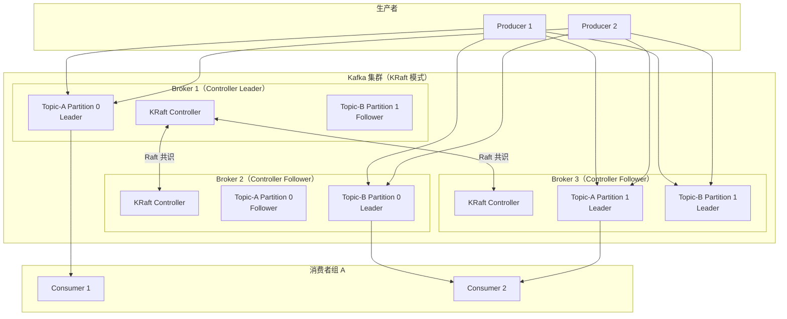
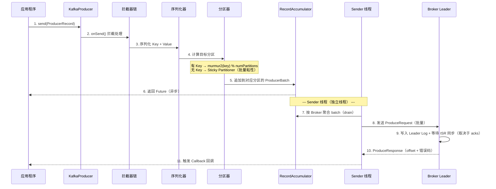
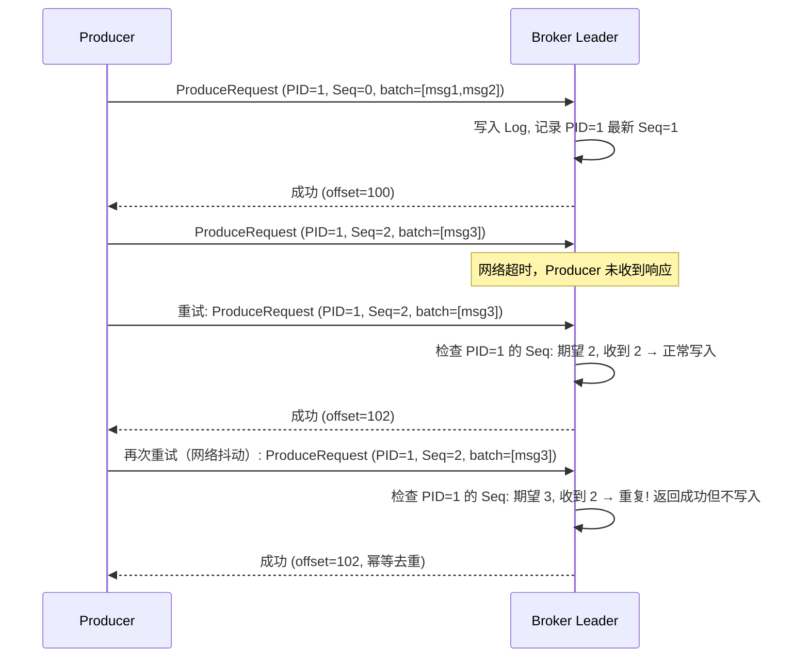
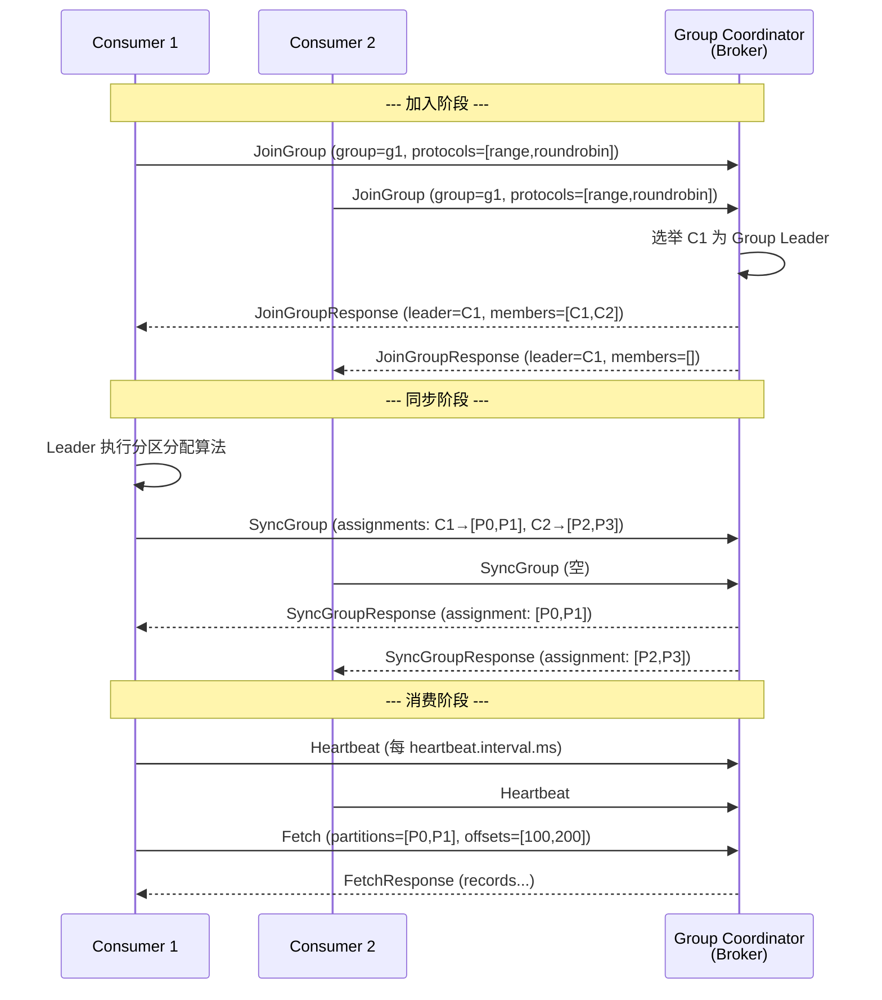
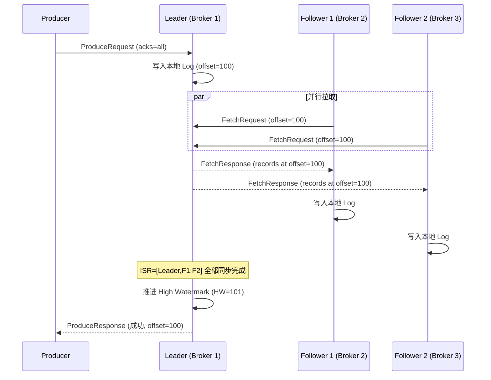
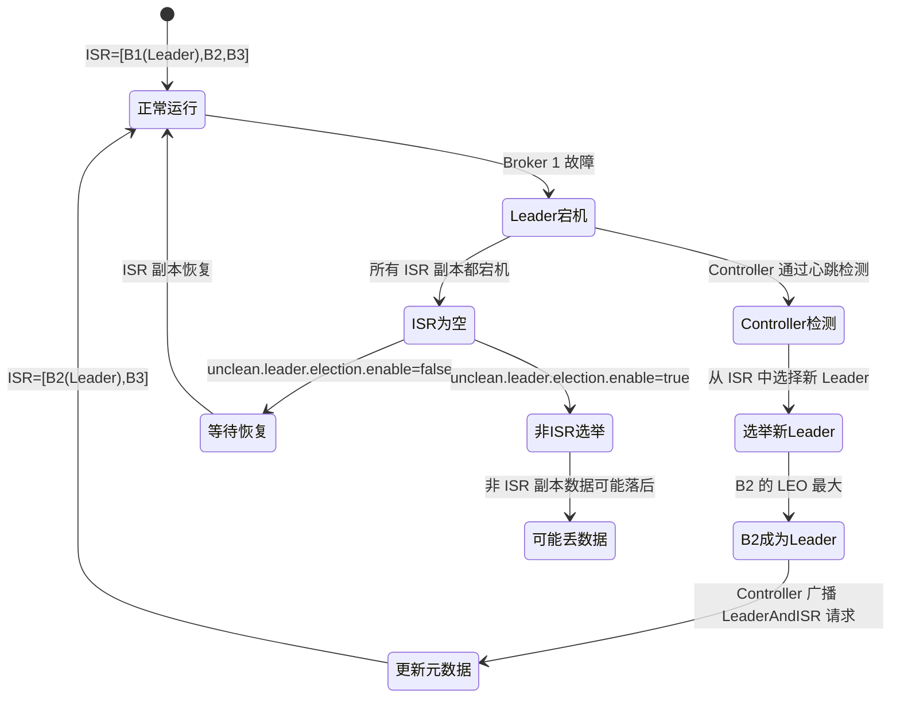
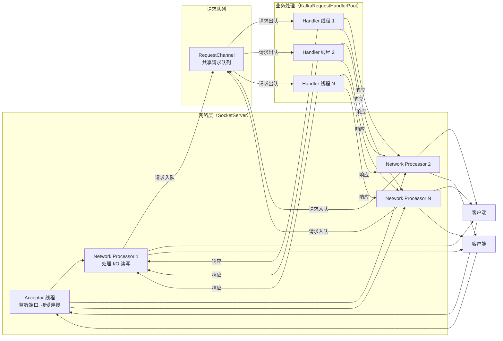
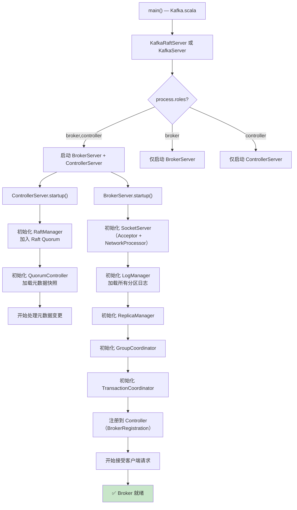

# Kafka 知多少 v1.0

> 基于 Apache Kafka 3.9.x | 最后更新时间：2025-01-01

---

## 📖 前言

### 技术背景与学习价值

Apache Kafka 是当今最流行的分布式事件流平台（Distributed Event Streaming Platform），最初由 LinkedIn 于 2010 年开发，2011 年开源并捐赠给 Apache 基金会，2012 年成为顶级项目。截至目前，全球超过 80% 的财富 100 强企业在使用 Kafka。

🎯 学习 Kafka 的核心价值：
- **行业标准**：事件驱动架构（EDA）和实时数据管道的事实标准
- **技术深度**：涵盖分布式系统、存储引擎、网络编程、共识协议等核心技术
- **生态完善**：Kafka Connect（数据集成）、Kafka Streams（流处理）、Schema Registry（数据治理）形成完整生态
- **职业必备**：后端开发、大数据工程师、架构师岗位的核心技能

### 适用读者

| 读者类型 | 建议阅读章节 |
|---------|------------|
| 初学者 | 前言 → 第一章 → 第七章（实验环境） |
| 后端开发工程师 | 第一章 → 第二章 → 第五章 → 第六章 |
| 大数据/流处理工程师 | 第二章 → 第三章 → 第五章 |
| 架构师 | 第二章 → 第四章 → 第五章 |
| 面试备战 | 第七章 → 第二章 → 第五章 |

### 版本说明

本文档基于 **Apache Kafka 3.9.x**。该版本的重大变化包括：
- **KRaft 模式成为默认**：ZooKeeper 模式已标记为 deprecated，KRaft（Kafka Raft）成为生产推荐的元数据管理方式
- **新版 Consumer Group 协议**：KIP-848 引入的新 Consumer Rebalance 协议持续演进
- **分层存储（Tiered Storage）**：KIP-405 引入的分层存储特性持续完善
- **改进的安全与配额管理**

> 见 Apache Kafka 官方文档：[Apache Kafka Documentation](https://kafka.apache.org/documentation/)

---

## 第一章：基础理论与架构演进

### 1.1 技术诞生背景与核心问题

**时代背景**：2010 年前后，LinkedIn 面临严峻的数据管道挑战。公司内部有数十个数据系统（数据库、搜索引擎、缓存、数据仓库、监控系统），它们之间需要实时交换数据。传统的点对点集成方式导致了 O(N²) 的连接复杂度，系统间耦合严重，数据一致性难以保证。

**Kafka 要解决的核心问题**：
1. **数据管道统一**：提供一个统一的、高吞吐的数据传输层，解耦数据生产者和消费者
2. **实时性**：从批处理走向实时流处理，数据产生后毫秒级可消费
3. **高吞吐**：支撑 LinkedIn 每天数万亿条消息的处理需求
4. **持久化与回溯**：消息持久化到磁盘，支持消费者按需回溯历史数据
5. **水平扩展**：通过分区（Partition）机制实现线性扩展

**创始团队**：Jay Kreps、Neha Narkhede 和 Jun Rao 在 LinkedIn 开发了 Kafka。名字来源于作家 Franz Kafka，因为"Kafka 是一个为写作而优化的系统"（Jay Kreps 语）。

💡 **进阶思考**：Kafka 的设计哲学是"分布式提交日志（Distributed Commit Log）"。它不是传统意义上的消息队列，而是一个有序的、可持久化的、可回溯的日志系统。这个核心抽象决定了 Kafka 的所有设计决策。

### 1.2 架构演进历程

| 版本 | 年份 | 里程碑 |
|------|------|--------|
| 0.7 | 2011 | 开源发布，基本的 Pub/Sub 功能 |
| 0.8 | 2013 | **引入副本机制（Replication）**，数据可靠性大幅提升 |
| 0.9 | 2015 | 新版 Consumer API（基于 Consumer Group 协议）、安全特性（SSL/SASL） |
| 0.10 | 2016 | **Kafka Streams** 流处理库、消息时间戳、Rack-Aware 副本分配 |
| 0.11 | 2017 | **幂等 Producer + 事务（Exactly-Once Semantics）**、消息头（Headers） |
| 1.0 | 2017 | 正式 1.0 版本，API 稳定性承诺 |
| 2.0 | 2018 | 安全增强、KIP-290 前缀 ACL |
| 2.4 | 2020 | **KRaft 早期预览**（KIP-500：去 ZooKeeper） |
| 3.0 | 2021 | KRaft 进入 Early Access，Producer 默认开启幂等 |
| 3.3 | 2022 | **KRaft 标记为生产就绪** |
| 3.5 | 2023 | ZooKeeper 模式标记为 deprecated |
| **3.9** | **2024** | **KRaft 为默认模式，ZK 迁移工具成熟，新 Consumer 协议演进** |

**演进原因分析**：

🎯 **从无副本到副本机制（0.8）**：早期 Kafka 没有副本，Broker 宕机即丢数据。0.8 引入 ISR（In-Sync Replicas）副本机制，是 Kafka 从"高吞吐日志"走向"可靠消息系统"的关键一步。

🎯 **Exactly-Once 语义（0.11）**：在此之前，Kafka 只能保证 At-Least-Once（至少一次），业务需要自行去重。0.11 通过幂等 Producer（PID + Sequence Number）和事务（Transaction Coordinator）实现了端到端的 Exactly-Once。见 KIP-98。

🎯 **KRaft 去 ZooKeeper（2.4 → 3.9）**：ZooKeeper 是 Kafka 最大的运维痛点——需要独立部署和维护一套 ZK 集群，且 ZK 的 Watch 机制在大规模集群下成为性能瓶颈（元数据更新延迟）。KRaft 使用 Raft 协议在 Kafka 内部实现元数据管理，消除了外部依赖。见 KIP-500。

⚠️ **易错点**：Kafka 3.9.x 中 ZooKeeper 模式仍然可用但已 deprecated。新部署应直接使用 KRaft 模式。从 ZK 迁移到 KRaft 可使用 `kafka-metadata.sh` 工具。

### 1.3 核心概念术语表

| 英文术语 | 中文 | 通俗解释 |
|---------|------|---------|
| Broker | 代理节点 | Kafka 集群中的一个服务器实例，负责存储和转发消息 |
| Topic | 主题 | 消息的逻辑分类，类似数据库中的"表" |
| Partition | 分区 | Topic 的物理分片，是并行度和有序性的基本单位 |
| Replica | 副本 | 分区的数据拷贝，分为 Leader 和 Follower |
| Leader | 领导者副本 | 负责处理该分区所有读写请求的副本 |
| Follower | 追随者副本 | 从 Leader 拉取数据保持同步，不直接服务客户端（3.x 前） |
| ISR | 同步副本集 | In-Sync Replicas，与 Leader 保持同步的副本集合 |
| Producer | 生产者 | 向 Topic 发送消息的客户端 |
| Consumer | 消费者 | 从 Topic 读取消息的客户端 |
| Consumer Group | 消费者组 | 一组 Consumer 共同消费一个 Topic，每个分区只被组内一个 Consumer 消费 |
| Offset | 偏移量 | 消息在分区中的唯一序号，从 0 开始递增 |
| Segment | 段文件 | 分区日志在磁盘上的物理文件单元（.log + .index + .timeindex） |
| Controller | 控制器 | 负责集群元数据管理的特殊 Broker（KRaft 模式下为 Raft Leader） |
| KRaft | Kafka Raft | Kafka 内置的基于 Raft 协议的元数据管理模式，替代 ZooKeeper |
| Log Compaction | 日志压缩 | 保留每个 Key 的最新值，删除旧值，用于 Changelog 场景 |
| Exactly-Once | 精确一次 | 消息不丢不重的语义保证 |
| Idempotent Producer | 幂等生产者 | 通过 PID + Sequence Number 保证单分区内消息不重复 |
| Transaction | 事务 | 跨分区的原子写入保证 |
| Consumer Lag | 消费延迟 | Consumer 当前 Offset 与分区最新 Offset 的差值 |
| Rebalance | 重平衡 | Consumer Group 内分区重新分配的过程 |

### 1.4 适用场景 vs 不适用场景

| 场景 | 是否适用 | 说明 |
|------|---------|------|
| 实时数据管道（数据库 → 数据仓库） | ✅ | Kafka Connect + CDC 是标准方案 |
| 事件驱动架构（微服务间异步通信） | ✅ | 解耦服务、削峰填谷、事件溯源 |
| 日志收集与聚合 | ✅ | 替代 Flume/Logstash 作为日志传输层 |
| 实时流处理 | ✅ | Kafka Streams / Flink / Spark Streaming 的数据源 |
| 指标监控数据传输 | ✅ | 高吞吐、持久化、支持多消费者 |
| 消息队列（任务分发） | ✅ | Consumer Group 天然支持负载均衡 |
| 事件溯源（Event Sourcing） | ✅ | 不可变日志 + Log Compaction 完美匹配 |
| 低延迟请求-响应（RPC） | ❌ | Kafka 是异步模型，不适合同步 RPC，应选用 gRPC/Dubbo |
| 小消息量、简单队列 | ❌ | 运维成本高，小规模场景 RabbitMQ/Redis 更轻量 |
| 严格的消息顺序（全局有序） | ❌ | Kafka 只保证分区内有序，全局有序需单分区（牺牲吞吐） |
| 复杂路由规则 | ❌ | 不支持 RabbitMQ 那样的 Exchange/Binding 路由，应选用 RabbitMQ |
| 消息优先级队列 | ❌ | Kafka 不支持消息优先级，应选用 RabbitMQ/RocketMQ |
| 延迟消息/定时消息 | ❌ | 原生不支持，需借助外部方案。RocketMQ 原生支持 |

### 1.5 同类技术对比

#### Kafka vs RocketMQ vs Pulsar vs RabbitMQ

| 维度 | Kafka 3.9 | RocketMQ 5.x | Pulsar 3.x | RabbitMQ 3.13 |
|------|-----------|-------------|------------|---------------|
| **设计哲学** | 分布式提交日志，吞吐优先 | 金融级消息队列，功能丰富 | 存算分离，云原生 | AMQP 标准，灵活路由 |
| **开发语言** | Java/Scala | Java | Java | Erlang |
| **存储架构** | 分区日志（Broker 本地磁盘） | CommitLog + ConsumeQueue | BookKeeper（存算分离） | 内存 + 磁盘（Mnesia/Khepri） |
| **元数据管理** | KRaft（内置 Raft） | NameServer（无状态） | ZooKeeper | Mnesia/Khepri 内置 |
| **消息模型** | Pub/Sub（Pull 模式） | Pub/Sub（Push + Pull） | Pub/Sub（Push + Pull） | Queue + Exchange（Push） |
| **消息顺序** | 分区内有序 | 队列内有序 | 分区内有序 | 队列内有序 |
| **延迟消息** | ❌ 不支持 | ✅ 原生支持（任意延迟） | ✅ 支持 | ✅ 插件支持 |
| **事务消息** | ✅ 跨分区事务 | ✅ 半消息事务 | ✅ 支持 | ✅ 支持 |
| **Exactly-Once** | ✅ 幂等 + 事务 | ✅ 事务消息 | ✅ 去重 + 事务 | ❌ At-Least-Once |
| **消息回溯** | ✅ 按 Offset/时间戳 | ✅ 按时间戳 | ✅ 按 MessageID/时间 | ❌ 消费即删除 |
| **吞吐量** | 极高（百万级 TPS） | 高（十万级 TPS） | 高（十万级 TPS） | 中（万级 TPS） |
| **端到端延迟** | 毫秒级（2-10ms） | 毫秒级（1-5ms） | 毫秒级（5-10ms） | 微秒级（< 1ms） |
| **运维复杂度** | 中（KRaft 后降低） | 低 | 高（依赖 BookKeeper + ZK） | 低 |
| **生态系统** | 极丰富（Connect、Streams、Schema Registry） | 丰富（国内生态强） | 丰富（Functions、IO） | 丰富（插件体系） |
| **社区活跃度** | 极高（Apache 顶级项目） | 高（Apache + 阿里巴巴） | 高（Apache + StreamNative） | 高（VMware/Broadcom） |
| **许可证** | Apache 2.0 | Apache 2.0 | Apache 2.0 | MPL 2.0 |

**如何选择**：

🎯 **选 Kafka**：需要极高吞吐的实时数据管道、事件驱动架构、日志聚合、流处理场景。团队有一定运维能力。

🎯 **选 RocketMQ**：国内业务场景、需要延迟消息/定时消息、金融级可靠性、对运维复杂度敏感。

🎯 **选 Pulsar**：需要存算分离架构、多租户隔离、跨地域复制原生支持、云原生部署。

🎯 **选 RabbitMQ**：消息量不大但需要灵活路由规则、低延迟、简单部署、AMQP 协议兼容。

⚠️ **易错点**：Kafka 的"高吞吐"建立在批量发送和顺序 I/O 的基础上。如果业务场景是大量小消息且要求极低延迟（< 1ms），RabbitMQ 可能是更好的选择。

---

## 第二章：实现原理解析

### 2.1 核心组件架构图

Kafka 3.9.x（KRaft 模式）的核心架构由 Producer、Broker（含 Controller）、Consumer 三大角色组成。



🎯 **核心要点**：
- **KRaft 模式**下，Controller 角色内嵌在 Broker 中（也可独立部署），通过 Raft 协议选举 Active Controller，管理集群元数据（Topic、分区分配、ISR 等）
- 每个 Partition 有一个 Leader 副本和多个 Follower 副本，所有读写请求都由 Leader 处理
- Consumer Group 内的 Consumer 通过 Group Coordinator 协调分区分配

> 见 Kafka 官方文档：[KRaft Architecture](https://kafka.apache.org/documentation/#kraft)

### 2.2 消息生产流程

#### 2.2.1 正常发送流程



**关键设计解析**：

**批量发送（Batching）**：Producer 不会每条消息都发一次网络请求。`RecordAccumulator` 将消息按分区聚合到 `ProducerBatch` 中，由 `Sender` 线程批量发送。两个参数控制批量行为：
- `batch.size`（默认 16KB）：单个 batch 的大小上限
- `linger.ms`（默认 0ms）：batch 未满时的等待时间

```java
// Producer 配置示例
Properties props = new Properties();
props.put("bootstrap.servers", "broker1:9092,broker2:9092");
props.put("key.serializer", "org.apache.kafka.common.serialization.StringSerializer");
props.put("value.serializer", "org.apache.kafka.common.serialization.StringSerializer");
props.put("acks", "all");              // 等待所有 ISR 确认
props.put("batch.size", 32768);        // 32KB batch
props.put("linger.ms", 5);            // 等待 5ms 凑批
props.put("compression.type", "lz4"); // LZ4 压缩
props.put("enable.idempotence", true); // 开启幂等（3.0+ 默认开启）

KafkaProducer<String, String> producer = new KafkaProducer<>(props);
producer.send(new ProducerRecord<>("my-topic", "key", "value"), (metadata, exception) -> {
    if (exception == null) {
        System.out.printf("Sent to partition %d, offset %d%n",
            metadata.partition(), metadata.offset());
    } else {
        exception.printStackTrace();
    }
});
```

#### 2.2.2 重试与幂等机制



🎯 **幂等 Producer 原理**：
- 每个 Producer 实例启动时获得一个唯一的 `Producer ID (PID)`
- 每条消息携带 `<PID, Partition, SequenceNumber>`
- Broker 端为每个 `<PID, Partition>` 维护最新的 Sequence Number
- 如果收到的 Seq ≤ 已记录的 Seq，判定为重复消息，返回成功但不重复写入
- 如果收到的 Seq > 已记录的 Seq + 1，说明有消息丢失，返回 `OutOfOrderSequenceException`

⚠️ **易错点**：幂等 Producer 只保证单分区内的去重。跨分区的 Exactly-Once 需要使用事务（Transactional Producer）。

### 2.3 消息消费流程

#### 2.3.1 Consumer Group 与 Rebalance



**Rebalance 触发条件**：
1. Consumer 加入或离开 Group
2. Consumer 心跳超时（`session.timeout.ms`，默认 45s）
3. Consumer 处理消息超时（`max.poll.interval.ms`，默认 5 分钟）
4. Topic 分区数变化
5. 订阅的 Topic 列表变化（正则匹配时新 Topic 出现）

**Offset 管理**：

```java
// 自动提交（默认）
props.put("enable.auto.commit", true);
props.put("auto.commit.interval.ms", 5000); // 每 5 秒自动提交

// 手动提交（推荐生产使用）
props.put("enable.auto.commit", false);

KafkaConsumer<String, String> consumer = new KafkaConsumer<>(props);
consumer.subscribe(Arrays.asList("my-topic"));

while (true) {
    ConsumerRecords<String, String> records = consumer.poll(Duration.ofMillis(100));
    for (ConsumerRecord<String, String> record : records) {
        // 处理消息
        processRecord(record);
    }
    consumer.commitSync(); // 同步提交 offset
}
```

⚠️ **易错点**：自动提交 Offset 可能导致消息丢失（提交了但处理失败）或重复消费（处理了但未提交）。生产环境建议使用手动提交，并在消息处理成功后再提交。

### 2.4 副本同步与 ISR 机制

#### 2.4.1 正常副本同步流程



**关键概念**：

```
分区日志的水位线：

LEO (Log End Offset)     = 每个副本最新写入的下一个 offset
HW  (High Watermark)     = 所有 ISR 副本中最小的 LEO
                           消费者只能读到 HW 之前的消息

Leader:    [msg0][msg1][msg2][msg3][msg4]  LEO=5
Follower1: [msg0][msg1][msg2][msg3]        LEO=4
Follower2: [msg0][msg1][msg2]              LEO=3
                                    HW=3 ↑
                                    (消费者只能读到 offset 0,1,2)
```

#### 2.4.2 Leader 故障切换



⚠️ **易错点**：`unclean.leader.election.enable` 默认为 `false`（Kafka 2.0+）。设为 `true` 可以在所有 ISR 副本宕机时从非 ISR 副本选举 Leader，提高可用性但可能丢数据。金融场景务必保持 `false`。

### 2.5 关键算法/协议详解

#### 2.5.1 KRaft（Kafka Raft）协议

KRaft 是 Kafka 基于 Raft 论文实现的共识协议，用于管理集群元数据。

**与标准 Raft 的差异**：
- 使用 **Pull 模式**（Follower 主动拉取）而非标准 Raft 的 Push 模式（Leader 推送），与 Kafka 的 Fetch 机制保持一致
- 元数据存储在内部 Topic `__cluster_metadata` 中，复用 Kafka 的日志存储机制
- 支持 **Snapshot** 机制，定期对元数据状态做快照，避免日志无限增长

```properties
# KRaft 模式 Broker 配置（server.properties）
process.roles=broker,controller    # 同时担任 broker 和 controller
node.id=1
controller.quorum.voters=1@broker1:9093,2@broker2:9093,3@broker3:9093
controller.listener.names=CONTROLLER
listeners=PLAINTEXT://:9092,CONTROLLER://:9093
log.dirs=/var/kafka-logs
```

#### 2.5.2 分区分配策略

| 策略 | 类名 | 原理 | 适用场景 |
|------|------|------|---------|
| Range | `RangeAssignor` | 按 Topic 维度，将分区按范围分配给 Consumer | 默认策略，简单但可能不均匀 |
| RoundRobin | `RoundRobinAssignor` | 将所有 Topic 的分区轮询分配 | 所有 Consumer 订阅相同 Topic 时均匀 |
| Sticky | `StickyAssignor` | 在均匀的基础上，Rebalance 时尽量保持原有分配 | 减少 Rebalance 开销 |
| CooperativeSticky | `CooperativeStickyAssignor` | Sticky + 协作式 Rebalance（增量式，不停止所有消费） | **3.x 推荐**，减少 Rebalance 影响 |

#### 2.5.3 Log Compaction（日志压缩）

```
普通日志（delete 策略）：
[K1:V1][K2:V2][K1:V3][K3:V4][K2:V5] → 超过 retention 后全部删除

压缩日志（compact 策略）：
[K1:V1][K2:V2][K1:V3][K3:V4][K2:V5]
                ↓ Log Compaction
[K1:V3][K3:V4][K2:V5]  ← 每个 Key 只保留最新值

用途：Kafka Streams 的 Changelog Topic、Connect 的 Offset Topic（__consumer_offsets）
```

### 2.6 数据模型与存储结构

#### 2.6.1 磁盘布局

```
/var/kafka-logs/                          # log.dirs 配置的目录
├── __cluster_metadata-0/                 # KRaft 元数据分区
├── __consumer_offsets-0/                 # Consumer Offset 内部 Topic
├── my-topic-0/                           # Topic=my-topic, Partition=0
│   ├── 00000000000000000000.log          # 第一个 Segment 的数据文件（起始 offset=0）
│   ├── 00000000000000000000.index        # 稀疏偏移量索引
│   ├── 00000000000000000000.timeindex    # 稀疏时间戳索引
│   ├── 00000000000000065536.log          # 第二个 Segment（起始 offset=65536）
│   ├── 00000000000000065536.index
│   ├── 00000000000000065536.timeindex
│   ├── leader-epoch-checkpoint            # Leader Epoch 检查点
│   └── partition.metadata                 # 分区元数据
├── my-topic-1/                           # Partition=1
└── ...
```

#### 2.6.2 消息格式（RecordBatch）

```
RecordBatch 结构（V2 格式，Kafka 0.11+）：
┌──────────────────────────────────────────────────┐
│ RecordBatch Header                                │
│  - baseOffset (8 bytes)        起始 offset        │
│  - batchLength (4 bytes)       batch 总长度       │
│  - partitionLeaderEpoch (4B)   Leader Epoch       │
│  - magic (1 byte)              版本号 = 2         │
│  - crc (4 bytes)               CRC32 校验         │
│  - attributes (2 bytes)        压缩/事务/时间戳类型│
│  - lastOffsetDelta (4 bytes)   最后一条的 offset 增量│
│  - baseTimestamp (8 bytes)     基准时间戳          │
│  - maxTimestamp (8 bytes)      最大时间戳          │
│  - producerId (8 bytes)        PID（幂等/事务）    │
│  - producerEpoch (2 bytes)     Producer Epoch     │
│  - baseSequence (4 bytes)      起始序列号          │
│  - numRecords (4 bytes)        记录数              │
├──────────────────────────────────────────────────┤
│ Record 1                                          │
│  - length (varint)             记录长度            │
│  - attributes (1 byte)                            │
│  - timestampDelta (varint)     时间戳增量          │
│  - offsetDelta (varint)        offset 增量         │
│  - keyLength (varint) + key                       │
│  - valueLength (varint) + value                   │
│  - numHeaders (varint) + headers[]                │
├──────────────────────────────────────────────────┤
│ Record 2 ...                                      │
└──────────────────────────────────────────────────┘
```

💡 **进阶思考**：Kafka 使用 varint 编码和增量存储（delta encoding）来压缩消息元数据。同一个 batch 内的 offset 和 timestamp 只存储与 base 的差值，大幅减少存储开销。

### 2.7 通信协议

Kafka 使用自定义的二进制协议，基于 TCP。所有请求/响应遵循统一格式：

```
请求格式：
┌────────────────────────────────────┐
│ Size (4 bytes)    整个请求的长度     │
├────────────────────────────────────┤
│ Request Header                      │
│  - api_key (2 bytes)   API 类型     │
│  - api_version (2 bytes) 版本号     │
│  - correlation_id (4 bytes) 请求 ID │
│  - client_id (string)  客户端标识   │
├────────────────────────────────────┤
│ Request Body（取决于 api_key）       │
└────────────────────────────────────┘

常用 API Key：
  0  = Produce          发送消息
  1  = Fetch            拉取消息
  3  = Metadata         获取集群元数据
  10 = FindCoordinator  查找 Group Coordinator
  11 = JoinGroup        加入消费者组
  14 = SyncGroup        同步分区分配
  22 = InitProducerId   初始化幂等 Producer
```

> 见 Kafka 官方文档：[Kafka Protocol Guide](https://kafka.apache.org/protocol)

---

## 第三章：源码级实现细节

> 本章基于 Apache Kafka 3.9.x 源码（[GitHub: apache/kafka](https://github.com/apache/kafka)）。Kafka 使用 Java 和 Scala 编写，构建系统为 Gradle。

### 3.1 代码组织结构

```
kafka/
├── core/                          # Broker 端核心代码（Scala）
│   └── src/main/scala/kafka/
│       ├── server/                # Broker 服务核心
│       │   ├── KafkaServer.scala  # ZK 模式启动入口
│       │   ├── BrokerServer.scala # KRaft 模式 Broker 启动
│       │   ├── ControllerServer.scala # KRaft Controller 启动
│       │   ├── KafkaApis.scala    # 所有 API 请求处理入口
│       │   ├── ReplicaManager.scala # 副本管理（ISR、HW、Fetch）
│       │   └── KafkaConfig.scala  # 配置解析
│       ├── log/                   # 日志存储引擎
│       │   ├── UnifiedLog.scala   # 分区日志（原 Log.scala）
│       │   ├── LogSegment.scala   # 段文件管理
│       │   ├── LogManager.scala   # 日志生命周期管理
│       │   └── LogCleaner.scala   # Log Compaction 实现
│       ├── coordinator/           # 协调器
│       │   ├── group/             # Consumer Group 协调
│       │   └── transaction/       # 事务协调
│       ├── network/               # 网络层
│       │   ├── SocketServer.scala # Reactor 网络模型
│       │   └── RequestChannel.scala # 请求队列
│       └── controller/            # ZK 模式 Controller（deprecated）
│
├── clients/                       # 客户端代码（Java）
│   └── src/main/java/org/apache/kafka/
│       ├── clients/
│       │   ├── producer/          # KafkaProducer 实现
│       │   │   ├── KafkaProducer.java
│       │   │   ├── RecordAccumulator.java
│       │   │   └── Sender.java
│       │   ├── consumer/          # KafkaConsumer 实现
│       │   │   ├── KafkaConsumer.java
│       │   │   └── ConsumerCoordinator.java
│       │   └── NetworkClient.java # 底层网络客户端
│       └── common/                # 公共模块（协议、序列化、错误码）
│
├── raft/                          # KRaft Raft 协议实现（Java）
│   └── src/main/java/org/apache/kafka/raft/
│       ├── KafkaRaftClient.java   # Raft 客户端核心
│       ├── LeaderState.java       # Leader 状态
│       ├── FollowerState.java     # Follower 状态
│       └── VoterState.java        # 投票状态
│
├── metadata/                      # KRaft 元数据管理（Java）
│   └── src/main/java/org/apache/kafka/
│       ├── controller/            # KRaft Controller 逻辑
│       │   ├── QuorumController.java # 基于 Raft 的 Controller
│       │   └── ReplicationControlManager.java # 副本控制
│       └── image/                 # 元数据快照
│
├── connect/                       # Kafka Connect 框架
├── streams/                       # Kafka Streams 流处理库
├── tools/                         # 命令行工具
└── build.gradle                   # Gradle 构建入口
```

🎯 **核心要点**：
- `core/` 是 Broker 端的核心，用 Scala 编写（历史原因），包含网络层、存储层、副本管理、协调器
- `clients/` 是 Producer/Consumer 客户端，用 Java 编写，是大多数开发者直接使用的 API
- `raft/` 是 KRaft 的 Raft 协议实现，纯 Java，独立于 Broker 逻辑
- `metadata/` 是 KRaft Controller 的业务逻辑，基于 `raft/` 模块

### 3.2 关键数据结构

#### 3.2.1 ProducerBatch（客户端）

```java
// 简化版 ProducerBatch（源码位于 clients/src/.../producer/internals/ProducerBatch.java）
public final class ProducerBatch {
    final TopicPartition topicPartition;       // 目标分区
    final MemoryRecordsBuilder recordsBuilder;  // 消息构建器（写入 ByteBuffer）
    final long createdMs;                       // 创建时间
    final long baseSequence;                    // 起始序列号（幂等）

    private int recordCount;                    // 当前记录数
    private final List<Thunk> thunks;           // 每条消息的回调（Callback）
    private long lastAttemptMs;                 // 最后一次发送尝试时间
    private int attempts;                       // 重试次数

    // 尝试追加一条消息到 batch
    public FutureRecordMetadata tryAppend(long timestamp, byte[] key, byte[] value,
                                          Header[] headers, Callback callback, long now) {
        if (!recordsBuilder.hasRoomFor(timestamp, key, value, headers)) {
            return null;  // batch 已满，返回 null 触发创建新 batch
        }
        recordsBuilder.append(timestamp, key, value, headers);
        // ... 记录回调
    }
}
```

#### 3.2.2 UnifiedLog（Broker 端日志）

```scala
// 简化版 UnifiedLog（源码位于 core/src/.../log/UnifiedLog.scala）
class UnifiedLog(val logStartOffset: Long,
                 val localLog: LocalLog,        // 本地日志段管理
                 val config: LogConfig,          // 日志配置
                 val producerStateManager: ProducerStateManager, // 幂等状态
                 ...) {

  // 追加消息（Leader 写入）
  def appendAsLeader(records: MemoryRecords,
                     leaderEpoch: Int,
                     origin: AppendOrigin): LogAppendInfo = {
    // 1. 验证消息格式、CRC
    // 2. 分配 offset（单调递增）
    // 3. 验证幂等序列号（PID + Seq）
    // 4. 写入 activeSegment
    // 5. 更新 LEO
    append(records, origin, ...)
  }

  // 读取消息（Fetch 请求）
  def read(startOffset: Long,
           maxLength: Int,
           isolation: FetchIsolation,  // READ_UNCOMMITTED / READ_COMMITTED / LOG_END
           minOneMessage: Boolean): FetchDataInfo = {
    // 1. 根据 isolation 确定可读范围（HW 或 LSO）
    // 2. 定位 Segment
    // 3. 使用 FileChannel.transferTo（零拷贝）读取数据
    localLog.read(startOffset, maxLength, ...)
  }
}
```

### 3.3 并发模型

#### 3.3.1 Reactor 网络模型

Kafka Broker 使用经典的 **多 Reactor 多线程** 模型处理网络请求：



**线程模型说明**：

| 线程类型 | 数量 | 配置参数 | 职责 |
|---------|------|---------|------|
| Acceptor | 每个 Listener 1 个 | - | 接受新连接，轮询分配给 Network Processor |
| Network Processor | `num.network.threads`（默认 3） | `num.network.threads` | NIO Selector，处理 Socket 读写 |
| Request Handler | `num.io.threads`（默认 8） | `num.io.threads` | 执行业务逻辑（Produce、Fetch、Metadata 等） |
| Purgatory Reaper | 少量 | - | 清理延迟操作中已超时的请求 |

#### 3.3.2 Purgatory（延迟操作）

Kafka 中很多操作需要"等待条件满足后再响应"，例如：
- `acks=all` 的 Produce 请求需要等待所有 ISR 副本同步完成
- `fetch.min.bytes` 的 Fetch 请求需要等待足够的数据

Kafka 使用 **Purgatory（炼狱）** 机制实现延迟操作：

```scala
// 简化版 DelayedOperation
abstract class DelayedOperation(delayMs: Long) extends TimerTask {
  // 尝试完成操作（条件是否满足）
  def tryComplete(): Boolean

  // 条件满足时的回调
  def onComplete(): Unit

  // 超时时的回调
  def onExpiration(): Unit
}

// 示例：DelayedProduce
// 当 acks=all 时，Produce 请求进入 Purgatory
// 每次 Follower Fetch 推进 HW 后，尝试 tryComplete
// 如果所有 ISR 都同步完成 → onComplete → 返回响应
// 如果超时 → onExpiration → 返回超时错误
```

### 3.4 重要类/接口设计

#### 3.4.1 KafkaApis — 请求路由中心

```scala
// 源码位于 core/src/.../server/KafkaApis.scala
class KafkaApis(/* ... */) {
  // 所有 API 请求的入口
  def handle(request: RequestChannel.Request): Unit = {
    request.header.apiKey match {
      case ApiKeys.PRODUCE            => handleProduceRequest(request)
      case ApiKeys.FETCH              => handleFetchRequest(request)
      case ApiKeys.LIST_OFFSETS       => handleListOffsetRequest(request)
      case ApiKeys.METADATA           => handleTopicMetadataRequest(request)
      case ApiKeys.OFFSET_COMMIT      => handleOffsetCommitRequest(request)
      case ApiKeys.OFFSET_FETCH       => handleOffsetFetchRequest(request)
      case ApiKeys.FIND_COORDINATOR   => handleFindCoordinatorRequest(request)
      case ApiKeys.JOIN_GROUP         => handleJoinGroupRequest(request)
      case ApiKeys.SYNC_GROUP         => handleSyncGroupRequest(request)
      case ApiKeys.HEARTBEAT          => handleHeartbeatRequest(request)
      case ApiKeys.INIT_PRODUCER_ID   => handleInitProducerIdRequest(request)
      // ... 60+ API 类型
    }
  }
}
```

#### 3.4.2 ReplicaManager — 副本管理核心

```scala
// 源码位于 core/src/.../server/ReplicaManager.scala
class ReplicaManager(/* ... */) {
  // 处理 Produce 请求
  def appendToLocalLog(/* ... */): Map[TopicPartition, LogAppendResult]

  // 处理 Fetch 请求（Consumer 和 Follower 共用）
  def fetchMessages(/* ... */): Unit

  // ISR 变更
  def maybeShrinkIsr(): Unit   // 缩减 ISR（Follower 落后）
  def maybeExpandIsr(): Unit   // 扩展 ISR（Follower 追上）

  // Leader/Follower 角色切换
  def becomeLeaderOrFollower(/* ... */): Unit
}
```

### 3.5 启动流程

Kafka 3.9.x KRaft 模式的启动流程：



```bash
# KRaft 模式���动命令
# 1. 生成集群 ID
KAFKA_CLUSTER_ID="$(bin/kafka-storage.sh random-uuid)"

# 2. 格式化存储目录
bin/kafka-storage.sh format -t $KAFKA_CLUSTER_ID -c config/kraft/server.properties

# 3. 启动 Broker
bin/kafka-server-start.sh config/kraft/server.properties
```

---

## 第四章：设计模式深度剖析

### 4.1 架构层面的模式

#### 4.1.1 Controller 模式

Kafka 集群中有且仅有一个 Active Controller，负责所有元数据决策（分区分配、Leader 选举、ISR 变更）。其他 Broker 被动接收 Controller 的指令。

**KRaft 模式下的 Controller**：
- Controller 节点组成 Raft Quorum，通过 Raft 选举产生 Active Controller
- 元数据变更以 Raft Log 的形式复制到所有 Controller 节点
- Broker 通过 `MetadataFetch` 请求从 Controller 拉取最新元数据
- 与 ZK 模式的关键区别：元数据变更是事件驱动的日志流，而非 ZK 的 Watch 通知

#### 4.1.2 日志抽象（Append-Only Log）

Kafka 的核心抽象是 **不可变的追加日志（Immutable Append-Only Log）**。这个抽象贯穿整个系统：

```
应用场景                    日志实例
───────────────────────���─────────────────
消息存储                    Topic Partition Log
Consumer Offset 存储        __consumer_offsets（Compacted Log）
事务状态存储                __transaction_state（Compacted Log）
集群元数据存储（KRaft）      __cluster_metadata（Raft Log）
```

**为什么选择日志抽象**：
- 顺序写入 → 磁盘顺序 I/O，性能接近内存
- 不可变 → 无需加锁，天然支持并发读
- 有序 → 通过 offset 实现精确的消息定位和回溯
- 可复制 → Follower 只需追加 Leader 的日志即可保持同步

### 4.2 GoF 设计模式在源码中的应用

#### 4.2.1 策略模式（Strategy）— 分区器

Producer 的分区策略是典型的策略模式：

```java
// 策略接口（clients/src/.../clients/producer/Partitioner.java）
public interface Partitioner extends Configurable, Closeable {
    int partition(String topic, Object key, byte[] keyBytes,
                  Object value, byte[] valueBytes, Cluster cluster);
}

// 具体策略
// 1. DefaultPartitioner — 有 Key 用 murmur2 hash，无 Key 用 Sticky
// 2. RoundRobinPartitioner — 轮询
// 3. UniformStickyPartitioner — 粘性分区（减少小 batch）
// 4. 用户自定义 Partitioner

// 使用方式
props.put("partitioner.class", "com.example.MyPartitioner");
```

#### 4.2.2 观察者模式（Observer）— MetadataListener

Broker 内部使用观察者模式监听元数据变更：

```java
// KRaft 模式下，Broker 注册 MetadataListener 监听 Controller 的元数据变更
// 当 Topic 创建、分区重分配、ISR 变更时，Listener 被通知
public interface RaftClient.Listener<T> {
    void handleCommit(BatchReader<T> reader);    // 新的元数据提交
    void handleLoadSnapshot(SnapshotReader<T> reader); // 加载快照
    void handleLeaderChange(LeaderAndEpoch leaderAndEpoch); // Leader 变更
}
```

#### 4.2.3 构建者模式（Builder）— ProducerRecord / ConsumerRecord

```java
// Kafka 广泛使用 Builder 模式构建复杂对象
// 示例：AdminClient 创建 Topic
NewTopic newTopic = new NewTopic("my-topic", 6, (short) 3)
    .configs(Map.of(
        "retention.ms", "604800000",
        "cleanup.policy", "delete"
    ));

AdminClient admin = AdminClient.create(props);
admin.createTopics(Collections.singleton(newTopic));
```

#### 4.2.4 模板方法模式（Template Method）— AbstractFetcherThread

```scala
// Follower 拉取 Leader 数据的抽象模板
// 源码位于 core/src/.../server/AbstractFetcherThread.scala
abstract class AbstractFetcherThread(/* ... */) {
  // 模板方法：定义 Fetch 流程骨架
  def doWork(): Unit = {
    maybeTruncate()           // 1. 可能需要截断日志
    maybeFetch()              // 2. 发送 Fetch 请求
    // → 子类实现具体的 processPartitionData()
  }

  // 子类实现：处理拉取到的数据
  protected def processPartitionData(/* ... */): Option[LogAppendInfo]

  // 子类实现：截断日志
  protected def truncate(/* ... */): Unit
}

// 具体实现
class ReplicaFetcherThread extends AbstractFetcherThread { ... }
```

### 4.3 分布式系统模式

#### 4.3.1 Leader Election（领导者选举）

Kafka 中有两层 Leader 选举：

| 层级 | 选举对象 | 机制 | 触发条件 |
|------|---------|------|---------|
| Controller 选举 | Active Controller | KRaft Raft 协议（多数派投票） | Controller 节点故障 |
| Partition Leader 选举 | 分区 Leader 副本 | Controller 从 ISR 中指定 | Broker 故障、手动重分配 |

#### 4.3.2 Epoch Fencing（纪元隔离）

Kafka 使用 Epoch 机制防止"脑裂"和过期请求：

```
Leader Epoch 机制：
- 每次 Leader 切换，Epoch 递增
- Follower 拉取数据时携带 Leader Epoch
- 如果 Broker 收到旧 Epoch 的请求，直接拒绝

示例：
  Epoch=5: Broker 1 是 Leader
  Broker 1 宕机 → Epoch=6: Broker 2 成为新 Leader
  Broker 1 恢复，仍以 Epoch=5 发送请求 → 被拒绝
  Broker 1 发现新 Epoch=6 → 截断多余日志 → 作为 Follower 同步
```

### 4.4 设计权衡分析

| 设计决策 | 选择 | 替代方案 | 权衡理由 |
|---------|------|---------|---------|
| 消费模型 | Pull（Consumer 主动拉取） | Push（Broker 推送） | Pull 让 Consumer 控制消费速率，避免 Broker 端复杂的流控逻辑 |
| 存储模型 | 追加日志 + 顺序 I/O | B-Tree 索引 | 顺序写性能极高，但不支持按 Key 随机查询 |
| 副本同步 | ISR（动态同步副本集） | 固定多数派（Raft） | ISR 更灵活，允许副本暂时落后而不影响写入，但可能在极端情况下丢数据 |
| 消息保留 | 基于时间/大小的保留策略 | 消费即删除（RabbitMQ） | 支持多消费者、消息回溯、事件溯源 |
| 元数据管理 | KRaft（内置 Raft） | ZooKeeper（外部依赖） | 消除外部依赖，简化运维，提升元数据更新性能 |
| 分区有序 | 分区内有序，分区间无序 | 全局有序 | 分区是并行度的基本单位，全局有序会牺牲吞吐 |

💡 **进阶思考**：Kafka 的 ISR 机制是一个精妙的设计。与 Raft 的"多数派"不同，ISR 允许副本集合动态变化。当 `acks=all` 且 `min.insync.replicas=2` 时，只要 ISR 中有 2 个副本确认即可，不需要等待所有副本。这在副本暂时不可用时仍能保持写入可用性。

---

## 第五章：高可靠与高可用方案

### 5.1 集群部署架构

| 部署模式 | 节点数 | Controller | 适用场景 | 容错能力 |
|---------|--------|-----------|---------|---------|
| 单机（Combined） | 1 | 同一节点 | 开发测试 | 无容错 |
| 小集群（Combined） | 3 | 3 节点均为 broker+controller | 中小业务 | 容忍 1 节点故障 |
| 中型集群（分离） | 3 Controller + N Broker | 独立 Controller | 生产推荐 | Controller 和 Broker 独立容错 |
| 大型集群 | 3-5 Controller + 数十 Broker | 独立 Controller | 大规模生产 | 高可用 + 高吞吐 |
| 跨机房 | 多集群 + MirrorMaker 2 | 每集群独立 | 容灾 | 跨地域容灾 |

```properties
# 生产推荐：独立 Controller 节点配置
# controller-server.properties
process.roles=controller
node.id=100
controller.quorum.voters=100@ctrl1:9093,101@ctrl2:9093,102@ctrl3:9093
listeners=CONTROLLER://:9093

# broker-server.properties
process.roles=broker
node.id=1
controller.quorum.voters=100@ctrl1:9093,101@ctrl2:9093,102@ctrl3:9093
listeners=PLAINTEXT://:9092
```

### 5.2 数据一致性保证

#### 5.2.1 acks 配置与数据可靠性

| acks 值 | 含义 | 可靠性 | 性能 | 适用场景 |
|---------|------|--------|------|---------|
| `0` | 不等待任何确认 | 可能丢数据 | 最高 | 日志、监控指标（允许丢失） |
| `1` | 等待 Leader 确认 | Leader 宕机可能丢 | 高 | 一般业务 |
| `all`（-1） | 等待所有 ISR 确认 | 不丢数据（配合 min.insync.replicas） | 中 | 金融、订单等关键业务 |

**不丢数据的黄金配置**：
```properties
# Producer 端
acks=all
retries=2147483647          # 无限重试
enable.idempotence=true     # 幂等（3.0+ 默认开启）
max.in.flight.requests.per.connection=5  # 幂等模式下最大 5

# Broker 端
min.insync.replicas=2       # ISR 最少 2 个副本
unclean.leader.election.enable=false  # 禁止非 ISR 选举
default.replication.factor=3  # 默认 3 副本
```

#### 5.2.2 Exactly-Once 语义

```java
// 事务 Producer 示例（跨分区 Exactly-Once）
Properties props = new Properties();
props.put("bootstrap.servers", "broker1:9092");
props.put("transactional.id", "my-transactional-id");  // 必须设置
props.put("enable.idempotence", true);

KafkaProducer<String, String> producer = new KafkaProducer<>(props);
producer.initTransactions();

try {
    producer.beginTransaction();
    producer.send(new ProducerRecord<>("topic-a", "key1", "value1"));
    producer.send(new ProducerRecord<>("topic-b", "key2", "value2"));
    // 同时提交 Consumer Offset（Consume-Transform-Produce 模式）
    producer.sendOffsetsToTransaction(offsets, consumerGroupMetadata);
    producer.commitTransaction();
} catch (Exception e) {
    producer.abortTransaction();
}
```

### 5.3 故障检测与恢复

#### 5.3.1 Controller Failover

```
KRaft Controller Failover 流程：
1. Active Controller 宕机
2. 其他 Controller 节点检测到心跳超时（controller.quorum.election.timeout.ms）
3. 发起 Raft 选举，获得多数票的节点成为新 Active Controller
4. 新 Controller 从 Raft Log 或 Snapshot 恢复元数据状态
5. Broker 通过 MetadataFetch 发现新 Controller，开始拉取最新元数据
```

#### 5.3.2 Broker 故障恢复

```
Broker 故障恢复流程：
1. Broker 宕机 → Controller 检测到 BrokerRegistration 过期
2. Controller 对该 Broker 上的所有 Leader 分区执行 Leader 选举
3. 从 ISR 中选择新 Leader，更新元数据
4. 其他 Broker 和 Client 通过 Metadata 更新感知变化
5. 故障 Broker 恢复后：
   a. 重新注册到 Controller
   b. 加载本地日志
   c. 作为 Follower 从新 Leader 拉取缺失数据
   d. 追上 Leader 后重新加入 ISR
```

### 5.4 容灾策略

#### MirrorMaker 2（跨集群复制）

```properties
# mm2.properties — MirrorMaker 2 配置
clusters = source, target
source.bootstrap.servers = source-broker1:9092,source-broker2:9092
target.bootstrap.servers = target-broker1:9092,target-broker2:9092

# 复制 source 集群的所有 Topic 到 target
source->target.enabled = true
source->target.topics = .*

# 同步 Consumer Group Offset
sync.group.offsets.enabled = true
emit.heartbeats.enabled = true

# 启动
bin/connect-mirror-maker.sh mm2.properties
```

### 5.5 性能优化（30+ 调优参数）

#### 5.5.1 Broker 端

| 参数 | 默认值 | 建议值 | 说明 |
|------|--------|--------|------|
| `num.network.threads` | 3 | CPU 核数 | 网络 I/O 线程数 |
| `num.io.threads` | 8 | CPU 核数 * 2 | 请求处理线程数 |
| `socket.send.buffer.bytes` | 100KB | 1MB | Socket 发送缓冲区 |
| `socket.receive.buffer.bytes` | 100KB | 1MB | Socket 接收缓���区 |
| `log.segment.bytes` | 1GB | 1GB | 单个 Segment 文件大小 |
| `log.retention.hours` | 168（7天） | 按业务需求 | 消息保留时间 |
| `log.retention.bytes` | -1（无限） | 按磁盘容量 | 分区日志最大大小 |
| `num.partitions` | 1 | 6-12 | 新 Topic 默认分区数 |
| `default.replication.factor` | 1 | 3 | 默认副本数 |
| `min.insync.replicas` | 1 | 2 | ISR 最小副本数 |
| `log.flush.interval.messages` | Long.MAX | 不建议修改 | 刷盘消息间隔（依赖 OS Page Cache） |
| `replica.fetch.max.bytes` | 1MB | 10MB | Follower 单次 Fetch 最大字节数 |
| `message.max.bytes` | 1MB | 按需调整 | 单条消息最大大小 |
| `compression.type` | producer | lz4 | Broker 端压缩策略 |

#### 5.5.2 Producer 端

| 参数 | 默认值 | 建议值 | 说明 |
|------|--------|--------|------|
| `batch.size` | 16KB | 32-64KB | 批量大小，增大可提高吞吐 |
| `linger.ms` | 0 | 5-20ms | 等待凑批时间 |
| `buffer.memory` | 32MB | 64-128MB | Producer 缓冲区总大小 |
| `compression.type` | none | lz4 / zstd | 压缩算法（zstd 压缩率最高，lz4 速度最快） |
| `max.in.flight.requests.per.connection` | 5 | 5 | 幂等模式下最大 5 |
| `retries` | 2147483647 | 2147483647 | 重试次数 |
| `delivery.timeout.ms` | 120000 | 120000 | 消息发送总超时 |
| `max.request.size` | 1MB | 按需调整 | 单次请求最大大小 |

#### 5.5.3 Consumer 端

| 参数 | 默认值 | 建议值 | 说明 |
|------|--------|--------|------|
| `fetch.min.bytes` | 1 | 1KB-1MB | 最小拉取字节数（增大可减少请求次数） |
| `fetch.max.wait.ms` | 500 | 100-500ms | 最大等待时间 |
| `max.poll.records` | 500 | 100-1000 | 单次 poll 最大记录数 |
| `max.poll.interval.ms` | 300000 | 按处理时间调整 | 两次 poll 最大间隔 |
| `session.timeout.ms` | 45000 | 10000-30000 | 心跳超时 |
| `heartbeat.interval.ms` | 3000 | session.timeout.ms / 3 | 心跳间隔 |
| `auto.offset.reset` | latest | earliest / latest | 无 Offset 时从哪里开始消费 |
| `max.partition.fetch.bytes` | 1MB | 1-10MB | 单分区最大拉取字节数 |
| `partition.assignment.strategy` | RangeAssignor | CooperativeStickyAssignor | 分区分配策略 |

### 5.6 可观测性

#### 5.6.1 关键 JMX Metrics

| 指标类别 | Metric 名称 | 说明 | 告警阈值建议 |
|---------|------------|------|------------|
| **Broker** | `kafka.server:type=BrokerTopicMetrics,name=MessagesInPerSec` | 每秒接收消息数 | 根据基线 |
| **Broker** | `kafka.server:type=BrokerTopicMetrics,name=BytesInPerSec` | 每秒接收字节数 | 根据网络带宽 |
| **Broker** | `kafka.server:type=ReplicaManager,name=UnderReplicatedPartitions` | 副本不足的分区数 | > 0 需告警 |
| **Broker** | `kafka.server:type=ReplicaManager,name=IsrShrinksPerSec` | ISR 缩减速率 | 持续 > 0 需排查 |
| **Broker** | `kafka.controller:type=KafkaController,name=ActiveControllerCount` | 活跃 Controller 数 | 必须 = 1 |
| **Broker** | `kafka.controller:type=KafkaController,name=OfflinePartitionsCount` | 离线分区数 | > 0 需告警 |
| **Broker** | `kafka.network:type=RequestMetrics,name=TotalTimeMs,request=Produce` | Produce 请求延迟 | P99 > 100ms 需关注 |
| **Broker** | `kafka.network:type=RequestMetrics,name=TotalTimeMs,request=Fetch` | Fetch 请求延迟 | P99 > 100ms 需关注 |
| **Consumer** | `kafka.consumer:type=consumer-fetch-manager-metrics,client-id=*,records-lag-max` | 最大消费延迟 | > 10000 需告警 |
| **Producer** | `kafka.producer:type=producer-metrics,client-id=*,record-send-rate` | 发送速率 | 根据基线 |

```bash
# 使用 kafka-consumer-groups.sh 查看消费延迟
bin/kafka-consumer-groups.sh --bootstrap-server broker1:9092 \
  --describe --group my-consumer-group

# 输出示例：
# GROUP           TOPIC     PARTITION  CURRENT-OFFSET  LOG-END-OFFSET  LAG
# my-group        my-topic  0          1000            1050            50
# my-group        my-topic  1          2000            2000            0
```

> 见 Kafka 官方文档：[Monitoring](https://kafka.apache.org/documentation/#monitoring)

---