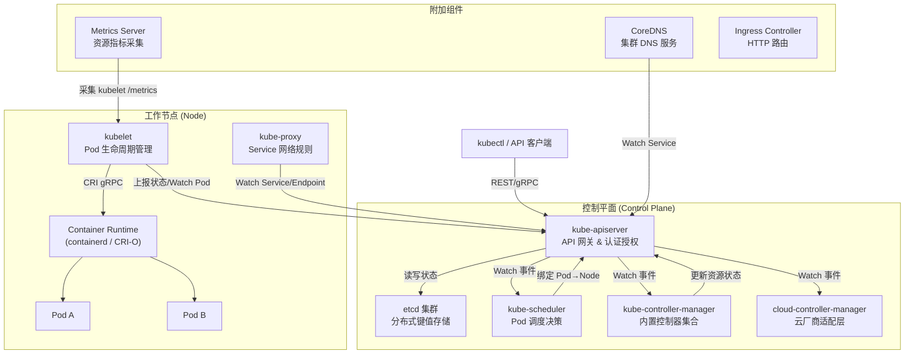
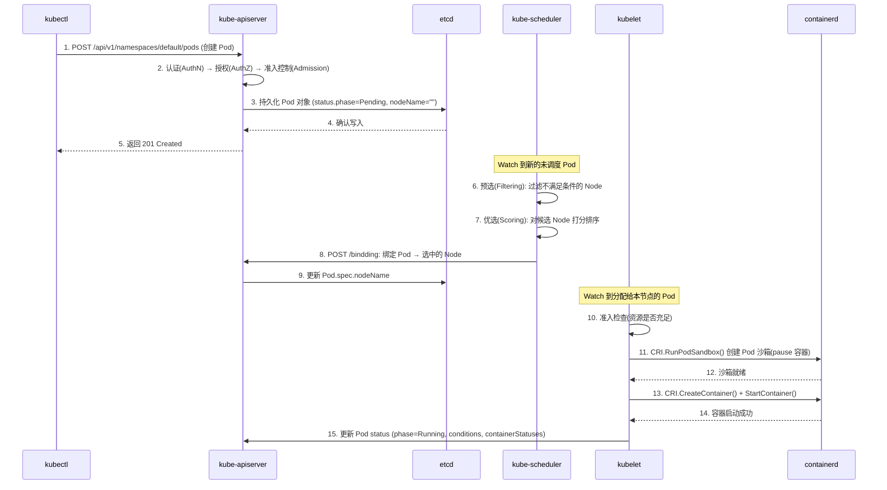
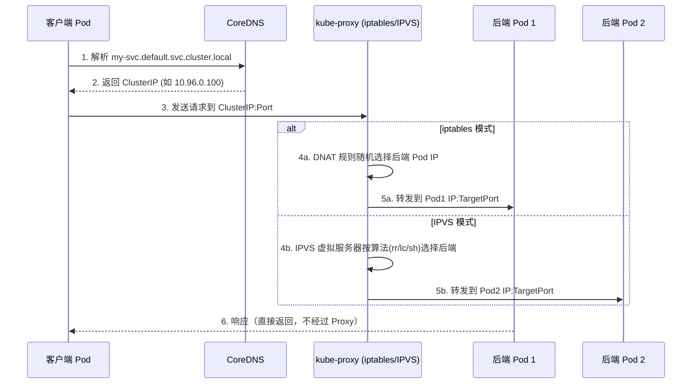
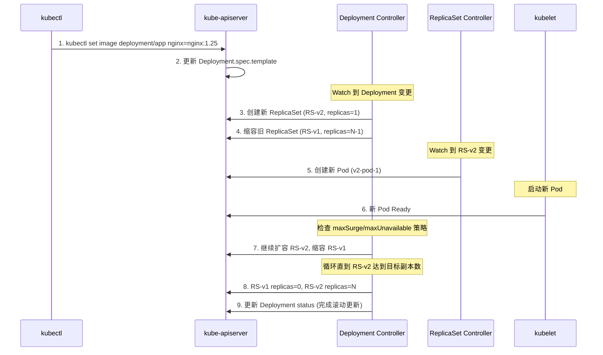
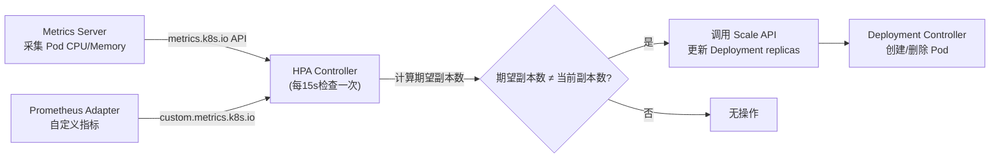
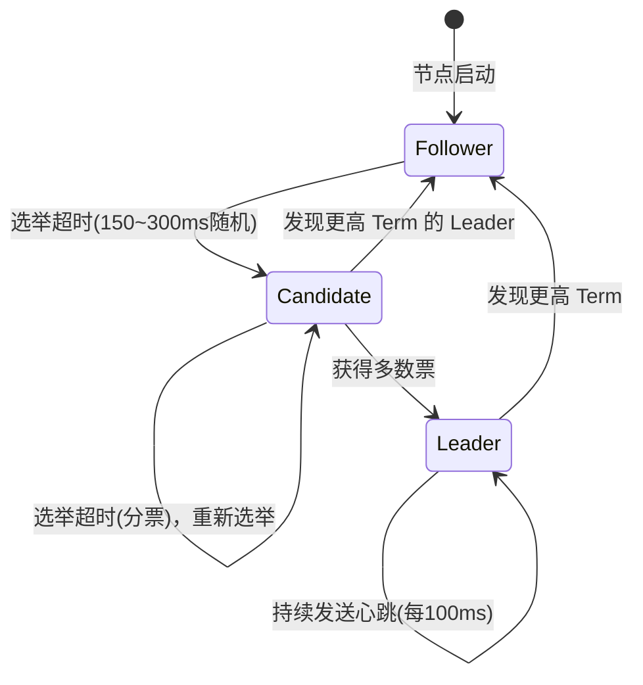
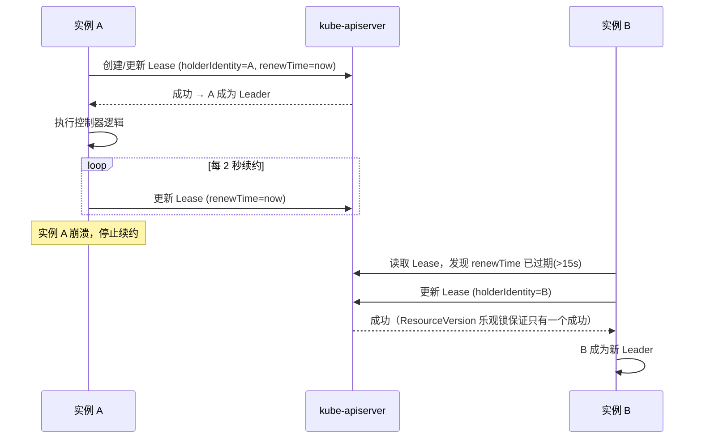
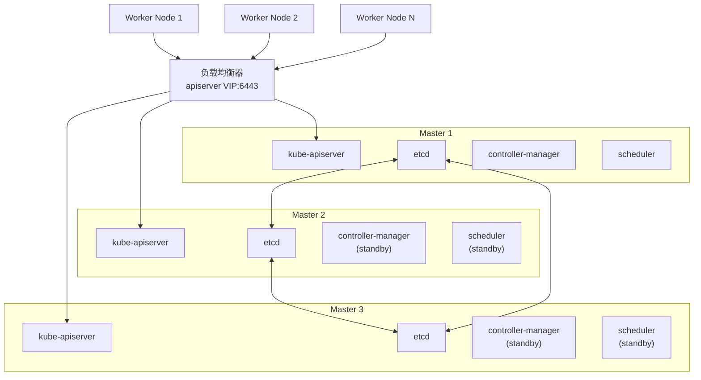

# Kubernetes 知多少 v1.0

> 版本：Kubernetes 1.32（代号 "Penelope"，2024年12月发布）
> 文档版本：v1.0
> 最后更新时间：2025-01-15

---

## 📖 前言

### 技术背景与学习价值

Kubernetes（常缩写为 K8s）是当今云原生生态的基石。自 2014 年 Google 将其开源以来，它已从一个容器编排工具演变为整个云原生技术栈的"操作系统"。CNCF 2023 年度调查显示，超过 84% 的组织在生产环境中使用或评估 Kubernetes，它已成为事实上的容器编排标准。

🎯 学习 Kubernetes 的核心价值：
- **职业竞争力**：云原生已成为后端/运维/架构师的必备技能
- **系统设计思维**：K8s 的声明式 API、控制器模式、最终一致性等设计理念，是分布式系统设计的教科书级范例
- **生态杠杆**：掌握 K8s 即打开了 Service Mesh（Istio）、Serverless（Knative）、GitOps（ArgoCD）等整个云原生生态的大门

### 为什么是 1.32 版本

Kubernetes 1.32 "Penelope" 于 2024 年 12 月发布，是一个重要的里程碑版本：
- **Sidecar Containers 正式 GA**���原生支持 Sidecar 生命周期管理，不再依赖社区 Workaround
- **动态资源分配（DRA）持续演进**：为 GPU/FPGA 等异构资源管理奠定基础
- **多项稳定性增强**：大量 Beta 特性晋升 GA，标志着平台成熟度进一步提升

### 阅读指南

| 读者类型 | 推荐章节 | 预期收获 |
|---------|---------|---------|
| K8s 初学者 | 第一章 → 第二章（2.1-2.2）→ 第六章 | 建立全局认知，掌握核心概念与排障能力 |
| 中级开发者 | 第二章 → 第三章 → 第四章 | 理解实现原理，具备 Operator 开发能力 |
| 高级架构师 | 第四章 → 第五章 → 第六章 | 掌握设计哲学，具备大规模集群治理能力 |
| 面试备战 | 第七章（配合对应章节深入） | 系统化面试准备 |

---

## 第一章：基础理论与架构演进

### 1.1 技术诞生背景与核心问题

#### 从物理机到容器的演进之路

```
物理机时代        虚拟机时代          容器时代            云原生时代
(~2005)          (2005~2013)        (2013~2017)        (2017~至今)
┌─────────┐     ┌─────────┐       ┌─────────┐        ┌─────────┐
│ App A/B/C│     │ VM1│VM2│VM3│    │ 容器1│容器2│容器3│  │ K8s 编排  │
│ 共享OS   │     │ 各自OS  │       │ 共享OS内核│       │ 声明式管理│
│ 资源争抢 │     │ 资源隔离 │       │ 轻量隔离  │       │ 自动化运维│
└─────────┘     └─────────┘       └─────────┘        └─────────┘
问题：资源浪费    问题：启动慢/重     问题：规模化管理难   解决：全自动编排
```

🎯 核心演进逻辑：每一代技术都在解决上一代的核心痛点——资源利用率 → 隔离性 → 轻量化 → 规模化管理。

#### Google Borg/Omega 的遗产

Kubernetes 并非凭空诞生，它直接继承了 Google 内部两代集群管理系统的经验：

| 系统 | 时间 | 核心贡献 | K8s 中的体现 |
|------|------|---------|-------------|
| Borg | 2003~ | 大规模集群管理、声明式任务描述 | Pod 概念、Label/Selector 机制 |
| Omega | 2013~ | 共享状态调度、乐观并发控制 | 基于 etcd 的共享状态、ResourceVersion 乐观锁 |
| Kubernetes | 2014~ | 开源、可扩展、声明式 API | CRD/Operator 扩展体系 |

> 📄 参考论文：*"Large-scale cluster management at Google with Borg"*（EuroSys 2015）；*"Borg, Omega, and Kubernetes"*（ACM Queue 2016）

#### Kubernetes 要解决的三大核心问题

1. **容器编排**：成百上千个容器如何自动部署、更新、回滚？
2. **资源调度**：如何将容器高效地分配到集群节点上，最大化资源利用率？
3. **服务治理**：容器间如何发现彼此、负载均衡、故障自愈？

💡 用一句话理解 Kubernetes：**它是数据中心的"分布式操作系统"，将一组机器抽象为一个统一的计算资源池，用户只需声明"我要什么"，K8s 负责"怎么做"。**

### 1.2 架构演进历程

#### 第一阶段：奠基期（v1.0 ~ v1.5，2015-2016）

- v1.0（2015.07）：首个正式版本，确立 Pod/Service/ReplicationController 核心模型
- v1.1：引入 HPA（Horizontal Pod Autoscaler）、Job
- v1.2：引入 Deployment（替代 ReplicationController）、ConfigMap
- v1.3：引入 PetSet（后更名为 StatefulSet）、Init Containers
- v1.4：引入 ScheduledJob（后更名为 CronJob）
- v1.5：引入 StatefulSet（Beta）、RBAC（Alpha）、PodDisruptionBudget

🎯 这一阶段的核心目标：**建立基础编排能力，验证声明式 API 模型的可行性。**

#### 第二阶段：成熟期（v1.6 ~ v1.12，2017-2018）

- v1.6：etcd v3 成为默认存储后端（性能大幅提升）、RBAC 进入 Beta
- v1.7：CRD（CustomResourceDefinition）取代 ThirdPartyResource，开启扩展性新纪元
- v1.8：RBAC GA、CronJob 进入 Beta
- v1.9：Workloads API（Deployment/DaemonSet/ReplicaSet/StatefulSet）GA
- v1.10：CSI（Container Storage Interface）Alpha，存储插件化
- v1.11：CoreDNS 成为默认 DNS、IPVS kube-proxy GA
- v1.12：RuntimeClass 引入、Kubelet TLS Bootstrap GA

🎯 这一阶段的核心目标：**插件化架构成型（CRI/CNI/CSI），RBAC 安全体系完善，核心 Workload API 稳定。**

#### 第三阶段：企业级（v1.13 ~ v1.20，2018-2020）

- v1.13：kubeadm GA（生产级集群部署工具）
- v1.14：Windows 节点支持 GA、kubectl 插件机制
- v1.16：CRD GA、Admission Webhook GA（扩展性里程碑）
- v1.18：Topology Manager GA、kubectl debug（Alpha）
- v1.19：Ingress API GA、EndpointSlice GA
- v1.20：dockershim 废弃公告（推动 containerd/CRI-O 迁移）

🎯 这一阶段的核心目标：**CRD/Webhook 扩展体系成熟，为 Operator 生态爆发奠定基础。**

#### 第四阶段：云原生深水区（v1.21 ~ v1.28，2021-2023）

- v1.21：PodSecurityPolicy 废弃，引入 PodSecurity Admission
- v1.22：移除大量过期 Beta API（重大 Breaking Change）
- v1.24：正式移除 dockershim、Gatekeeper 成熟
- v1.25：Pod Security Admission GA、Ephemeral Containers GA
- v1.26：Job 可变调度指令、CEL for Admission
- v1.27：In-Place Pod Resize（Alpha）、kubectl events 改进
- v1.28：Sidecar Containers（Alpha）、Native Sidecar 支持

🎯 这一阶段的核心目标：**安全模型重构（PSA 替代 PSP），移除历史包袱，引入 Sidecar 原生支持。**

#### 第五阶段：精细化治理（v1.29 ~ v1.32，2023-2024）

- v1.29：KMS v2 GA、nftables kube-proxy（Alpha）
- v1.30：结构化授权配置、Pod Scheduling Readiness GA
- v1.31：AppArmor GA、nftables kube-proxy（Beta）
- v1.32 "Penelope"：
  - **Sidecar Containers GA**：`restartPolicy: Always` 的 Init Container 正式稳定
  - **DRA（Dynamic Resource Allocation）持续演进**：结构化参数模型
  - **多项 Beta → GA 晋升**：标志平台进入高度稳定期

🎯 这一阶段的核心目标：**精细化资源管理（DRA），安全加固（KMS v2/AppArmor），Sidecar 原生化。**

### 1.3 核心概念术语表

| 英文术语 | 中文 | 通俗解释 |
|---------|------|---------|
| Pod | 容器组 | K8s 最小调度单元，一个或多个共享网络/存储的容器 |
| Node | 节点 | 集群中的一台工作机器（物理机或虚拟机） |
| Cluster | 集群 | 一组 Node 的集合，由控制平面统一管理 |
| Namespace | 命名空间 | 集群内的虚拟隔离分区，用于多租户资源隔离 |
| Deployment | 部署 | 管理无状态应用的控制器，支持滚动更新和回滚 |
| StatefulSet | 有状态副本集 | 管理有状态应用（如数据库），保证 Pod 有序性和持久标识 |
| DaemonSet | 守护进程集 | 确保每个（或指定）Node 上运行一个 Pod 副本 |
| Service | 服务 | 为一组 Pod 提供稳定的网络访问入口和负载均衡 |
| Ingress | 入口 | HTTP/HTTPS 层的路由规则，将外部流量导入集群内 Service |
| ConfigMap | 配置映射 | 存储非敏感配置数据的 API 对象 |
| Secret | 密钥 | 存储敏感数据（密码、Token 等），Base64 编码存储 |
| PV / PVC | 持久卷 / 持久卷声明 | PV 是存储资源，PVC 是用户对存储的申请 |
| CRD | 自定义资源定义 | 扩展 K8s API 的机制，允许用户定义新的资源类型 |
| Operator | 操作器 | CRD + 自定义 Controller，将运维知识编码为自动化程序 |
| Label / Selector | 标签 / 选择器 | 键值对标签系统，用于资源分组和筛选 |
| Annotation | 注解 | 附加到对象的非标识性元数据 |
| kubelet | 节点代理 | 运行在每个 Node 上，负责管理 Pod 生命周期 |
| kube-proxy | 网络代理 | 维护节点上的网络规则，实现 Service 的流量转发 |
| etcd | 分布式键值存储 | K8s 的"大脑"，存储所有集群状态数据 |
| Controller | 控制器 | 监听 API 对象变化并驱动实际状态向期望状态收敛的循环 |
| Scheduler | 调度器 | 决定 Pod 应该运行在哪个 Node 上 |

### 1.4 适用场景 vs 不适用场景

| 场景 | 适用性 | 说明 |
|------|--------|------|
| 微服务架构编排 | ✅ | K8s 的核心设计目标，Service/Ingress/DNS 天然支持 |
| CI/CD 流水线基础设施 | ✅ | Jenkins/Tekton/ArgoCD 等均原生运行于 K8s |
| 弹性伸缩 Web 应用 | ✅ | HPA/VPA/Cluster Autoscaler 提供多层弹性 |
| 批处理与大数据任务 | ✅ | Job/CronJob + Spark on K8s/Flink on K8s |
| 混合云/多云统一管理 | ✅ | 抽象层屏蔽底层差异，KubeFed/Karmada 支持多集群 |
| AI/ML 训练任务 | ✅ | GPU 调度 + DRA + Kubeflow 生态 |
| 单体小应用（< 3 个服务） | ❌ | 运维复杂度远超收益，Docker Compose 足矣 |
| 强实时系统（高频交易） | ❌ | 容器网络和调度引入的延迟不可接受 |
| 裸金属特殊内核依赖 | ❌ | 容器共享宿主内核，无法满足特殊内核需求 |
| 极小团队无运维能力 | ❌ | K8s 运维门槛高，建议使用托管服务（EKS/GKE/AKS） |

⚠️ 常见误区：**"上了 K8s 就是云原生"**——Kubernetes 只是云原生的基础设施层，真正的云原生还需要微服务拆分、DevOps 文化、可观测性体系等配套。

### 1.5 与同类技术对比

| 维度 | Kubernetes | Docker Swarm | Apache Mesos | HashiCorp Nomad |
|------|-----------|-------------|-------------|----------------|
| **设计哲学** | 声明式、可扩展的平台 | 简单易用的编排工具 | 两层调度的资源管理器 | 简洁灵活的工作负载编排 |
| **架构复杂度** | 高（组件多、概念多） | 低（内置于 Docker） | 高（Mesos + Marathon/Aurora） | 中（单二进制、架构简洁） |
| **调度能力** | 强（插件化调度框架） | 基础（内置策略有限） | 强（两层调度、大规模验证） | 中（支持多种驱动） |
| **扩展性** | 极强（CRD/Operator/Webhook） | 弱（扩展机制有限） | 中（Framework 机制） | 中（Task Driver 插件） |
| **生态丰富度** | 极丰富（CNCF 生态） | 较少（社区萎缩） | 中等（大数据生态） | 中等（HashiCorp 生态） |
| **社区活跃度** | 极高（最大开源项目之一） | 低（已基本停止发展） | 低（Apache 归档） | 中（HashiCorp 维护） |
| **学习曲线** | 陡峭 | 平缓 | 陡峭 | 中等 |
| **生产采用率** | 极高（>84% 组织） | 低 | 低（逐步退出） | 中（特定场景） |
| **多工作负载** | 容器为主 | 仅容器 | 容器+大数据+自定义 | 容器+VM+二进制+Java |
| **适合规模** | 中大规模 | 小规模 | 超大规模 | 中小规模 |

💡 选型建议：
- **绝大多数场景选 Kubernetes**：生态最完善，人才最多，长期投资最安全
- **极简场景选 Nomad**：如果团队小、不需要 K8s 的复杂性，Nomad 是轻量替代
- **Docker Swarm / Mesos**：不建议新项目采用，社区已基本停滞

---

## 第二章：实现原理解析

### 2.1 核心组件架构图



🎯 核心设计原则：**所有组件通过 kube-apiserver 通信，apiserver 是唯一直接读写 etcd 的组件。** 这种"星型拓扑"设计简化了安全模型（只需保护 apiserver），也使得各组件可以独立扩展和替换。

#### 各组件职责详解

| 组件 | 职责 | 是否有状态 | 可水平扩展 |
|------|------|-----------|-----------|
| kube-apiserver | REST API 网关、认证授权、准入控制、etcd 代理 | 无状态 | ✅ 多实例 + LB |
| etcd | 存储所有集群状态（唯一持久化组件） | 有状态 | ✅ 3/5/7 节点集群 |
| kube-scheduler | 监听未调度 Pod，执行调度决策 | 无状态（Leader Election） | ✅ 多实例主备 |
| kube-controller-manager | 运行内置控制器（Deployment/ReplicaSet/Node 等） | 无状态（Leader Election） | ✅ 多实例主备 |
| cloud-controller-manager | 对接云厂商 API（LB/Node/Route） | 无状态（Leader Election） | ✅ 多实例主备 |
| kubelet | 管理本节点 Pod 生命周期、上报节点状态 | 无状态 | ❌ 每节点一个 |
| kube-proxy | 维护 iptables/IPVS 规则实现 Service 转发 | 无状态 | ❌ 每节点一个 |

### 2.2 核心工作流程

#### 流程一：Pod 创建全流程



⚠️ 异常流程处理：

| 异常场景 | 触发阶段 | 表现 | 处理机制 |
|---------|---------|------|---------|
| 准入控制拒绝 | 步骤 2 | API 返回 403 | Webhook 返回拒绝原因，用户修正后重试 |
| 调度失败（无合适节点） | 步骤 6-7 | Pod 持续 Pending | Scheduler 周期性重试；触发 Cluster Autoscaler 扩容 |
| 镜像拉取失败 | 步骤 13 | ImagePullBackOff | kubelet 指数退避重试（10s→20s→40s...→5min） |
| OOMKilled | 运行时 | CrashLoopBackOff | kubelet 按 restartPolicy 重启，指数退避 |
| 节点故障 | 运行时 | Node NotReady | node-controller 等待 grace period 后驱逐 Pod |

#### 流程二：Service 请求路由流程



💡 iptables vs IPVS 模式对比：

| 维度 | iptables 模式 | IPVS 模式 |
|------|-------------|----------|
| 实现方式 | iptables 规则链 | Linux IPVS 内核模块 |
| 时间复杂度 | O(n)，规则线性匹配 | O(1)，哈希表查找 |
| 适用规模 | < 1000 Service | > 1000 Service |
| 负载均衡算法 | 随机（iptables probability） | rr/lc/dh/sh/sed/nq 多种算法 |
| 连接追踪 | conntrack | conntrack |
| 推荐场景 | 小规模集群 | 中大规模集群 |

#### 流程三：Deployment 滚动更新流程



⚠️ 滚动更新关键参数：

```yaml
apiVersion: apps/v1
kind: Deployment
metadata:
  name: nginx-deployment
spec:
  replicas: 10
  strategy:
    type: RollingUpdate
    rollingUpdate:
      maxSurge: 25%        # 最多允许超出期望副本数的比例（向上取整=3）
      maxUnavailable: 25%  # 最多允许不可用的副本数比例（向下取整=2）
  revisionHistoryLimit: 10 # 保留的历史 ReplicaSet 数量（用于回滚）
  minReadySeconds: 5       # Pod Ready 后等待多久才认为可用
  progressDeadlineSeconds: 600 # 更新超时时间
```

回滚命令：
```bash
# 查看更新历史
kubectl rollout history deployment/nginx-deployment

# 回滚到上一版本
kubectl rollout undo deployment/nginx-deployment

# 回滚到指定版本
kubectl rollout undo deployment/nginx-deployment --to-revision=2
```

#### 流程四：HPA 自动扩缩容流程



HPA 核心算法：

```
期望副本数 = ceil(当前副本数 × (当前指标值 / 目标指标值))
```

示例配置：
```yaml
apiVersion: autoscaling/v2
kind: HorizontalPodAutoscaler
metadata:
  name: nginx-hpa
spec:
  scaleTargetRef:
    apiVersion: apps/v1
    kind: Deployment
    name: nginx-deployment
  minReplicas: 2
  maxReplicas: 20
  metrics:
  - type: Resource
    resource:
      name: cpu
      target:
        type: Utilization
        averageUtilization: 70  # CPU 使用率超过 70% 触发扩容
  behavior:
    scaleUp:
      stabilizationWindowSeconds: 60   # 扩容冷却期
      policies:
      - type: Percent
        value: 100    # 每次最多扩容 100%
        periodSeconds: 60
    scaleDown:
      stabilizationWindowSeconds: 300  # 缩容冷却期（更保守）
      policies:
      - type: Percent
        value: 10     # 每次最多缩容 10%
        periodSeconds: 60
```

⚠️ HPA 易错点：
- Pod 必须设置 `resources.requests`，否则 HPA 无法计算利用率
- `stabilizationWindowSeconds` 缩容建议设置 300s+，避免流量波动导致频繁缩容

### 2.3 关键算法与协议详解

#### etcd 的 Raft 一致性协议

etcd 是 Kubernetes 的"大脑"，使用 Raft 协议保证分布式一致性。



🎯 Raft 在 K8s 中的三个关键机制：

1. **Leader 选举**：etcd 集群中只有一个 Leader 处理写请求。选举超时随机化（150~300ms）避免活锁。
2. **日志复制**：Leader 将写操作作为日志条目复制到多数 Follower 后才确认提交（Write Quorum = N/2 + 1）。
3. **快照（Snapshot）**：当日志过长时，etcd 自动创建快照压缩历史日志，默认每 10000 条日志触发一次（`--snapshot-count=10000`）。

💡 为什么 etcd 集群推荐奇数节点（3/5/7）？
- 3 节点：容忍 1 节点故障（Quorum=2）
- 5 节点：容忍 2 节点故障（Quorum=3）
- 4 节点 vs 3 节点：容错能力相同（都只容忍 1 节点故障），但 4 节点增加了网络开销

#### kube-scheduler 调度算法

Kubernetes 1.32 使用 **Scheduling Framework**（调度框架），将调度过程分为多个扩展点：

```
调度一个 Pod 的完整流程：

┌─────────────────────────────────────────────────────────────┐
│                    调度周期 (Scheduling Cycle)                │
│                                                             │
│  PreFilter → Filter → PostFilter → PreScore → Score → Reserve│
│                                                             │
└──────────────────────────┬──────────────────────────────────┘
                           │
┌──────────────────────────▼──────────────────────────────────┐
│                    绑定周期 (Binding Cycle)                   │
│                                                             │
│              Permit → PreBind → Bind → PostBind              │
│                                                             │
└─────────────────────────────────────────────────────────────┘
```

各阶段说明：

| 阶段 | 作用 | 内置插件示例 |
|------|------|------------|
| PreFilter | 预处理，检查 Pod 是否可调度 | NodeResourcesFit（预计算资源需求） |
| Filter | 过滤不满足条件的节点 | NodeAffinity、TaintToleration、PodTopologySpread |
| PostFilter | Filter 无结果时触发（如抢占） | DefaultPreemption（抢占低优先级 Pod） |
| PreScore | 评分前预处理 | InterPodAffinity（预计算亲和性拓扑） |
| Score | 对候选节点打分（0~100） | NodeResourcesBalancedAllocation、ImageLocality |
| Reserve | 预留资源（乐观假设绑定成功） | VolumeBinding（预留 PV） |
| Permit | 批准/拒绝/等待 | — |
| Bind | 执行绑定（写入 apiserver） | DefaultBinder |

⚠️ 调度性能优化：`percentageOfNodesToScore` 参数控制 Score 阶段评估的节点比例。在 5000+ 节点集群中，默认值会自动降低以保证调度延迟。

#### kube-proxy 负载均衡实现

**iptables 模式**（默认）：
```bash
# kube-proxy 为每个 Service 生成的 iptables 规则示例
# Service: my-svc (ClusterIP: 10.96.0.100, Port: 80)
# Endpoints: 10.244.1.5:8080, 10.244.2.6:8080

-A KUBE-SERVICES -d 10.96.0.100/32 -p tcp --dport 80 -j KUBE-SVC-XXXX
-A KUBE-SVC-XXXX -m statistic --mode random --probability 0.5 -j KUBE-SEP-AAA
-A KUBE-SVC-XXXX -j KUBE-SEP-BBB
-A KUBE-SEP-AAA -p tcp -j DNAT --to-destination 10.244.1.5:8080
-A KUBE-SEP-BBB -p tcp -j DNAT --to-destination 10.244.2.6:8080
```

**IPVS 模式**：
```bash
# 等效的 IPVS 配置
# ipvsadm -Ln
TCP  10.96.0.100:80 rr
  -> 10.244.1.5:8080    Masq    1      0      0
  -> 10.244.2.6:8080    Masq    1      0      0
```

#### Lease 机制

Kubernetes 使用 Lease 对象实现两个关键功能：

1. **Node 心跳**：kubelet 每 10s 更新一次 `kube-node-lease` 命名空间中的 Lease 对象，比更新 NodeStatus 更轻量（减少 etcd 写入量）。

2. **Leader Election**：kube-scheduler 和 kube-controller-manager 通过 Lease 实现主备选举：
```go
// 简化的 Leader Election 逻辑
leaseClient.Get(leaseName)
if lease.holderIdentity == "" || lease.renewTime + leaseDuration < now {
    // 尝试获取 Leader
    lease.holderIdentity = myIdentity
    lease.renewTime = now
    leaseClient.Update(lease)  // 利用 ResourceVersion 乐观锁
}
```

### 2.4 数据模型与存储结构

#### etcd 中的数据组织

etcd 中所有 Kubernetes 对象按以下键值结构存储：

```
/registry/<resource-type>/<namespace>/<name>

示例：
/registry/pods/default/nginx-pod-abc123
/registry/deployments/kube-system/coredns
/registry/services/specs/default/kubernetes
/registry/configmaps/default/my-config
/registry/nodes/worker-node-1          # 非命名空间资源无 namespace 层级
```

查看 etcd 中的实际数据：
```bash
# 列出所有键（需要 etcdctl 访问 etcd）
ETCDCTL_API=3 etcdctl get /registry --prefix --keys-only

# 查看某个 Pod 的存储内容（Protobuf 编码）
ETCDCTL_API=3 etcdctl get /registry/pods/default/nginx-pod --print-value-only | \
  auger decode
```

#### GVK 与 GVR

Kubernetes API 对象通过两套坐标系统定位：

| 概念 | 全称 | 示例 | 用途 |
|------|------|------|------|
| GVK | Group/Version/Kind | apps/v1/Deployment | 标识对象类型（代码层面） |
| GVR | Group/Version/Resource | apps/v1/deployments | 标识 REST 路径（API 层面） |

```
GVK: apps/v1/Deployment
     ↓ 映射
GVR: apps/v1/deployments
     ↓ 构成 REST 路径
URL: /apis/apps/v1/namespaces/{ns}/deployments/{name}

核心组（core group）的 GVR 路径特殊：
URL: /api/v1/namespaces/{ns}/pods/{name}  （注意是 /api 而非 /apis）
```

#### Watch 机制与 ResourceVersion

Watch 是 Kubernetes 实现"事件驱动"的核心机制：

```
客户端                          apiserver                    etcd
  │                               │                           │
  │── GET /api/v1/pods?watch=true │                           │
  │   &resourceVersion=1000       │                           │
  │                               │── Watch /registry/pods    │
  │                               │   (从 revision 1000 开始)  │
  │                               │                           │
  │                               │◄── Event: Pod A created   │
  │◄── {"type":"ADDED",           │    (revision 1001)        │
  │     "object":{...}}           │                           │
  │                               │◄── Event: Pod B modified  │
  │◄── {"type":"MODIFIED",        │    (revision 1002)        │
  │     "object":{...}}           │                           │
  │         ...                   │         ...               │
```

🎯 关键概念：
- **ResourceVersion**：每个对象都有一个 ResourceVersion（对应 etcd 的 revision），用于乐观并发控制和 Watch 断点续传
- **Watch Bookmark**：apiserver 定期发送 Bookmark 事件（只含 ResourceVersion，无对象数据），帮助客户端更新进度，避免 Watch 重连时从过旧的版本开始
- **Watch Cache**：apiserver 内置 Watch Cache，避免每个 Watch 请求都直接访问 etcd

### 2.5 通信协议

| 通信路径 | 协议 | 说明 |
|---------|------|------|
| kubectl → apiserver | HTTPS (REST) | 标准 RESTful API，支持 JSON/YAML/Protobuf |
| apiserver → etcd | gRPC (TLS) | etcd v3 API，使用 Protobuf 序列化 |
| kubelet → apiserver | HTTPS (REST) | 上报状态、Watch Pod 变更 |
| apiserver → kubelet | HTTPS | exec/logs/port-forward 等流式操作 |
| kubelet → CRI | gRPC (Unix Socket) | 容器运行时接口，如 `/run/containerd/containerd.sock` |
| kubelet → CNI | 可执行文件调用 | 网络插件通过 exec 调用 CNI 二进制 |
| kubelet → CSI | gRPC (Unix Socket) | 存储插件接口 |
| Admission Webhook | HTTPS (回调) | apiserver 主动调用外部 Webhook 服务 |
| Aggregated API | HTTPS (代理) | apiserver 代理请求到扩展 API Server |

💡 为什么 apiserver 对外用 REST，对 etcd 用 gRPC？
- **对外 REST**：降低客户端接入门槛，任何 HTTP 客户端都能调用
- **对 etcd gRPC**：高性能、强类型、支持双向流（Watch），适合内部高频通信

---

## 第三章：源码级实现细节

> 源码仓库：https://github.com/kubernetes/kubernetes
> 本章基于 Kubernetes 1.32 源码分析，主要语言为 Go。

### 3.1 代码组织结构

```
kubernetes/
├── cmd/                          # 各组件的 main 入口
│   ├── kube-apiserver/           # API Server 入口
│   ├── kube-controller-manager/  # Controller Manager 入口
│   ├── kube-scheduler/           # Scheduler 入口
│   ├── kubelet/                  # Kubelet 入口
│   ├── kube-proxy/               # Kube-proxy 入口
│   └── kubectl/                  # kubectl CLI 入口
├── pkg/                          # 核心业务逻辑
│   ├── api/                      # 内部 API 类型定义
│   ├── controller/               # 内置控制器实现
│   ├── kubelet/                  # kubelet 核心逻辑
│   ├── scheduler/                # 调度器核心逻辑
│   ├── proxy/                    # kube-proxy 核心逻辑
│   └── registry/                 # API 资源的 REST 存储实现
├── staging/src/k8s.io/           # 独立发布的库（通过 symlink 引用）
│   ├── api/                      # 外部 API 类型定义（如 corev1.Pod）
│   ├── apimachinery/             # API 基础设施（Scheme、GVK、序列化）
│   ├── apiserver/                # 通用 API Server 框架
│   ├── client-go/                # 官方 Go 客户端库（Informer/Lister/ClientSet）
│   ├── controller-manager/       # Controller Manager 框架
│   └── kubectl/                  # kubectl 命令实现
├── plugin/                       # 插件（如 Admission 插件）
├── hack/                         # 构建、测试、代码生成脚本
├── api/                          # OpenAPI 规范定义
├── build/                        # 构建相关（Dockerfile 等）
└── test/                         # 集成测试和 e2e 测试
```

🎯 核心模块功能说明：

| 模块 | 路径 | 职责 |
|------|------|------|
| client-go | `staging/src/k8s.io/client-go/` | K8s 官方 Go 客户端，包含 Informer/Lister/ClientSet，是开发 Controller/Operator 的基础 |
| apimachinery | `staging/src/k8s.io/apimachinery/` | API 基础设施：Scheme（类型注册）、GVK/GVR 映射、序列化/反序列化、字段选择器 |
| apiserver | `staging/src/k8s.io/apiserver/` | 通用 API Server 框架：请求处理链、认证授权、准入控制、审计、Watch 缓存 |
| controller | `pkg/controller/` | 内置控制器：Deployment、ReplicaSet、StatefulSet、Job、Node、Endpoint 等 |
| scheduler | `pkg/scheduler/` | 调度框架：Scheduling Framework 插件体系、调度队列、调度缓存 |
| kubelet | `pkg/kubelet/` | 节点代理：Pod 生命周期管理、PLEG、syncLoop、Volume 管理、探针检查 |

### 3.2 关键数据结构

#### Pod 结构体

```go
// staging/src/k8s.io/api/core/v1/types.go
type Pod struct {
    metav1.TypeMeta   `json:",inline"`          // apiVersion + kind
    metav1.ObjectMeta `json:"metadata,omitempty"` // name, namespace, labels, annotations, resourceVersion...

    Spec   PodSpec   `json:"spec,omitempty"`   // 期望状态：容器定义、卷、调度约束
    Status PodStatus `json:"status,omitempty"` // 实际状态：phase, conditions, podIP, containerStatuses
}

type PodSpec struct {
    Containers     []Container     `json:"containers"`               // 主容器列表
    InitContainers []Container     `json:"initContainers,omitempty"` // Init 容器（含 Sidecar）
    Volumes        []Volume        `json:"volumes,omitempty"`        // 卷定义
    NodeName       string          `json:"nodeName,omitempty"`       // 调度结果：目标节点
    NodeSelector   map[string]string `json:"nodeSelector,omitempty"` // 节点选择器
    Tolerations    []Toleration    `json:"tolerations,omitempty"`    // 容忍度
    // ... 更多字段
}

// 1.32 Sidecar Container 示例：restartPolicy=Always 的 Init Container
type Container struct {
    Name          string          `json:"name"`
    Image         string          `json:"image"`
    Resources     ResourceRequirements `json:"resources,omitempty"`
    RestartPolicy *ContainerRestartPolicy `json:"restartPolicy,omitempty"` // Sidecar: Always
    // ...
}
```

#### Informer 核心架构

```go
// staging/src/k8s.io/client-go/tools/cache/shared_informer.go

// SharedIndexInformer 是 client-go 的核心缓存机制
// 它将 Watch 事件转化为本地缓存 + 事件回调
type SharedIndexInformer interface {
    // 添加事件处理器
    AddEventHandler(handler ResourceEventHandler) (ResourceEventHandlerRegistration, error)
    // 获取本地缓存的 Indexer
    GetIndexer() Indexer
    // 启动 Informer
    Run(stopCh <-chan struct{})
}

// ResourceEventHandler 定义了三种事件回调
type ResourceEventHandler interface {
    OnAdd(obj interface{}, isInInitialList bool)
    OnUpdate(oldObj, newObj interface{})
    OnDelete(obj interface{})
}
```

Informer 内部数据流：

```
                    ┌──────────────┐
                    │  API Server  │
                    └──────┬───────┘
                           │ List + Watch
                    ┌──────▼───────┐
                    │  Reflector   │  负责 List-Watch，将事件写入 DeltaFIFO
                    └──────┬───────┘
                           │
                    ┌──────▼───────┐
                    │  DeltaFIFO   │  增量队列：存储 (key, DeltaType) 对
                    └──────┬───────┘
                           │ Pop()
                    ┌──────▼───────┐
                    │  Indexer     │  本地缓存（线程安全的 Store + 索引）
                    │  (Store)     │
                    └──────┬───────┘
                           │ 同时触发
                    ┌──────▼───────┐
                    │ EventHandler │  OnAdd / OnUpdate / OnDelete
                    │  回调        │  → 将 key 放入 workqueue
                    └──────────────┘
```

#### workqueue（工作队列）

```go
// staging/src/k8s.io/client-go/util/workqueue/

// 三种队列类型，层层增强：
// 1. 基础队列：去重 + FIFO
type Interface interface {
    Add(item interface{})           // 添加元素（自动去重）
    Get() (item interface{}, shutdown bool) // 获取元素
    Done(item interface{})          // 标记处理完成
    ShutDown()
}

// 2. 延迟队列：支持延迟入队
type DelayingInterface interface {
    Interface
    AddAfter(item interface{}, duration time.Duration)
}

// 3. 限速队列：支持指数退避重试
type RateLimitingInterface interface {
    DelayingInterface
    AddRateLimited(item interface{})  // 按限速策略延迟入队
    Forget(item interface{})          // 重置重试计数
    NumRequeues(item interface{}) int // 查询重试次数
}
```

💡 为什么需要三层队列？
- **去重**：同一个对象短时间内多次变更，只需处理一次（最终状态）
- **延迟**：某些操作需要等待（如等待 Pod 就绪后再检查）
- **限速**：处理失败时指数退避重试（10s→20s→40s...→max），避免热循环

### 3.3 并发模型

Kubernetes 大量使用 Go 的并发原语：

#### Informer 的 Reflector → DeltaFIFO → Indexer 流水线

```go
// 简化的 Reflector 运行逻辑
func (r *Reflector) Run(stopCh <-chan struct{}) {
    // 1. 首次 List：获取全量数据
    list, resourceVersion := r.listerWatcher.List(options)
    r.syncWith(list, resourceVersion)  // 写入 DeltaFIFO

    // 2. 持续 Watch：增量更新
    for {
        watcher := r.listerWatcher.Watch(options{ResourceVersion: resourceVersion})
        for event := range watcher.ResultChan() {
            switch event.Type {
            case watch.Added:
                r.store.Add(event.Object)    // 写入 DeltaFIFO
            case watch.Modified:
                r.store.Update(event.Object)
            case watch.Deleted:
                r.store.Delete(event.Object)
            }
            resourceVersion = event.Object.GetResourceVersion()
        }
        // Watch 断开后自动重连，从 resourceVersion 续传
    }
}
```

#### Controller 的 worker 协程池

```go
// 典型的 Controller 启动模式
func (c *Controller) Run(workers int, stopCh <-chan struct{}) {
    defer c.queue.ShutDown()

    // 等待 Informer 缓存同步完成
    if !cache.WaitForCacheSync(stopCh, c.hasSynced) {
        return
    }

    // 启动 N 个 worker 协程并发处理
    for i := 0; i < workers; i++ {
        go wait.Until(c.runWorker, time.Second, stopCh)
    }

    <-stopCh // 阻塞直到收到停止信号
}

func (c *Controller) runWorker() {
    for c.processNextWorkItem() {
    }
}

func (c *Controller) processNextWorkItem() bool {
    key, quit := c.queue.Get()  // 从 workqueue 取出一个 key
    if quit { return false }
    defer c.queue.Done(key)

    err := c.syncHandler(key.(string))  // 执行 Reconcile 逻辑
    if err != nil {
        c.queue.AddRateLimited(key)     // 失败则限速重入队列
        return true
    }
    c.queue.Forget(key)                 // 成功则重置重试计数
    return true
}
```

🎯 并发模型总结：
- **Reflector**：单协程执行 List-Watch，写入 DeltaFIFO
- **Informer processLoop**：单协程从 DeltaFIFO Pop，更新 Indexer + 触发 EventHandler
- **Controller workers**：多协程从 workqueue 取 key 并发处理（默认 2~5 个 worker）
- **优雅退出**：通过 `stopCh`（`<-chan struct{}`）和 `context.Context` 级联取消

### 3.4 重要类/接口设计

#### runtime.Object — 所有 API 对象的基接口

```go
// staging/src/k8s.io/apimachinery/pkg/runtime/interfaces.go
type Object interface {
    GetObjectKind() schema.ObjectKind  // 返回 GVK 信息
    DeepCopyObject() Object            // 深拷贝（并发安全）
}
```

所有 K8s API 对象（Pod、Deployment、Service 等）都实现此接口。

#### Scheme — 类型注册与转换（工厂模式 + 注册表模式）

```go
// staging/src/k8s.io/apimachinery/pkg/runtime/scheme.go
type Scheme struct {
    gvkToType map[schema.GroupVersionKind]reflect.Type  // GVK → Go 类型
    typeToGVK map[reflect.Type][]schema.GroupVersionKind // Go 类型 → GVK
    converter *conversion.Converter                      // 版本转换器
    // ...
}

// 注册类型
scheme.AddKnownTypes(corev1.SchemeGroupVersion,
    &corev1.Pod{},
    &corev1.Service{},
    &corev1.ConfigMap{},
)

// 使用：根据 GVK 创建对象实例（工厂模式）
obj, err := scheme.New(schema.GroupVersionKind{
    Group: "", Version: "v1", Kind: "Pod",
})
// obj 是 *corev1.Pod 类型
```

#### RESTStorage — API 资源的 CRUD 抽象（策略模式）

```go
// staging/src/k8s.io/apiserver/pkg/registry/rest/rest.go

// 每个 API 资源实现以下接口的子集
type Storage interface {
    New() runtime.Object  // 创建空对象
}

type Getter interface {
    Get(ctx context.Context, name string, options *metav1.GetOptions) (runtime.Object, error)
}

type Lister interface {
    NewList() runtime.Object
    List(ctx context.Context, options *metainternalversion.ListOptions) (runtime.Object, error)
}

type Creater interface {
    Create(ctx context.Context, obj runtime.Object, ...) (runtime.Object, error)
}

type Updater interface {
    Update(ctx context.Context, name string, objInfo UpdatedObjectInfo, ...) (runtime.Object, bool, error)
}

type GracefulDeleter interface {
    Delete(ctx context.Context, name string, ...) (runtime.Object, bool, error)
}

type Watcher interface {
    Watch(ctx context.Context, options *metainternalversion.ListOptions) (watch.Interface, error)
}
```

💡 设计模式标注：
- **工厂模式**：`Scheme.New()` 根据 GVK 创建对象实例
- **策略模式**：RESTStorage 接口组合，不同资源实现不同的接口子集
- **观察者模式**：Informer 的 EventHandler 回调机制
- **模板方法模式**：Controller 的 `processNextWorkItem` 定义处理骨架，`syncHandler` 由具体控制器实现

### 3.5 启动流程

#### kube-apiserver 启动全过程

```
cmd/kube-apiserver/apiserver.go: main()
  │
  ├── 1. 命令行解析（cobra.Command）
  │     解析 --etcd-servers, --service-cluster-ip-range, --tls-cert-file 等
  │
  ├── 2. 构建 ServerConfig
  │     ├── GenericConfig（认证、授权、审计、准入控制链）
  │     ├── EtcdConfig（etcd 连接、存储后端）
  │     └── ServiceIPRange（Service ClusterIP 分配范围）
  │
  ├── 3. 创建 API Server 实例
  │     ├── KubeAPIServer（核心 API：Pod/Service/Deployment 等）
  │     ├── APIExtensionsServer（CRD 相关 API）
  │     └── AggregatorServer（API 聚合层）
  │     三者通过 Delegation 链串联：Aggregator → KubeAPI → APIExtensions
  │
  ├── 4. 注册 API 资源的 Handler
  │     每个 GVR 注册到 HTTP 路由：
  │     /apis/{group}/{version}/namespaces/{ns}/{resource}/{name}
  │     Handler 链：认证 → 授权 → 准入 → RESTStorage.CRUD
  │
  ├── 5. 启动后台 goroutine
  │     ├── PostStartHook（如启动内置控制器、GC）
  │     ├── Watch Cache 初始化
  │     └── 健康检查端点 (/healthz, /livez, /readyz)
  │
  └── 6. 启动 HTTPS 服务
        监听 --secure-port（默认 6443）
        开始接受请求
```

#### kubelet 启动全过程

```
cmd/kubelet/kubelet.go: main()
  │
  ├── 1. 配置加载
  │     ├── 命令行参数 + KubeletConfiguration（文件/ConfigMap）
  │     └── 注册节点到 apiserver
  │
  ├── 2. 初始化核心模块
  │     ├── containerRuntime（通过 CRI 连接 containerd）
  │     ├── podManager（Pod 元数据管理）
  │     ├── statusManager（Pod 状态上报）
  │     ├── volumeManager（卷挂载/卸载）
  │     ├── imageManager（镜像 GC）
  │     └── probeManager（健康检查探针）
  │
  ├── 3. 启动 PLEG（Pod Lifecycle Event Generator）
  │     每秒检查容器运行时状态，生成 Pod 生命周期事件
  │     （如 ContainerStarted, ContainerDied）
  │
  ├── 4. 启动 syncLoop（核心主循环）
  │     监听多个事件源：
  │     ├── configCh：来自 apiserver 的 Pod 配置变更
  │     ├── plegCh：来自 PLEG 的容器状态变更
  │     ├── syncCh：定时全量同步（默认每 1 分钟）
  │     ├── housekeepingCh：清理任务（默认每 2 秒）
  │     └── livenessManager：探针结果
  │
  └── 5. 服务就绪
        ├── 开放 /healthz, /pods, /metrics 端点
        └── 开始处理 Pod 创建/更新/删除请求
```

⚠️ kubelet 的 syncLoop 是整个节点管理的"心脏"——它是一个 `select` 多路复用循环，持续监听上述所有事件源，确保节点上的 Pod 状态与期望状态一致。

---

## 第四章：设计模式深度剖析

### 4.1 架构层面的模式

#### 声明式 API + 控制器模式（Reconciliation Loop）

🎯 这是 Kubernetes 最核心的设计哲学，理解它就理解了 K8s 的灵魂。

**核心思想**：用户声明期望状态（Desired State），控制器持续将实际状态（Actual State）向期望状态收敛。

```
用户声明：                    控制器循环：
"我要 3 个 nginx Pod"         ┌──────────────────────┐
                              │  观察(Observe)        │
    Deployment YAML ──────►   │  当前有几个 Pod？      │
    replicas: 3               │                      │
                              │  对比(Diff)           │
                              │  期望3个，实际2个      │
                              │                      │
                              │  行动(Act)            │
                              │  创建1个新 Pod         │
                              │                      │
                              │  循环(Loop)           │
                              │  继续观察...           │
                              └──────────────────────┘
```

**为什么选择声明式而非命令式？**

| 维度 | 命令式（Imperative） | 声明式（Declarative） |
|------|---------------------|---------------------|
| 表达方式 | "创建3个Pod" | "我要3个Pod" |
| 幂等性 | ❌ 重复执行会创建6个 | ✅ 重复执行仍是3个 |
| 故障恢复 | ❌ 需要人工干预 | ✅ 控制器自动修复 |
| 状态漂移 | ❌ 无法检测 | ✅ 持续收敛 |
| 多人协作 | ❌ 操作冲突 | ✅ 以最终状态为准 |
| GitOps 友好 | ❌ 难以版本化 | ✅ YAML 即代码 |

💡 类比理解：声明式就像恒温空调——你设定 25°C（期望状态），空调自动调节制冷/制热（控制器），无论外界温度如何变化（故障/扰动），室温始终趋向 25°C。

#### Operator 模式

Operator = CRD（自定义资源） + 自定义 Controller

```
传统运维：                     Operator 模式：
DBA 手动操作 MySQL             MySQL Operator 自动化
├── 创建主从实例               ├── 用户创建 MySQLCluster CR
├── 配置复制                   ├── Operator 自动创建 StatefulSet
├── 监控健康状态               ├── Operator 自动配置主从复制
├── 故障切换                   ├── Operator 自动故障切换
└── 备份恢复                   └── Operator 自动定时备份
```

Operator 开发框架：
```go
// 使用 controller-runtime（Kubebuilder/Operator SDK 的基础）
// 一个最简 Operator 的 Reconcile 函数
func (r *MySQLClusterReconciler) Reconcile(ctx context.Context,
    req ctrl.Request) (ctrl.Result, error) {

    // 1. 获取 CR 对象
    cluster := &v1alpha1.MySQLCluster{}
    if err := r.Get(ctx, req.NamespacedName, cluster); err != nil {
        return ctrl.Result{}, client.IgnoreNotFound(err)
    }

    // 2. 确保 StatefulSet 存在
    sts := &appsv1.StatefulSet{}
    err := r.Get(ctx, types.NamespacedName{Name: cluster.Name, Namespace: cluster.Namespace}, sts)
    if errors.IsNotFound(err) {
        sts = r.buildStatefulSet(cluster)
        return ctrl.Result{}, r.Create(ctx, sts)
    }

    // 3. 确保副本数一致
    if *sts.Spec.Replicas != cluster.Spec.Replicas {
        sts.Spec.Replicas = &cluster.Spec.Replicas
        return ctrl.Result{}, r.Update(ctx, sts)
    }

    // 4. 检查健康状态，必要时触发故障切换
    // ...

    return ctrl.Result{RequeueAfter: 30 * time.Second}, nil
}
```

#### Sidecar 模式（1.32 GA）

在 Kubernetes 1.32 中，Sidecar Containers 正式 GA。实现方式是在 `initContainers` 中设置 `restartPolicy: Always`：

```yaml
apiVersion: v1
kind: Pod
metadata:
  name: app-with-sidecar
spec:
  initContainers:
  - name: istio-proxy          # Sidecar 容器
    image: istio/proxyv2:1.20
    restartPolicy: Always      # 关键：标记为 Sidecar
    ports:
    - containerPort: 15090
  containers:
  - name: app                  # 主容器
    image: my-app:v1
```

🎯 Sidecar GA 解决的核心问题：
- **生命周期管理**：Sidecar 在所有 Init Container 之后启动，在主容器之后终止
- **Job 兼容**：Job 完成时 Sidecar 会被正确终止（之前 Sidecar 不退出导致 Job 永远不完成）
- **启动顺序**：Sidecar 就绪后主容器才启动，保证代理/日志收集器先于业务就绪

#### Ambassador / Adapter 模式

```yaml
# Ambassador 模式：代理容器处理外部通信
spec:
  containers:
  - name: app
    image: my-app:v1
  - name: ambassador           # 代理容器
    image: haproxy:2.8         # 处理连接池、TLS 终止等
    ports:
    - containerPort: 8080

# Adapter 模式：适配容器转换数据格式
spec:
  containers:
  - name: app
    image: my-app:v1
  - name: log-adapter          # 适配容器
    image: fluentd:v1.16       # 将应用日志转换为统一格式
    volumeMounts:
    - name: log-volume
      mountPath: /var/log/app
```

### 4.2 GoF 设计模式在源码中的应用

#### 1. 工厂模式 — cmdutil.Factory

```go
// staging/src/k8s.io/kubectl/pkg/cmd/util/factory.go
// kubectl 使用 Factory 接口抽象客户端创建过程
type Factory interface {
    // 创建 REST 客户端映射器
    ToRESTMapper() (meta.RESTMapper, error)
    // 创建 Discovery 客户端
    ToDiscoveryClient() (discovery.CachedDiscoveryInterface, error)
    // 创建 REST 配置
    ToRESTConfig() (*rest.Config, error)
    // 创建动态客户端
    DynamicClient() (dynamic.Interface, error)
    // 创建 Kubernetes 客户端
    KubernetesClientSet() (*kubernetes.Clientset, error)
}
```

**为什么用工厂模式**：kubectl 需要支持多种认证方式（kubeconfig、ServiceAccount、OIDC 等），工厂模式将客户端创建逻辑与使用逻辑解耦。

#### 2. 策略模式 — 调度器 Score 插件

```go
// pkg/scheduler/framework/interface.go
type ScorePlugin interface {
    Plugin
    Score(ctx context.Context, state *CycleState, pod *v1.Pod, nodeName string) (int64, *Status)
    ScoreExtensions() ScoreExtensions
}

// 不同的评分策略实现同一接口：
// - NodeResourcesBalancedAllocation：倾向资源均衡的节点
// - ImageLocality：倾向已有镜像的节点
// - InterPodAffinity：倾向满足亲和性的节点
// - NodeResourcesFit：倾向资源充足的节点
```

**为什么用策略模式**：调度策略需要可插拔、可组合。用户可以通过 KubeSchedulerConfiguration 启用/禁用/调整权重。

#### 3. 观察者模式 — Informer EventHandler

```go
// staging/src/k8s.io/client-go/tools/cache/shared_informer.go
// Informer 允许注册多个 EventHandler，当资源变更时通知所有观察者

podInformer.AddEventHandler(cache.ResourceEventHandlerFuncs{
    AddFunc: func(obj interface{}) {
        // Pod 创建时触发
        controller.enqueue(obj)
    },
    UpdateFunc: func(oldObj, newObj interface{}) {
        // Pod 更新时触发
        controller.enqueue(newObj)
    },
    DeleteFunc: func(obj interface{}) {
        // Pod 删除时触发
        controller.enqueue(obj)
    },
})
```

**为什么用观察者模式**：多个控制器可能关注同一种资源（如 Deployment Controller 和 HPA Controller 都关注 Pod），观察者模式实现一对多的事件分发。

#### 4. 责任链模式 — Admission Webhook 链

```go
// staging/src/k8s.io/apiserver/pkg/admission/chain.go
type chainAdmissionHandler []Interface

func (admissionHandler chainAdmissionHandler) Admit(
    ctx context.Context, a Attributes, o ObjectInterfaces) error {
    for _, handler := range admissionHandler {
        if !handler.Handles(a.GetOperation()) {
            continue
        }
        err := handler.Admit(ctx, a, o)
        if err != nil {
            return err  // 任一环节拒绝则整体拒绝
        }
    }
    return nil
}
```

请求处理链：`Mutating Webhook 1 → Mutating Webhook 2 → ... → Validating Webhook 1 → Validating Webhook 2 → ...`

### 4.3 分布式系统模式

#### Leader Election — 基于 Lease 的选主



#### Watch + Cache（List-Watch 模式）

**问题**：如果每个控制器都直接 List apiserver，apiserver 和 etcd 会被压垮。

**解决**：Informer 的 List-Watch 模式——首次 List 全量，之后 Watch 增量，本地缓存（Indexer）提供读取。

```
                    无 Informer                    有 Informer
Controller A ──List──►                  Controller A ──Read──► Local Cache
Controller B ──List──► apiserver        Controller B ──Read──► Local Cache
Controller C ──List──►                  Controller C ──Read──► Local Cache
                    ↓                                          ↑
              apiserver 过载              Informer ──Watch──► apiserver
                                         (只有一个连接)
```

#### Level-Triggered vs Edge-Triggered

🎯 Kubernetes 选择 **Level-Triggered（电平触发）** 而非 Edge-Triggered（边沿触发）：

| 模式 | 含义 | 特点 |
|------|------|------|
| Edge-Triggered | 只在状态变化时触发 | 如果错过一个事件，状态就不一致了 |
| Level-Triggered | 基于当前状态持续触发 | 即使错过事件，下次检查仍能发现差异并修复 |

**为什么选择 Level-Triggered？**
- 分布式系统中事件可能丢失（网络分区、Watch 断连）
- Level-Triggered 天然具备自愈能力：控制器每次 Reconcile 都比较"期望状态 vs 实际状态"，而非依赖"发生了什么事件"
- 代价是可能做一些不必要的检查，但换来了更强的鲁棒性

### 4.4 设计权衡分析

#### 声明式 vs 命令式

Kubernetes 选择声明式 API 的核心权衡：
- **收益**：幂等性、自愈能力、GitOps 友好、多控制器协作
- **代价**：学习曲线陡峭（用户需要理解"期望状态"思维）、调试困难（"为什么我的 Pod 没有按预期运行？"需要理解控制器逻辑）

#### 最终一致性 vs 强一致性

- **etcd 层**：强一致性（Raft 协议保证）
- **控制器层**：最终一致性（控制器异步收敛，可能有短暂的状态不一致窗口）
- **权衡**：强一致性保证数据不丢失，最终一致性保证系统可用性和扩展性

#### CRD + Operator 的扩展哲学

- **收益**：无需修改 K8s 核心代码即可扩展 API，Operator 生态爆发（OperatorHub 上 300+ Operator）
- **代价**：CRD 的功能不如原生 API 丰富（如缺少原生的 `kubectl explain` 支持、字段验证需要额外配置）
- **演进方向**：CEL 验证规则（1.25+）、CRD Validation Ratcheting（1.28+）持续缩小差距

---

## 第五章：高可靠与高可用方案

### 5.1 集群部署架构

#### 单节点开发环境

```bash
# Kind（Kubernetes in Docker）— 推荐的本地开发方案
kind create cluster --name dev --config kind-config.yaml

# Minikube — 单节点虚拟机
minikube start --cpus=4 --memory=8192 --driver=docker
```

适用场景：本地开发、CI 测试、学习实验。不适用于生产。

#### 三节点高可用控制平面（Stacked etcd）



🎯 Stacked etcd 模式：etcd 与 apiserver 部署在同一节点，运维简单但耦合度高。

#### 外置 etcd 集群架构

```
┌─────────────────────────────────────────────┐
│              etcd 集群（独立部署）              │
│  etcd-1 ◄──► etcd-2 ◄──► etcd-3            │
│  (独立硬件，SSD 磁盘，低延迟网络)              │
└──────────────────┬──────────────────────────┘
                   │ gRPC
┌──────────────────▼──────────────────────────┐
│           控制平面节点                         │
│  Master-1: apiserver + CM + scheduler       │
│  Master-2: apiserver + CM(standby)          │
│  Master-3: apiserver + scheduler(standby)   │
└─────────────────────────────────────────────┘
```

💡 外置 etcd 的优势：
- etcd 和控制平面可以独立扩展和维护
- etcd 节点可以使用专用 SSD 和网络
- 推荐用于 500+ 节点的大规模集群

#### 部署模式对比

| 维度 | 单节点 | Stacked HA | 外置 etcd HA |
|------|--------|-----------|-------------|
| 节点数 | 1 | 3+ Master | 3+ Master + 3+ etcd |
| 容错能力 | 无 | 容忍 1 Master 故障 | 控制平面和 etcd 独立容错 |
| 运维复杂度 | 低 | 中 | 高 |
| 适用规模 | 开发测试 | 中小规模生产 | 大规模生产 |
| 成本 | 最低 | 中 | 高 |

### 5.2 数据一致性保证

#### etcd 的 Raft 强一致性

- 所有写操作必须经过 Leader，并复制到多数节点后才确认
- 读操作默认 Serializable（可能读到旧数据），可设置 Linearizable 保证强一致读
- K8s apiserver 默认使用 Serializable 读（性能优先），关键操作使用 Quorum 读

#### apiserver 缓存的最终一致性

```
写请求路径（强一致）：
Client → apiserver → etcd (Raft Quorum Write) → 确认

读请求路径（最终一致）：
Client → apiserver → Watch Cache (内存) → 返回
                     ↑
                     etcd Watch 事件异步更新
```

⚠️ Watch Cache 可能有毫秒级延迟。如果需要读取最新数据，使用 `resourceVersion=""` 强制从 etcd 读取（但会增加 etcd 负载）。

#### ResourceVersion 乐观锁

```yaml
# 更新时携带 resourceVersion，防止并发冲突
apiVersion: v1
kind: ConfigMap
metadata:
  name: my-config
  resourceVersion: "12345"  # 必须与服务端一致，否则返回 409 Conflict
data:
  key: new-value
```

### 5.3 故障检测与恢复

#### Node 故障检测

```
kubelet                    kube-apiserver              node-controller
  │                            │                           │
  │── 更新 Lease (每10s) ──►   │                           │
  │── 更新 NodeStatus (每10s)─►│                           │
  │                            │                           │
  │   (kubelet 停止心跳)       │                           │
  │                            │   (Lease 过期)            │
  │                            │◄── 检测到 Lease 过期 ─────│
  │                            │                           │
  │                            │   等待 node-monitor-      │
  │                            │   grace-period (40s)      │
  │                            │                           │
  │                            │◄── 标记 Node NotReady ────│
  │                            │                           │
  │                            │   等待 pod-eviction-      │
  │                            │   timeout (5min)          │
  │                            │                           │
  │                            │◄── 驱逐 Node 上的 Pod ────│
```

关键超时参数：

| 参数 | 默认值 | 说明 |
|------|--------|------|
| `--node-monitor-period` | 5s | node-controller 检查 Node 状态的间隔 |
| `--node-monitor-grace-period` | 40s | 标记 Node NotReady 前的等待时间 |
| `--pod-eviction-timeout` | 5m | Node NotReady 后开始驱逐 Pod 的等待时间 |
| kubelet `--node-status-update-frequency` | 10s | kubelet 上报 NodeStatus 的间隔 |
| kubelet Lease 续约间隔 | 10s | kubelet 更新 Lease 对象的间隔 |

#### Pod 健康检查

```yaml
apiVersion: v1
kind: Pod
spec:
  containers:
  - name: app
    image: my-app:v1
    # 存活探针：失败则重启容器
    livenessProbe:
      httpGet:
        path: /healthz
        port: 8080
      initialDelaySeconds: 15  # 首次检查延迟
      periodSeconds: 10        # 检查间隔
      failureThreshold: 3      # 连续失败次数后重启
      timeoutSeconds: 3        # 单次超时

    # 就绪探针：失败则从 Service Endpoint 移除
    readinessProbe:
      httpGet:
        path: /ready
        port: 8080
      periodSeconds: 5
      failureThreshold: 3

    # 启动探针（1.20 GA）：启动期间替代 liveness 检查
    startupProbe:
      httpGet:
        path: /healthz
        port: 8080
      failureThreshold: 30     # 30 × 10s = 最多等待 5 分钟启动
      periodSeconds: 10
```

🎯 三种探针的关系：
- **startupProbe**：启动阶段使用，成功后不再执行，交给 liveness/readiness
- **livenessProbe**：运行阶段检测容器是否存活，失败则重启
- **readinessProbe**：运行阶段检测容器是否就绪接收流量，失败则从 Endpoint 移除

#### 控制平面故障恢复

```bash
# etcd 备份
ETCDCTL_API=3 etcdctl snapshot save /backup/etcd-snapshot.db \
  --endpoints=https://127.0.0.1:2379 \
  --cacert=/etc/kubernetes/pki/etcd/ca.crt \
  --cert=/etc/kubernetes/pki/etcd/server.crt \
  --key=/etc/kubernetes/pki/etcd/server.key

# etcd 恢复
ETCDCTL_API=3 etcdctl snapshot restore /backup/etcd-snapshot.db \
  --data-dir=/var/lib/etcd-restored \
  --name=etcd-0 \
  --initial-cluster=etcd-0=https://10.0.0.1:2380 \
  --initial-advertise-peer-urls=https://10.0.0.1:2380
```

### 5.4 容灾策略

#### Pod 拓扑分布约束

```yaml
apiVersion: apps/v1
kind: Deployment
spec:
  replicas: 6
  template:
    spec:
      topologySpreadConstraints:
      - maxSkew: 1                          # 最大不均衡度
        topologyKey: topology.kubernetes.io/zone  # 按可用区分布
        whenUnsatisfiable: DoNotSchedule    # 不满足则不调度
        labelSelector:
          matchLabels:
            app: web
      - maxSkew: 1
        topologyKey: kubernetes.io/hostname  # 按节点分布
        whenUnsatisfiable: ScheduleAnyway   # 尽量满足，不强制
        labelSelector:
          matchLabels:
            app: web
```

#### Velero 备份与灾难恢复

```bash
# 安装 Velero
velero install --provider aws --bucket my-backup-bucket \
  --secret-file ./credentials-velero

# 创建备份
velero backup create full-backup --include-namespaces default,production

# 定时备份
velero schedule create daily-backup --schedule="0 2 * * *" \
  --include-namespaces production --ttl 720h

# 灾难恢复
velero restore create --from-backup full-backup
```

### 5.5 性能优化（30+ 调优参数）

#### kube-apiserver 调优

| 参数 | 默认值 | 推荐值（大规模） | 说明 |
|------|--------|----------------|------|
| `--max-requests-inflight` | 400 | 800~1600 | 非 mutating 请求并发上限 |
| `--max-mutating-requests-inflight` | 200 | 400~800 | mutating 请求并发上限 |
| `--watch-cache-sizes` | 自动 | 按资源调整 | Watch Cache 大小（如 pods#1000） |
| `--default-watch-cache-size` | 100 | 500~1000 | 默认 Watch Cache 大小 |
| `--etcd-compaction-interval` | 5m | 5m | etcd 压缩间隔 |
| `--audit-log-maxage` | 0 | 30 | 审计日志保留天数 |
| `--audit-log-maxsize` | 0 | 100 | 审计日志单文件最大 MB |
| `--enable-priority-and-fairness` | true | true | API 优先级和公平性（APF） |

#### etcd 调优

| 参数 | 默认值 | 推荐值 | 说明 |
|------|--------|--------|------|
| `--quota-backend-bytes` | 2GB | 8GB | 存储配额（最大 8GB） |
| `--snapshot-count` | 10000 | 10000 | 触发快照的日志条数 |
| `--heartbeat-interval` | 100ms | 100ms | Leader 心跳间隔 |
| `--election-timeout` | 1000ms | 1000ms | 选举超时（应为心跳的 10 倍） |
| `--auto-compaction-mode` | periodic | periodic | 自动压缩模式 |
| `--auto-compaction-retention` | 0 | 1h | 自动压缩保留时间 |
| 磁盘类型 | — | NVMe SSD | etcd 对磁盘 IOPS 极其敏感 |
| 网络延迟 | — | < 10ms | etcd 节点间延迟应 < 10ms |

⚠️ etcd 性能黄金法则：**SSD 磁盘 + 低延迟网络 + 合理的 quota-backend-bytes**。etcd 性能劣化是大规模集群最常见的瓶颈。

#### kubelet 调优

| 参数 | 默认值 | 推荐值 | 说明 |
|------|--------|--------|------|
| `--max-pods` | 110 | 110~250 | 单节点最大 Pod 数 |
| `--kube-api-qps` | 50 | 100 | kubelet 访问 apiserver 的 QPS |
| `--kube-api-burst` | 100 | 200 | kubelet 访问 apiserver 的 Burst |
| `--serialize-image-pulls` | true | false | 并行拉取镜像（需 containerd 支持） |
| `--image-gc-high-threshold` | 85% | 85% | 镜像 GC 高水位 |
| `--image-gc-low-threshold` | 80% | 80% | 镜像 GC 低水位 |
| `--eviction-hard` | 见下方 | 按需调整 | 硬驱逐阈值 |
| `--system-reserved` | — | cpu=500m,memory=1Gi | 系统预留资源 |
| `--kube-reserved` | — | cpu=500m,memory=1Gi | K8s 组件预留资源 |

驱逐阈值配置：
```yaml
# KubeletConfiguration
evictionHard:
  memory.available: "500Mi"
  nodefs.available: "10%"
  imagefs.available: "15%"
  nodefs.inodesFree: "5%"
evictionSoft:
  memory.available: "1Gi"
evictionSoftGracePeriod:
  memory.available: "1m30s"
```

#### kube-scheduler 调优

| 参数 | 默认值 | 推荐值 | 说明 |
|------|--------|--------|------|
| `--percentageOfNodesToScore` | 自动 | 按规模调整 | Score 阶段评估的节点比例 |
| `--kube-api-qps` | 50 | 100 | 访问 apiserver 的 QPS |
| `--kube-api-burst` | 100 | 200 | 访问 apiserver 的 Burst |
| 并行度 | 16 | 16~64 | 调度器并行处理的 Pod 数 |

#### kube-proxy 调优

| 参数 | 默认值 | 推荐值 | 说明 |
|------|--------|--------|------|
| `--proxy-mode` | iptables | ipvs | 大规模集群使用 IPVS |
| `--ipvs-scheduler` | rr | rr/lc | IPVS 负载均衡算法 |
| `--ipvs-min-sync-period` | 0s | 1s | IPVS 规则最小同步间隔 |
| `--conntrack-max-per-core` | 32768 | 65536 | 每核心 conntrack 表大小 |

#### 集群级调优

```yaml
# API Priority and Fairness (APF) — 防止单个客户端耗尽 apiserver 资源
apiVersion: flowcontrol.apiserver.k8s.io/v1
kind: FlowSchema
metadata:
  name: high-priority-system
spec:
  priorityLevelConfiguration:
    name: workload-high
  matchingPrecedence: 100
  rules:
  - subjects:
    - kind: ServiceAccount
      serviceAccount:
        name: critical-controller
        namespace: kube-system
    resourceRules:
    - verbs: ["*"]
      apiGroups: ["*"]
      resources: ["*"]
```

### 5.6 可观测性

#### 关键 Prometheus 指标

| 组件 | 指标 | 含义 | 告警阈值建议 |
|------|------|------|------------|
| apiserver | `apiserver_request_duration_seconds` | API 请求延迟 | P99 > 1s |
| apiserver | `apiserver_request_total` | API 请求总数（按状态码） | 5xx 率 > 1% |
| apiserver | `apiserver_current_inflight_requests` | 当前并发请求数 | > 80% max |
| etcd | `etcd_disk_wal_fsync_duration_seconds` | WAL 写入延迟 | P99 > 10ms |
| etcd | `etcd_server_proposals_failed_total` | 失败的 Raft 提案数 | 持续增长 |
| etcd | `etcd_mvcc_db_total_size_in_bytes` | 数据库大小 | > 6GB (quota 8GB) |
| kubelet | `kubelet_pod_start_duration_seconds` | Pod 启动延迟 | P99 > 30s |
| kubelet | `kubelet_running_pods` | 运行中的 Pod 数 | 接近 max-pods |
| scheduler | `scheduler_scheduling_attempt_duration_seconds` | 调度延迟 | P99 > 1s |
| scheduler | `scheduler_pending_pods` | 待调度 Pod 数 | 持续增长 |

#### 健康检查端点

```bash
# apiserver 健康检查
curl -k https://localhost:6443/healthz    # 综合健康状态
curl -k https://localhost:6443/livez      # 存活检查
curl -k https://localhost:6443/readyz     # 就绪检查
curl -k https://localhost:6443/readyz?verbose  # 详细就绪状态

# etcd 健康检查
etcdctl endpoint health --endpoints=https://127.0.0.1:2379

# kubelet 健康检查
curl http://localhost:10248/healthz
```

#### 审计日志配置

```yaml
# audit-policy.yaml
apiVersion: audit.k8s.io/v1
kind: Policy
rules:
# 不记录健康检查
- level: None
  nonResourceURLs: ["/healthz*", "/livez*", "/readyz*"]

# 记录 Secret 的元数据（不记录内容）
- level: Metadata
  resources:
  - group: ""
    resources: ["secrets"]

# 记录所有写操作的请求体
- level: Request
  verbs: ["create", "update", "patch", "delete"]
  resources:
  - group: ""
    resources: ["pods", "services", "configmaps"]

# 其他记录元数据
- level: Metadata
  omitStages: ["RequestReceived"]
```

---

## 第六章：实战指南与问题排查

### 6.1 最佳实践

#### 资源请求与限制

```yaml
# 推荐配置模式
resources:
  requests:          # 调度依据，保证最低资源
    cpu: 100m        # 0.1 核
    memory: 128Mi
  limits:            # 硬上限，超出则 OOMKilled/CPU 限流
    cpu: 500m        # 建议 limits/requests 比例 2~5 倍
    memory: 256Mi    # memory limits 建议 = requests 或略高
```

⚠️ 关键原则：
- **必须设置 requests**：否则 Pod 会被视为 BestEffort，资源紧张时最先被驱逐
- **memory limits 不宜过高**：超出 limits 会被 OOMKilled，但 CPU 只会被限流
- **避免 limits = requests**：这是 Guaranteed QoS，资源利用率低；建议 Burstable QoS

#### RBAC 权限最小化

```yaml
# 最小权限 Role 示例：只允许读取特定 namespace 的 Pod
apiVersion: rbac.authorization.k8s.io/v1
kind: Role
metadata:
  namespace: production
  name: pod-reader
rules:
- apiGroups: [""]
  resources: ["pods"]
  verbs: ["get", "list", "watch"]  # 只读，不含 create/delete
---
apiVersion: rbac.authorization.k8s.io/v1
kind: RoleBinding
metadata:
  namespace: production
  name: read-pods
subjects:
- kind: ServiceAccount
  name: monitoring-sa
  namespace: production
roleRef:
  kind: Role
  name: pod-reader
  apiGroup: rbac.authorization.k8s.io
```

#### Pod 安全标准

```yaml
# 在 Namespace 级别启用 Pod Security Standards
apiVersion: v1
kind: Namespace
metadata:
  name: production
  labels:
    pod-security.kubernetes.io/enforce: restricted    # 强制执行
    pod-security.kubernetes.io/audit: restricted      # 审计记录
    pod-security.kubernetes.io/warn: restricted       # 警告提示
```

### 6.2 性能压测

#### 推荐工具

| 工具 | 用途 | 特点 |
|------|------|------|
| kube-burner | 集群压力测试 | 模拟大量资源创建/删除，测量 API 延迟 |
| ClusterLoader2 | K8s 官方压测工具 | SIG-Scalability 使用，最权威 |
| k6 | HTTP 负载测试 | 测试 Service/Ingress 层面的性能 |
| kwok | 模拟大规模集群 | 无需真实节点，模拟数千节点 |

#### 典型基准值

| 指标 | 小规模 (<100 节点) | 大规模 (1000+ 节点) |
|------|-------------------|-------------------|
| API 请求延迟 (P99) | < 200ms | < 1s |
| Pod 启动延迟 (P99) | < 5s | < 15s |
| 调度延迟 (P99) | < 100ms | < 500ms |
| Watch 事件延迟 | < 100ms | < 500ms |

### 6.3 常见故障模式

#### 故障 1：Pod 一直 Pending

**现象**：Pod 状态持续为 Pending，不被调度到任何节点。

**排查命令**：
```bash
# 查看 Pod 事件
kubectl describe pod <pod-name> -n <namespace>

# 查看调度器日志
kubectl logs -n kube-system -l component=kube-scheduler --tail=100

# 查看节点资源使用情况
kubectl top nodes
kubectl describe nodes | grep -A 5 "Allocated resources"
```

**常见根因与解决方案**：

| 根因 | Events 中的提示 | 解决方案 |
|------|----------------|---------|
| 资源不足 | `Insufficient cpu/memory` | 扩容节点或调整 requests |
| 节点亲和性不匹配 | `didn't match Pod's node affinity/selector` | 检查 nodeSelector/nodeAffinity |
| Taint 未容忍 | `had taint {key=value:NoSchedule}` | 添加对应 toleration |
| PVC 未绑定 | `persistentvolumeclaim is not bound` | 检查 PV/StorageClass |
| 调度器未运行 | 无事件 | 检查 kube-scheduler 状态 |

**预防措施**：配置 Cluster Autoscaler 自动扩容；设置 PodDisruptionBudget 防止过度驱逐。

#### 故障 2：Pod CrashLoopBackOff

**现象**：Pod 反复重启，状态在 Running 和 CrashLoopBackOff 之间切换。

**排查命令**：
```bash
# 查看容器日志（当前和上一次）
kubectl logs <pod-name> -c <container-name>
kubectl logs <pod-name> -c <container-name> --previous

# 查看 Pod 详情
kubectl describe pod <pod-name>

# 进入容器调试（如果容器能启动）
kubectl exec -it <pod-name> -- /bin/sh

# 使用 ephemeral container 调试（容器无法启动时）
kubectl debug <pod-name> -it --image=busybox
```

**常见根因**：应用启动失败（配置错误、依赖服务不可用）、OOMKilled、liveness 探针配置不当。

#### 故障 3：ImagePullBackOff

**现象**：Pod 事件显示 `Failed to pull image`。

**排查命令**：
```bash
kubectl describe pod <pod-name> | grep -A 10 Events

# 验证镜像是否存在
docker pull <image-name>

# 检查 imagePullSecrets
kubectl get pod <pod-name> -o jsonpath='{.spec.imagePullSecrets}'
kubectl get secret <secret-name> -o jsonpath='{.data.\.dockerconfigjson}' | base64 -d
```

**常见根因**：镜像名/标签错误、私有仓库认证失败、网络不通、仓库限流（Docker Hub rate limit）。

#### 故障 4：Node NotReady

**现象**：`kubectl get nodes` 显示节点状态为 NotReady。

**排查命令**：
```bash
# 查看节点状态详情
kubectl describe node <node-name> | grep -A 20 Conditions

# 检查 kubelet 状态
systemctl status kubelet
journalctl -u kubelet --since "10 minutes ago" --no-pager

# 检查容器运行时
systemctl status containerd
crictl ps
```

**常见根因**：kubelet 崩溃、容器运行时故障、磁盘空间不足、内存耗尽、网络不通。

#### 故障 5：Service 无法访问后端 Pod

**排查命令**：
```bash
# 检查 Service 和 Endpoints
kubectl get svc <svc-name>
kubectl get endpoints <svc-name>

# 检查 Pod 标签是否匹配 Service selector
kubectl get pods -l <selector-key>=<selector-value>

# 测试 DNS 解析
kubectl run test-dns --image=busybox --rm -it -- nslookup <svc-name>

# 检查 kube-proxy 规则
iptables -t nat -L KUBE-SERVICES | grep <svc-cluster-ip>
# 或 IPVS 模式
ipvsadm -Ln | grep <svc-cluster-ip>
```

**常见根因**：Selector 不匹配、Pod 未就绪（readinessProbe 失败）、NetworkPolicy 阻断、kube-proxy 异常。

#### 故障 6：PVC Pending

**排查命令**：
```bash
kubectl describe pvc <pvc-name>
kubectl get sc  # 检查 StorageClass
kubectl get pv  # 检查可用 PV
```

**常见根因**：无匹配的 PV、StorageClass 不存在、CSI 驱动未安装、存储后端容量不足。

#### 故障 7：DNS 解析失败

**排查命令**：
```bash
# 检查 CoreDNS 状态
kubectl get pods -n kube-system -l k8s-app=kube-dns
kubectl logs -n kube-system -l k8s-app=kube-dns

# 从 Pod 内测试 DNS
kubectl exec -it <pod-name> -- nslookup kubernetes.default
kubectl exec -it <pod-name> -- cat /etc/resolv.conf
```

**常见根因**：CoreDNS Pod 异常、resolv.conf 配置错误、NetworkPolicy 阻断 DNS 流量（UDP 53）。

#### 故障 8：OOMKilled

**排查命令**：
```bash
kubectl describe pod <pod-name> | grep -A 5 "Last State"
# 查看 Reason: OOMKilled

# 查看节点内存使用
kubectl top pod <pod-name>
kubectl top node <node-name>

# 查看 cgroup 内存限制
kubectl exec <pod-name> -- cat /sys/fs/cgroup/memory/memory.limit_in_bytes
```

**解决方案**：增加 memory limits、优化应用内存使用、排查内存泄漏。

#### 故障 9：Evicted Pod

**排查命令**：
```bash
# 查看被驱逐的 Pod
kubectl get pods --field-selector=status.phase=Failed | grep Evicted

# 查看节点压力状况
kubectl describe node <node-name> | grep -A 5 Conditions
# 关注 MemoryPressure、DiskPressure、PIDPressure
```

**常见根因**：节点内存/磁盘压力触发 kubelet 驱逐。BestEffort QoS 的 Pod 最先被驱逐。

#### 故障 10：RBAC 权限不足（403 Forbidden）

**排查命令**：
```bash
# 检查当前用户/SA 的权限
kubectl auth can-i create pods --namespace production
kubectl auth can-i --list --namespace production

# 检查 SA 绑定的 Role
kubectl get rolebindings,clusterrolebindings -o wide | grep <sa-name>
```

#### 故障 11：etcd 性能劣化导致 apiserver 超时

**排查命令**：
```bash
# 检查 etcd 指标
etcdctl endpoint status --write-out=table
etcdctl endpoint health

# 检查磁盘延迟
etcdctl check perf

# 查看 apiserver 日志中的 etcd 超时
kubectl logs -n kube-system kube-apiserver-<node> | grep "etcd"
```

**解决方案**：迁移到 SSD、执行 etcd 碎片整理（`etcdctl defrag`）、增加 `--quota-backend-bytes`。

#### 故障 12：证书过期导致集群通信中断

**排查命令**：
```bash
# 检查证书过期时间
kubeadm certs check-expiration

# 查看具体证书
openssl x509 -in /etc/kubernetes/pki/apiserver.crt -noout -dates
```

**解决方案**：
```bash
# 续期所有证书
kubeadm certs renew all

# 重启控制平面组件
systemctl restart kubelet
```

**预防措施**：设置证书过期告警（提前 30 天）、配置自动续期。

### 6.4 故障演练（Chaos Engineering）

#### 使用 Chaos Mesh 的场景设计

```yaml
# 场景 1：Pod 故障注入 — 随机杀死 Pod
apiVersion: chaos-mesh.org/v1alpha1
kind: PodChaos
metadata:
  name: pod-kill-test
spec:
  action: pod-kill
  mode: one              # 随机选择一个 Pod
  selector:
    namespaces: ["production"]
    labelSelectors:
      app: web
  scheduler:
    cron: "@every 5m"    # 每 5 分钟杀一次

---
# 场景 2：网络延迟注入
apiVersion: chaos-mesh.org/v1alpha1
kind: NetworkChaos
metadata:
  name: network-delay-test
spec:
  action: delay
  mode: all
  selector:
    namespaces: ["production"]
    labelSelectors:
      app: api-gateway
  delay:
    latency: "200ms"
    jitter: "50ms"
  duration: "5m"

---
# 场景 3：节点故障模拟
apiVersion: chaos-mesh.org/v1alpha1
kind: PhysicalMachineChaos
metadata:
  name: node-failure-test
spec:
  action: stress-cpu
  address: ["http://10.0.0.5:31767"]
  stress-cpu:
    workers: 4
    load: 90
  duration: "10m"
```

🎯 故障演练检查清单：
- Pod 被杀后是否自动恢复？恢复时间是否可接受？
- 网络延迟下服务是否有合理的超时和重试？
- 节点故障后 Pod 是否被正确驱逐和重新调度？
- 数据库 Pod 故障后数据是否完整？主从切换是否正常？

---

## 第七章：面试题库与学习路径

### 7.1 高频面试题

#### 基础题（10题）

**Q1：Pod 和容器的关系是什么？为什么 K8s 不直接管理容器？**

Pod 是 K8s 最小调度单元，包含一个或多个共享网络命名空间和存储卷的容器。K8s 不直接管理容器的原因：
- 多个容器可能需要紧密协作（如 Sidecar 模式），共享 localhost 和 Volume
- Pod 提供了统一的生命周期管理（Init Container → Sidecar → 主容器）
- Pod 是调度的原子单位，保证相关容器在同一节点

**Q2：Service 的四种类型及其区别？**

| 类型 | 访问范围 | 实现方式 |
|------|---------|---------|
| ClusterIP | 集群内部 | 分配虚拟 IP，通过 kube-proxy 转发 |
| NodePort | 集群外部（通过节点端口） | 在每个节点上开放 30000-32767 端口 |
| LoadBalancer | 集群外部（通过云 LB） | 调用云厂商 API 创建外部负载均衡器 |
| ExternalName | DNS 别名 | 返回 CNAME 记录，不做代理 |

**Q3：Deployment 和 StatefulSet 的区别？**

| 维度 | Deployment | StatefulSet |
|------|-----------|------------|
| Pod 标识 | 随机名（如 nginx-abc123） | 有序固定名（如 mysql-0, mysql-1） |
| 存储 | 共享 PVC 或无状态 | 每个 Pod 独立 PVC（volumeClaimTemplates） |
| 扩缩容 | 并行创建/删除 | 有序创建（0→1→2），逆序删除（2→1→0） |
| 更新策略 | RollingUpdate（并行） | RollingUpdate（逆序，一个一个更新） |
| 适用场景 | 无状态应用（Web、API） | 有状态应用（数据库、消息队列） |

**Q4：K8s 的三种 QoS 等级是什么？**

- **Guaranteed**：所有容器的 requests = limits → 最高优先级，最后被驱逐
- **Burstable**：至少一个容器设置了 requests 且 requests ≠ limits → 中等优先级
- **BestEffort**：没有任何容器设置 requests/limits → 最低优先级，最先被驱逐

**Q5：什么是 Init Container？它和 Sidecar Container 的区别？**

Init Container 在主容器启动前按顺序执行，全部成功后主容器才启动。用于初始化（如等待依赖服务、下载配置）。

Sidecar Container（1.32 GA）是设置了 `restartPolicy: Always` 的 Init Container，它在 Init 阶段启动后持续运行，与主容器共存。用于日志收集、代理等。

**Q6：ConfigMap 和 Secret 的区别？**

两者都用于存储配置数据，区别在于：Secret 的数据以 Base64 编码存储（注意：不是加密），可以配合 KMS 加密存储在 etcd 中。Secret 适合存储密码、Token、证书等敏感数据。

**Q7：什么是 Taint 和 Toleration？**

Taint（污点）标记在 Node 上，阻止 Pod 调度到该节点。Toleration（容忍）标记在 Pod 上，允许 Pod 调度到有对应 Taint 的节点。常用于专用节点（如 GPU 节点只运行 ML 任务）。

**Q8：Namespace 的作用是什么？它能实现网络隔离吗？**

Namespace 提供逻辑隔离：资源名称在 Namespace 内唯一、可以设置 ResourceQuota 和 LimitRange。但 Namespace 本身不提供网络隔离，需要配合 NetworkPolicy 实现。

**Q9：kubectl apply 和 kubectl create 的区别？**

- `create`：命令式，资源已存在则报错
- `apply`：声明式，资源不存在则创建，已存在则更新（三方合并 patch）
- 生产环境推荐 `apply`，支持 GitOps 工作流

**Q10：什么是 PodDisruptionBudget（PDB）？**

PDB 定义了在自愿中断（如节点维护、滚动更新）期间，必须保持可用的最小 Pod 数量或最大不可用数量。防止运维操作导致服务完全不可用。

#### 进阶题（10题）

**Q11：Informer 机制的工作原理？**

Informer 通过 List-Watch 机制实现本地缓存：首次 List 获取全量数据存入 Indexer，之后通过 Watch 接收增量事件更新缓存。内部流水线：Reflector → DeltaFIFO → Indexer + EventHandler → workqueue。这避免了每次都查询 apiserver，大幅降低 apiserver 负载。

**Q12：kube-scheduler 的调度流程？**

调度框架分为两个阶段：
1. 调度周期：PreFilter → Filter（过滤不合格节点）→ PostFilter（抢占）→ PreScore → Score（打分排序）→ Reserve
2. 绑定周期：Permit → PreBind → Bind（写入 apiserver）→ PostBind

**Q13：如何实现 Pod 的零停机更新？**

1. 配置 readinessProbe 确保新 Pod 就绪后才接收流量
2. 设置合理的 `maxSurge` 和 `maxUnavailable`
3. 使用 `preStop` hook 等待连接排空：`lifecycle.preStop.exec.command: ["sleep", "15"]`
4. 配置 PDB 保证最小可用副本数

**Q14：etcd 的 Raft 协议如何保证一致性？**

Raft 通过三个子问题保证一致性：
1. Leader 选举：随机超时避免活锁，获得多数票成为 Leader
2. 日志复制：Leader 将写操作复制到多数 Follower 后才提交
3. 安全性：只有包含最新已提交日志的节点才能当选 Leader

**Q15：CRD 和 Aggregated API Server 的区别？**

- CRD：轻量级扩展，只需定义 YAML，数据存储在 etcd 中，适合大多数场景
- Aggregated API Server：重量级扩展，需要开发独立的 API Server，可以使用自定义存储后端，适合需要自定义存储或复杂逻辑的场景

**Q16：K8s 网络模型的三个基本要求？**

1. 所有 Pod 可以不经过 NAT 直接与其他 Pod 通信
2. 所有 Node 可以不经过 NAT 直接与所有 Pod 通信
3. Pod 看到的自己的 IP 与其他 Pod 看到的一致

**Q17：什么是 Admission Webhook？Mutating 和 Validating 的区别？**

Admission Webhook 是 apiserver 在持久化对象前调用的外部 HTTP 回调：
- Mutating Webhook：可以修改请求对象（如注入 Sidecar、添加默认标签）
- Validating Webhook：只能接受或拒绝请求（如强制资源限制、命名规范）
- 执行顺序：先 Mutating，后 Validating

**Q18：如何排查 Pod 网络不通的问题？**

排查路径：Pod → CNI → Node → kube-proxy → Service → 目标 Pod
1. 检查 Pod IP 是否分配：`kubectl get pod -o wide`
2. 检查 CNI 插件状态：`kubectl get pods -n kube-system | grep calico/flannel`
3. 从 Pod 内 ping 其他 Pod IP
4. 检查 NetworkPolicy 是否阻断
5. 检查 kube-proxy 和 iptables/IPVS 规则

**Q19：K8s 的垃圾回收（GC）机制？**

K8s 使用 OwnerReference 建立对象间的所有权关系。当 Owner 被删除时，GC Controller 根据删除策略处理：
- Foreground：先删除所有 dependents，再删除 owner
- Background：先删除 owner，GC 异步删除 dependents
- Orphan：删除 owner，保留 dependents（解除关联）

**Q20：什么是 API Priority and Fairness（APF）？**

APF 是 apiserver 的流量管理机制，将请求分为不同优先级（PriorityLevel），每个优先级有独立的并发限制和排队策略。防止单个客户端（如失控的控制器）耗尽 apiserver 资源，保护系统关键请求。

#### 原理题（10题）

**Q21：apiserver 处理一个请求的完整链路？**

```
客户端请求 → TLS 终止 → 认证(Authentication) → 授权(Authorization)
→ Mutating Admission → Object Schema Validation → Validating Admission
→ etcd 持久化 → 返回响应
```

**Q22：kubelet 的 PLEG 是什么？为什么需要它？**

PLEG（Pod Lifecycle Event Generator）每秒轮询容器运行时，对比上次状态生成 Pod 生命周期事件。它解耦了 kubelet 主循环和容器运行时的状态同步，避免 kubelet 直接依赖容器运行时的事件机制。

**Q23：Watch 断连后如何恢复？**

客户端记录最后收到的 ResourceVersion，断连后使用该版本重新 Watch。如果版本过旧（etcd 已压缩），apiserver 返回 410 Gone，客户端需要重新 List 获取全量数据。Watch Bookmark 机制帮助客户端保持较新的 ResourceVersion。

**Q24：K8s 如何实现 Service 的负载均衡？**

kube-proxy 在每个节点上维护转发规则：
- iptables 模式：通过 DNAT 规则和 probability 实现随机负载均衡
- IPVS 模式：通过 Linux IPVS 内核模块实现多种算法（rr/lc/sh 等）
- 两种模式都依赖 conntrack 进行连接追踪

**Q25：为什么 K8s 选择 etcd 而不是 ZooKeeper 或 Consul？**

- etcd 使用 Raft（比 ZooKeeper 的 ZAB 更易理解和实现）
- etcd 提供 Watch 机制（K8s 的核心需求）
- etcd 是 Go 编写（与 K8s 技术栈一致）
- etcd 的 MVCC 存储支持高效的范围查询和 Watch

**Q26：K8s 的 GVK 和 GVR 是什么？为什么需要两套？**

GVK（Group/Version/Kind）标识对象类型，用于代码层面的类型系统。GVR（Group/Version/Resource）标识 REST 路径，用于 API 层面的路由。两者通过 RESTMapper 映射。分离的原因是 Kind 和 Resource 不总是一一对应（如 Scale 子资源）。

**Q27：Controller 的 Reconcile 函数应该遵循哪些原则？**

1. 幂等性：多次执行结果相同
2. Level-Triggered：基于当前状态而非事件
3. 只关注自己管理的资源
4. 失败时返回错误让框架重试
5. 避免长时间阻塞（使用 RequeueAfter）

**Q28：K8s 的证书体系是怎样的？**

K8s 使用 PKI 体系，核心 CA 签发所有组件证书：
- apiserver 服务端证书（客户端验证 apiserver 身份）
- kubelet 客户端证书（apiserver 验证 kubelet 身份）
- etcd 服务端/客户端证书
- front-proxy 证书（API 聚合）
- SA 签名密钥对（签发 ServiceAccount Token）

**Q29：什么是 Finalizer？它的工作原理？**

Finalizer 是对象 metadata 中的字符串列表。当对象被删除时，如果有 Finalizer，对象不会被真正删除，而是设置 `deletionTimestamp`。控制器检测到后执行清理逻辑，完成后移除 Finalizer，对象才被真正删除。用于确保外部资源（如云资源）被正确清理。

**Q30：K8s 1.32 中 Sidecar Containers GA 的实现原理？**

通过在 `initContainers` 中设置 `restartPolicy: Always` 实现。kubelet 在启动 Init Containers 时，遇到 `restartPolicy: Always` 的容器会将其标记为 Sidecar，启动后不等待其完成就继续启动下一个 Init Container。Sidecar 在所有主容器终止后才被终止。

#### 场景题（5题）

**Q31：设计一个支持 10000 QPS 的 Web 服务在 K8s 上的部署方案。**

关键设计点：
- HPA 基于 CPU/自定义指标自动扩缩容
- Pod 反亲和性确保分散在不同节点/AZ
- Ingress Controller（如 Nginx）+ 外部 LB 入口
- 合理的 requests/limits（压测确定单 Pod 承载能力）
- PDB 保证滚动更新时最小可用副本
- 预热机制（startupProbe + minReadySeconds）

**Q32：etcd 数据损坏，如何恢复集群？**

1. 停止所有 apiserver
2. 从最近的 etcd 快照恢复：`etcdctl snapshot restore`
3. 重启 etcd 集群
4. 重启 apiserver
5. 验证集群状态：`kubectl get nodes`、`kubectl get pods --all-namespaces`
6. 检查是否有数据丢失（快照时间点之后的变更会丢失）

**Q33：如何实现金丝雀发布（Canary Deployment）？**

方案一：原生 K8s（两个 Deployment + Service 权重）
方案二：Istio VirtualService 流量分割（推荐，精确控制百分比）
方案三：Argo Rollouts（声明式渐进式交付）

**Q34：集群中出现大量 Evicted Pod，如何排查和解决？**

1. `kubectl describe node` 检查节点 Conditions（MemoryPressure/DiskPressure）
2. `kubectl top nodes` 查看资源使用
3. 检查 kubelet 驱逐阈值配置
4. 清理 Evicted Pod：`kubectl delete pods --field-selector=status.phase=Failed`
5. 根因解决：扩容节点、优化应用资源使用、调整驱逐阈值

**Q35：如何安全地对 K8s 集群进行版本升级？**

1. 阅读目标版本的 CHANGELOG，关注 Breaking Changes 和废弃 API
2. 在测试环境验证升级
3. 备份 etcd
4. 逐个升级控制平面节点（先升级 apiserver，再升级 controller-manager 和 scheduler）
5. 逐个升级工作节点（cordon → drain → 升级 kubelet → uncordon）
6. 验证集群功能和应用状态

### 7.2 学习资源

#### 官方文档必读章节

| 章节 | 链接 | 重要程度 |
|------|------|---------|
| Concepts | https://kubernetes.io/docs/concepts/ | ⭐⭐⭐⭐⭐ |
| Tasks | https://kubernetes.io/docs/tasks/ | ⭐⭐⭐⭐ |
| API Reference | https://kubernetes.io/docs/reference/ | ⭐⭐⭐ |
| Contribute (设计提案) | https://github.com/kubernetes/enhancements | ⭐⭐⭐⭐ |

#### 经典书籍

| 书名 | 作者 | 适合人群 |
|------|------|---------|
| 《Kubernetes in Action》 | Marko Lukša | 入门到进阶 |
| 《Programming Kubernetes》 | Michael Hausenblas | Operator 开发者 |
| 《Kubernetes Patterns》 | Bilgin Ibryam | 架构师 |
| 《Managing Kubernetes》 | Brendan Burns | 运维工程师 |

#### 核心论文

1. *"Large-scale cluster management at Google with Borg"* — EuroSys 2015
2. *"Borg, Omega, and Kubernetes"* — ACM Queue 2016
3. *"In Search of an Understandable Consensus Algorithm (Raft)"* — USENIX ATC 2014

### 7.3 实验环境搭建

#### Kind 多节点集群

```yaml
# kind-config.yaml
kind: Cluster
apiVersion: kind.x-k8s.io/v1alpha4
nodes:
- role: control-plane
  kubeadmConfigPatches:
  - |
    kind: InitConfiguration
    nodeRegistration:
      kubeletExtraArgs:
        node-labels: "ingress-ready=true"
  extraPortMappings:
  - containerPort: 80
    hostPort: 80
    protocol: TCP
  - containerPort: 443
    hostPort: 443
    protocol: TCP
- role: worker
- role: worker
- role: worker
```

```bash
# 创建集群
kind create cluster --name k8s-lab --config kind-config.yaml --image kindest/node:v1.32.0

# 验证
kubectl get nodes
kubectl cluster-info

# 安装 Metrics Server（Kind 需要特殊配置）
kubectl apply -f https://github.com/kubernetes-sigs/metrics-server/releases/latest/download/components.yaml
kubectl patch deployment metrics-server -n kube-system --type='json' \
  -p='[{"op":"add","path":"/spec/template/spec/containers/0/args/-","value":"--kubelet-insecure-tls"}]'

# 清理
kind delete cluster --name k8s-lab
```

#### kubeadm 生产级集群搭建要点

```bash
# 1. 系统准备（所有节点）
swapoff -a
modprobe br_netfilter
cat <<EOF | tee /etc/sysctl.d/k8s.conf
net.bridge.bridge-nf-call-iptables  = 1
net.bridge.bridge-nf-call-ip6tables = 1
net.ipv4.ip_forward                 = 1
EOF
sysctl --system

# 2. 安装 containerd + kubeadm/kubelet/kubectl（所有节点）
# 见官方文档：https://kubernetes.io/docs/setup/production-environment/

# 3. 初始化控制平面（第一个 Master）
kubeadm init \
  --control-plane-endpoint "lb.example.com:6443" \
  --upload-certs \
  --pod-network-cidr=10.244.0.0/16

# 4. 安装 CNI（如 Calico）
kubectl apply -f https://raw.githubusercontent.com/projectcalico/calico/v3.27.0/manifests/calico.yaml

# 5. 加入其他 Master 和 Worker 节点
kubeadm join lb.example.com:6443 --token <token> \
  --discovery-token-ca-cert-hash sha256:<hash> \
  --control-plane --certificate-key <key>  # Master 节点加 --control-plane
```

---

## 附录

### 附录A：核心术语表

| 术语 | 全称 | 说明 |
|------|------|------|
| K8s | Kubernetes | K 和 s 之间有 8 个字母 |
| Pod | — | 最小调度单元 |
| Node | — | 集群工作节点 |
| Namespace | — | 逻辑隔离分区 |
| Deployment | — | 无状态应用控制器 |
| StatefulSet | — | 有状态应用控制器 |
| DaemonSet | — | 每节点一个 Pod 的控制器 |
| ReplicaSet | — | Pod 副本管理器（Deployment 内部使用） |
| Service | — | 稳定的网络访问入口 |
| Ingress | — | HTTP/HTTPS 路由规则 |
| ConfigMap | — | 非敏感配置存储 |
| Secret | — | 敏感数据存储 |
| PV | PersistentVolume | 持久化存储资源 |
| PVC | PersistentVolumeClaim | 存储资源申请 |
| SC | StorageClass | 存储类（动态供给） |
| CRD | CustomResourceDefinition | 自定义资源定义 |
| CR | Custom Resource | 自定义资源实例 |
| CRI | Container Runtime Interface | 容器运行时接口 |
| CNI | Container Network Interface | 容器网络接口 |
| CSI | Container Storage Interface | 容器存储接口 |
| RBAC | Role-Based Access Control | 基于角色的访问控制 |
| SA | ServiceAccount | 服务账户 |
| HPA | Horizontal Pod Autoscaler | 水平 Pod 自动扩缩器 |
| VPA | Vertical Pod Autoscaler | 垂直 Pod 自动扩缩器 |
| PDB | PodDisruptionBudget | Pod 中断预算 |
| PSA | Pod Security Admission | Pod 安全准入 |
| PSS | Pod Security Standards | Pod 安全标准 |
| GVK | Group/Version/Kind | API 对象类型标识 |
| GVR | Group/Version/Resource | API 资源路径标识 |
| APF | API Priority and Fairness | API 优先级和公平性 |
| DRA | Dynamic Resource Allocation | 动态资源分配 |
| PLEG | Pod Lifecycle Event Generator | Pod 生命周期事件生成器 |
| KEP | Kubernetes Enhancement Proposal | Kubernetes 增强提案 |
| SIG | Special Interest Group | 特别兴趣小组 |
| CNCF | Cloud Native Computing Foundation | 云原生计算基金会 |
| OCI | Open Container Initiative | 开放容器倡议 |
| etcd | — | 分布式键值存储（名称来源于 /etc 目录 + distributed） |
| kubeadm | — | 集群引导工具 |
| kubectl | — | K8s 命令行客户端 |
| kubelet | — | 节点代理 |
| kube-proxy | — | 网络代理 |
| CoreDNS | — | 集群 DNS 服务 |
| Helm | — | K8s 包管理器 |
| Operator | — | CRD + Controller 的运维自动化模式 |
| Informer | — | client-go 的本地缓存机制 |
| Finalizer | — | 对象删除前的清理钩子 |
| Webhook | — | HTTP 回调机制（Admission/Conversion） |

### 附录B：参考文献

#### 官方资源

- Kubernetes 官方文档：https://kubernetes.io/docs/
- Kubernetes GitHub 仓库：https://github.com/kubernetes/kubernetes
- Kubernetes Enhancement Proposals (KEPs)：https://github.com/kubernetes/enhancements
- Kubernetes API Reference (1.32)：https://kubernetes.io/docs/reference/generated/kubernetes-api/v1.32/
- client-go 文档：https://pkg.go.dev/k8s.io/client-go

#### 论文

1. Verma, A., et al. "Large-scale cluster management at Google with Borg." *Proceedings of the European Conference on Computer Systems (EuroSys)*, 2015.
2. Burns, B., et al. "Borg, Omega, and Kubernetes." *ACM Queue*, 14(1), 2016.
3. Ongaro, D., Ousterhout, J. "In Search of an Understandable Consensus Algorithm." *USENIX Annual Technical Conference*, 2014.

#### 社区资源

- CNCF 年度调查报告：https://www.cncf.io/reports/
- Kubernetes Blog：https://kubernetes.io/blog/
- KubeCon 演讲视频：https://www.youtube.com/c/CloudNativeComputingFoundation

### 附录C：Kubernetes 1.32 版本更新记录

#### GA（稳定）特性

| 特性 | KEP | 说明 |
|------|-----|------|
| Sidecar Containers | KEP-753 | Init Container 支持 `restartPolicy: Always` |
| Custom Resource Field Selectors | KEP-4358 | CRD 支持字段选择器 |
| Pod Scheduling Readiness | KEP-3521 | Pod 可声明调度就绪条件 |

#### Beta 特性

| 特性 | KEP | 说明 |
|------|-----|------|
| DRA: Structured Parameters | KEP-4381 | 动态资源分配结构化参数 |
| nftables kube-proxy | KEP-3866 | 基于 nftables 的 kube-proxy 后端 |
| Recursive Read-only Mounts | KEP-3857 | 递归只读挂载 |

#### 废弃与移除

- 持续清理过期的 Beta API
- 推进 in-tree 存储插件向 CSI 迁移

> 完整 CHANGELOG 见：https://github.com/kubernetes/kubernetes/blob/master/CHANGELOG/CHANGELOG-1.32.md

---

> 本文档最后更新时间：2025-01-15
> 基于 Kubernetes 1.32 "Penelope" 版本
> 文档版本：v1.0

