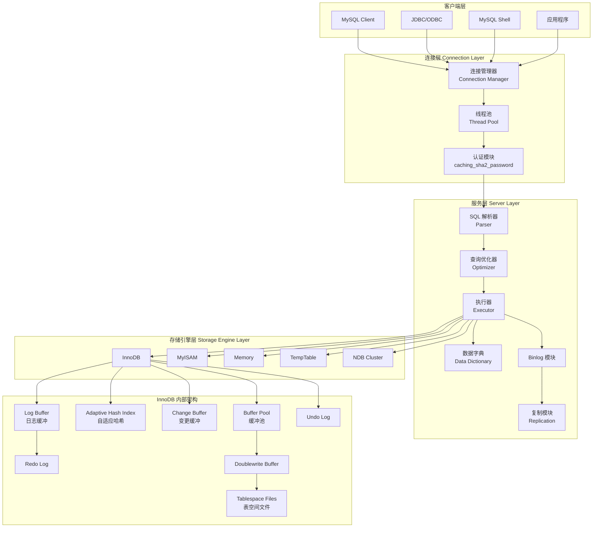
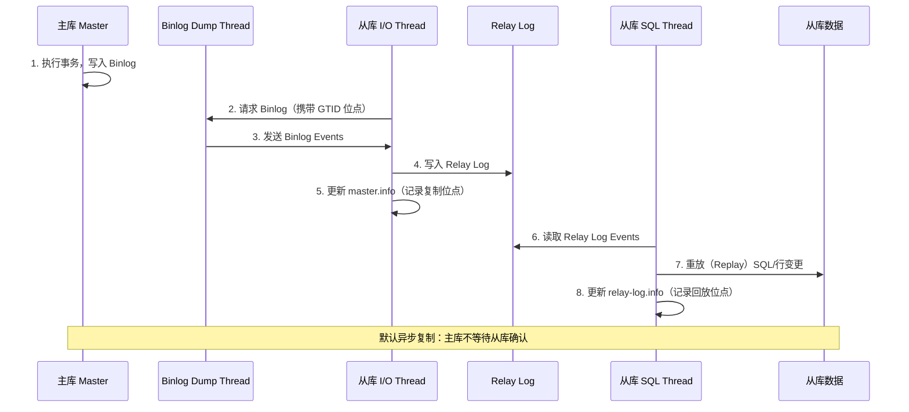
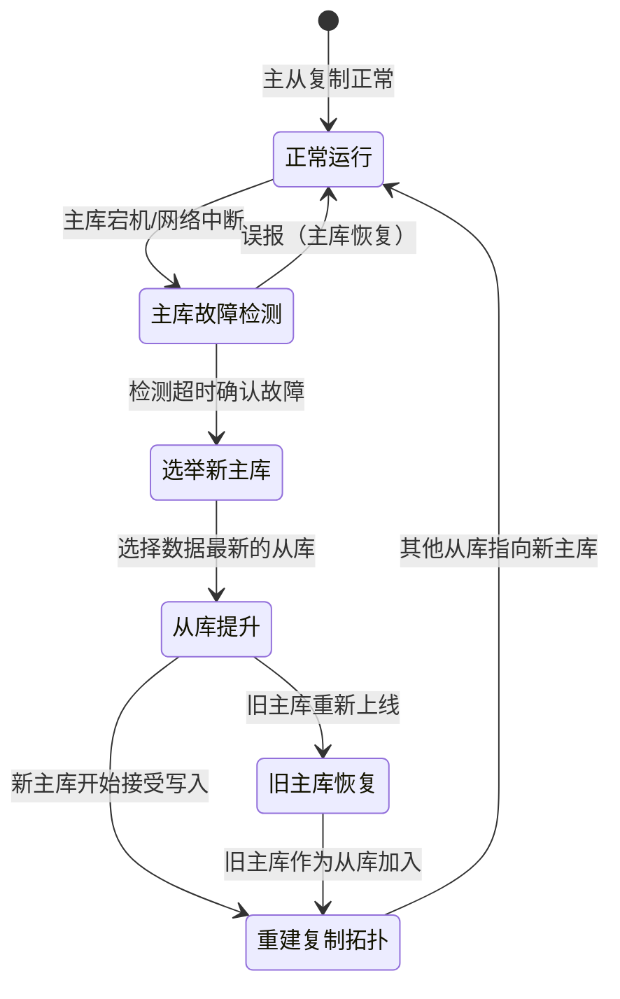
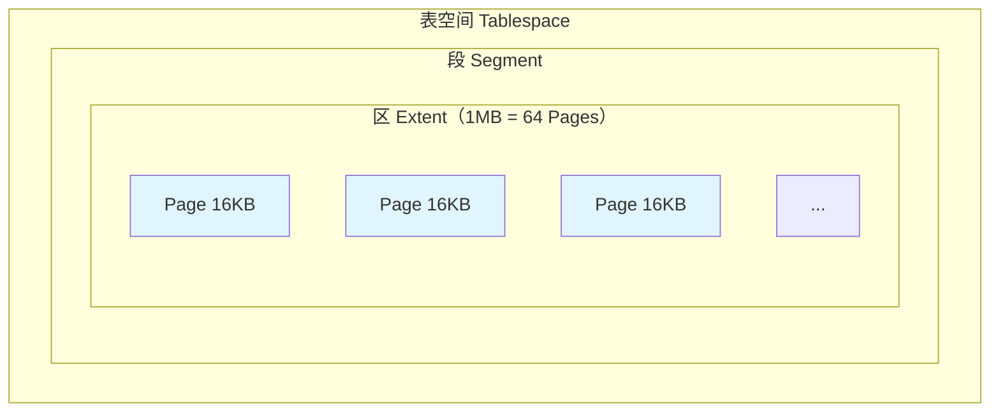
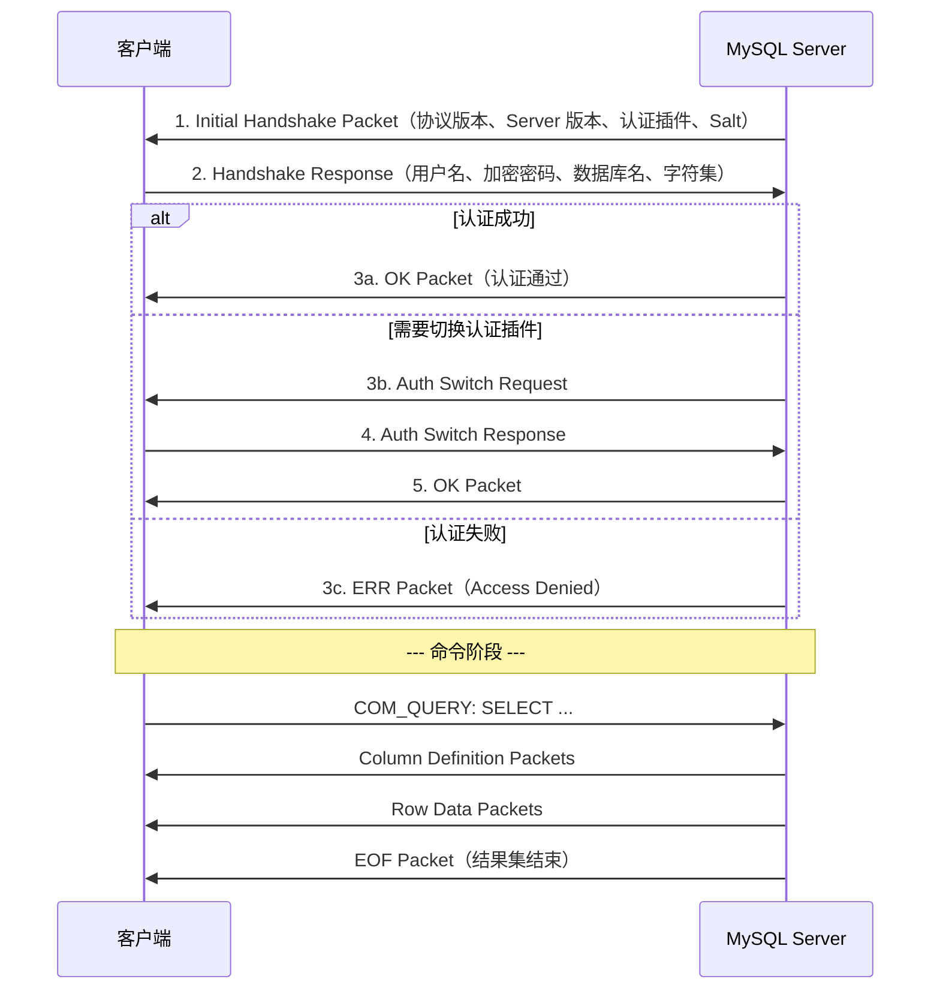
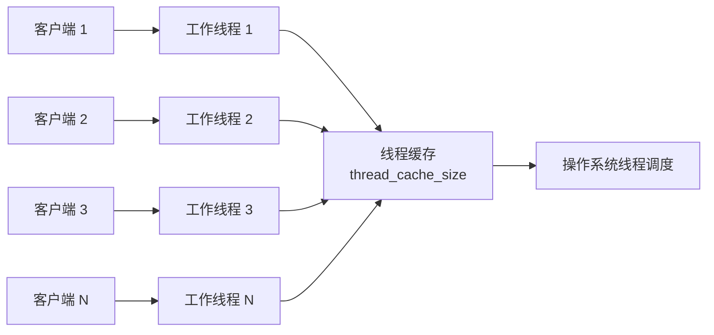
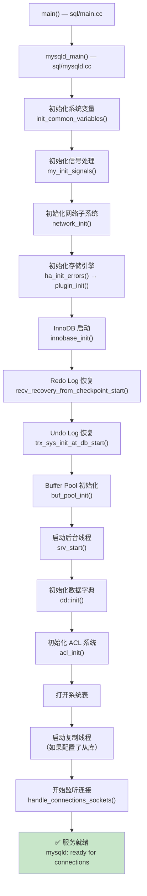
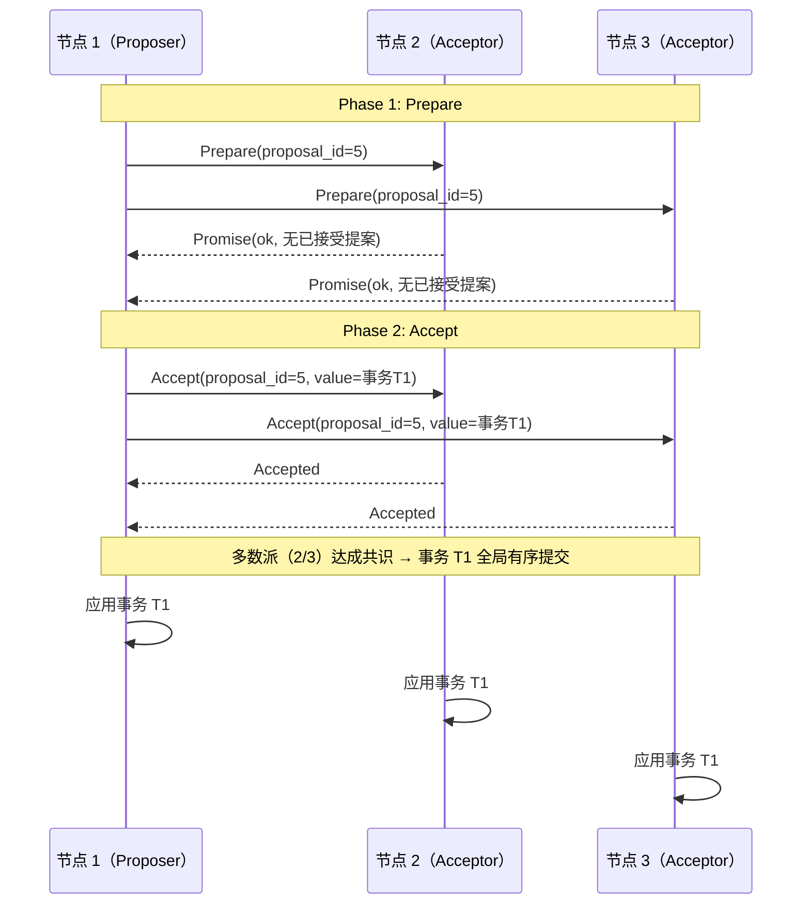
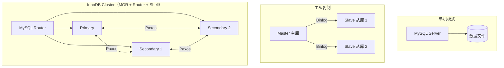
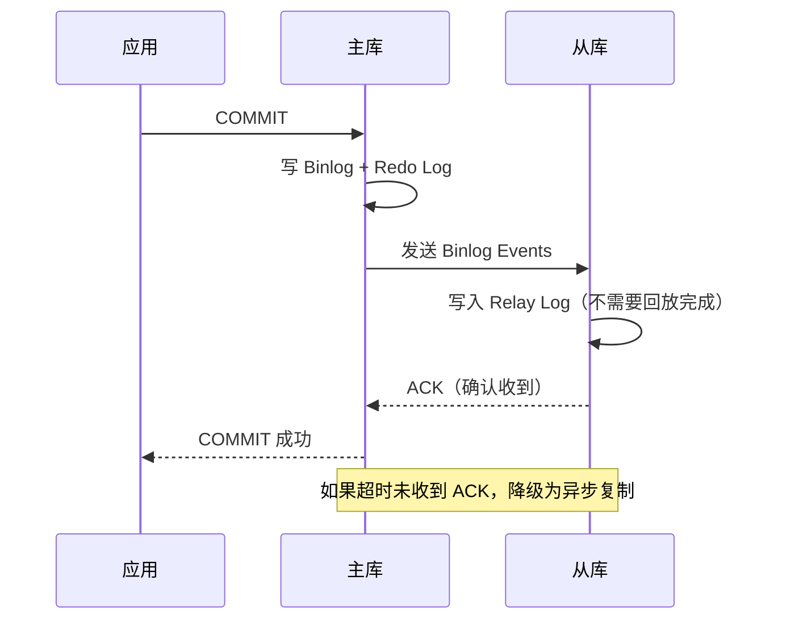

# MySQL 知多少 v1.0

> 基于 MySQL 8.0.x | 最后更新时间：2025-01-01

---

## 📖 前言

### 技术背景与学习价值

MySQL 是全球最流行的开源关系型数据库管理系统（RDBMS），由瑞典 MySQL AB 公司于 1995 年开发，后经 Sun Microsystems 收购（2008），最终归入 Oracle 旗下（2010）。截至目前，MySQL 在 DB-Engines 排名中长期位居前二，是互联网行业事实上的"标准数据库"。

🎯 学习 MySQL 的核心价值：
- **工程实用性**：全球超过 50% 的 Web 应用使用 MySQL 作为后端存储（见 Stack Overflow Developer Survey）
- **理论深度**：InnoDB 引擎涵盖了 B+Tree 索引、MVCC、WAL、Crash Recovery 等经典数据库理论
- **职业必备**：后端开发、DBA、数据工程师岗位的核心技能要求
- **生态完善**：与 Linux、Apache/Nginx、PHP/Java/Go 等形成成熟技术栈

### 适用读者

| 读者类型 | 建议阅读章节 |
|---------|------------|
| 初学者 | 前言 → 第一章 → 第七章（实验环境） |
| 后端开发工程师 | 第一章 → 第二章 → 第五章 → 第六章 |
| DBA / 运维工程师 | 第五章 → 第六章 → 第二章 |
| 架构师 | 第二章 → 第四章 → 第五章 |
| 面试备战 | 第七章 → 第二章 → 第五章 |

### 版本说明

本文档基于 **MySQL 8.0.x**（具体以 8.0.35 ~ 8.0.40 为参考）。MySQL 8.0 相较于 5.7 的重大变化包括：
- 默认字符集从 `latin1` 改为 `utf8mb4`
- 默认认证插件从 `mysql_native_password` 改为 `caching_sha2_password`
- 引入窗口函数（Window Functions）、CTE（Common Table Expressions）
- 原生 JSON 增强、GIS 增强
- 数据字典（Data Dictionary）从文件系统迁移到 InnoDB 事务表
- 引入不可见索引（Invisible Index）、降序索引（Descending Index）
- Redo Log 架构重构（8.0.30+）
- 移除查询缓存（Query Cache）

> 见 MySQL 官方文档：[What Is New in MySQL 8.0](https://dev.mysql.com/doc/refman/8.0/en/mysql-nutshell.html)

---

## 第一章：基础理论与架构演进

### 1.1 技术诞生背景与核心问题

**时代背景**：1990 年代中期，互联网开始爆发式增长。当时的商业数据库（Oracle、DB2、SQL Server）价格昂贵、部署复杂，中小型 Web 应用迫切需要一款轻量、高性能、免费的关系型数据库。

**MySQL 要解决的核心问题**：
1. **成本问题**：提供免费/低成本的关系型数据库方案
2. **性能问题**：针对 Web 场景（读多写少）优化，提供极高的查询吞吐量
3. **易用性问题**：简单的安装部署、直观的 SQL 接口
4. **可靠性问题**：在保证基本 ACID 的前提下，提供可接受的数据安全性

**创始团队**：Michael "Monty" Widenius、David Axmark 和 Allan Larsson 于 1995 年在瑞典创建 MySQL AB。MySQL 的名字来源于 Monty 的女儿 "My"。

💡 **进阶思考**：MySQL 早期选择了 MyISAM 作为默认存储引擎（不支持事务），这是一个典型的"性能优先于功能完备性"的设计决策。直到 InnoDB 成为默认引擎（MySQL 5.5+），MySQL 才真正成为一个完整的事务型数据库。

### 1.2 架构演进历程

| 版本 | 年份 | 里程碑 |
|------|------|--------|
| 3.23 | 2001 | 引入 InnoDB 引擎（作为插件）、全文索引 |
| 4.0 | 2003 | 支持 UNION、子查询、SSL 连接 |
| 4.1 | 2004 | 支持 UTF-8、预处理语句（Prepared Statements） |
| 5.0 | 2005 | 存储过程、触发器、视图、游标、INFORMATION_SCHEMA |
| 5.1 | 2008 | 分区表（Partitioning）、行级复制（Row-Based Replication）、Plugin API |
| 5.5 | 2010 | **InnoDB 成为默认引擎**、半同步复制（Semi-Sync Replication） |
| 5.6 | 2013 | GTID 复制、全文索引支持 InnoDB、Online DDL、memcached Plugin |
| 5.7 | 2015 | JSON 数据类型、Group Replication（Labs）、sys schema、多源复制 |
| **8.0** | **2018** | **窗口函数、CTE、原子 DDL、数据字典重构、角色管理、不可见索引** |

**演进原因分析**：

🎯 **从 MyISAM 到 InnoDB（5.5）**：Web 2.0 时代，写操作激增，MyISAM 的表级锁成为严重瓶颈。InnoDB 的行级锁 + MVCC + 事务支持成为刚需。

🎯 **从 5.7 到 8.0（跳过 6.x/7.x）**：Oracle 决定跳过版本号以表示重大升级。8.0 的核心变化是将数据字典从文件系统（`.frm` 文件）迁移到 InnoDB 事务表，这是一次架构级重构，使得 DDL 操作可以原子化执行。

⚠️ **易错点**：MySQL 8.0 移除了查询缓存（Query Cache）。很多旧教程仍然提到 `query_cache_size` 参数，但在 8.0 中该参数已不存在。官方认为查询缓存在高并发写入场景下弊大于利（频繁失效导致锁竞争）。见 MySQL 官方博客：[MySQL 8.0: Retiring Support for the Query Cache](https://mysqlserverteam.com/mysql-8-0-retiring-support-for-the-query-cache/)。

### 1.3 核心概念术语表

| 英文术语 | 中文 | 通俗解释 |
|---------|------|---------|
| InnoDB | InnoDB 存储引擎 | MySQL 默认的事务型存储引擎，支持行锁、MVCC、外键 |
| B+Tree | B+ 树 | InnoDB 索引的底层数据结构，所有数据存储在叶子节点，适合范围查询 |
| MVCC | 多版本并发控制 | 通过保存数据的多个版本，让读操作不阻塞写操作，提高并发性能 |
| Redo Log | 重做日志 | 记录数据页的物理修改，用于崩溃恢复，保证事务持久性（Durability） |
| Undo Log | 回滚日志 | 记录数据修改前的旧值，用于事务回滚和 MVCC 读取历史版本 |
| Binlog | 二进制日志 | 记录所有 DDL 和 DML 操作的逻辑日志，用于主从复制和数据恢复 |
| WAL | 预写日志 | Write-Ahead Logging，先写日志再写数据页的策略，保证崩溃安全 |
| Buffer Pool | 缓冲池 | InnoDB 在内存中缓存数据页和索引页的区域，是性能的关键 |
| Tablespace | 表空间 | InnoDB 存储数据的逻辑容器，包含系统表空间和独立表空间 |
| GTID | 全局事务标识符 | Global Transaction Identifier，唯一标识一个事务，简化复制管理 |
| Clustered Index | 聚簇索引 | InnoDB 主键索引，叶子节点存储完整行数据，每表只有一个 |
| Secondary Index | 二级索引 | 非主键索引，叶子节点存储主键值，查询需要"回表" |
| Page | 页 | InnoDB 数据存储的最小单位，默认 16KB |
| Extent | 区 | 由 64 个连续页组成，大小为 1MB |
| Segment | 段 | 表空间中的逻辑分组，如数据段、索引段、回滚段 |
| Adaptive Hash Index | 自适应哈希索引 | InnoDB 自动为热点页建立的哈希索引，加速等值查询 |
| Change Buffer | 变更缓冲 | 缓存对二级索引页的修改，减少随机 I/O |
| Doublewrite Buffer | 双写缓冲 | 防止部分页写入（Partial Page Write）导致数据损坏的安全机制 |
| Purge | 清除 | 后台线程清理不再需要的 Undo Log 记录 |
| Checkpoint | 检查点 | 将 Buffer Pool 中的脏页刷新到磁盘的时间点，推进 Redo Log 的回收 |

### 1.4 适用场景 vs 不适用场景

| 场景 | 是否适用 | 说明 |
|------|---------|------|
| Web 应用后端（电商、社交、CMS） | ✅ | MySQL 的核心战场，读多写少，成熟生态 |
| OLTP 在线事务处理 | ✅ | InnoDB 提供完整 ACID 事务支持，行级锁保证高并发 |
| 中小规模数据（TB 级以内） | ✅ | 单实例可稳定承载数 TB 数据 |
| 读写分离架构 | ✅ | 原生主从复制 + ProxySQL/MySQL Router 可轻松实现 |
| JSON 文档混合存储 | ✅ | 8.0 原生 JSON 类型 + 函数索引，适合半结构化数据 |
| SaaS 多租户（按库/按表隔离） | ✅ | 轻量级实例，资源占用可控 |
| 大规模 OLAP 分析（PB 级） | ❌ | 缺乏列式存储和 MPP 并行计算，应选用 ClickHouse、Doris 等 |
| 海量写入（IoT 时��数据） | ❌ | B+Tree 索引在高频写入下写放大严重，应选用 TimescaleDB、TDengine |
| 复杂图关系查询 | ❌ | 多表 JOIN 性能有限，应选用 Neo4j 等图数据库 |
| 全文搜索为主的场景 | ❌ | InnoDB 全文索引功能有限，应选用 Elasticsearch |
| 超大规模分布式（数百 TB+自动分片） | ❌ | MySQL 原生不支持自动分片，需借助 Vitess、ShardingSphere 或选用 TiDB、CockroachDB |
| 强一致性分布式事务（跨节点） | ❌ | Group Replication 有局限，跨节点分布式事务应选用 TiDB、Spanner |

💡 **进阶思考**：MySQL 8.0 推出的 HeatWave 是 Oracle 云上的 OLAP 加速引擎，可以在 MySQL 上直接运行分析查询而无需 ETL。但 HeatWave 是 Oracle Cloud 专属服务，不属于开源 MySQL 的范畴。

### 1.5 同类技术对比

#### MySQL vs PostgreSQL vs TiDB vs MariaDB

| 维度 | MySQL 8.0 | PostgreSQL 16 | TiDB 7.x | MariaDB 11.x |
|------|-----------|---------------|----------|--------------|
| **设计哲学** | 简单高效，Web 场景优先 | 功能完备，标准合规优先 | 分布式 HTAP，兼容 MySQL 协议 | MySQL 开源分支，社区驱动 |
| **存储引擎** | 可插拔（InnoDB 为主） | 单一引擎（Heap Tuple） | TiKV（分布式 KV） | 可插拔（InnoDB/Aria/ColumnStore） |
| **事务隔离** | 默认 REPEATABLE READ | 默认 READ COMMITTED | 默认 SNAPSHOT ISOLATION | 默认 REPEATABLE READ |
| **MVCC 实现** | Undo Log（回滚段） | 堆表多版本（HOT 优化） | Percolator 模型（基于时间戳） | Undo Log（同 MySQL） |
| **分布式能力** | Group Replication / InnoDB Cluster | 逻辑复制 + Citus 扩展 | 原生分布式，自动分片 | Galera Cluster |
| **SQL 兼容性** | 较好，部分非标准扩展 | 最接近 SQL 标准 | 高度兼容 MySQL 语法 | 高度兼容 MySQL 语法 |
| **JSON 支持** | 原生 JSON 类型 + 丰富函数 | JSONB（二进制存储，更强） | 兼容 MySQL JSON | 兼容 MySQL JSON |
| **窗口函数** | 8.0 支持 | 早期即支持（更成熟） | 支持 | 10.2+ 支持 |
| **GIS 能力** | 基础空间函数 | PostGIS（业界最强） | 基础支持 | 基础空间函数 |
| **扩展机制** | Plugin API | Extension（极其灵活） | 无需扩展（内置分布式） | Plugin API |
| **连接模型** | 线程模型（一连接一线程） | 进程模型（一连接一进程） | 协程模型（Go 实现） | 线程模型（同 MySQL） |
| **适用规模** | 单机 TB 级 | 单机 TB 级 | 分布式 PB 级 | 单机 TB 级 |
| **学习曲线** | 低 | 中 | 中（需理解分布式概念） | 低（MySQL 用���无缝迁移） |
| **社区活跃度** | 极高（Oracle 主导 + 社区） | 极高（纯社区驱动） | 高（PingCAP 主导） | 高（MariaDB Foundation） |
| **许可证** | GPL v2 | PostgreSQL License（类 BSD） | Apache 2.0 | GPL v2 |

**如何选择**：

🎯 **选 MySQL**：团队熟悉 MySQL 生态、Web 应用 OLTP 场景、需要成熟的云托管服务（RDS/Aurora）、对运维复杂度敏感。

🎯 **选 PostgreSQL**：需要高级 SQL 特性（CTE 递归、物化视图、数组类型）、GIS 场景、对 SQL 标准合规性要求高、需要强大的扩展生态。

🎯 **选 TiDB**：数据量超过单机承载能力、需要弹性水平扩展、希望兼容 MySQL 协议降低迁移成本、HTAP 混合负载。

🎯 **选 MariaDB**：希望保持 MySQL 兼容性的同时获得更激进的社区创新（如 ColumnStore 列式引擎）、对 Oracle 控制 MySQL 方向有顾虑。

⚠️ **易错点**：TiDB 虽然兼容 MySQL 协议，但并非 100% 兼容。例如自增 ID 行为、部分 MySQL 特有语法、存储过程支持等方面存在差异。迁移前务必进行兼容性测试。

---

## 第二章：实现原理解析

### 2.1 核心组件架构图

MySQL 8.0 采用经典的分层架构，自上而下分为连接层、服务层、存储引擎层和文件系统层。



🎯 **核心要点**：
- MySQL 8.0 的数据字典（Data Dictionary）已从 `.frm` 文件迁移到 InnoDB 事务表，这意味着 DDL 操作（如 `CREATE TABLE`、`ALTER TABLE`）现在是原子性的
- 存储引擎层通过 Handler API 与服务层解耦，这是 MySQL 可插拔存储引擎架构的基础
- InnoDB 是唯一同时支持事务、行锁、外键、全文索引的内置引擎

> 见 MySQL 官方文档：[MySQL Server Architecture](https://dev.mysql.com/doc/refman/8.0/en/pluggable-storage-overview.html)

### 2.2 SQL 执行流程

#### 2.2.1 正常执行流程（SELECT 查询）

```mermaid
sequenceDiagram
    participant Client as 客户端
    participant Conn as 连接器
    participant Parser as 解析器
    participant Prep as 预处理器
    participant Opt as 优化器
    participant Exec as 执行器
    participant Engine as InnoDB

    Client->>Conn: 1. 建立连接（TCP 三次握手）
    Conn->>Conn: 2. 身份认证（caching_sha2_password）
    Conn->>Conn: 3. 权限查询（缓存到连接会话）
    Client->>Parser: 4. 发送 SQL: SELECT * FROM users WHERE id = 1
    Parser->>Parser: 5. 词法分析（Lexer）→ Token 序列
    Parser->>Parser: 6. 语法分析（Yacc）→ AST 语法树
    Parser->>Prep: 7. 传递 AST
    Prep->>Prep: 8. 语义检查（表/列是否存在、权限校验）
    Prep->>Opt: 9. 传递验证后的 AST
    Opt->>Opt: 10. 生成执行计划（基于成本的优化器 CBO）
    Opt->>Opt: 11. 选择最优索引（PRIMARY vs 全表扫描）
    Opt->>Exec: 12. 传递执行计划
    Exec->>Engine: 13. 调用 Handler API: ha_index_read()
    Engine->>Engine: 14. 在 Buffer Pool 中查找数据页
    alt 数据页在 Buffer Pool 中
        Engine-->>Exec: 15a. 直接返回数据行
    else 数据页不在 Buffer Pool 中
        Engine->>Engine: 15b. 从磁盘读取数据页到 Buffer Pool
        Engine-->>Exec: 15c. 返回数据行
    end
    Exec-->>Client: 16. 返回结果集
```

**关键步骤详解**：

**步骤 5-6：SQL 解析**
MySQL 使用 Bison（Yacc 的 GNU 实现）进行语法解析。解析器将 SQL 文本转换为内部的抽象语法树（AST），在源码中对应 `sql/sql_yacc.yy` 文件。

```sql
-- 示例：查看 SQL 解析后的执行计划
EXPLAIN FORMAT=TREE SELECT * FROM users WHERE id = 1;

-- 输出示例：
-- -> Rows fetched before execution  (cost=0.00..0.00 rows=1)
```

**步骤 10-11：查询优化器（CBO）**
MySQL 8.0 使用基于成本的优化器（Cost-Based Optimizer），核心决策包括：
- 选择使用哪个索引（或全表扫描）
- JOIN 顺序（对于多表查询）
- 是否使用索引下推（Index Condition Pushdown）
- 是否使用 MRR（Multi-Range Read）
- 子查询优化策略（物化、半连接等）

```sql
-- 查看优化器的成本估算
EXPLAIN FORMAT=JSON SELECT * FROM orders WHERE user_id = 100 AND status = 'paid';

-- 查看优化器实际选择的策略
EXPLAIN ANALYZE SELECT * FROM orders WHERE user_id = 100 AND status = 'paid';
```

💡 **进阶思考**：MySQL 8.0 引入了 `EXPLAIN ANALYZE`（实际执行并返回真实统计信息），这比传统 `EXPLAIN` 的估算值更准确，是性能调优的利器。见官方文档：[EXPLAIN ANALYZE](https://dev.mysql.com/doc/refman/8.0/en/explain.html#explain-analyze)。

#### 2.2.2 写入流程（UPDATE 语句 + 事务提交）

```mermaid
sequenceDiagram
    participant Client as 客户端
    participant Exec as 执行器
    participant InnoDB as InnoDB 引擎
    participant BP as Buffer Pool
    participant UndoLog as Undo Log
    participant RedoLog as Redo Log
    participant Binlog as Binlog

    Client->>Exec: 1. BEGIN; UPDATE users SET name='Bob' WHERE id=1; COMMIT;
    Exec->>InnoDB: 2. 开启事务（分配事务 ID）
    InnoDB->>BP: 3. 查找 id=1 的数据页
    BP->>BP: 4. 对数据行加排他锁（X Lock）
    InnoDB->>UndoLog: 5. 写入旧值到 Undo Log（name='Alice'）
    InnoDB->>BP: 6. 在 Buffer Pool 中修改数据页（内存中）
    InnoDB->>RedoLog: 7. 写入 Redo Log Buffer（物理变更记录）

    Note over Client,Binlog: --- COMMIT 阶段（两阶段提交） ---

    InnoDB->>RedoLog: 8. Redo Log 写入磁盘（prepare 状态）
    Exec->>Binlog: 9. 写入 Binlog（fsync 到磁盘）
    InnoDB->>RedoLog: 10. Redo Log 标记为 commit 状态
    InnoDB-->>Client: 11. 返回 COMMIT 成功

    Note over BP,RedoLog: --- 后台异步刷盘 ---
    BP->>BP: 12. 脏页由后台线程异步刷新到磁盘（Checkpoint）
```

🎯 **核心要点 — 两阶段提交（2PC）**：

MySQL 使用内部 XA 事务（两阶段提交）来保证 Redo Log 和 Binlog 的一致性：
1. **Prepare 阶段**：InnoDB 将 Redo Log 刷盘，标记为 `prepare` 状态
2. **Commit 阶段**：先写 Binlog 到磁盘，再将 Redo Log 标记为 `commit`

这样即使在任何一步崩溃，MySQL 都能通过崩溃恢复判断事务的最终状态：
- Redo Log 是 prepare 但 Binlog 不存在 → 回滚事务
- Redo Log 是 prepare 且 Binlog 存在 → 提交事务

> 见 MySQL 官方文档：[The Binary Log](https://dev.mysql.com/doc/refman/8.0/en/binary-log.html)

⚠️ **易错点**：`sync_binlog=1` 和 `innodb_flush_log_at_trx_commit=1` 是保证数据不丢失的"双1配置"。生产环境务必开启，但会带来一定的性能开销（每次提交都 fsync）。

### 2.3 事务处理流程

#### 2.3.1 InnoDB 事务的 ACID 实现

| ACID 属性 | 实现机制 | 说明 |
|-----------|---------|------|
| **A（原子性）** | Undo Log | 事务回滚时，通过 Undo Log 恢复数据到修改前的状态 |
| **C（一致性）** | Undo Log + Redo Log + 约束检查 | 一致性是目标，由 A、I、D 共同保证，加上数据库约束（主键、外键、CHECK） |
| **I（隔离性）** | 锁机制 + MVCC | 不同隔离级别通过不同的锁策略和 MVCC 快照实现 |
| **D（持久性）** | Redo Log + Doublewrite Buffer | WAL 机制保证已提交事务的修改不会丢失 |

#### 2.3.2 MVCC 多版本并发控制

MVCC 是 InnoDB 实现高并发读写的核心机制。其本质是：**读操作读取数据的历史版本，不需要加锁，从而避免读写冲突**。

**实现原理**：

每行数据在 InnoDB 中包含两个隐藏列：
- `DB_TRX_ID`（6 字节）：最后修改该行的事务 ID
- `DB_ROLL_PTR`（7 字节）：指向 Undo Log 中该行旧版本的指针

```
┌─────────────────────────────────────────────────────┐
│                    InnoDB 数据行                      │
├──────────┬──────────┬──────────┬────────────────────┤
│ DB_TRX_ID│DB_ROLL_PTR│DB_ROW_ID │   用户数据列        │
│ (事务ID)  │(回滚指针) │(隐藏主键) │  col1, col2, ...   │
└──────────┴────┬─────┴──────────┴────────────────────┘
                │
                ▼
        ┌───────────────┐
        │  Undo Log 记录  │  ← 旧版本数据
        │  DB_TRX_ID=100 │
        │  DB_ROLL_PTR ──┼──→ 更旧的版本...
        │  name='Alice'  │
        └───────────────┘
```

**ReadView（读视图）机制**：

当事务执行一致性读（Consistent Read）时，InnoDB 会创建一个 ReadView，包含：
- `m_ids`：当前所有活跃（未提交）事务的 ID 列表
- `m_low_limit_id`：下一个将要分配的事务 ID（即当前最大事务 ID + 1）
- `m_up_limit_id`：活跃事务中最小的事务 ID
- `m_creator_trx_id`：创建该 ReadView 的事务 ID

**可见性判断规则**：
```
对于数据行的 DB_TRX_ID：
1. 如果 DB_TRX_ID < m_up_limit_id → 该版本在 ReadView 创建前已提交 → 可见
2. 如果 DB_TRX_ID >= m_low_limit_id → 该版本在 ReadView 创建后才出现 → 不可见
3. 如果 m_up_limit_id <= DB_TRX_ID < m_low_limit_id：
   a. DB_TRX_ID 在 m_ids 中 → 该事务还未提交 → 不可见
   b. DB_TRX_ID 不在 m_ids 中 → 该事务已提交 → 可见
4. 如果不可见，沿着 DB_ROLL_PTR 找到 Undo Log 中的旧版本，重复判断
```

**不同隔离级别下 ReadView 的创建时机**：

| 隔离级别 | ReadView 创建时机 | 效果 |
|---------|-----------------|------|
| READ COMMITTED | 每次 SELECT 都创建新的 ReadView | 能看到其他事务已提交的最新数据 |
| REPEATABLE READ | 事务中第一次 SELECT 时创建，后续复用 | 整个事务期间看到的数据快照一致 |

```sql
-- 演示 REPEATABLE READ 下的 MVCC 行为
-- 会话 A
START TRANSACTION;
SELECT * FROM users WHERE id = 1;  -- 此时创建 ReadView，看到 name='Alice'

-- 会话 B（同时执行）
UPDATE users SET name = 'Bob' WHERE id = 1;
COMMIT;

-- 会话 A（继续）
SELECT * FROM users WHERE id = 1;  -- 仍然看到 name='Alice'（复用同一个 ReadView）
COMMIT;
```

⚠️ **易错点**：MVCC 只对普通 SELECT（快照读）生效。`SELECT ... FOR UPDATE`、`SELECT ... LOCK IN SHARE MODE` 是当前读（Current Read），会读取最新版本并加锁。

### 2.4 主从复制流程

#### 2.4.1 正常复制流程

MySQL 主从复制基于 Binlog，8.0 推荐使用 GTID（Global Transaction Identifier）模式。



**三种复制模式对比**：

| 模式 | 原理 | 数据安全性 | 性能影响 | 适用场景 |
|------|------|-----------|---------|---------|
| **异步复制** | 主库提交后立即返回，不等从库 | 主库宕机可能丢数据 | 无影响 | 对数据一致性要求不高的读写分离 |
| **半同步复制** | 主库等待至少一个从库确认收到 Binlog | 大幅降低丢数据风险 | 增加一次网络 RTT | 生产环境推荐 |
| **Group Replication** | 基于 Paxos 协议的多主复制 | 强一致性 | 较大（共识开销） | 高可用集群 |

```sql
-- 查看复制状态（MySQL 8.0 推荐使用 Performance Schema）
SELECT * FROM performance_schema.replication_connection_status\G
SELECT * FROM performance_schema.replication_applier_status_by_worker\G

-- 查看 GTID 执行情况
SELECT @@global.gtid_executed;

-- 配置半同步复制（主库）
INSTALL PLUGIN rpl_semi_sync_master SONAME 'semisync_master.so';
SET GLOBAL rpl_semi_sync_master_enabled = 1;
SET GLOBAL rpl_semi_sync_master_timeout = 1000;  -- 超时 1 秒后降级为异步
```

#### 2.4.2 故障切换流程



**GTID 在故障切换中的优势**：
- 传统复制需要手动指定 Binlog 文件名和位点（`CHANGE MASTER TO MASTER_LOG_FILE='...', MASTER_LOG_POS=...`），容易出错
- GTID 模式下，从库只需要 `CHANGE MASTER TO MASTER_AUTO_POSITION=1`，MySQL 自动计算差异

> 见 MySQL 官方文档：[Replication with Global Transaction Identifiers](https://dev.mysql.com/doc/refman/8.0/en/replication-gtids.html)

### 2.5 InnoDB 关键算法详解

#### 2.5.1 B+Tree 索引

InnoDB 使用 B+Tree 作为索引的底层数据结构。与 B-Tree 的关键区别：**所有数据都存储在叶子节点，叶子节点之间通过双向链表连接**。

```
                        ┌─────────────┐
                        │  [30, 60]   │  ← 根节点（非叶子）
                        └──┬───┬───┬──┘
                   ┌───────┘   │   └───────┐
                   ▼           ▼           ▼
            ┌──────────┐ ┌──────────┐ ┌──────────┐
            │ [10, 20] │ │ [35, 50] │ │ [70, 80] │  ← 非叶子节点
            └─┬──┬──┬──┘ └─┬──┬──┬──┘ └─┬──┬──┬──┘
              │  │  │       │  │  │       │  │  │
              ▼  ▼  ▼       ▼  ▼  ▼       ▼  ▼  ▼
            ┌──┐┌──┐┌──┐ ┌──┐┌──┐┌──┐ ┌──┐┌──┐┌──┐
            │10││20││30│ │35││50││60│ │70││80││90│  ← 叶子节点（存储数据）
            └──┘└──┘└──┘ └──┘└──┘└──┘ └──┘└──┘└──┘
              ↔    ↔   ↔   ↔   ↔   ↔   ↔   ↔
                    双向链表连接
```

**聚簇索引 vs 二级索引**：

```
聚簇索引（主键索引）：
叶子节点 = 主键值 + 完整行数据
┌────────────────────────────────┐
│ PK=1 | name='Alice' | age=25  │
│ PK=2 | name='Bob'   | age=30  │
└────────────────────────────────┘

二级索引（如 idx_name）：
叶子节点 = 索引列值 + 主键值
┌──────────────────┐
│ name='Alice' | 1  │  ← 需要"回表"：拿到 PK=1，再去聚簇索引查完整行
│ name='Bob'   | 2  │
└──────────────────┘
```

**索引覆盖（Covering Index）**：如果查询的列全部包含在二级索引中，则无需回表，称为"覆盖索引"。

```sql
-- 假设有索引 idx_name_age(name, age)
SELECT name, age FROM users WHERE name = 'Alice';
-- EXPLAIN 中会显示 Using index（覆盖索引，无需回表）

SELECT name, age, email FROM users WHERE name = 'Alice';
-- 需要回表，因为 email 不在索引中
```

#### 2.5.2 Redo Log（重做日志）

Redo Log 是 InnoDB 实现 WAL（Write-Ahead Logging）的核心组件，保证事务的持久性。

**工作原理**：
1. 事务修改数据时，先将变更写入 Redo Log Buffer（内存）
2. 事务提交时，将 Redo Log Buffer 刷新到磁盘（Redo Log 文件）
3. 数据页的修改在 Buffer Pool 中完成（脏页），由后台线程异步刷盘

**为什么不直接写数据文件？**
- 数据文件的写入是随机 I/O（数据页分散在磁盘各处）
- Redo Log 的写入是顺序 I/O（追加写入），性能高出一个数量级
- 这就是 WAL 的核心思想：用顺序写日志替代随机写数据页

**MySQL 8.0.30+ 的 Redo Log 架构变化**：
- 8.0.30 之前：固定大小的循环写入文件（`ib_logfile0`、`ib_logfile1`）
- 8.0.30 之后：动态大小的 Redo Log，存储在 `#innodb_redo` 目录下，由 `innodb_redo_log_capacity` 参数控制总大小

```sql
-- 查看 Redo Log 配置（8.0.30+）
SHOW VARIABLES LIKE 'innodb_redo_log_capacity';

-- 动态调整 Redo Log 大小（8.0.30+，无需重启）
SET GLOBAL innodb_redo_log_capacity = 2*1024*1024*1024;  -- 2GB

-- 查看 Redo Log 状态
SELECT * FROM performance_schema.innodb_redo_log_files;
```

> 见 MySQL 官方文档：[Redo Log](https://dev.mysql.com/doc/refman/8.0/en/innodb-redo-log.html)

#### 2.5.3 Undo Log（回滚日志）

Undo Log 有两个核心作用：
1. **事务回滚**：记录数据修改前的旧值，ROLLBACK 时恢复
2. **MVCC**：为一致性读提供数据的历史版本

**Undo Log 的存储**：
- MySQL 8.0 中，Undo Log 默认存储在独立的 Undo 表空间（`undo_001`、`undo_002`）
- 支持在线 truncate Undo 表空间，回收磁盘空间

```sql
-- 查看 Undo 表空间
SELECT * FROM information_schema.innodb_tablespaces WHERE space_type = 'Undo';

-- 配置 Undo 表空间自动 truncate
SET GLOBAL innodb_undo_log_truncate = ON;
SET GLOBAL innodb_max_undo_log_size = 1073741824;  -- 1GB，超过后触发 truncate
```

⚠️ **易错点**：长事务会导致 Undo Log 无法被 Purge 线程清理，造成 Undo 表空间持续膨胀。生产环境应监控 `trx_rows_locked` 和 `trx_rows_modified`，及时发现并终止长事务。

```sql
-- 查找运行超过 60 秒的长事务
SELECT trx_id, trx_state, trx_started,
       TIMESTAMPDIFF(SECOND, trx_started, NOW()) AS duration_sec,
       trx_rows_locked, trx_rows_modified
FROM information_schema.innodb_trx
WHERE TIMESTAMPDIFF(SECOND, trx_started, NOW()) > 60
ORDER BY trx_started;
```

### 2.6 数据模型与存储结构

#### 2.6.1 表空间（Tablespace）层次结构



**表空间类型**：

| 表空间类型 | 文件 | 说明 |
|-----------|------|------|
| 系统表空间 | `ibdata1` | 存储数据字典、Doublewrite Buffer、Change Buffer、Undo Log（可配置独立） |
| 独立表空间 | `表名.ibd` | 每张表一个文件（`innodb_file_per_table=ON`，8.0 默认开启） |
| 通用表空间 | 自定义 `.ibd` | 多张表共享一个表空间文件 |
| Undo 表空间 | `undo_001`, `undo_002` | 独立存储 Undo Log（8.0 默认） |
| 临时表空间 | `ibtmp1` | 存储临时表数据 |

#### 2.6.2 InnoDB 页（Page）结构

InnoDB 的最小 I/O 单位是页（Page），默认 16KB。

```
┌──────────────────────────────────────────────────┐
│                 InnoDB Page (16KB)                 │
├──────────────────────────────────────────────────┤
│ File Header (38 bytes)                            │
│   - FIL_PAGE_SPACE_OR_CHKSUM (校验和)              │
│   - FIL_PAGE_OFFSET (页号)                         │
│   - FIL_PAGE_PREV / FIL_PAGE_NEXT (前后页指针)      │
│   - FIL_PAGE_TYPE (页类型)                         │
├──────────────────────────────────────────────────┤
│ Page Header (56 bytes)                            │
│   - PAGE_N_DIR_SLOTS (页目录槽数)                   │
│   - PAGE_HEAP_TOP (空闲空间起始)                    │
│   - PAGE_N_RECS (记录数)                           │
│   - PAGE_LEVEL (B+Tree 层级，0=叶子)               │
├──────────────────────────────────────────────────┤
│ Infimum + Supremum Records (26 bytes)             │
│   - 虚拟的最小记录和最大记录                          │
├──────────────────────────────────────────────────┤
│ User Records (用户数据行)                           │
│   - 按主键顺序组织的单向链表                          │
│   - 每行包含：变长字段长度列表 + NULL 标志位            │
│     + 记录头信息 + 列数据                            │
├──────────────────────────────────────────────────┤
│ Free Space (空闲空间)                               │
├──────────────────────────────────────────────────┤
│ Page Directory (页目录)                             │
│   - 稀疏索引，加速页内二分查找                        │
├──────────────────────────────────────────────────┤
│ File Trailer (8 bytes)                            │
│   - 校验和（与 File Header 对比，检测页完整性）        │
└──────────────────────────────────────────────────┘
```

#### 2.6.3 行格式（Row Format）

MySQL 8.0 默认行格式为 `DYNAMIC`。

| 行格式 | 特点 | 适用场景 |
|--------|------|---------|
| COMPACT | 紧凑存储，变长字段前缀存页内 | 通用（5.0 默认） |
| DYNAMIC | 大字段完全存溢出页，页内只存 20 字节指针 | **8.0 默认**，适合含大字段的表 |
| COMPRESSED | 在 DYNAMIC 基础上支持页压缩 | 归档数据、I/O 密集场景 |
| REDUNDANT | 兼容旧版本的冗余格式 | 不推荐使用 |

```sql
-- 查看表的行格式
SELECT TABLE_NAME, ROW_FORMAT
FROM information_schema.TABLES
WHERE TABLE_SCHEMA = 'your_db';

-- 创建表时指定行格式
CREATE TABLE t1 (
    id INT PRIMARY KEY,
    data TEXT
) ROW_FORMAT=DYNAMIC;
```

### 2.7 通信协议（MySQL Protocol）

MySQL 客户端与服务端之间使用自定义的二进制协议通信，基于 TCP（默认端口 3306）。

**连接握手流程**：



**MySQL 8.0 认证变化**：

MySQL 8.0 默认认证插件从 `mysql_native_password`（SHA1）改为 `caching_sha2_password`（SHA256）。这带来了更高的安全性，但也导致了一些兼容性问题：

```sql
-- 如果旧客户端无法连接，可以临时切换认证方式
ALTER USER 'username'@'host' IDENTIFIED WITH mysql_native_password BY 'password';

-- 或者全局修改默认认证插件（不推荐，降低安全性）
-- my.cnf:
-- [mysqld]
-- default_authentication_plugin=mysql_native_password
```

**协议包格式**：

```
┌────────────────────────────────────────┐
│          MySQL Packet                   │
├──────────┬──────────┬──────────────────┤
│ 3 bytes  │ 1 byte   │ N bytes          │
│ Payload  │ Sequence │ Payload          │
│ Length   │ ID       │ (实际数据)        │
└──────────┴──────────┴──────────────────┘
最大包大小：16MB（2^24 - 1 bytes）
超过 16MB 的数据会被拆分为多个包
```

> 见 MySQL 官方文档：[MySQL Client/Server Protocol](https://dev.mysql.com/doc/dev/mysql-server/latest/page_protocol_basics.html)

---

## 第三章：源码级实现细节

> 本章基于 MySQL 8.0 开源代码（[GitHub: mysql/mysql-server](https://github.com/mysql/mysql-server)）。MySQL 使用 C/C++ 编写，构建系统为 CMake。

### 3.1 代码组织结构

MySQL 8.0 源码仓库的核心目录结构如下：

```
mysql-server/
├── sql/                    # SQL 层核心代码（解析器、优化器、执行器）
│   ├── sql_yacc.yy         # SQL 语法定义（Bison 语法文件）
│   ├── sql_lex.h           # 词法分析器
│   ├── sql_parse.cc        # SQL 命令分发入口（dispatch_command）
│   ├── sql_optimizer.cc    # 查询优化器
│   ├── sql_executor.cc     # 查询执行器
│   ├── sql_select.cc       # SELECT 语句处理
│   ├── sql_update.cc       # UPDATE 语句处理
│   ├── sql_delete.cc       # DELETE 语句处理
│   ├── sql_insert.cc       # INSERT 语句处理
│   ├── handler.h           # 存储引擎 Handler API 接口定义
│   ├── handler.cc          # Handler API 基类实现
│   ├── dd/                 # 数据字典（Data Dictionary）模块
│   └── server_component/   # 组件服务框架
│
├── storage/                # 存储引擎实现
│   ├── innobase/           # InnoDB 存储引擎
│   │   ├── buf/            # Buffer Pool 管理
│   │   ├── log/            # Redo Log 子系统
│   │   ├── trx/            # 事务子系统
│   │   ├── lock/           # 锁管理
│   │   ├── row/            # 行操作（CRUD）
│   │   ├── page/           # 页管理
│   │   ├── btr/            # B-Tree 索引操作
│   │   ├── fil/            # 文件空间管理
│   │   ├── fsp/            # 表空间管理
│   │   ├── dict/           # InnoDB 内部数据字典
│   │   ├── rem/            # 记录（Record）格式处理
│   │   └── srv/            # InnoDB 后台服务线程
│   ├── myisam/             # MyISAM 存储引擎
│   ├── memory/             # Memory 存储引擎
│   └── temptable/          # TempTable 引擎（8.0 新增，替代内存临时表）
│
├── client/                 # 客户端工具（mysql, mysqladmin, mysqldump 等）
├── plugin/                 # 插件（认证、审计、Group Replication 等）
│   ├── group_replication/  # Group Replication 插件
│   ├── semisync/           # 半同步复制插件
│   └── audit_log/          # 审计日志插件
│
├── router/                 # MySQL Router（中间件代理）
├── libs/                   # 公共库
├── include/                # 公共头文件
├── mysys/                  # MySQL 系统库（内存分配、文件 I/O、线程封装）
├── strings/                # 字符串处理和字符集
├── unittest/               # 单元测试
└── CMakeLists.txt          # CMake 构建入口
```

🎯 **核心要点**：
- `sql/` 目录是 Server 层的核心，包含 SQL 解析、优化、执行的全部逻辑
- `storage/innobase/` 是 InnoDB 引擎的完整实现，代码量占整个项目的很大比例
- `sql/handler.h` 定义了存储引擎的抽象接口，是理解可插拔架构的关键入口

### 3.2 关键数据结构

#### 3.2.1 THD（Thread Handler Descriptor）

`THD` 是 MySQL 中最核心的数据结构之一，代表一个客户端连接的完整上下文。每个连接对应一个 `THD` 实例。

```cpp
// 简化版 THD 结构（源码位于 sql/sql_class.h）
class THD : public MDL_context_owner,
            public Query_arena,
            public Open_tables_state {
public:
  // === 连接信息 ===
  NET net;                          // 网络连接句柄
  Protocol *m_protocol;             // 通信协议（文本/二进制）
  Security_context m_security_ctx;  // 安全上下文（用户、权限）

  // === 查询状态 ===
  LEX *lex;                         // 当前 SQL 的语法树（AST）
  Query_expression *m_current_query_terms;  // 当前查询表达式
  enum_sql_command m_sql_command;    // SQL 命令类型（SELECT/INSERT/...）

  // === 事务状态 ===
  Transaction_ctx *m_transaction;   // 事务上下文
  Ha_trx_info *ha_data;            // 存储引擎事务数据

  // === 变量与状态 ===
  System_variables variables;       // 会话级系统变量
  Status_var status_var;           // 会话级状态变量

  // === 诊断信息 ===
  Diagnostics_area m_main_da;      // 错误/警告信息

  // === 锁与并发 ===
  MDL_context mdl_context;         // 元数据锁上下文

  // === 关键方法 ===
  bool send_result_metadata(...);  // 发送结果集元数据
  bool send_result_set_row(...);   // 发送结果集行
  void cleanup_after_query();      // 查询结束后清理
};
```

💡 **进阶思考**：`THD` 对象的生命周期与连接一致。连接池（如 ProxySQL）的核心价值之一就是减少 `THD` 对象的频繁创建和销毁开销。

#### 3.2.2 handler — 存储引擎抽象接口

```cpp
// 简化版 handler 接口（源码位于 sql/handler.h）
class handler : public Sql_alloc {
public:
  // === 表操作 ===
  virtual int open(const char *name, int mode, uint test_if_locked);
  virtual int close(void);

  // === 行级读操作 ===
  virtual int rnd_init(bool scan);           // 初始化全表扫描
  virtual int rnd_next(uchar *buf);          // 读取下一行
  virtual int rnd_pos(uchar *buf, uchar *pos); // 按位置读取

  // === 索引操作 ===
  virtual int index_init(uint idx, bool sorted);
  virtual int index_read(uchar *buf, const uchar *key,
                         uint key_len, enum ha_rkey_function find_flag);
  virtual int index_next(uchar *buf);        // 索引顺序下一行
  virtual int index_prev(uchar *buf);        // 索引顺序上一行

  // === 写操作 ===
  virtual int write_row(uchar *buf);         // 插入一行
  virtual int update_row(const uchar *old_data, uchar *new_data);
  virtual int delete_row(const uchar *buf);  // 删除一行

  // === 事务操作 ===
  virtual int external_lock(THD *thd, int lock_type);
  virtual int start_stmt(THD *thd, thr_lock_type lock_type);

  // === 信息查询 ===
  virtual ha_rows records_in_range(uint inx, key_range *min_key,
                                   key_range *max_key);
  virtual double scan_time();                // 全表扫描成本估算
  virtual double read_time(uint index, uint ranges, ha_rows rows);
};
```

🎯 **核心要点**：`handler` 是 MySQL 可插拔存储引擎架构的基石。InnoDB 通过继承 `handler` 实现了 `ha_innobase` 类（位于 `storage/innobase/handler/ha_innodb.cc`）。优化器通过调用 `handler` 的 `scan_time()` 和 `read_time()` 方法来估算不同执行计划的成本。

### 3.3 并发模型

#### 3.3.1 连接处理模型

MySQL 8.0 默认采用 **一连接一线程（Thread-per-Connection）** 模型：



**线程缓存机制**：
- 客户端断开后，工作线程不会立即销毁，而是放入线程缓存（Thread Cache）
- 新连接到来时，优先从缓存中复用线程，避免频繁的线程创建/销毁开销
- 由 `thread_cache_size` 参数控制缓存大小

```sql
-- 查看线程缓存配置和使用情况
SHOW VARIABLES LIKE 'thread_cache_size';
SHOW STATUS LIKE 'Threads_%';

-- 典型输出：
-- Threads_cached    = 8    （缓存中的空闲线程数）
-- Threads_connected = 50   （当前连接数）
-- Threads_created   = 200  （累计创建的线程数，越小越好）
-- Threads_running   = 5    （正在执行查询的线程数）
```

#### 3.3.2 InnoDB 后台线程

InnoDB 引擎内部维护多个后台线程，各司其职：

| 线程类型 | 数量 | 职责 |
|---------|------|------|
| Master Thread | 1 | 核心调度线程，协调脏页刷新、Undo Purge、Change Buffer Merge |
| IO Thread (Read) | `innodb_read_io_threads`（默认 4） | 处理异步读 I/O 请求（预读） |
| IO Thread (Write) | `innodb_write_io_threads`（默认 4） | 处理异步写 I/O 请求（脏页刷盘） |
| Purge Thread | `innodb_purge_threads`（默认 4） | 清理不再需要的 Undo Log 记录 |
| Page Cleaner Thread | `innodb_page_cleaners`（默认 4） | 刷新 Buffer Pool 中的脏页到磁盘 |
| Log Writer Thread | 1 | 将 Redo Log Buffer 写入 Redo Log 文件 |
| Log Flusher Thread | 1 | 将 Redo Log 文件 fsync 到磁盘 |
| Log Checkpointer | 1 | 推进 Checkpoint，回收 Redo Log 空间 |

```sql
-- 查看 InnoDB 后台线程状态
SELECT name, type, processlist_state
FROM performance_schema.threads
WHERE name LIKE 'thread/innodb/%';
```

#### 3.3.3 InnoDB 锁体系

```
InnoDB 锁类型层次：
├── 表级锁
│   ├── 意向共享锁（IS）—— SELECT ... LOCK IN SHARE MODE 前自动加
│   ├── 意向排他锁（IX）—— SELECT ... FOR UPDATE / DML 前自动加
│   ├── AUTO-INC 锁 —— 自增列插入时
│   └── 元数据锁（MDL）—— DDL 操作时（Server 层）
│
├── 行级锁（基于索引实现）
│   ├── 记录锁（Record Lock）—— 锁定索引记录本身
│   ├── 间隙锁（Gap Lock）—— 锁定索引记录之间的间隙（防止幻读）
│   ├── 临键锁（Next-Key Lock）—— Record Lock + Gap Lock（默认行锁类型）
│   └── 插入意向锁（Insert Intention Lock）—— INSERT 操作等待间隙锁时
```

```sql
-- 查看当前锁等待情况
SELECT * FROM performance_schema.data_lock_waits\G

-- 查看当前持有的锁
SELECT * FROM performance_schema.data_locks\G

-- 查看 InnoDB 锁等待超时设置
SHOW VARIABLES LIKE 'innodb_lock_wait_timeout';  -- 默认 50 秒
```

⚠️ **易错点**：InnoDB 的行锁是加在索引上的，不是加在数据行上。如果 SQL 没有使用索引，InnoDB 会退化为对聚簇索引的全部记录加 Next-Key Lock，效果类似表锁。这是很多"行锁变表锁"问题的根因。

### 3.4 重要类/接口设计

#### 3.4.1 Plugin API

MySQL 的插件体系允许在不修改核心代码的情况下扩展功能。8.0 中主要的插件类型：

```cpp
// 插件类型定义（源码位于 include/mysql/plugin.h）
#define MYSQL_STORAGE_ENGINE_PLUGIN   1   // 存储引擎
#define MYSQL_FTPARSER_PLUGIN         2   // 全文解析器
#define MYSQL_DAEMON_PLUGIN           3   // 后台守护进程
#define MYSQL_INFORMATION_SCHEMA_PLUGIN 4 // INFORMATION_SCHEMA 表
#define MYSQL_AUDIT_PLUGIN            5   // 审计
#define MYSQL_REPLICATION_PLUGIN      6   // 复制
#define MYSQL_AUTHENTICATION_PLUGIN   7   // 认证
#define MYSQL_GROUP_REPLICATION_PLUGIN 9  // Group Replication

// 插件声明宏示例（以存储引擎为例）
mysql_declare_plugin(example) {
  MYSQL_STORAGE_ENGINE_PLUGIN,
  &example_storage_engine,
  "EXAMPLE",
  "Author Name",
  "Example storage engine",
  PLUGIN_LICENSE_GPL,
  example_init_func,    // 初始化函数
  nullptr,
  example_deinit_func,  // 卸载函数
  0x0100,               // 版本
  nullptr,              // 状态变量
  nullptr,              // 系统变量
  nullptr,
  0
}
mysql_declare_plugin_end;
```

#### 3.4.2 Component Service（8.0 新架构）

MySQL 8.0 引入了 Component 架构，作为 Plugin API 的演进方向。Component 之间通过 Service 接口通信，实现更好的解耦。

```cpp
// Component Service 接口示例
// 定义一个服务接口
BEGIN_SERVICE_DEFINITION(mysql_example_service)
  DECLARE_BOOL_METHOD(do_something, (int param1, const char *param2));
END_SERVICE_DEFINITION(mysql_example_service)

// 实现该服务
BEGIN_SERVICE_IMPLEMENTATION(component_example, mysql_example_service)
  example_do_something  // 函数指针
END_SERVICE_IMPLEMENTATION()
```

> 见 MySQL 官方文档：[MySQL Component Architecture](https://dev.mysql.com/doc/dev/mysql-server/latest/PAGE_COMPONENTS.html)

### 3.5 启动流程

MySQL Server（`mysqld`）的启动流程从 `sql/main.cc` 的 `main()` 函数开始：



**关键启动阶段说明**：

1. **Redo Log 恢复（Crash Recovery）**：如果上次非正常关闭，InnoDB 会扫描 Redo Log，将已提交但未刷盘的数据页重做（Redo），将未提交的事务回滚（Undo）。这是 InnoDB 崩溃安全的核心保障。

2. **Buffer Pool 初始化**：分配 `innodb_buffer_pool_size` 大小的内存。如果配置了 `innodb_buffer_pool_load_at_startup=ON`，还会从磁盘加载上次关闭时的热点页列表，加速预热。

3. **数据字典初始化**：MySQL 8.0 的数据字典存储在 InnoDB 表中，启动时需要先初始化 InnoDB，再加载数据字典，存在启动依赖关系。

```sql
-- 查看 mysqld 启动时间
SELECT VARIABLE_VALUE FROM performance_schema.global_status
WHERE VARIABLE_NAME = 'Uptime';

-- 查看 Buffer Pool 预热进度
SELECT VARIABLE_VALUE FROM performance_schema.global_status
WHERE VARIABLE_NAME = 'Innodb_buffer_pool_load_status';
```

⚠️ **易错点**：`innodb_buffer_pool_size` 设置过大（超过物理内存的 70-80%）会导致操作系统 OOM Killer 杀掉 mysqld 进程。设置过小则频繁磁盘 I/O，性能下降。生产环境建议设置为物理内存的 50%-75%。

---

## 第四章：设计模式深度剖析

### 4.1 架构层面的模式

#### 4.1.1 可插拔存储引擎架构（Strategy + Abstract Factory）

MySQL 最具标志性的架构设计就是可插拔存储引擎。Server 层通过 `handler` 抽象接口与存储引擎交互，不依赖任何具体引擎实现。

```
┌─────────────────────────────────────────────────┐
│                  Server 层                        │
│  SQL Parser → Optimizer → Executor               │
│                    │                              │
│              handler API（抽象接口）                │
└────────────────────┬────────────────────────────┘
                     │
        ┌────────────┼────────────┬──────────────┐
        ▼            ▼            ▼              ▼
  ┌──────────┐ ┌──────────┐ ┌──────────┐ ┌──────────┐
  │ha_innobase│ │ha_myisam │ │ha_memory │ │ha_temptable│
  │(InnoDB)   │ │(MyISAM)  │ │(Memory)  │ │(TempTable) │
  └──────────┘ └──────────┘ └──────────┘ └──────────┘
```

**涉及的设计模式**：

- **策略模式（Strategy）**：`handler` 定义了统一的数据访问接口（`index_read`、`write_row` 等），不同存储引擎提供不同的实现策略。Server 层在运行时根据表的引擎类型选择对应的 handler 实例。

- **抽象工厂模式（Abstract Factory）**：每个存储引擎通过 `handlerton` 结构体注册自己的工厂方法。当需要打开一张表时，MySQL 通过 `handlerton::create()` 创建对应引擎的 handler 实例。

```cpp
// handlerton 结构体（简化，源码位于 sql/handler.h）
struct handlerton {
  // 工厂方法：创建 handler 实例
  handler *(*create)(handlerton *hton, TABLE_SHARE *table, MEM_ROOT *mem_root);

  // 事务相关回调
  int (*commit)(handlerton *hton, THD *thd, bool all);
  int (*rollback)(handlerton *hton, THD *thd, bool all);
  int (*prepare)(handlerton *hton, THD *thd, bool all);

  // 引擎信息
  const char *name;
  enum legacy_db_type db_type;  // 引擎类型标识
  uint slot;                     // 在全局引擎数组中的槽位
};
```

**为什么这样设计**：
- 解耦 Server 层和存储层，允许独立演进
- 用户可以根据业务场景为不同的表选择不同的引擎
- 第三方可以开发自定义存储引擎而无需修改 MySQL 核心代码

#### 4.1.2 数据字典抽象层（Facade 模式）

MySQL 8.0 将数据字典从文件系统迁移到 InnoDB 事务表后，引入了 `dd` 命名空间作为统一的数据字典访问门面（Facade）。

```cpp
// 数据字典 Facade（源码位于 sql/dd/）
namespace dd {
  // 获取表定义
  bool get_table_definition(THD *thd, const char *schema, const char *table,
                            const dd::Table **table_def);

  // 创建表定义
  bool create_table(THD *thd, const dd::Schema &schema,
                    const dd::Table &table_def);

  // 所有 DDL 操作通过 dd:: 命名空间统一入口
  // 底层实际存储在 mysql.tables、mysql.columns 等 InnoDB 系统表中
}
```

**好处**：上层代码不需要关心数据字典的存储细节（是文件还是 InnoDB 表），只通过 `dd::` 接口访问。这使得 8.0 的数据字典迁移对上层代码的影响降到最低。

### 4.2 GoF 设计模式在源码中的应用

#### 4.2.1 迭代器模式（Iterator）— 查询执行器

MySQL 8.0 的查询执行器采用了 **火山模型（Volcano Model）**，也称为迭代器模型。每个执行计划节点都是一个迭代器，通过 `Init()` → `Read()` → `Read()` → ... 的方式逐行产出数据。

```cpp
// 迭代器基类（源码位于 sql/iterators/row_iterator.h）
class RowIterator {
public:
  // 初始化迭代器
  virtual bool Init() = 0;

  // 读取下一行，返回 0 表示成功，-1 表示无更多行
  virtual int Read() = 0;

  virtual ~RowIterator() = default;
};

// 具体迭代器示例
class TableScanIterator : public RowIterator { ... };    // 全表扫描
class IndexRangeScanIterator : public RowIterator { ... }; // 索引范围扫描
class SortingIterator : public RowIterator { ... };       // 排序
class FilterIterator : public RowIterator { ... };        // WHERE 过滤
class HashJoinIterator : public RowIterator { ... };      // Hash Join
class NestedLoopIterator : public RowIterator { ... };    // Nested Loop Join
```

**执行计划的迭代器组合**：

```
SELECT u.name, o.total
FROM users u JOIN orders o ON u.id = o.user_id
WHERE o.total > 100
ORDER BY o.total DESC;

执行计划迭代器树：
SortingIterator (ORDER BY o.total DESC)
  └── FilterIterator (WHERE o.total > 100)
        └── HashJoinIterator (u.id = o.user_id)
              ├── TableScanIterator (users)
              └── IndexRangeScanIterator (orders.idx_user_id)
```

💡 **进阶思考**：MySQL 8.0.18+ 引入了 Hash Join，替代了之前只有 Nested Loop Join 的局面。对于无索引的等值 JOIN，Hash Join 的性能远优于 Nested Loop。可通过 `EXPLAIN FORMAT=TREE` 查看迭代器执行计划。

#### 4.2.2 观察者模式（Observer）— 事件通知机制

MySQL 的审计插件（Audit Plugin）和 Group Replication 都使用了观察者模式。Server 层在关键操作点（如 SQL 执行前后、连接建立/断开）发出事件通知，注册的插件作为观察者接收并处理这些事件。

```cpp
// 审计事件类型（源码位于 include/mysql/plugin_audit.h）
#define MYSQL_AUDIT_GENERAL_CLASS         0  // 通用事件
#define MYSQL_AUDIT_CONNECTION_CLASS      1  // 连接事件
#define MYSQL_AUDIT_PARSE_CLASS           2  // 解析事件
#define MYSQL_AUDIT_TABLE_ACCESS_CLASS    5  // 表访问事件
#define MYSQL_AUDIT_QUERY_CLASS           7  // 查询事件

// 审计插件注册观察者
static struct st_mysql_audit my_audit_plugin = {
  MYSQL_AUDIT_PLUGIN,
  &audit_plugin_descriptor,
  "my_audit",
  ...
  audit_event_notify,  // 事件回调函数（观察者）
  { MYSQL_AUDIT_GENERAL_ALL | MYSQL_AUDIT_CONNECTION_ALL }  // 订阅的事件
};

// Server 层在关键点触发事件
// sql/sql_audit.cc
mysql_audit_notify(thd, MYSQL_AUDIT_QUERY_START, ...);
// → 遍历所有注册的审计插件，调用其 audit_event_notify()
```

#### 4.2.3 模板方法模式（Template Method）— SQL 命令执行框架

MySQL 的 SQL 命令执行遵循统一的模板流程，具体命令只需实现特定的步骤：

```cpp
// SQL 命令基类（源码位于 sql/sql_cmd.h）
class Sql_cmd {
public:
  // 模板方法：定义执行骨架
  virtual bool execute(THD *thd) = 0;

  // 预检查（权限等）
  virtual bool prepare(THD *thd) { return false; }

  // 命令类型
  virtual enum_sql_command sql_command_code() const = 0;
};

// 具体命令实现
class Sql_cmd_select : public Sql_cmd {
  bool execute(THD *thd) override;  // SELECT 的具体执行逻辑
};

class Sql_cmd_insert : public Sql_cmd {
  bool execute(THD *thd) override;  // INSERT 的具体执行逻辑
};

class Sql_cmd_update : public Sql_cmd {
  bool execute(THD *thd) override;  // UPDATE 的具体执行逻辑
};
```

**统一的执行流程**（在 `sql/sql_parse.cc` 的 `mysql_execute_command()` 中）：
1. 权限检查 → 2. 打开表 → 3. 加锁 → 4. 调用 `Sql_cmd::execute()` → 5. 释放锁 → 6. 关闭表 → 7. 写 Binlog

#### 4.2.4 单例模式（Singleton）— 全局子系统

MySQL 中多个全局子系统采用单例模式：

```cpp
// Buffer Pool 实例（全局唯一，但 8.0 支持多实例以减少锁竞争）
// storage/innobase/buf/buf0buf.cc
buf_pool_t *buf_pool_ptr;  // 全局 Buffer Pool 指针

// 数据字典缓存（全局唯一）
// sql/dd/cache/dictionary_client.h
class Dictionary_client { ... };  // 每个 THD 持有一个 client，但底层共享缓存

// 锁系统（全局唯一）
// storage/innobase/lock/lock0lock.cc
lock_sys_t *lock_sys;  // 全局锁系统实例
```

### 4.3 分布式系统模式

#### 4.3.1 Group Replication 中的 Paxos 协议

MySQL Group Replication（MGR）使用 **XCom**（一个基于 Paxos 变体的通信库）来实现组内节点的共识。



**MGR 的关键设计决策**：

| 设计点 | 选择 | 原因 |
|--------|------|------|
| 共识协议 | Paxos 变体（XCom） | 容忍少数节点故障，无需指定 Leader |
| 冲突检测 | 基于主键的 Certification | 在提交前检测写写冲突，冲突事务回滚 |
| 成员管理 | Group Communication System | 自动检测节点加入/离开/故障 |
| 数据同步 | 分布式恢复（Distributed Recovery） | 新节点加入时自动从组内同步数据 |

```sql
-- 查看 Group Replication 状态
SELECT * FROM performance_schema.replication_group_members;

-- 查看组内事务认证（Certification）信息
SELECT * FROM performance_schema.replication_group_member_stats\G

-- 配置 Group Replication（单主模式）
SET GLOBAL group_replication_group_name = 'aaaaaaaa-bbbb-cccc-dddd-eeeeeeeeeeee';
SET GLOBAL group_replication_single_primary_mode = ON;
SET GLOBAL group_replication_enforce_update_everywhere_checks = OFF;
START GROUP_REPLICATION;
```

> 见 MySQL 官方文档：[Group Replication](https://dev.mysql.com/doc/refman/8.0/en/group-replication.html)

#### 4.3.2 Leader Election（主节点选举）

在 MGR 单主模式下，组内只有一个节点接受写操作（Primary）。当 Primary 故障时，组内自动选举新的 Primary：

**选举规则**（按优先级）：
1. `group_replication_member_weight` 值最高的节点
2. 权重相同时，`server_uuid` 字典序最小的节点

```sql
-- 设置节点选举权重（值越大优先级越高）
SET GLOBAL group_replication_member_weight = 80;

-- 查看当前 Primary 节点
SELECT MEMBER_ID, MEMBER_ROLE
FROM performance_schema.replication_group_members
WHERE MEMBER_ROLE = 'PRIMARY';
```

#### 4.3.3 Split Brain 防护

MGR 通过多数派机制防止脑裂：只有包含多数节点（N/2 + 1）的分区才能继续提供服务。少数派分区会自动进入 `ERROR` 状态，拒绝读写。

```sql
-- 如果发生网络分区，少数派节点会报错：
-- ERROR: This member is not able to reach a majority of members in the group.

-- 强制恢复（仅在确认多数派不可恢复时使用，有数据丢失风险）
SET GLOBAL group_replication_force_members = 'node1:33061,node2:33061';
```

⚠️ **易错点**：`group_replication_force_members` 是一个危险操作，只应在确认多数派节点永久丢失时使用。错误使用可能导致数据不一致。

### 4.4 设计权衡分析

| 设计决策 | 选择 | 替代方案 | 权衡理由 |
|---------|------|---------|---------|
| 存储引擎可插拔 | handler 抽象层 | 单一引擎（如 PostgreSQL） | 灵活性 vs 优化深度。MySQL 选择灵活性，但也导致 Server 层无法做引擎特定优化 |
| 连接模型 | 一连接一线程 | 事件驱动（如 Redis） | 实现简单、调试方便 vs 高并发下线程切换开销大。MySQL 通过线程池（Enterprise）缓解 |
| 默认隔离级别 | REPEATABLE READ | READ COMMITTED（如 PostgreSQL） | 防止幻读 vs 锁竞争更少。RR 下 Gap Lock 可能导致更多死锁 |
| Binlog + Redo Log | 两套日志 + 2PC | 单一 WAL（如 PostgreSQL） | 支持可插拔引擎（Binlog 在 Server 层）vs 写入放大。这是历史架构决定的 |
| 数据字典存储 | InnoDB 事务表（8.0） | 文件系统 .frm（5.7） | 原子 DDL + 一致性 vs 启动依赖复杂（需先启动 InnoDB 才能读数据字典） |
| MGR 共识协议 | Paxos（XCom） | Raft | Paxos 更通用、无需固定 Leader vs Raft 实现更简单、性能更可预测 |

💡 **进阶思考**：MySQL 的"两套日志"（Binlog + Redo Log）是一个经常被讨论的架构问题。Binlog 在 Server 层，用于复制和审计；Redo Log 在 InnoDB 层，用于崩溃恢复。两者需要通过内部 2PC 保持一致，增加了写入路径的复杂度和延迟。这是可插拔架构带来的历史包袱——如果 MySQL 只支持 InnoDB，理论上可以只用 Redo Log 完成所有功能。

---

## 第五章：高可靠与高可用方案

### 5.1 集群部署架构

#### 5.1.1 部署模式对比



| 部署模式 | 节点数 | 写入能力 | 故障切换 | 数据一致性 | 复杂度 | 适用场景 |
|---------|--------|---------|---------|-----------|--------|---------|
| **单机** | 1 | 单点 | 无 | N/A | 低 | 开发测试、小型应用 |
| **主从复制** | 2+ | 单主写 | 手动/MHA/Orchestrator | 异步：可能丢数据 | 中 | 读写分离、数据备份 |
| **半同步主从** | 2+ | 单主写 | 手动/MHA | 接近强一致 | 中 | 对数据安全要求较高的业务 |
| **MGR 单主** | 3/5/7 | 单主写 | 自动（秒级） | 强一致 | 高 | 高可用核心业务 |
| **MGR 多主** | 3/5/7 | 多主写 | 自动 | 强一致（冲突回滚） | 很高 | 多点写入场景（谨慎使用） |
| **InnoDB Cluster** | 3+ | 单主写 | 自动（Router 感知） | 强一致 | 高 | 生产环境推荐的完整 HA 方案 |
| **InnoDB ClusterSet** | 多集群 | 单主写 | 跨集群切换 | 异步跨集群 | 很高 | 跨地域容灾 |
| **InnoDB ReplicaSet** | 2+ | 单主写 | 手动 | 异步 | 低 | 简单主从管理 |

#### 5.1.2 InnoDB Cluster 架构详解

InnoDB Cluster 是 MySQL 8.0 官方推荐的高可用方案，由三个组件组成：

```
┌─────────────────────────────────────────────────────────┐
│                    应用层                                 │
└────────────────────────┬────────────────────────────────┘
                         │
                         ▼
┌─────────────────────────────────────────────────────────┐
│              MySQL Router（中间件代理）                    │
│  - 读写分离路由（6446=RW, 6447=RO）                       │
│  - 自动感知 Primary 切换                                  │
│  - 连接池管理                                             │
└────────┬───────────────┬───────────────┬────────────────┘
         │               │               │
         ▼               ▼               ▼
┌──────────────┐ ┌──────────────┐ ┌──────────────┐
│   Primary    │ │  Secondary 1 │ │  Secondary 2 │
│  (读写)      │ │  (只读)       │ │  (只读)       │
│              │ │              │ │              │
│  Group       │ │  Group       │ │  Group       │
│  Replication │ │  Replication │ │  Replication │
└──────────────┘ └──────────────┘ └──────────────┘
        ↕ Paxos 共识 ↕                ↕
```

```sql
-- 使用 MySQL Shell 创建 InnoDB Cluster
-- 步骤 1：配置实例
mysqlsh -- dba.configureInstance('root@node1:3306');
mysqlsh -- dba.configureInstance('root@node2:3306');
mysqlsh -- dba.configureInstance('root@node3:3306');

-- 步骤 2：创建集群
mysqlsh -- shell.connect('root@node1:3306');
mysqlsh -- var cluster = dba.createCluster('myCluster');

-- 步骤 3：添加节点
mysqlsh -- cluster.addInstance('root@node2:3306');
mysqlsh -- cluster.addInstance('root@node3:3306');

-- 步骤 4：查看集群状态
mysqlsh -- cluster.status();

-- 步骤 5：部署 MySQL Router
-- $ mysqlrouter --bootstrap root@node1:3306 --directory /opt/myrouter
```

### 5.2 数据一致性保证

#### 5.2.1 半同步复制（Semi-Synchronous Replication）



**关键参数**：

```sql
-- 半同步复制配置
-- 主库
INSTALL PLUGIN rpl_semi_sync_master SONAME 'semisync_master.so';
SET GLOBAL rpl_semi_sync_master_enabled = 1;
SET GLOBAL rpl_semi_sync_master_timeout = 1000;       -- ACK 超时（毫秒）
SET GLOBAL rpl_semi_sync_master_wait_for_slave_count = 1;  -- 等待几个从库确认
SET GLOBAL rpl_semi_sync_master_wait_point = 'AFTER_SYNC';  -- 8.0 推荐

-- 从库
INSTALL PLUGIN rpl_semi_sync_slave SONAME 'semisync_slave.so';
SET GLOBAL rpl_semi_sync_slave_enabled = 1;
```

🎯 **AFTER_SYNC vs AFTER_COMMIT**：
- `AFTER_SYNC`（增强半同步，8.0 默认）：主库在 Binlog fsync 后、引擎提交前等待从库 ACK。即使主库崩溃，从库也有完整数据，不会出现"幻读"问题
- `AFTER_COMMIT`（传统半同步）：主库在引擎提交后等待从库 ACK。主库崩溃时，客户端可能已看到提交结果但从库尚未收到

#### 5.2.2 Group Replication 一致性级别

MySQL 8.0.14+ 引入了 `group_replication_consistency` 参数，控制读写一致性：

| 级别 | 含义 | 性能影响 |
|------|------|---------|
| `EVENTUAL` | 默认。读可能读到旧数据（从库可能有延迟） | 最低 |
| `BEFORE_ON_PRIMARY_FAILOVER` | 主切换后，新主等待积压事务应用完再接受新查询 | 低 |
| `BEFORE` | 读操作前等待所有先前事务在本节点应用完成 | 中 |
| `AFTER` | 写操作等待所有节点应用完成后才返回 | 高 |
| `BEFORE_AND_AFTER` | 读写都等待 | 最高 |

```sql
-- 设置一致性级别（会话级）
SET @@SESSION.group_replication_consistency = 'BEFORE';

-- 全局设置
SET GLOBAL group_replication_consistency = 'AFTER';
```

### 5.3 故障检测与恢复

#### 5.3.1 InnoDB Crash Recovery

InnoDB 的崩溃恢复是自动的，无需人工干预。启动时 InnoDB 会执行以下步骤：

```
Crash Recovery 流程：
1. 扫描 Redo Log，找到最后一个 Checkpoint 位置
2. 从 Checkpoint 开始，重放（Redo）所有已提交事务的修改
3. 扫描 Undo Log，回滚所有未提交事务
4. 清理临时表和临时表空间
5. 恢复完成，开始接受连接
```

**关键参数**：

```sql
-- 强制恢复模式（仅在正常恢复失败时使用）
-- my.cnf:
-- [mysqld]
-- innodb_force_recovery = 1  -- 1~6，数字越大跳过越多检查

-- 级别说明：
-- 1 (SRV_FORCE_IGNORE_CORRUPT): 忽略损坏页
-- 2 (SRV_FORCE_NO_BACKGROUND): 不启动后台线程
-- 3 (SRV_FORCE_NO_TRX_UNDO): 不执行事务回滚
-- 4 (SRV_FORCE_NO_IBUF_MERGE): 不执行 Change Buffer 合并
-- 5 (SRV_FORCE_NO_UNDO_LOG_SCAN): 不扫描 Undo Log
-- 6 (SRV_FORCE_NO_LOG_REDO): 不执行 Redo Log 前滚
```

⚠️ **易错点**：`innodb_force_recovery >= 4` 时数据库以只读模式启动，且可能丢失数据。仅用于紧急数据抢救，恢复后应立即 `mysqldump` 导出数据并重建实例。

#### 5.3.2 GTID 与复制故障恢复

```sql
-- 场景：从库复制中断后恢复
-- 1. 查看从库复制状态
SHOW REPLICA STATUS\G
-- 关注：Last_SQL_Error, Seconds_Behind_Source, Retrieved_Gtid_Set, Executed_Gtid_Set

-- 2. 如果是单条 SQL 执行失败（如主键冲突），可以跳过
SET GLOBAL sql_replica_skip_counter = 1;
START REPLICA;

-- 3. GTID 模式下跳过特定事务
SET GTID_NEXT = 'aaaaaaaa-bbbb-cccc-dddd-eeeeeeeeeeee:123';
BEGIN; COMMIT;  -- 注入空事务
SET GTID_NEXT = 'AUTOMATIC';
START REPLICA;

-- 4. 查看主从延迟
SELECT * FROM performance_schema.replication_applier_status_by_worker
WHERE LAST_ERROR_NUMBER != 0\G
```

#### 5.3.3 故障检测超时建议

| 场景 | 参数 | 建议值 | 说明 |
|------|------|--------|------|
| 连接超时 | `connect_timeout` | 10s | 客户端建立连接的超时 |
| 空闲连接超时 | `wait_timeout` | 28800s（8h） | 非交互式连接空闲超时 |
| 交互式连接超时 | `interactive_timeout` | 28800s | 交互式连接空闲超时 |
| 锁等待超时 | `innodb_lock_wait_timeout` | 50s | 行锁等待超时，超时后回滚当前语句 |
| 元数据锁超时 | `lock_wait_timeout` | 31536000s（1年） | DDL 等待 MDL 锁超时，建议调低到 60s |
| 半同步 ACK 超时 | `rpl_semi_sync_master_timeout` | 1000ms | 超时后降级为异步 |
| MGR 成员检测 | `group_replication_member_expel_timeout` | 5s | 节点失联后被驱逐的等待时间 |
| MGR 通信超时 | `group_replication_communication_max_message_size` | 10MB | 单条消息最大大小 |

### 5.4 容灾策略

#### 5.4.1 多 AZ 部署

```
┌─────────────────────────────────────────────────────┐
│                    VPC / 数据中心                      │
│                                                       │
│  ┌─────────────┐  ┌─────────────┐  ┌─────────────┐  │
│  │    AZ-A     │  │    AZ-B     │  │    AZ-C     │  │
│  │             │  │             │  │             │  │
│  │  Primary    │  │ Secondary 1 │  │ Secondary 2 │  │
│  │  (MGR)      │  │  (MGR)      │  │  (MGR)      │  │
│  │             │  │             │  │             │  │
│  │  Router     │  │  Router     │  │  Router     │  │
│  └─────────────┘  └─────────────┘  └─────────────┘  │
│                                                       │
│  网络延迟：AZ 间 < 2ms（同城多 AZ）                      │
└─────────────────────────────────────────────────────┘
```

**部署建议**：
- 3 节点 MGR 分布在 3 个 AZ，任一 AZ 故障不影响服务
- MySQL Router 部署在每个 AZ 或与应用同机部署，减少网络跳数
- 同城多 AZ 延迟通常 < 2ms，对 MGR 性能影响可接受

#### 5.4.2 跨地域复制（InnoDB ClusterSet）

```sql
-- 使用 MySQL Shell 创建 ClusterSet（跨地域）
mysqlsh -- var cs = cluster.createClusterSet('myClusterSet');

-- 在远程数据中心创建 Replica Cluster
mysqlsh -- cs.createReplicaCluster('root@remote-node1:3306', 'replicaCluster');

-- 查看 ClusterSet 状态
mysqlsh -- cs.status();

-- 灾难切换（将 Replica 提升为 Primary Cluster）
mysqlsh -- cs.setPrimaryCluster('replicaCluster');
```

⚠️ **易错点**：ClusterSet 中 Primary Cluster 和 Replica Cluster 之间是异步复制，跨地域切换可能丢失少量数据（RPO > 0）。如果需要 RPO=0，需要在同城部署 MGR 集群。

### 5.5 性能优化（30+ 实战调优参数）

#### 5.5.1 内存相关

| 参数 | 默认值 | 建议值 | 说明 |
|------|--------|--------|------|
| `innodb_buffer_pool_size` | 128MB | 物理内存的 50%-75% | InnoDB 最核心的性能参数，缓存数据页和索引页 |
| `innodb_buffer_pool_instances` | 8（或自动） | CPU 核数（≤64） | 将 Buffer Pool 分为多个实例，减少并发锁竞争 |
| `innodb_log_buffer_size` | 16MB | 16-64MB | Redo Log 缓冲区，大事务场景可适当增大 |
| `innodb_sort_buffer_size` | 1MB | 1-4MB | 创建索引时的排序缓冲区 |
| `sort_buffer_size` | 256KB | 256KB-2MB | ORDER BY 排序缓冲区（每连接分配） |
| `join_buffer_size` | 256KB | 256KB-4MB | JOIN 缓冲区（每连接分配，Block Nested Loop 使用） |
| `read_buffer_size` | 128KB | 128KB-1MB | 顺序扫描缓冲区 |
| `read_rnd_buffer_size` | 256KB | 256KB-2MB | 随机读缓冲区（MRR 使用） |
| `tmp_table_size` | 16MB | 64-256MB | 内存临时表最大大小 |
| `max_heap_table_size` | 16MB | 64-256MB | MEMORY 引擎表最大大小，与 tmp_table_size 取较小值 |
| `table_open_cache` | 4000 | 4000-10000 | 表文件描述符缓存数 |
| `table_definition_cache` | 自动 | 自动或 4000+ | 表定义缓存数 |

#### 5.5.2 I/O 相关

| 参数 | 默认值 | 建议值 | 说明 |
|------|--------|--------|------|
| `innodb_flush_log_at_trx_commit` | 1 | 1（安全）/ 2（性能） | 1=每次提交 fsync；2=每秒 fsync；0=由 OS 决定 |
| `sync_binlog` | 1 | 1（安全）/ 100（性能） | 每 N 次提交 fsync Binlog |
| `innodb_io_capacity` | 200 | SSD: 2000-10000 | InnoDB 后台 I/O 操作的 IOPS 上限 |
| `innodb_io_capacity_max` | 2000 | SSD: 10000-20000 | 紧急刷脏页时的 IOPS 上限 |
| `innodb_flush_method` | `fsync` | `O_DIRECT`（Linux） | 绕过 OS 缓存直接写磁盘，避免双重缓存 |
| `innodb_flush_neighbors` | 0（8.0 默认） | SSD: 0; HDD: 1 | 刷脏页时是否连带刷相邻页，SSD 无需开启 |
| `innodb_read_io_threads` | 4 | 4-16 | 异步读 I/O 线程数 |
| `innodb_write_io_threads` | 4 | 4-16 | 异步写 I/O 线程数 |
| `innodb_page_cleaners` | 4 | 等于 buffer_pool_instances | 脏页刷新线程数 |
| `innodb_redo_log_capacity` | 100MB（8.0.30+） | 1-4GB | Redo Log 总大小，越大崩溃恢复越慢但写入性能越好 |

#### 5.5.3 并发与连接

| 参数 | 默认值 | 建议值 | 说明 |
|------|--------|--------|------|
| `max_connections` | 151 | 500-2000 | 最大连接数，需配合连接池使用 |
| `thread_cache_size` | 自动 | 16-64 | 线程缓存大小 |
| `innodb_thread_concurrency` | 0（不限制） | 0 或 CPU 核数*2 | InnoDB 内部并发线程数限制 |
| `innodb_concurrency_tickets` | 5000 | 5000 | 线程进入 InnoDB 后可执行的操作数 |
| `innodb_adaptive_hash_index` | ON | ON（通常）/ OFF（高竞争时） | 自适应哈希索引，高并发写入时可能成为瓶颈 |
| `innodb_change_buffering` | all | all | Change Buffer 策略 |
| `innodb_change_buffer_max_size` | 25 | 25-50 | Change Buffer 占 Buffer Pool 的最大百分比 |

#### 5.5.4 查询优化

| 参数 | 默认值 | 建议值 | 说明 |
|------|--------|--------|------|
| `optimizer_switch` | 复杂 | 按需调整 | 控制优化器特性开关（如 index_merge, MRR, BKA） |
| `long_query_time` | 10s | 1s 或 0.5s | 慢查询阈值 |
| `slow_query_log` | OFF | ON | 开启慢查询日志 |
| `log_queries_not_using_indexes` | OFF | ON | 记录未使用索引的查询 |
| `innodb_stats_persistent` | ON | ON | 统计信息持久化到磁盘 |
| `innodb_stats_auto_recalc` | ON | ON | 表数据变化超过 10% 时自动重新计算统计信息 |

```sql
-- 生产环境推荐的核心配置模板（my.cnf）
[mysqld]
# 基础
server-id = 1
port = 3306
character-set-server = utf8mb4
collation-server = utf8mb4_0900_ai_ci

# 内存
innodb_buffer_pool_size = 8G          # 物理内存的 50-75%
innodb_buffer_pool_instances = 8
innodb_log_buffer_size = 32M

# I/O
innodb_flush_log_at_trx_commit = 1    # 数据安全优先
sync_binlog = 1                        # 数据安全优先
innodb_flush_method = O_DIRECT
innodb_io_capacity = 4000             # SSD
innodb_io_capacity_max = 8000
innodb_redo_log_capacity = 2G

# 并发
max_connections = 1000
thread_cache_size = 32
innodb_thread_concurrency = 0

# 慢查询
slow_query_log = ON
long_query_time = 1
log_queries_not_using_indexes = ON

# 复制
gtid_mode = ON
enforce_gtid_consistency = ON
binlog_format = ROW
binlog_row_image = FULL
replica_parallel_workers = 8
replica_parallel_type = LOGICAL_CLOCK
```

### 5.6 可观测性

#### 5.6.1 Performance Schema

Performance Schema 是 MySQL 内置的性能监控框架，提供了数百张监控表。

```sql
-- 查看最耗时的 SQL（Top SQL）
SELECT DIGEST_TEXT, COUNT_STAR, AVG_TIMER_WAIT/1000000000 AS avg_ms,
       SUM_ROWS_EXAMINED, SUM_ROWS_SENT
FROM performance_schema.events_statements_summary_by_digest
ORDER BY AVG_TIMER_WAIT DESC
LIMIT 10;

-- 查看等待事件（锁等待、I/O 等待等）
SELECT EVENT_NAME, COUNT_STAR, SUM_TIMER_WAIT/1000000000000 AS total_sec
FROM performance_schema.events_waits_summary_global_by_event_name
WHERE COUNT_STAR > 0
ORDER BY SUM_TIMER_WAIT DESC
LIMIT 20;

-- 查看表 I/O 统计
SELECT OBJECT_SCHEMA, OBJECT_NAME,
       COUNT_READ, COUNT_WRITE, COUNT_FETCH,
       SUM_TIMER_WAIT/1000000000000 AS total_sec
FROM performance_schema.table_io_waits_summary_by_table
ORDER BY SUM_TIMER_WAIT DESC
LIMIT 10;

-- 查看内存使用分布
SELECT EVENT_NAME, CURRENT_NUMBER_OF_BYTES_USED/1024/1024 AS mb
FROM performance_schema.memory_summary_global_by_event_name
ORDER BY CURRENT_NUMBER_OF_BYTES_USED DESC
LIMIT 10;
```

#### 5.6.2 sys Schema

sys Schema 是 Performance Schema 的易用封装，提供了更友好的视图：

```sql
-- 查看最耗资源的 SQL
SELECT * FROM sys.statements_with_runtimes_in_95th_percentile LIMIT 5;

-- 查看未使用的索引
SELECT * FROM sys.schema_unused_indexes;

-- 查看冗余索引
SELECT * FROM sys.schema_redundant_indexes;

-- 查看 I/O 热点表
SELECT * FROM sys.io_global_by_file_by_bytes LIMIT 10;

-- 查看用户连接统计
SELECT * FROM sys.host_summary;

-- 查看 Buffer Pool 中各表占用
SELECT * FROM sys.innodb_buffer_stats_by_table ORDER BY pages DESC LIMIT 10;

-- 查看等待事件
SELECT * FROM sys.waits_global_by_latency LIMIT 10;
```

#### 5.6.3 关键监控指标

| 指标类别 | 指标名 | 获取方式 | 告警阈值建议 |
|---------|--------|---------|------------|
| **连接** | 当前连接数 | `Threads_connected` | > max_connections * 80% |
| **连接** | 活跃线程数 | `Threads_running` | > CPU 核数 * 2 |
| **查询** | QPS | `Questions` / 秒 | 根据基线设定 |
| **查询** | 慢查询数 | `Slow_queries` | > 0 需关注 |
| **InnoDB** | Buffer Pool 命中率 | `Innodb_buffer_pool_read_requests / (... + Innodb_buffer_pool_reads)` | < 99% 需扩容 |
| **InnoDB** | 脏页比例 | `Innodb_buffer_pool_pages_dirty / Innodb_buffer_pool_pages_total` | > 75% 需关注 |
| **InnoDB** | 行锁等待 | `Innodb_row_lock_waits` | 持续增长需排查 |
| **InnoDB** | 死锁次数 | `Innodb_deadlocks`（8.0.18+） | > 0 需排查 |
| **复制** | 主从延迟 | `Seconds_Behind_Source` | > 10s 需告警 |
| **复制** | 复制状态 | `Replica_IO_Running / Replica_SQL_Running` | 非 Yes 需告警 |
| **磁盘** | 磁盘使用率 | OS 层面监控 | > 80% 需扩容 |
| **磁盘** | Redo Log 使用率 | `Innodb_redo_log_current_lsn - Innodb_redo_log_checkpoint_lsn` | 接近 capacity 需关注 |

```sql
-- 一键查看 InnoDB 引擎状态（信息量大，适合排查问题）
SHOW ENGINE INNODB STATUS\G

-- 查看全局状态变量
SHOW GLOBAL STATUS LIKE 'Innodb%';
SHOW GLOBAL STATUS LIKE 'Threads%';
SHOW GLOBAL STATUS LIKE 'Slow_queries';
```

> 见 MySQL 官方文档：[Performance Schema](https://dev.mysql.com/doc/refman/8.0/en/performance-schema.html)、[sys Schema](https://dev.mysql.com/doc/refman/8.0/en/sys-schema.html)

---

## 第六章：实战指南与问题排查

### 6.1 最佳实践

#### 6.1.1 表设计规范

| 规范 | 说明 | 原因 |
|------|------|------|
| 主键使用自增 BIGINT | `id BIGINT UNSIGNED AUTO_INCREMENT PRIMARY KEY` | 顺序插入减少页分裂，BIGINT 避免溢出 |
| 字段尽量 NOT NULL | 设置合理默认值 | NULL 值需要额外存储空间，且影响索引统计 |
| 字符集统一 utf8mb4 | `CHARACTER SET utf8mb4 COLLATE utf8mb4_0900_ai_ci` | 支持 emoji 和完整 Unicode，8.0 默认排序规则性能更好 |
| 时间字段用 DATETIME/TIMESTAMP | 避免用字符串存时间 | TIMESTAMP 占 4 字节，DATETIME 占 5 字节（8.0），支持时区和索引 |
| 金额用 DECIMAL | `DECIMAL(18,2)` | FLOAT/DOUBLE 有精度丢失问题 |
| 单表字段数 ≤ 50 | 超过考虑垂直拆分 | 字段过多影响查询性能和行存储效率 |
| 单表数据量建议 ≤ 2000 万行 | 超过考虑分库分表或归档 | 经验值，取决于行大小和查询模式 |
| 禁止使用外键约束 | 在应用层保证引用完整性 | 外键影响写入性能，且在分库分表后无法使用 |

#### 6.1.2 索引设计规范

```sql
-- ✅ 好的索引设计
-- 1. 联合索引遵循最左前缀原则
CREATE INDEX idx_user_status_created ON orders(user_id, status, created_at);

-- 2. 覆盖索引减少回表
CREATE INDEX idx_cover ON orders(user_id, status, total_amount);
-- SELECT status, total_amount FROM orders WHERE user_id = 100; → Using index

-- 3. 前缀索引节省空间（长字符串字段）
CREATE INDEX idx_email_prefix ON users(email(20));

-- 4. 函数索引（8.0 新特性）
CREATE INDEX idx_upper_name ON users((UPPER(name)));
-- SELECT * FROM users WHERE UPPER(name) = 'ALICE'; → 可以使用索引

-- ❌ 常见索引错误
-- 1. 在低基数列上建索引（如 gender 只有 M/F）
-- 2. 索引列参与运算：WHERE YEAR(created_at) = 2024 → 无法使用索引
-- 3. 隐式类型转换：WHERE phone = 13800138000 （phone 是 VARCHAR）→ 全表扫描
-- 4. 前导模糊查询：WHERE name LIKE '%alice%' → 无法使用索引
```

⚠️ **易错点**：MySQL 8.0 支持不可见索引（Invisible Index），可以在不删除索引的情况下测试去掉索引的影响：

```sql
-- 将索引设为不可见（优化器不使用，但仍然维护）
ALTER TABLE orders ALTER INDEX idx_status INVISIBLE;

-- 测试查询性能...

-- 恢复可见
ALTER TABLE orders ALTER INDEX idx_status VISIBLE;
```

#### 6.1.3 SQL 编写规范

```sql
-- ✅ 推荐写法
-- 1. 明确指定查询列，避免 SELECT *
SELECT id, name, email FROM users WHERE id = 1;

-- 2. 分页查询使用延迟关联（深分页优化）
-- 慢：SELECT * FROM orders ORDER BY id LIMIT 1000000, 10;
-- 快：
SELECT o.* FROM orders o
INNER JOIN (SELECT id FROM orders ORDER BY id LIMIT 1000000, 10) t
ON o.id = t.id;

-- 3. 批量插入代替逐条插入
INSERT INTO users (name, email) VALUES
  ('Alice', 'a@example.com'),
  ('Bob', 'b@example.com'),
  ('Charlie', 'c@example.com');

-- 4. EXISTS 代替 IN（子查询数据量大时）
SELECT * FROM users u
WHERE EXISTS (SELECT 1 FROM orders o WHERE o.user_id = u.id);

-- 5. 避免在事务中做耗时操作（如 RPC 调用、文件 I/O）
-- 事务应尽快提交，减少锁持有时间
```

### 6.2 性能压测

#### 6.2.1 sysbench

sysbench 是 MySQL 性能测试的事实标准工具。

```bash
# 安装 sysbench
# Ubuntu/Debian
apt-get install sysbench

# macOS
brew install sysbench

# 准备测试数据（10 张表，每表 100 万行）
sysbench oltp_read_write \
  --mysql-host=127.0.0.1 \
  --mysql-port=3306 \
  --mysql-user=root \
  --mysql-password=yourpassword \
  --mysql-db=sbtest \
  --tables=10 \
  --table-size=1000000 \
  prepare

# 运行读写混合测试（64 线程，持续 60 秒）
sysbench oltp_read_write \
  --mysql-host=127.0.0.1 \
  --mysql-port=3306 \
  --mysql-user=root \
  --mysql-password=yourpassword \
  --mysql-db=sbtest \
  --tables=10 \
  --table-size=1000000 \
  --threads=64 \
  --time=60 \
  --report-interval=5 \
  run

# 清理测试数据
sysbench oltp_read_write \
  --mysql-host=127.0.0.1 \
  --mysql-user=root \
  --mysql-password=yourpassword \
  --mysql-db=sbtest \
  --tables=10 \
  cleanup
```

**常用测试场景**：

| 场景 | sysbench 命令 | 说明 |
|------|--------------|------|
| 纯读 | `oltp_read_only` | 测试 SELECT 性能 |
| 纯写 | `oltp_write_only` | 测试 INSERT/UPDATE/DELETE |
| 读写混合 | `oltp_read_write` | 最接近真实业务 |
| 点查 | `oltp_point_select` | 测试主键查询性能 |
| 范围查询 | `select_random_ranges` | 测试范围扫描性能 |

**关键指标解读**：
- **TPS（Transactions Per Second）**：每秒事务数，核心吞吐量指标
- **QPS（Queries Per Second）**：每秒查询数
- **Latency（延迟）**：关注 P95/P99 而非平均值
- **Errors**：错误数应为 0

#### 6.2.2 mysqlslap

MySQL 自带的压测工具，适合快速验证：

```bash
# 自动生成测试数据，50 并发，1000 次查询
mysqlslap --auto-generate-sql \
  --auto-generate-sql-load-type=mixed \
  --concurrency=50 \
  --number-of-queries=1000 \
  --host=127.0.0.1 \
  --user=root \
  --password=yourpassword

# 使用自定义 SQL 文件
mysqlslap --query="SELECT * FROM users WHERE id = FLOOR(RAND()*1000000)" \
  --concurrency=100 \
  --iterations=3 \
  --host=127.0.0.1 \
  --user=root \
  --password=yourpassword \
  --create-schema=testdb
```

### 6.3 常见故障模式

#### 故障 1：死锁（Deadlock）

**现象**：应用报错 `Deadlock found when trying to get lock; try restarting transaction`

**排查命令**：
```sql
-- 查看最近一次死锁信息
SHOW ENGINE INNODB STATUS\G
-- 关注 LATEST DETECTED DEADLOCK 部分

-- 查看死锁历史（8.0.18+）
SELECT * FROM performance_schema.data_lock_waits;

-- 开启死锁日志（记录所有死锁到错误日志）
SET GLOBAL innodb_print_all_deadlocks = ON;
```

**根因分析**：两个或多个事务互相等待对方持有的锁，形成循环等待。InnoDB 自动检测死锁并回滚代价较小的事务。

**解决方案**：
- 保持事务短小，减少锁持有时间
- 多个表的操作按固定顺序访问
- 使用合理的索引，减少锁定范围

**预防措施**：监控 `Innodb_deadlocks` 状态变量，设置告警。

#### 故障 2：锁等待超时

**现象**：`Lock wait timeout exceeded; try restarting transaction`

**排查命令**：
```sql
-- 查看当前锁等待
SELECT
  r.trx_id AS waiting_trx_id,
  r.trx_mysql_thread_id AS waiting_thread,
  r.trx_query AS waiting_query,
  b.trx_id AS blocking_trx_id,
  b.trx_mysql_thread_id AS blocking_thread,
  b.trx_query AS blocking_query
FROM information_schema.innodb_lock_waits w
JOIN information_schema.innodb_trx b ON b.trx_id = w.blocking_trx_id
JOIN information_schema.innodb_trx r ON r.trx_id = w.requesting_trx_id;

-- 8.0 推荐使用 Performance Schema
SELECT * FROM performance_schema.data_lock_waits\G
```

**根因分析**：某个事务长时间持有行锁未释放（长事务、未提交事务、慢查询）。

**解决方案**：找到阻塞事务并终止 `KILL <blocking_thread_id>;`

#### 故障 3：MDL 锁等待（DDL 被阻塞）

**现象**：`ALTER TABLE` 或 `DROP TABLE` 长时间挂起，后续所有对该表的查询也被阻塞。

**排查命令**：
```sql
-- 查看 MDL 锁等待
SELECT * FROM performance_schema.metadata_locks
WHERE OBJECT_TYPE = 'TABLE'
ORDER BY TIMER_START;

-- 查看阻塞 DDL 的会话
SELECT
  processlist_id, processlist_info, processlist_state
FROM performance_schema.threads
WHERE thread_id IN (
  SELECT OWNER_THREAD_ID FROM performance_schema.metadata_locks
  WHERE OBJECT_SCHEMA = 'your_db' AND OBJECT_NAME = 'your_table'
);
```

**根因分析**：DDL 需要获取表的 MDL 排他锁，但有未提交的事务或长查询持有 MDL 共享锁。

**解决方案**：
1. 找到持有 MDL 锁的会话并终止
2. 设置 `lock_wait_timeout` 为较短值（如 60s），避免 DDL 无限等待
3. 使用 `pt-online-schema-change` 或 `gh-ost` 进行在线 DDL

#### 故障 4：连接数耗尽

**现象**：`Too many connections`

**排查命令**：
```sql
SHOW VARIABLES LIKE 'max_connections';
SHOW STATUS LIKE 'Threads_connected';
SHOW STATUS LIKE 'Max_used_connections';

-- 查看各用户/主机的连接数
SELECT user, host, COUNT(*) AS conn_count
FROM information_schema.processlist
GROUP BY user, host
ORDER BY conn_count DESC;
```

**根因分析**：连接泄漏（应用未正确关闭连接）、突发流量、连接池配置不当。

**解决方案**：
- 临时：`SET GLOBAL max_connections = 2000;`
- 根本：使用连接池（HikariCP、Druid）、排查连接泄漏、设置合理的 `wait_timeout`

#### 故障 5：主从复制延迟

**现象**：`Seconds_Behind_Source` 持续增大。

**排查命令**：
```sql
SHOW REPLICA STATUS\G
-- 关注：Seconds_Behind_Source, Relay_Log_Space, Exec_Master_Log_Pos

-- 查看从库 SQL 线程正在执行的事务
SELECT * FROM performance_schema.replication_applier_status_by_worker\G
```

**根因分析**：
- 主库大事务（如大批量 UPDATE/DELETE）
- 从库硬件性能不足
- 从库单线程回放（未开启并行复制）
- 主库写入 QPS 过高

**解决方案**：
```sql
-- 开启并行复制（8.0 推荐）
SET GLOBAL replica_parallel_workers = 8;
SET GLOBAL replica_parallel_type = 'LOGICAL_CLOCK';
SET GLOBAL replica_preserve_commit_order = ON;

-- 大事务拆分：将 DELETE FROM t WHERE id < 1000000 拆为多次小批量
```

#### 故障 6：磁盘空间不足

**现象**：错误日志出现 `No space left on device`，写入操作失败。

**排查命令**：
```bash
# 查看磁盘使用
df -h

# 查看 MySQL 数据目录大小
du -sh /var/lib/mysql/*

# 查看各表空间大小
```
```sql
SELECT TABLE_SCHEMA, TABLE_NAME,
       ROUND(DATA_LENGTH/1024/1024, 2) AS data_mb,
       ROUND(INDEX_LENGTH/1024/1024, 2) AS index_mb,
       ROUND(DATA_FREE/1024/1024, 2) AS free_mb
FROM information_schema.TABLES
ORDER BY DATA_LENGTH DESC
LIMIT 20;
```

**根因分析**：Binlog 未清理、大表未归档、Undo 表空间膨胀、临时文件过大。

**解决方案**：
```sql
-- 清理过期 Binlog
PURGE BINARY LOGS BEFORE DATE_SUB(NOW(), INTERVAL 7 DAY);
-- 或设置自动过期
SET GLOBAL binlog_expire_logs_seconds = 604800;  -- 7 天

-- 回收表空间碎片
ALTER TABLE large_table ENGINE=InnoDB;  -- 重建表，回收 DATA_FREE
-- 或使用 OPTIMIZE TABLE（效果相同）
OPTIMIZE TABLE large_table;
```

#### 故障 7：OOM（内存溢出）

**现象**：mysqld 进程被 OOM Killer 杀掉，`dmesg` 中出现 `Out of memory: Kill process mysqld`。

**排查命令**：
```bash
# 查看 OOM 日志
dmesg | grep -i "oom\|kill"

# 查看 MySQL 内存使用
```
```sql
SELECT EVENT_NAME, CURRENT_NUMBER_OF_BYTES_USED/1024/1024 AS mb
FROM performance_schema.memory_summary_global_by_event_name
ORDER BY CURRENT_NUMBER_OF_BYTES_USED DESC LIMIT 10;
```

**根因分析**：`innodb_buffer_pool_size` 设置过大、大量连接各自分配的 session 级内存（sort_buffer、join_buffer）累积、内存泄漏。

**解决方案**：
- 总内存预估公式：`innodb_buffer_pool_size + max_connections * (sort_buffer_size + join_buffer_size + read_buffer_size + ...) + OS 预留`
- 确保总和不超过物理内存的 85%

#### 故障 8：慢查询导致 CPU 飙高

**现象**：CPU 使用率持续 > 90%，应用响应变慢。

**排查命令**：
```sql
-- 查看当前正在执行的查询
SELECT id, user, host, db, command, time, state, info
FROM information_schema.processlist
WHERE command != 'Sleep'
ORDER BY time DESC;

-- 查看最耗时的 SQL
SELECT DIGEST_TEXT, COUNT_STAR, AVG_TIMER_WAIT/1000000000 AS avg_ms
FROM performance_schema.events_statements_summary_by_digest
ORDER BY SUM_TIMER_WAIT DESC LIMIT 10;
```

**解决方案**：
1. `KILL` 掉耗时最长的查询
2. 分析慢查询日志，优化 SQL 和索引
3. 检查是否有全表扫描（`EXPLAIN` 中 type=ALL）

#### 故障 9：数据页损坏

**现象**：错误日志出现 `InnoDB: Database page corruption`。

**排查命令**：
```bash
# 使用 innochecksum 检查表空间文件
innochecksum /var/lib/mysql/your_db/your_table.ibd
```
```sql
-- 检查表完整性
CHECK TABLE your_table;
```

**根因分析**：磁盘硬件故障、文件系统 bug、断电导致部分页写入（Doublewrite Buffer 可防护）。

**解决方案**：
1. 如果 Doublewrite Buffer 开启（默认开启），InnoDB 会自动从 Doublewrite Buffer 恢复损坏页
2. 如果无法自动恢复，使用 `innodb_force_recovery` 启动并导出数据
3. 从备份恢复

#### 故障 10：自增 ID 用尽

**现象**：`Duplicate entry '2147483647' for key 'PRIMARY'`（INT 类型溢出）。

**排查命令**：
```sql
-- 查看自增 ID 当前值和最大值
SELECT TABLE_SCHEMA, TABLE_NAME, AUTO_INCREMENT,
  CASE DATA_TYPE
    WHEN 'int' THEN 2147483647
    WHEN 'bigint' THEN 9223372036854775807
  END AS max_value,
  ROUND(AUTO_INCREMENT / CASE DATA_TYPE
    WHEN 'int' THEN 2147483647
    WHEN 'bigint' THEN 9223372036854775807
  END * 100, 2) AS usage_pct
FROM information_schema.TABLES t
JOIN information_schema.COLUMNS c
  ON t.TABLE_SCHEMA = c.TABLE_SCHEMA
  AND t.TABLE_NAME = c.TABLE_NAME
  AND c.COLUMN_KEY = 'PRI'
WHERE t.AUTO_INCREMENT IS NOT NULL
  AND c.DATA_TYPE IN ('int', 'bigint')
ORDER BY usage_pct DESC;
```

**解决方案**：将主键类型从 `INT` 改为 `BIGINT UNSIGNED`（最大值 18446744073709551615）。

**预防措施**：监控自增 ID 使用率，超过 50% 时告警。

#### 故障 11：隐式类型转换导致全表扫描

**现象**：明明有索引，但 `EXPLAIN` 显示全表扫描。

**排查示例**：
```sql
-- phone 字段是 VARCHAR(20)，有索引
EXPLAIN SELECT * FROM users WHERE phone = 13800138000;
-- type: ALL（全表扫描！）

-- 原因：数字 13800138000 与 VARCHAR 比较，MySQL 将 phone 列转为数字再比较
-- 函数作用在索引列上 → 索引失效

-- 正确写法
EXPLAIN SELECT * FROM users WHERE phone = '13800138000';
-- type: ref（使用索引）
```

### 6.4 故障演练（Chaos Engineering）

#### 6.4.1 演练场景设计

| 演练场景 | 注入方式 | 预期结果 | 验证点 |
|---------|---------|---------|--------|
| 主库宕机 | `kill -9 mysqld` 或 `systemctl stop mysqld` | MGR 自动选举新主，Router 自动切换 | 应用无感知或短暂中断（< 30s） |
| 从库宕机 | 停止一个 Secondary 节点 | 读流量自动路由到其他节点 | 读请求不受影响 |
| 网络分区 | `iptables` 隔离节点间通信 | 少数派节点进入 ERROR 状态 | 多数派继续服务，数据不丢失 |
| 磁盘满 | `fallocate` 填满磁盘 | 写入失败，告警触发 | 清理空间后自动恢复 |
| 大事务 | 执行大批量 UPDATE | 复制延迟增大 | 并行复制是否生效 |
| 长事务 | 开启事务不提交 | Undo 表空间增长，MDL 锁阻塞 DDL | 监控是否及时告警 |

```bash
# 模拟主库宕机（在 MGR 环境中）
# 在 Primary 节点执行
systemctl stop mysqld

# 观察集群状态（在其他节点）
mysqlsh -- cluster.status()
# 预期：新的 Primary 被选举出来

# 恢复旧节点
systemctl start mysqld
# 节点自动以 Secondary 角色重新加入集群

# 模拟网络分区（使用 iptables）
# 在 node1 上隔离 node2 和 node3
iptables -A INPUT -s node2_ip -j DROP
iptables -A INPUT -s node3_ip -j DROP

# 观察后恢复
iptables -F
```

💡 **进阶思考**：故障演练应在预发布环境定期执行，建议每季度至少一次。演练前确保有完整的备份和回滚方案。可以使用 Chaos Mesh（Kubernetes 环境）或 Pumba（Docker 环境）进行自动化故障注入。

---

## 第七章：面试题库与学习路径

### 7.1 高频面试题

#### 基础篇

**Q1：MySQL 的存储引擎有哪些？InnoDB 和 MyISAM 的区别？**

| 特性 | InnoDB | MyISAM |
|------|--------|--------|
| 事务支持 | ✅ 支持 ACID | ❌ 不支持 |
| 锁粒度 | 行级锁 | 表级锁 |
| 外键 | ✅ 支持 | ❌ 不支持 |
| MVCC | ✅ 支持 | ❌ 不支持 |
| 崩溃恢复 | ✅ Redo Log + Doublewrite | ❌ 无保障 |
| 全文索引 | ✅ 支持（5.6+） | ✅ 支持 |
| 聚簇索引 | ✅ 数据按主键组织 | ❌ 堆表，索引和数据分离 |
| 默认引擎 | ✅ MySQL 5.5+ 默认 | MySQL 5.5 之前默认 |

🎯 **答题要点**：不要只列区别，要说明 InnoDB 成为默认引擎的原因——Web 2.0 时代写操作增多，MyISAM 的表级锁成为瓶颈。

**Q2：一条 SELECT 语句在 MySQL 中的执行流程是什么？**

答：连接器（身份认证、权限查询）→ 解析器（词法分析、语法分析生成 AST）→ 预处理器（语义检查、权限校验）→ 优化器（基于成本选择执行计划）→ 执行器（调用 Handler API 访问存储引擎）→ 存储引擎（在 Buffer Pool 中查找或从磁盘读取数据页）→ 返回结果集。

⚠️ **易错点**：MySQL 8.0 已移除查询缓存（Query Cache），不要在回答中提到"先查缓存"。

**Q3：什么是索引下推（Index Condition Pushdown, ICP）？**

答：ICP 是 MySQL 5.6 引入的优化。在没有 ICP 时，存储引擎根据索引查找到记录后返回给 Server 层，由 Server 层做 WHERE 条件过滤。开启 ICP 后，存储引擎在索引层面就可以过滤掉不满足条件的记录，减少回表次数。

```sql
-- 示例：联合索引 idx(name, age)
SELECT * FROM users WHERE name LIKE 'A%' AND age > 25;
-- 无 ICP：引擎返回所有 name 以 A 开头的行，Server 层再过滤 age > 25
-- 有 ICP：引擎在索引中直接过滤 age > 25，只回表满足条件的行
-- EXPLAIN 中显示 Using index condition
```

#### 进阶篇

**Q4：MVCC 的实现原理？ReadView 是什么？**

答：见本文 2.3.2 节。核心要点：
- 每行数据有隐藏列 `DB_TRX_ID`（最后修改的事务 ID）和 `DB_ROLL_PTR`（指向 Undo Log 旧版本的指针）
- ReadView 包含创建时所有活跃事务 ID 列表（`m_ids`）、最小活跃事务 ID（`m_up_limit_id`）、下一个事务 ID（`m_low_limit_id`）
- RR 隔离级别下，ReadView 在事务第一次 SELECT 时创建并复用；RC 隔离级别下，每次 SELECT 都创建新的 ReadView

**Q5：MySQL 的锁有哪些类型？什么情况下行锁会退化为表锁？**

答：
- 表级锁：意向锁（IS/IX）、AUTO-INC 锁、MDL 锁
- 行级锁：记录锁（Record Lock）、间隙锁（Gap Lock）、临键锁（Next-Key Lock）、插入意向锁

行锁退化为"类表锁"的情况：**当 WHERE 条件没有使用索引时**，InnoDB 会对聚簇索引的所有记录加 Next-Key Lock，效果等同于锁全表。这是因为 InnoDB 的行锁是加在索引上的，没有索引就只能锁所有记录。

**Q6：Redo Log 和 Binlog 的区别？为什么需要两阶段提交？**

| 维度 | Redo Log | Binlog |
|------|----------|--------|
| 所属层 | InnoDB 引擎层 | Server 层 |
| 内容 | 物理日志（数据页的修改） | 逻辑日志（SQL 语句或行变更） |
| 写入方式 | 循环写入（空间固定/动态） | 追加写入（文件不断增长） |
| 用途 | 崩溃恢复（Crash Recovery） | 主从复制、数据恢复 |
| 事务性 | 支持（prepare/commit 状态） | 事务提交时一次性写入 |

两阶段提交保证 Redo Log 和 Binlog 的一致性。如果不用 2PC，可能出现：Redo Log 写成功但 Binlog 未写，导致主库恢复后有数据但从库没有。

#### 原理篇

**Q7：InnoDB 的 Buffer Pool 是如何管理的？LRU 算法有什么改进？**

答：InnoDB 使用改进的 LRU 算法管理 Buffer Pool：
- 将 LRU 链表分为 Young 区（热数据，约 5/8）和 Old 区（冷数据，约 3/8）
- 新读入的页先放入 Old 区头部，而不是整个 LRU 的头部
- 只有在 Old 区停留超过 `innodb_old_blocks_time`（默认 1000ms）后再次被访问，才会移到 Young 区
- 这样设计是为了防止全表扫描等一次性大量读取操作污染 Buffer Pool 中的热数据

```sql
-- 查看 Buffer Pool 状态
SHOW ENGINE INNODB STATUS\G
-- 关注 BUFFER POOL AND MEMORY 部分

-- 查看 LRU 相关参数
SHOW VARIABLES LIKE 'innodb_old_blocks%';
-- innodb_old_blocks_pct = 37   （Old 区占比 37%）
-- innodb_old_blocks_time = 1000 （在 Old 区停留 1 秒后才能晋升）
```

**Q8：什么是幻读？InnoDB 如何解决幻读？**

答：幻读是指在同一个事务中，两次相同的范围查询返回了不同数量的行（第二次多出了"幻影行"）。

InnoDB 在 REPEATABLE READ 隔离级别下通过两种机制解决幻读：
1. **快照读（普通 SELECT）**：通过 MVCC 的 ReadView 机制，始终读取事务开始时的快照，自然不会看到新插入的行
2. **当前读（SELECT ... FOR UPDATE / DML）**：通过 Next-Key Lock（Record Lock + Gap Lock）锁定索引记录及其间隙，阻止其他事务在间隙中插入新行

⚠️ **易错点**：严格来说，InnoDB 的 RR 级别并不能完全避免所有幻读场景。例如：事务 A 先快照读（无锁），事务 B 插入并提交，事务 A 再执行 UPDATE（当前读）会更新到事务 B 插入的行，之后事务 A 再快照读就能看到这行了。

**Q9：MySQL 主从复制的原理？GTID 相比传统复制有什么优势？**

答：见本文 2.4 节。核心流程：主库写 Binlog → Binlog Dump 线程发送给从库 → 从库 I/O 线程写入 Relay Log → 从库 SQL 线程回放。

GTID 优势：
- 每个事务有全局唯一标识（`server_uuid:transaction_id`），无需手动指定 Binlog 文件名和位点
- 故障切换时自动计算差异，`CHANGE MASTER TO MASTER_AUTO_POSITION=1` 即可
- 可以方便地判断主从数据是否一致（对比 `gtid_executed`）

#### 场景篇

**Q10：线上数据库突然变慢，你的排查思路是什么？**

答：按照"由外到内、由粗到细"的思路：

```
1. 确认范围：是所有查询变慢还是特定查询？
   → SHOW PROCESSLIST; 查看当前活跃查询

2. 检查系统资源：
   → CPU: top / vmstat
   → 内存: free -m
   → 磁盘 I/O: iostat -x 1
   → 网络: sar -n DEV 1

3. 检查 MySQL 内部状态：
   → SHOW ENGINE INNODB STATUS\G  （锁等待、死锁、Buffer Pool）
   → SHOW GLOBAL STATUS LIKE 'Threads_running';  （活跃线程数）
   → SHOW GLOBAL STATUS LIKE 'Innodb_row_lock_waits';  （锁等待）

4. 定位慢查询：
   → 查看慢查询日志
   → performance_schema.events_statements_summary_by_digest（Top SQL）

5. 分析执行计划：
   → EXPLAIN ANALYZE 定位具体慢在哪一步

6. 检查是否有锁阻塞：
   → performance_schema.data_lock_waits
   → performance_schema.metadata_locks

7. 检查复制状态（如果是从库）：
   → SHOW REPLICA STATUS\G
```

**Q11：如何设计一个支持千万级数据的分页查询？**

答：
```sql
-- ❌ 传统分页（深分页性能极差）
SELECT * FROM orders ORDER BY id LIMIT 10000000, 10;
-- 需要扫描 1000 万 + 10 行，丢弃前 1000 万行

-- ✅ 方案 1：延迟关联（推荐）
SELECT o.* FROM orders o
INNER JOIN (SELECT id FROM orders ORDER BY id LIMIT 10000000, 10) t
ON o.id = t.id;
-- 子查询只扫描索引（覆盖索引），不回表

-- ✅ 方案 2：游标分页（记住上次位置）
SELECT * FROM orders WHERE id > 上次最后一条的id ORDER BY id LIMIT 10;
-- 利用主键索引，性能恒定，不受页码影响

-- ✅ 方案 3：业务层限制（不允许跳页，只允许上一页/下一页）
```

**Q12：MySQL 8.0 相比 5.7 有哪些重要的新特性？**

答：
- 窗口函数（`ROW_NUMBER()`, `RANK()`, `LAG()`, `LEAD()` 等）
- CTE（`WITH ... AS`，支持递归）
- 原子 DDL（数据字典迁移到 InnoDB）
- 默认字符集 `utf8mb4`，默认认证 `caching_sha2_password`
- 不可见索引（Invisible Index）、降序索引（Descending Index）
- 函数索引（Functional Index）
- `EXPLAIN ANALYZE`（实际执行并返回真实统计）
- Hash Join（8.0.18+）
- 角色管理（Role-Based Access Control）
- 移除查询缓存（Query Cache）
- Redo Log 动态调整（8.0.30+）
- JSON 增强（`JSON_TABLE()`, `->>`操作符等）

### 7.2 学习资源推荐

#### 官方文档必读章节

| 章节 | 链接 | 说明 |
|------|------|------|
| MySQL Reference Manual | https://dev.mysql.com/doc/refman/8.0/en/ | 官方权威参考，遇到问题首先查阅 |
| InnoDB Storage Engine | https://dev.mysql.com/doc/refman/8.0/en/innodb-storage-engine.html | InnoDB 架构、事务、锁、MVCC 的官方说明 |
| Optimization | https://dev.mysql.com/doc/refman/8.0/en/optimization.html | 查询优化、索引优化的官方指南 |
| Replication | https://dev.mysql.com/doc/refman/8.0/en/replication.html | 主从复制、GTID、Group Replication |
| Performance Schema | https://dev.mysql.com/doc/refman/8.0/en/performance-schema.html | 性能监控框架 |
| MySQL Server Internals | https://dev.mysql.com/doc/dev/mysql-server/latest/ | 源码级开发者文档 |

#### 经典书籍

| 书名 | 作者 | 推荐理由 |
|------|------|---------|
| 《高性能 MySQL》（第4版） | Silvia Botros, Jeremy Tinley | MySQL 性能优化的经典之作，涵盖架构、索引、查询优化、复制 |
| 《MySQL 技术内幕：InnoDB 存储引擎》（第2版） | 姜承尧 | 深入 InnoDB 内部原理，适合理解存储引擎实现 |
| 《MySQL 是怎样运行的》 | 小孩子4919 | 以通俗易懂的方式讲解 MySQL 内部原理，适合入门 |
| 《数据库系统概念》（第7版） | Abraham Silberschatz 等 | 数据库理论基础，理解 ACID、并发控制、恢复机制的理论根基 |

#### 经典论文

| 论文 | 说明 |
|------|------|
| *A Critique of ANSI SQL Isolation Levels* (1995) | 深入分析 SQL 标准隔离级别的不足，理解快照隔离 |
| *ARIES: A Transaction Recovery Method* (1992) | WAL 和崩溃恢复的理论基础，InnoDB 的 Redo/Undo 机制源于此 |
| *The Part-Time Parliament* (Lamport, 1998) | Paxos 协议原始论文，理解 Group Replication 的共识基础 |

### 7.3 实验环境搭建

#### 7.3.1 单机 Docker 快速启动

```yaml
# docker-compose.yml — 单实例 MySQL 8.0
version: '3.8'
services:
  mysql:
    image: mysql:8.0
    container_name: mysql8
    environment:
      MYSQL_ROOT_PASSWORD: rootpassword
      MYSQL_DATABASE: testdb
      MYSQL_USER: testuser
      MYSQL_PASSWORD: testpassword
    ports:
      - "3306:3306"
    volumes:
      - mysql_data:/var/lib/mysql
      - ./my.cnf:/etc/mysql/conf.d/custom.cnf
    command: >
      --default-authentication-plugin=caching_sha2_password
      --character-set-server=utf8mb4
      --collation-server=utf8mb4_0900_ai_ci
      --innodb-buffer-pool-size=256M
      --slow-query-log=ON
      --long-query-time=1

volumes:
  mysql_data:
```

```bash
# 启动
docker compose up -d

# 连接
docker exec -it mysql8 mysql -uroot -prootpassword

# 或使用 MySQL Shell
docker exec -it mysql8 mysqlsh --sql -uroot -prootpassword
```

#### 7.3.2 三节点 InnoDB Cluster（Docker Compose）

```yaml
# docker-compose-cluster.yml — 3 节点 MGR 集群
version: '3.8'
services:
  mysql-node1:
    image: mysql/mysql-server:8.0
    container_name: mysql-node1
    hostname: mysql-node1
    environment:
      MYSQL_ROOT_PASSWORD: root
      MYSQL_ROOT_HOST: '%'
    ports:
      - "3301:3306"
      - "33061:33060"
    command: >
      --server-id=1
      --gtid-mode=ON
      --enforce-gtid-consistency=ON
      --binlog-checksum=NONE
      --log-bin=binlog
      --log-replica-updates=ON
      --binlog-format=ROW
      --report-host=mysql-node1
      --report-port=3306
      --plugin-load-add=group_replication.so
      --group-replication-group-name=aaaaaaaa-bbbb-cccc-dddd-eeeeeeeeeeee
      --group-replication-local-address=mysql-node1:33061
      --group-replication-group-seeds=mysql-node1:33061,mysql-node2:33061,mysql-node3:33061
    networks:
      - mysql-cluster

  mysql-node2:
    image: mysql/mysql-server:8.0
    container_name: mysql-node2
    hostname: mysql-node2
    environment:
      MYSQL_ROOT_PASSWORD: root
      MYSQL_ROOT_HOST: '%'
    ports:
      - "3302:3306"
      - "33062:33060"
    command: >
      --server-id=2
      --gtid-mode=ON
      --enforce-gtid-consistency=ON
      --binlog-checksum=NONE
      --log-bin=binlog
      --log-replica-updates=ON
      --binlog-format=ROW
      --report-host=mysql-node2
      --report-port=3306
      --plugin-load-add=group_replication.so
      --group-replication-group-name=aaaaaaaa-bbbb-cccc-dddd-eeeeeeeeeeee
      --group-replication-local-address=mysql-node2:33061
      --group-replication-group-seeds=mysql-node1:33061,mysql-node2:33061,mysql-node3:33061
    networks:
      - mysql-cluster

  mysql-node3:
    image: mysql/mysql-server:8.0
    container_name: mysql-node3
    hostname: mysql-node3
    environment:
      MYSQL_ROOT_PASSWORD: root
      MYSQL_ROOT_HOST: '%'
    ports:
      - "3303:3306"
      - "33063:33060"
    command: >
      --server-id=3
      --gtid-mode=ON
      --enforce-gtid-consistency=ON
      --binlog-checksum=NONE
      --log-bin=binlog
      --log-replica-updates=ON
      --binlog-format=ROW
      --report-host=mysql-node3
      --report-port=3306
      --plugin-load-add=group_replication.so
      --group-replication-group-name=aaaaaaaa-bbbb-cccc-dddd-eeeeeeeeeeee
      --group-replication-local-address=mysql-node3:33061
      --group-replication-group-seeds=mysql-node1:33061,mysql-node2:33061,mysql-node3:33061
    networks:
      - mysql-cluster

networks:
  mysql-cluster:
    driver: bridge
```

```bash
# 启动集群
docker compose -f docker-compose-cluster.yml up -d

# 使用 MySQL Shell 初始化集群
mysqlsh -- dba.configureInstance('root@localhost:3301', {password: 'root'})
mysqlsh -- dba.configureInstance('root@localhost:3302', {password: 'root'})
mysqlsh -- dba.configureInstance('root@localhost:3303', {password: 'root'})

mysqlsh root@localhost:3301 -- dba.createCluster('testCluster')
# 然后 addInstance 添加 node2 和 node3
```

---

## 附录

### A. 术语表

见第一章 1.3 节核心概念术语表。

### B. 参考文献

1. MySQL 8.0 Reference Manual — https://dev.mysql.com/doc/refman/8.0/en/
2. MySQL Server Blog — https://mysqlserverteam.com/
3. MySQL Source Code (GitHub) — https://github.com/mysql/mysql-server
4. *High Performance MySQL*, 4th Edition — Silvia Botros, Jeremy Tinley (O'Reilly, 2021)
5. *MySQL 技术内幕：InnoDB 存储引擎*（第2版）— 姜承尧（机械工业出版社）
6. *ARIES: A Transaction Recovery Method Supporting Fine-Granularity Locking and Partial Rollbacks Using Write-Ahead Logging* — C. Mohan et al. (1992)
7. *A Critique of ANSI SQL Isolation Levels* — Hal Berenson et al. (1995)
8. *The Part-Time Parliament* — Leslie Lamport (1998)
9. MySQL InnoDB Cluster Documentation — https://dev.mysql.com/doc/mysql-shell/8.0/en/mysql-innodb-cluster.html
10. Performance Schema Documentation — https://dev.mysql.com/doc/refman/8.0/en/performance-schema.html

### C. 版本更新记录

| 版本 | 日期 | 更新内容 |
|------|------|---------|
| v1.0 | 2025-01-01 | 初始版本，涵盖 MySQL 8.0.x 全部 7 章内容 |

---

> 本文档最后更新时间：2025-01-01
>
> 声明：本文档基于 MySQL 8.0.x 官方文档和公开技术资料编写。对于无法确认的技术细节，已标注"建议查阅官方文档"。如有错误或遗漏，欢迎指正。
