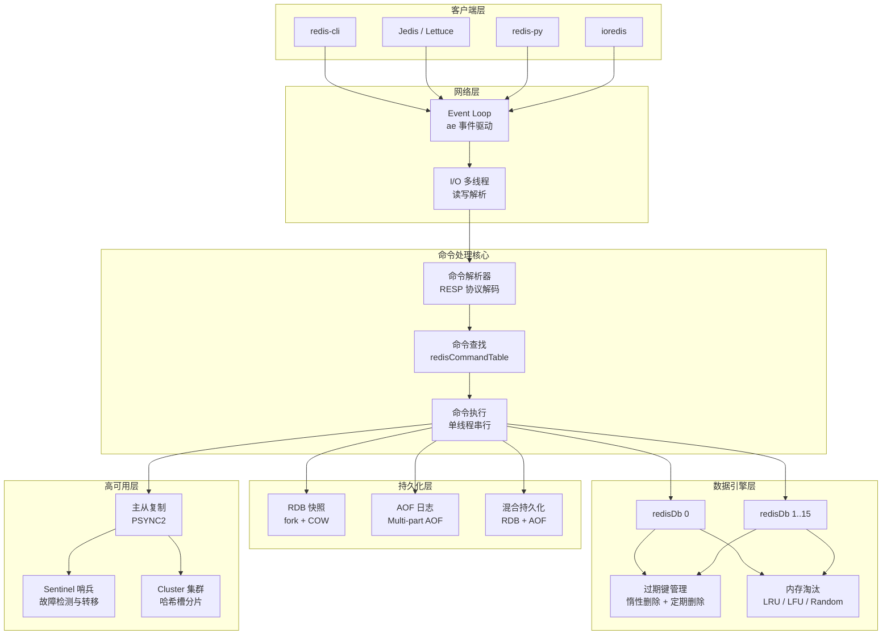
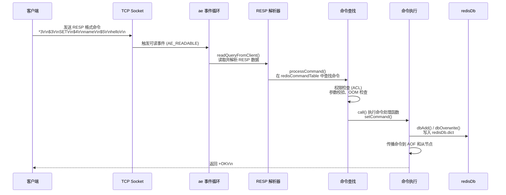
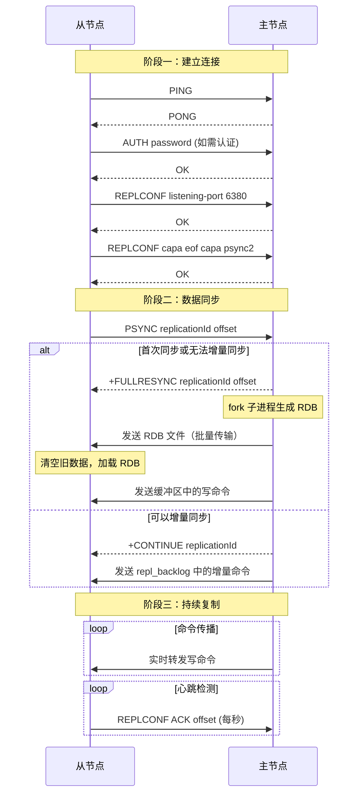
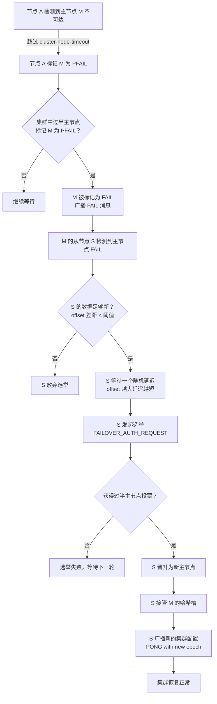
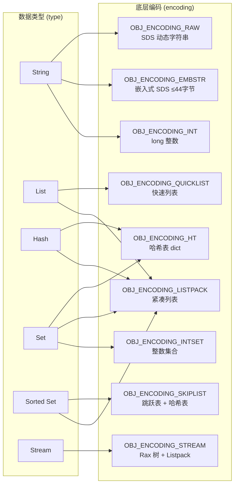
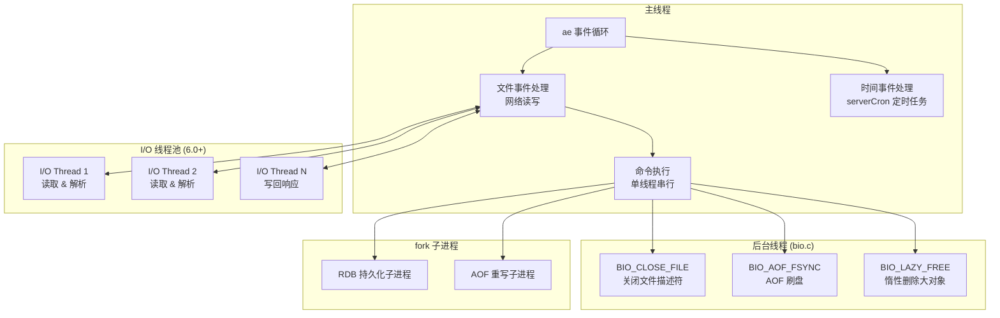
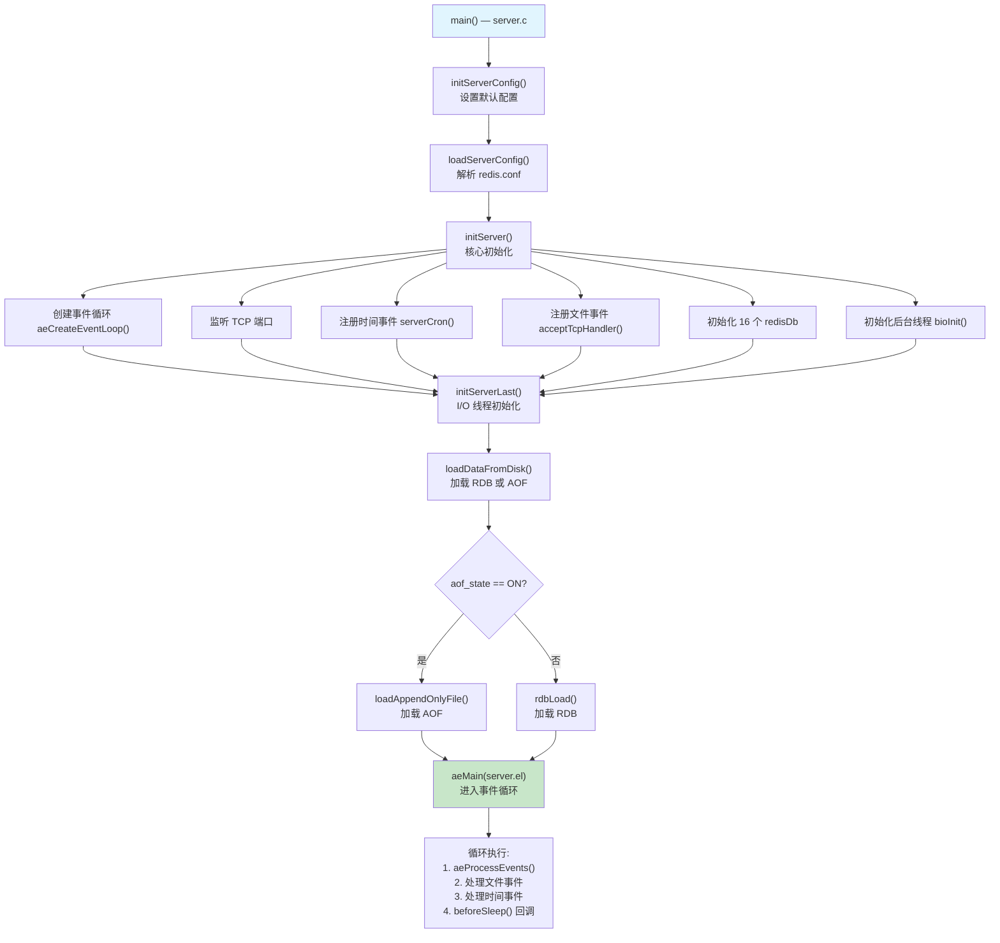
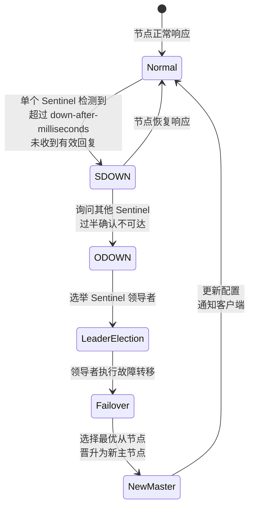

# Redis 知多少 v1.0

> 基于 Redis 7.2.x / 7.4.x | 最后更新时间：2025-01-01

---

## 📖 前言

### 技术背景与学习价值

Redis（Remote Dictionary Server）是全球最流行的开源内存数据结构存储系统，由意大利开发者 Salvatore Sanfilippo（网名 Antirez）于 2009 年创建。Redis 在 DB-Engines 排名中长期位居键值数据库第一名，是互联网行业事实上的"缓存标准"和"内存数据库标准"。

🎯 学习 Redis 的核心价值：
- **工程实用性**：全球数百万应用使用 Redis 作为缓存、会话存储、消息队列等核心组件（见 Redis 官方文档：Introduction to Redis）
- **理论深度**：涵盖跳跃表、哈希表、事件驱动、主从复制、分布式一致性等经典计算机科学理论
- **职业必备**：后端开发、架构师、SRE/运维岗位的核心技能要求，面试高频考点
- **生态完善**：与 Spring、Django、Rails、Node.js 等主流框架深度集成，客户端覆盖 50+ 编程语言

### 适用读者

| 读者类型 | 建议阅读章节 |
|---------|------------|
| 初学者 | 前言 → 第一章 → 第七章（实验环境） |
| 后端开发工程师 | 第一章 → 第二章 → 第五章 → 第六章 |
| 运维 / SRE 工程师 | 第五章 → 第六章 → 第二章 |
| 架构师 | 第二章 → 第四章 → 第五章 |
| 面试备战 | 第七章 → 第二章 → 第五章 |

### 版本说明

本文档基于 **Redis 7.2.x**（最新稳定开源版本），同时涵盖 **7.4.x** 的重要变更信息。Redis 7.0 → 7.2 的重大变化包括：

- 引入 Redis Functions（替代 EVAL 脚本的新编程模型，7.0+）
- Sharded Pub/Sub（分片发布订阅，7.0+）
- Multi-part AOF（多文件 AOF 重写机制，7.0+）
- ACL v2（更细粒度的权限控制，7.0+）
- 客户端缓存（Client-side Caching）改进（7.2+）
- Listpack 全面替代 Ziplist（7.0+）
- 命令元数据与文档内嵌（COMMAND DOCS，7.0+）

⚠️ **重要提示**：Redis 7.4（2024 年 3 月）将开源许可证从 BSD 3-Clause 变更为 RSALv2 + SSPLv1 双许可证。这意味着云服务商不能再直接提供 Redis 托管服务而不获得商业许可。社区因此 fork 出了 Valkey（Linux Foundation 托管）等替代项目。见 Redis 官方博客：Redis Adopts Dual Source-Available Licensing。

> 见 Redis 官方文档：https://redis.io/docs/about/

---

## 第一章：基础理论与架构演进

### 1.1 技术诞生背景与核心问题

**时代背景**：2009 年，意大利开发者 Salvatore Sanfilippo（Antirez）在开发一个实时 Web 日志分析工具（LLOOGG）时，发现传统关系型数据库无法满足高频读写和实时排序的性能需求。他需要一个能在内存中高速操作多种数据结构的存储系统，于是创建了 Redis。

**Redis 要解决的核心问题**：
1. **性能问题**：传统磁盘数据库的 I/O 延迟无法满足微秒级响应需求，Redis 将数据存储在内存中，单实例可达 10 万+ QPS
2. **数据结构问题**：简单的 Key-Value 存储（如 Memcached）无法支持排行榜、计数器、队列等复杂场景，Redis 提供了 String、List、Hash、Set、Sorted Set 等丰富数据结构
3. **持久化问题**：纯内存存储存在数据丢失风险，Redis 提供 RDB 快照和 AOF 日志两种持久化机制
4. **原子性问题**：多步操作需要原子执行保证，Redis 的单线程模型天然保证命令的原子性

**名称由来**：Redis = **Re**mote **Di**ctionary **S**erver（远程字典服务）。

💡 **进阶思考**：Redis 选择单线程模型并非因为"多线程不好"，而是因为 Redis 的性能瓶颈在于网络 I/O 和内存访问，而非 CPU 计算。单线程避免了锁竞争和上下文切换的开销，使得代码更简单、更可预测。直到 6.0 版本，Redis 才引入 I/O 多线程来优化网络读写，但命令执行仍然是单线程的。

### 1.2 架构演进历程

| 版本 | 年份 | 里程碑 |
|------|------|--------|
| 1.0 | 2009 | 基础 KV 存储，支持 String、List、Set、Sorted Set |
| 2.0 | 2010 | 虚拟内存（后废弃）、Pub/Sub 发布订阅、Hash 数据类型 |
| 2.6 | 2012 | Lua 脚本支持、毫秒级过期精度、BITCOUNT/BITOP 位操作 |
| 2.8 | 2013 | 部分重同步 PSYNC（避免全量复制）、Sentinel 生产可用 |
| **3.0** | **2015** | **Redis Cluster 正式发布**，支持自动分片和故障转移 |
| 3.2 | 2016 | GEO 地理位置命令、SDS 内存优化、Lua 调试器 |
| **4.0** | **2017** | **Module 模块系统**、PSYNC2 优化、混合持久化（RDB+AOF）、MEMORY 命令 |
| **5.0** | **2018** | **Stream 数据类型**（类 Kafka 消息流）、集群管理器内置（redis-cli --cluster） |
| **6.0** | **2020** | **ACL 访问控制**、**I/O 多线程**、RESP3 协议、SSL/TLS 支持、客户端缓存 |
| 6.2 | 2021 | GETDEL/GETEX 命令、COPY 命令、RESET 命令、LMPOP/ZMPOP |
| **7.0** | **2022** | **Redis Functions**、**Sharded Pub/Sub**、**Multi-part AOF**、ACL v2、命令元数据 |
| 7.2 | 2023 | 客户端缓存改进、性能优化、Cluster 改进 |
| 7.4 | 2024 | **许可证变更**（BSD → RSALv2 + SSPLv1） |

**演进原因分析**：

🎯 **从单机到 Cluster（3.0）**：随着数据量增长，单机内存成为瓶颈。Redis Cluster 通过 16384 个哈希槽实现数据自动分片，支持水平扩展。这是 Redis 从"缓存工具"走向"分布式数据库"的关键一步。

🎯 **引入 Module 系统（4.0）**：Redis 核心保持精简，通过模块机制允许第三方扩展功能（如 RediSearch 全文搜索、RedisJSON JSON 支持、RedisTimeSeries 时序数据）。这是"小内核 + 大生态"的设计哲学。

🎯 **引入 Stream（5.0）**：消息队列是 Redis 的高频使用场景，但 List/Pub/Sub 都有局限性（List 不支持消费者组，Pub/Sub 不持久化）。Stream 借鉴 Kafka 的设计，提供了持久化、消费者组、消息确认等完整的消息流语义。

🎯 **I/O 多线程（6.0）**：随着网络带宽提升（10GbE/25GbE），网络 I/O 成为新的瓶颈。Redis 6.0 引入 I/O 多线程处理网络读写，但命令执行仍保持单线程，兼顾了性能和简单性。

🎯 **许可证变更（7.4）**：Redis Ltd.（原 Redis Labs）将许可证从 BSD 变更为 RSALv2 + SSPLv1，限制云服务商直接提供 Redis 托管服务。这引发了社区分裂，Linux Foundation 托管了 fork 项目 Valkey。

⚠️ **易错点**：Redis 的版本号从 1.x 直接跳到 2.x，没有经历传统的 1.x 长期迭代。另外，Redis 6.0 的 I/O 多线程默认是关闭的，需要通过 `io-threads` 配置项手动开启。

### 1.3 核心概念术语表

| 英文术语 | 中文 | 通俗解释 |
|---------|------|---------|
| SDS (Simple Dynamic String) | 简单动态字符串 | Redis 自实现的字符串结构，相比 C 字符串支持 O(1) 获取长度、二进制安全、自动扩容 |
| Dict (Hash Table) | 字典/哈希表 | Redis 的核心数据结构，采用链地址法解决冲突，支持渐进式 rehash |
| Skiplist | 跳跃表 | Sorted Set 的底层实现之一，多层链表结构，支持 O(logN) 的查找和范围查询 |
| Ziplist | 压缩列表 | 紧凑的连续内存结构，适合存储少量小元素，已在 7.0 被 Listpack 替代 |
| Listpack | 紧凑列表 | Ziplist 的改进版，解决了级联更新问题，7.0+ 全面替代 Ziplist |
| Quicklist | 快速列表 | List 类型的底层实现，由多个 Listpack 节点组成的双向链表 |
| RDB (Redis Database) | Redis 数据库快照 | 将内存数据以二进制格式写入磁盘的持久化方式，适合备份和灾难恢复 |
| AOF (Append Only File) | 追加日志文件 | 将每条写命令追加到日志文件的持久化方式，数据安全性更高 |
| Sentinel | 哨兵 | Redis 高可用方案，负责监控主从节点、自动故障转移、配置通知 |
| Cluster | 集群 | Redis 分布式方案，通过哈希槽分片实现数据水平扩展和高可用 |
| Slot | 哈希槽 | Cluster 中数据分片的基本单位，共 16384 个槽，每个 Key 通过 CRC16 映射到一个槽 |
| RESP (Redis Serialization Protocol) | Redis 序列化协议 | 客户端与服务端通信的文本协议，简单高效，当前版本为 RESP3 |
| Pub/Sub | 发布/订阅 | 消息通信模式，发布者发送消息到频道，订阅者接收频道消息 |
| Pipeline | 管道 | 客户端批量发送命令、一次性接收响应的优化技术，减少网络往返 |
| Lua Scripting | Lua 脚本 | 在服务端原子执行 Lua 脚本，保证多条命令的原子性 |
| Stream | 流 | 5.0 引入的日志型数据结构，支持消费者组、消息确认，类似 Kafka |
| Module | 模块 | 4.0 引入的扩展机制，允许用 C 语言编写 Redis 扩展（如 RediSearch、RedisJSON） |
| Eviction | 内存淘汰 | 当内存达到上限时，按策略（LRU/LFU/Random/TTL）删除部分 Key |
| Keyspace Notification | 键空间通知 | 当 Key 发生变化时发送通知事件，可用于监控 Key 的过期、删除等操作 |
| Client-side Caching | 客户端缓存 | 6.0 引入，客户端在本地缓存数据，服务端通过 Tracking 机制通知失效 |

### 1.4 适用场景 vs 不适用场景

| 场景 | 适用性 | 说明 |
|------|--------|------|
| 缓存（Cache） | ✅ | 最经典的使用场景，利用内存高速读写降低数据库压力 |
| 会话管理（Session Store） | ✅ | 分布式环境下共享用户会话，支持过期自动清理 |
| 排行榜（Leaderboard） | ✅ | Sorted Set 天然支持按分数排序，O(logN) 插入和查询 |
| 计数器（Counter） | ✅ | INCR/DECR 原子操作，适合 PV/UV 统计、限流计数 |
| 分布式锁（Distributed Lock） | ✅ | SET NX EX 实现互斥锁，Redlock 算法提供更强保证 |
| 消息队列（Message Queue） | ✅ | Stream 类型提供完整的消息队列语义（5.0+） |
| 地理位置（Geospatial） | ✅ | GEO 命令支持经纬度存储、距离计算、范围查询 |
| 限流（Rate Limiting） | ✅ | 滑动窗口/令牌桶算法可基于 Sorted Set 或 Lua 脚本实现 |
| 实时推荐/去重 | ✅ | HyperLogLog 基数统计、Bloom Filter（Module）去重 |
| 海量冷数据存储 | ❌ | 内存成本高，不适合存储 TB 级冷数据，应使用磁盘数据库 |
| 复杂关系查询 | ❌ | 不支持 JOIN、子查询等 SQL 操作，应使用关系型数据库 |
| 强事务 ACID | ❌ | Redis 事务不支持回滚，不适合需要严格 ACID 保证的场景 |
| 大 Value 存储 | ❌ | 单个 Value 超过 10KB 会显著影响性能，超过 1MB 应避免 |
| 全文搜索（原生） | ❌ | 原生不支持，需要 RediSearch 模块或使用 Elasticsearch |

### 1.5 同类技术对比

| 维度 | Redis | Memcached | etcd |
|------|-------|-----------|------|
| **设计哲学** | 内存数据结构服务器，"瑞士军刀" | 纯粹的分布式内存缓存 | 分布式可靠键值存储，为配置共享和服务发现设计 |
| **数据结构** | String、List、Hash、Set、Sorted Set、Stream、HyperLogLog、Bitmap、GEO | 仅 String（Key-Value） | 仅 Key-Value（层级目录结构） |
| **持久化** | RDB 快照 + AOF 日志 + 混合持久化 | ❌ 不支持 | ✅ WAL + 快照（基于 bbolt） |
| **集群方案** | Redis Cluster（哈希槽分片） | 客户端一致性哈希 | Raft 共识协议 |
| **一致性模型** | 最终一致性（异步复制） | 无复制，无一致性保证 | 强一致性（线性一致性读写） |
| **单实例 QPS** | 10 万 ~ 30 万（取决于命令复杂度） | 100 万+（纯 GET/SET） | 1 万 ~ 3 万 |
| **延迟** | 亚毫秒级（< 1ms） | 亚毫秒级（< 1ms） | 毫秒级（1~10ms） |
| **内存效率** | 中等（对象头开销，但有 Listpack 等紧凑编码） | 高（Slab Allocator，无额外元数据） | 低（Raft 日志 + bbolt B+Tree 开销） |
| **多线程** | 命令执行单线程，I/O 多线程（6.0+） | 多线程（多 worker 线程） | 多 goroutine |
| **编程语言** | C | C | Go |
| **协议** | RESP2/RESP3（文本协议） | 自定义文本/二进制协议 | gRPC + HTTP/JSON |
| **Watch/通知** | Pub/Sub、Keyspace Notification、Client Tracking | ❌ | ✅ Watch 机制（长轮询） |
| **事务** | MULTI/EXEC（乐观锁，不支持回滚） | CAS（Check-And-Set） | 事务（Mini-Transaction） |
| **社区活跃度** | ⭐⭐⭐⭐⭐ GitHub 60k+ Stars | ⭐⭐⭐ 成熟稳定，更新较慢 | ⭐⭐⭐⭐ CNCF 毕业项目 |
| **典型场景** | 缓存、会话、排行榜、消息队列、分布式锁 | 纯缓存（大规模 KV 缓存） | 服务发现、配置中心、分布式锁、Leader 选举 |
| **许可证** | RSALv2 + SSPLv1（7.4+）/ BSD（7.2-） | BSD | Apache 2.0 |

🎯 **选型建议**：
- **纯缓存场景 + 极致性能**：Memcached（多线程、无持久化开销、内存效率高）
- **缓存 + 丰富数据结构 + 持久化**：Redis（最通用的选择）
- **分布式协调 + 强一致性**：etcd（配置中心、服务发现、Leader 选举）

💡 **进阶思考**：Redis 和 Memcached 的性能差距在纯 GET/SET 场景下并不大（都是亚毫秒级），但 Redis 的优势在于数据结构的丰富性。如果你的场景只需要简单的 KV 缓存，Memcached 的多线程模型在高并发下可能表现更好。但如果需要排行榜、计数器、队列等功能，Redis 是唯一选择。

---

## 第二章：实现原理解析

### 2.1 核心组件架构图



🎯 **架构核心特征**：
- **单线程命令执行**：所有命令在主线程中串行执行，避免锁竞争
- **事件驱动**：基于 ae 库的 Reactor 模式，同时处理文件事件（网络 I/O）和时间事件（定时任务）
- **I/O 多线程**：6.0+ 可选开启，仅处理网络读写和协议解析，不涉及命令执行
- **fork 子进程**：RDB 持久化和 AOF 重写通过 fork 子进程 + COW（Copy-On-Write）实现，不阻塞主线程

### 2.2 核心工作流程

#### 2.2.1 命令执行流程（正常流程）



🎯 **关键细节**：
- 命令查找使用哈希表 `server.commands`，时间复杂度 O(1)
- `call()` 函数是所有命令执行的统一入口，负责统计、慢查询记录、命令传播
- 如果开启了 AOF，命令执行后会追加到 `server.aof_buf` 缓冲区
- 如果有从节点，命令会追加到 `server.repl_backlog` 复制积压缓冲区

#### 2.2.2 主从复制流程



🎯 **PSYNC2 改进（4.0+）**：
- 支持从节点重启后的增量同步（通过持久化 replicationId 和 offset）
- 支持故障转移后的增量同步（新主节点保留旧 replicationId 作为 replid2）
- 见 Redis 官方文档：Replication 章节

⚠️ **易错点**：全量同步期间，主节点会 fork 子进程生成 RDB，如果数据量大（>10GB），fork 操作可能导致主节点短暂阻塞（取决于内存页表大小）。生产环境建议开启 `repl-diskless-sync yes`（无盘复制），直接通过 Socket 发送 RDB 数据，避免磁盘 I/O。

#### 2.2.3 Cluster 故障转移流程（异常流程）



🎯 **关键参数**：
- `cluster-node-timeout`：节点不可达超时时间，默认 15000ms（15 秒）
- 从节点选举延迟 = 500ms + random(0, 500ms) + `rank * 1000ms`（rank 基于复制偏移量排序，偏移量越大 rank 越小，优先选举）

#### 2.2.4 持久化流程

**RDB 持久化流程**：

```mermaid
flowchart TD
    A[触发 RDB 持久化] --> B{触发方式}
    B -->|手动 SAVE| C[主线程阻塞执行<br/>生产环境禁用]
    B -->|手动 BGSAVE| D[fork 子进程]
    B -->|自动触发<br/>save 配置| D
    D --> E[子进程遍历所有 DB<br/>序列化为 RDB 格式]
    E --> F[写入临时文件<br/>temp-pid.rdb]
    F --> G[rename 替换旧文件<br/>dump.rdb]
    G --> H[子进程退出<br/>通知主进程]

    Note right of D: 利用 OS 的 COW 机制<br/>父子进程共享内存页<br/>写时才复制修改的页
```

**AOF 持久化流程（Multi-part AOF，7.0+）**：

```mermaid
flowchart TD
    A[写命令执行] --> B[追加到 aof_buf 缓冲区]
    B --> C{appendfsync 策略}
    C -->|always| D[每条命令 fsync]
    C -->|everysec| E[每秒 fsync<br/>后台线程执行]
    C -->|no| F[由 OS 决定 fsync]
    D & E & F --> G[写入 appendonly.aof.incr 文件]

    H[AOF 重写触发] --> I[fork 子进程]
    I --> J[子进程遍历数据库<br/>生成 RDB 格式的 base 文件]
    J --> K[主进程将新命令写入<br/>appendonly.aof.incr 新增量文件]
    K --> L[子进程完成<br/>生成 manifest 清单文件]
    L --> M[原子替换旧 AOF 文件组]

    Note right of J: 7.0+ Multi-part AOF<br/>base 文件 + 多个 incr 文件<br/>+ manifest 清单文件
```

🎯 **Multi-part AOF（7.0+）的改进**：
- 旧版 AOF 重写需要在子进程完成后，将重写期间的增量数据追加到新 AOF 文件，这个过程可能阻塞主线程
- 新版将 AOF 拆分为 base 文件（RDB 格式）+ 多个 incr 增量文件 + manifest 清单文件
- 重写完成后只需更新 manifest，无需合并文件，消除了阻塞风险
- 见 Redis 源码：`aof.c` 中的 `aofRewriteBackground()` 函数

### 2.3 关键算法/协议详解

#### 2.3.1 Gossip 协议（Cluster 节点通信）

Redis Cluster 使用 Gossip 协议进行节点间的状态传播和故障检测。每个节点维护一份集群状态视图，通过周期性交换信息最终达成一致。

**工作机制**：
1. 每个节点每秒随机选择 1 个节点发送 PING 消息（携带自身状态 + 随机选取的其他节点信息）
2. 接收方回复 PONG 消息（携带自身最新状态）
3. 如果某节点超过 `cluster-node-timeout / 2` 未收到 PONG，会额外发送 PING
4. 通过多轮交换，所有节点最终获得一致的集群视图

**Gossip 消息结构**（见源码 `cluster.h`）：

```c
// clusterMsg 消息头
typedef struct {
    char sig[4];          // "RCmb" 签名
    uint32_t totlen;      // 消息总长度
    uint16_t ver;         // 协议版本
    uint16_t port;        // 客户端端口
    uint16_t type;        // 消息类型: PING, PONG, MEET, FAIL...
    uint16_t count;       // 携带的 gossip 节点数量
    uint64_t currentEpoch;// 当前纪元
    uint64_t configEpoch; // 配置纪元
    char sender[40];      // 发送者节点 ID
    unsigned char myslots[CLUSTER_SLOTS/8]; // 发送者负责的槽位图
    // ...
} clusterMsg;

// clusterMsgDataGossip 每个 gossip 节点信息
typedef struct {
    char nodename[40];    // 节点 ID
    uint32_t ping_sent;   // 最后发送 PING 的时间
    uint32_t pong_received;// 最后收到 PONG 的时间
    char ip[46];          // IP 地址
    uint16_t port;        // 端口
    uint16_t flags;       // 节点标志 (MASTER/SLAVE/PFAIL/FAIL...)
} clusterMsgDataGossip;
```

💡 **进阶思考**：Gossip 协议的收敛速度与集群规模有关。对于 N 个节点的集群，理论上需要 O(logN) 轮交换才能让所有节点获得最新信息。Redis Cluster 建议节点数不超过 1000 个，超过后 Gossip 消息的带宽开销会显著增加。

#### 2.3.2 CRC16 哈希槽分配算法

Redis Cluster 将键空间划分为 16384 个哈希槽（slot），每个 Key 通过以下算法映射到一个槽：

```
SLOT = CRC16(key) mod 16384
```

**为什么是 16384 个槽？**（见 Antirez 在 GitHub issue #2576 的回复）
1. 16384 个槽的位图只需 2KB（16384/8），每次 Gossip 消息携带槽位图的开销可接受
2. Redis Cluster 建议不超过 1000 个主节点，16384 个槽足够均匀分配
3. 如果使用 65536 个槽，位图需要 8KB，Gossip 消息过大

**Hash Tag 机制**：如果 Key 中包含 `{...}`，则只对花括号内的部分计算哈希，确保相关 Key 落在同一个槽：

```bash
# 以下三个 Key 都映射到 CRC16("user") mod 16384 对应的槽
SET {user}:name "Alice"
SET {user}:age 30
SET {user}:email "[email]"
```

#### 2.3.3 LRU / LFU 淘汰算法

Redis 的内存淘汰并非精确的 LRU/LFU，而是**近似算法**，以节省内存开销。

**近似 LRU 实现**：
- 每个 redisObject 有一个 24 位的 `lru` 字段，记录最后访问时间（秒级精度，约 194 天循环）
- 淘汰时，随机采样 `maxmemory-samples`（默认 5）个 Key，淘汰其中 `lru` 值最小的
- 采样数越大越接近精确 LRU，但 CPU 开销也越大

**LFU 实现（4.0+）**：
- 复用 `lru` 字段的 24 位：高 16 位存储上次衰减时间（分钟精度），低 8 位存储对数计数器（0~255）
- 计数器使用概率递增：`counter` 越大，递增概率越低（对数增长）
- 计数器会随时间衰减：`lfu-decay-time` 配置衰减周期（默认 1 分钟）

```c
// LFU 计数器递增逻辑（见 evict.c）
uint8_t LFULogIncr(uint8_t counter) {
    if (counter == 255) return 255;  // 已达上限
    double r = (double)rand() / RAND_MAX;
    double baseval = counter - LFU_INIT_VAL;  // LFU_INIT_VAL = 5
    if (baseval < 0) baseval = 0;
    double p = 1.0 / (baseval * server.lfu_log_factor + 1);
    if (r < p) counter++;
    return counter;
}
```

🎯 **淘汰策略一览**：

| 策略 | 说明 |
|------|------|
| `noeviction` | 不淘汰，内存满时写入报错（默认） |
| `allkeys-lru` | 从所有 Key 中淘汰最近最少使用的 |
| `volatile-lru` | 从设置了过期时间的 Key 中淘汰 LRU |
| `allkeys-lfu` | 从所有 Key 中淘汰最不经常使用的（4.0+） |
| `volatile-lfu` | 从设置了过期时间的 Key 中淘汰 LFU（4.0+） |
| `allkeys-random` | 从所有 Key 中随机淘汰 |
| `volatile-random` | 从设置了过期时间的 Key 中随机淘汰 |
| `volatile-ttl` | 从设置了过期时间的 Key 中淘汰 TTL 最小的 |

#### 2.3.4 Sentinel 领导者选举（类 Raft 算法）

当 Sentinel 检测到主节点客观下线（ODOWN）后，需要选举一个 Sentinel 领导者来执行故障转移：

1. 检测到 ODOWN 的 Sentinel 将自己的 `currentEpoch` 加 1，向其他 Sentinel 发送 `SENTINEL is-master-down-by-addr` 请求投票
2. 每个 Sentinel 在每个 epoch 中只能投票一次（先到先得）
3. 获得过半 Sentinel 投票的节点成为领导者
4. 如果本轮没有选出领导者，等待 `2 * failover-timeout` 后重试

⚠️ **注意**：这不是完整的 Raft 协议，而是借鉴了 Raft 的 Leader Election 部分。Sentinel 不需要日志复制，因此不需要完整的 Raft 实现。

### 2.4 数据模型与存储结构

#### redisObject 对象系统

Redis 中所有数据都封装为 `redisObject` 结构体：

```c
// 见 server.h
typedef struct redisObject {
    unsigned type:4;      // 数据类型: STRING, LIST, HASH, SET, ZSET, STREAM...
    unsigned encoding:4;  // 编码方式: INT, EMBSTR, RAW, LISTPACK, SKIPLIST...
    unsigned lru:24;      // LRU 时间 或 LFU 计数器
    int refcount;         // 引用计数（用于内存管理）
    void *ptr;            // 指向底层数据结构的指针
} robj;  // 共 16 字节
```

#### 类型与编码对应关系



#### 编码转换阈值（7.2 默认值）

| 类型 | 紧凑编码 | 转换条件 | 标准编码 |
|------|---------|---------|---------|
| String | INT | 值不是整数或长度 > 20 位 | EMBSTR（≤44字节）/ RAW |
| String | EMBSTR | 长度 > 44 字节 | RAW |
| List | Listpack | 元素数 > 128 或单元素 > 64 字节 | Quicklist |
| Hash | Listpack | 字段数 > 128 或单值 > 64 字节 | Hashtable |
| Set | Intset | 元素非整数或数量 > 128 | Hashtable |
| Set | Listpack | 元素数 > 128 或单元素 > 64 字节 | Hashtable |
| Sorted Set | Listpack | 元素数 > 128 或单元素 > 64 字节 | Skiplist + Hashtable |

⚠️ **易错点**：这些阈值可通过配置修改（如 `list-max-listpack-size`、`hash-max-listpack-entries`），但不建议在生产环境随意调整。Listpack 在元素较多时性能会下降（O(N) 遍历），而 Hashtable/Skiplist 虽然内存开销更大但查找效率更高。

### 2.5 通信协议

#### RESP2 协议格式

RESP（Redis Serialization Protocol）是 Redis 客户端与服务端通信的协议，设计目标是简单、高效、易于实现。

```
数据类型        前缀    示例
─────────────────────────────────────────
Simple String   +      +OK\r\n
Error           -      -ERR unknown command\r\n
Integer         :      :1000\r\n
Bulk String     $      $5\r\nhello\r\n
Array           *      *2\r\n$3\r\nfoo\r\n$3\r\nbar\r\n
Null            $      $-1\r\n
```

**客户端发送命令示例**：

```
# SET name hello
*3\r\n        # 数组，3 个元素
$3\r\n        # Bulk String，长度 3
SET\r\n       # 命令名
$4\r\n        # Bulk String，长度 4
name\r\n      # Key
$5\r\n        # Bulk String，长度 5
hello\r\n     # Value
```

#### RESP3 协议新特性（6.0+）

RESP3 在 RESP2 基础上增加了更多数据类型，支持更丰富的语义：

| 类型 | 前缀 | 说明 |
|------|------|------|
| Null | `_` | 统一的空值表示 |
| Boolean | `#` | `#t\r\n` 或 `#f\r\n` |
| Double | `,` | `,3.14\r\n` |
| Big Number | `(` | `(3492890328409238509324850943850943825024385\r\n` |
| Verbatim String | `=` | 带格式标记的字符串（如 txt、mkd） |
| Map | `%` | 键值对映射（替代 Array 表示哈希） |
| Set | `~` | 无序集合 |
| Push | `>` | 服务端主动推送（用于 Pub/Sub、Client Tracking） |

🎯 **RESP3 的核心价值**：
- **类型丰富**：客户端无需猜测返回值类型，减少解析歧义
- **Push 支持**：服务端可主动推送消息，支持 Client-side Caching 的失效通知
- **向后兼容**：客户端通过 `HELLO 3` 命令切换到 RESP3，默认仍使用 RESP2

```bash
# 切换到 RESP3 协议
> HELLO 3
1# "server" => "redis"
2# "version" => "7.2.0"
3# "proto" => (integer) 3
4# "id" => (integer) 1
5# "mode" => "standalone"
6# "role" => "master"
7# "modules" => (empty array)
```

> 见 Redis 官方文档：RESP protocol spec（https://redis.io/docs/reference/protocol-spec/）

---

## 第三章：源码级实现细节

> 本章基于 Redis 7.2.x 源码（C 语言），源码仓库：https://github.com/redis/redis

### 3.1 代码组织结构

Redis 源码以简洁著称，核心代码约 10 万行 C 代码，集中在 `src/` 目录下：

| 文件 | 功能说明 | 代码量级 |
|------|---------|---------|
| `server.c` / `server.h` | 服务器核心：全局状态、初始化、事件循环入口 | ~6000 行 |
| `networking.c` | 网络通信：客户端连接管理、读写处理、RESP 解析 | ~4000 行 |
| `ae.c` / `ae.h` | 事件驱动库：封装 epoll/kqueue/select | ~500 行 |
| `ae_epoll.c` / `ae_kqueue.c` | 平台相关的 I/O 多路复用实现 | ~150 行/文件 |
| `dict.c` / `dict.h` | 哈希表：渐进式 rehash、迭代器 | ~1200 行 |
| `sds.c` / `sds.h` | 简单动态字符串 | ~1300 行 |
| `adlist.c` / `adlist.h` | 双向链表 | ~400 行 |
| `ziplist.c`（已废弃）/ `listpack.c` | 压缩列表 / 紧凑列表 | ~1500 行 |
| `quicklist.c` | 快速列表（Listpack 链表） | ~1200 行 |
| `t_string.c` | String 类型命令实现（SET/GET/INCR...） | ~800 行 |
| `t_list.c` | List 类型命令实现（LPUSH/RPOP/LRANGE...） | ~900 行 |
| `t_hash.c` | Hash 类型命令实现（HSET/HGET/HGETALL...） | ~800 行 |
| `t_set.c` | Set 类型命令实现（SADD/SMEMBERS/SINTER...） | ~1200 行 |
| `t_zset.c` | Sorted Set 类型命令实现（ZADD/ZRANGE/ZRANGEBYSCORE...） | ~4000 行 |
| `t_stream.c` | Stream 类型命令实现（XADD/XREAD/XREADGROUP...） | ~2500 行 |
| `rdb.c` | RDB 持久化：快照生成与加载 | ~3500 行 |
| `aof.c` | AOF 持久化：日志追加与重写 | ~2000 行 |
| `replication.c` | 主从复制：PSYNC2、全量/增量同步 | ~4000 行 |
| `cluster.c` | Cluster 集群：Gossip、故障转移、槽管理 | ~7000 行 |
| `sentinel.c` | Sentinel 哨兵：监控、选举、故障转移 | ~4500 行 |
| `evict.c` | 内存淘汰策略实现 | ~600 行 |
| `expire.c` | 过期键管理：惰性删除 + 定期删除 | ~300 行 |
| `bio.c` | 后台 I/O 线程：惰性删除、AOF fsync | ~300 行 |
| `module.c` | Module API 实现 | ~12000 行 |
| `acl.c` | ACL 访问控制 | ~2500 行 |
| `object.c` | redisObject 管理：创建、编码转换、内存统计 | ~1500 行 |

💡 **进阶思考**：Redis 源码的一个显著特点是"扁平化"——没有复杂的目录层级，所有核心代码都在 `src/` 下。这与 Antirez 的设计哲学一致：保持简单，避免过度抽象。

### 3.2 关键数据结构

#### 3.2.1 SDS（Simple Dynamic String）

SDS 是 Redis 最基础的数据结构，替代 C 语言原生字符串：

```c
// 见 sds.h — SDS 头部结构（以 sdshdr8 为例）
struct __attribute__ ((__packed__)) sdshdr8 {
    uint8_t len;        // 已使用长度
    uint8_t alloc;      // 分配的总长度（不含头部和 \0）
    unsigned char flags; // 类型标志（低 3 位表示类型：sdshdr5/8/16/32/64）
    char buf[];          // 柔性数组，实际存储字符串内容
};

// SDS 类型根据字符串长度选择不同的头部大小
// sdshdr5:  < 32 字节（不常用）
// sdshdr8:  < 256 字节
// sdshdr16: < 64KB
// sdshdr32: < 4GB
// sdshdr64: >= 4GB
```

**SDS 相比 C 字符串的优势**：

| 特性 | C 字符串 | SDS |
|------|---------|-----|
| 获取长度 | O(N) 遍历 | O(1) 读取 `len` 字段 |
| 缓冲区溢出 | 不检查，可能溢出 | 自动扩容，安全 |
| 二进制安全 | 以 `\0` 结尾，不能存储二进制 | 以 `len` 判断结束，可存储任意二进制 |
| 内存分配 | 每次修改都需要 realloc | 空间预分配 + 惰性释放 |
| 兼容 C 函数 | 原生兼容 | `buf` 末尾保留 `\0`，兼容 `printf` 等 |

**空间预分配策略**：
- 修改后长度 < 1MB：分配 `2 * newlen + 1` 字节
- 修改后长度 >= 1MB：分配 `newlen + 1MB + 1` 字节

#### 3.2.2 Dict（哈希表）

Redis 的哈希表实现了**渐进式 rehash**，避免一次性 rehash 导致的长时间阻塞：

```c
// 见 dict.h
typedef struct dict {
    dictType *type;       // 类型特定函数（hash、比较、复制、析构）
    void *privdata;       // 私有数据
    dictht ht[2];         // 两个哈希表：ht[0] 正常使用，ht[1] rehash 时使用
    long rehashidx;       // rehash 进度（-1 表示未在 rehash）
    int16_t pauserehash;  // rehash 暂停计数
} dict;

typedef struct dictht {
    dictEntry **table;    // 哈希桶数组
    unsigned long size;   // 桶数量（总是 2 的幂）
    unsigned long sizemask; // size - 1，用于取模
    unsigned long used;   // 已有节点数量
} dictht;

typedef struct dictEntry {
    void *key;            // 键
    union {
        void *val;
        uint64_t u64;
        int64_t s64;
        double d;
    } v;                  // 值（联合体节省内存）
    struct dictEntry *next; // 链地址法解决冲突
} dictEntry;
```

**渐进式 rehash 流程**：
1. 当负载因子（`used / size`）超过阈值时，分配 `ht[1]`（大小为 `ht[0].used` 的下一个 2 的幂）
2. 设置 `rehashidx = 0`，开始渐进式迁移
3. 每次 CRUD 操作时，顺带将 `ht[0].table[rehashidx]` 桶中的所有节点迁移到 `ht[1]`
4. 定时任务 `databasesCron()` 中也会执行批量迁移（每次迁移 100 个桶，耗时不超过 1ms）
5. 迁移完成后，释放 `ht[0]`，将 `ht[1]` 设为 `ht[0]`，重置 `rehashidx = -1`

⚠️ **rehash 期间的查找**：先查 `ht[0]`，未找到再查 `ht[1]`。新增操作直接写入 `ht[1]`。

#### 3.2.3 Skiplist（跳跃表）

Sorted Set 的底层实现之一，支持 O(logN) 的插入、删除和范围查询：

```c
// 见 server.h
typedef struct zskiplistNode {
    sds ele;              // 成员值（SDS 字符串）
    double score;         // 分数
    struct zskiplistNode *backward; // 后退指针（用于反向遍历）
    struct zskiplistLevel {
        struct zskiplistNode *forward; // 前进指针
        unsigned long span;            // 跨度（用于计算排名）
    } level[];            // 柔性数组，层级数量随机决定
} zskiplistNode;

typedef struct zskiplist {
    struct zskiplistNode *header, *tail; // 头尾指针
    unsigned long length;                // 节点数量
    int level;                           // 当前最大层级
} zskiplist;

// Sorted Set 同时使用 skiplist + dict
typedef struct zset {
    dict *dict;           // member -> score 的映射（O(1) 查找分数）
    zskiplist *zsl;       // 按 score 排序的跳跃表（O(logN) 范围查询）
} zset;
```

**为什么选择跳跃表而非平衡树？**（见 Antirez 的解释）
1. 实现简单：跳跃表代码量远少于红黑树/AVL 树
2. 范围查询高效：跳跃表天然支持有序遍历，无需中序遍历
3. 并发友好：跳跃表的局部修改不影响全局结构（虽然 Redis 是单线程，但简单性仍有价值）
4. 内存局部性：通过调整层级概率可以控制空间开销

### 3.3 并发模型



**I/O 多线程工作流程（6.0+）**：

1. 主线程通过事件循环接收新连接
2. 将待读取的客户端分配到 I/O 线程（轮询分配）
3. I/O 线程并行读取 Socket 数据并解析 RESP 协议
4. 主线程等待所有 I/O 线程完成读取
5. 主线程串行执行所有命令
6. 将待写回的客户端分配到 I/O 线程
7. I/O 线程并行写回响应数据

```bash
# 开启 I/O 多线程（redis.conf）
io-threads 4              # I/O 线程数（建议 CPU 核数的 1/2 ~ 3/4）
io-threads-do-reads yes   # 开启读取多线程（默认只开启写回多线程）
```

⚠️ **关键约束**：命令执行始终在主线程中串行进行，I/O 多线程只负责网络读写和协议解析。这保证了 Redis 的线程安全性，无需加锁。

### 3.4 重要结构体/接口设计

#### redisServer（全局状态）

```c
// 见 server.h（简化版，实际有 500+ 字段）
struct redisServer {
    // 基础配置
    pid_t pid;
    char *configfile;
    int dbnum;                    // 数据库数量，默认 16
    redisDb *db;                  // 数据库数组

    // 网络
    int port;                     // 监听端口，默认 6379
    int tcp_backlog;              // TCP backlog
    aeEventLoop *el;              // 事件循环

    // 命令
    dict *commands;               // 命令表
    dict *orig_commands;          // 原始命令表（rename 前）

    // 客户端
    list *clients;                // 已连接客户端链表
    int maxclients;               // 最大客户端数

    // 持久化
    long long dirty;              // 上次 RDB 后的修改次数
    struct saveparam *saveparams; // RDB 自动保存条件
    char *aof_filename;           // AOF 文件名
    int aof_state;                // AOF 状态

    // 复制
    char replid[41];              // 复制 ID
    long long master_repl_offset; // 主节点复制偏移量
    char *repl_backlog;           // 复制积压缓冲区

    // 内存
    size_t maxmemory;             // 最大内存限制
    int maxmemory_policy;         // 淘汰策略

    // 统计
    long long stat_numcommands;   // 已执行命令总数
    long long stat_numconnections;// 已接受连接总数
    // ...
};
```

#### client（客户端连接）

```c
typedef struct client {
    uint64_t id;              // 客户端唯一 ID
    connection *conn;         // 网络连接
    int resp;                 // RESP 协议版本（2 或 3）
    redisDb *db;              // 当前选择的数据库
    robj *name;               // 客户端名称（CLIENT SETNAME）

    sds querybuf;             // 输入缓冲区（接收的原始数据）
    int argc;                 // 当前命令参数数量
    robj **argv;              // 当前命令参数数组
    struct redisCommand *cmd; // 当前要执行的命令

    list *reply;              // 输出链表（大响应）
    char buf[16384];          // 固定输出缓冲区（小响应，16KB）
    int bufpos;               // 固定缓冲区已用长度

    int flags;                // 客户端标志（MASTER/SLAVE/MONITOR...）
    time_t lastinteraction;   // 最后交互时间
    // ...
} client;
```

### 3.5 启动流程



**serverCron 定时任务**（默认每 100ms 执行一次）：

```c
// 见 server.c — serverCron() 核心逻辑
int serverCron(struct aeEventLoop *eventLoop, long long id, void *clientData) {
    // 1. 更新缓存时间（避免频繁系统调用）
    updateCachedTime();

    // 2. 统计信息更新（内存、客户端数、QPS 等）
    trackInstantaneousMetric(STATS_METRIC_COMMAND, server.stat_numcommands);

    // 3. 客户端超时检查
    clientsCron();

    // 4. 数据库维护（过期键删除、rehash、resize）
    databasesCron();

    // 5. 触发 RDB/AOF 持久化
    if (hasActiveChildProcess() == 0) {
        // 检查是否需要 BGSAVE 或 AOF 重写
    }

    // 6. 复制相关定时任务
    replicationCron();

    // 7. Cluster 相关定时任务
    clusterCron();

    // 8. Sentinel 相关定时任务
    sentinelTimer();

    return 1000 / server.hz;  // 返回下次执行间隔（ms）
}
```

> 见 Redis 源码：`server.c` 中的 `main()` 和 `serverCron()` 函数

---

## 第四章：设计模式深度剖析

### 4.1 架构层面的模式

#### 4.1.1 Reactor 模式（ae 事件驱动库）

Redis 的网络模型是经典的**单 Reactor 单线程**模式（6.0 之前），6.0 之后演进为**单 Reactor + 多 I/O 线程**模式。

**Reactor 模式核心组件**：
- **Event Demultiplexer**（事件多路分离器）：`ae_epoll.c` / `ae_kqueue.c`，封装操作系统的 I/O 多路复用
- **Event Handler**（事件处理器）：`acceptTcpHandler()`（新连接）、`readQueryFromClient()`（读取命令）、`sendReplyToClient()`（写回响应）
- **Reactor**（反应器）：`aeMain()` → `aeProcessEvents()`，事件循环的核心

```c
// ae.c — 事件循环核心（简化）
void aeMain(aeEventLoop *eventLoop) {
    eventLoop->stop = 0;
    while (!eventLoop->stop) {
        // beforeSleep: 处理待写客户端、AOF 刷盘、集群消息等
        if (eventLoop->beforesleep != NULL)
            eventLoop->beforesleep(eventLoop);
        // 核心：等待并处理事件
        aeProcessEvents(eventLoop, AE_ALL_EVENTS | AE_CALL_BEFORE_SLEEP | AE_CALL_AFTER_SLEEP);
    }
}
```

🎯 **为什么选择 Reactor 而非 Proactor？**
- Reactor 是同步非阻塞模型，实现简单，与 Redis 的单线程命令执行模型天然契合
- Linux 的 epoll 是 Reactor 模式的最佳搭档，性能优异
- Proactor（如 Windows IOCP）是异步模型，实现复杂，且 Linux 的原生异步 I/O（io_uring）在 Redis 创建时尚不成熟

#### 4.1.2 Pipeline 模式（批量命令处理）

Pipeline 允许客户端一次性发送多条命令，服务端批量处理后一次性返回所有响应，减少网络往返（RTT）。

```bash
# 不使用 Pipeline：每条命令一个 RTT
SET key1 val1  →  +OK
SET key2 val2  →  +OK
SET key3 val3  →  +OK
# 总耗时 ≈ 3 × RTT

# 使用 Pipeline：所有命令一个 RTT
SET key1 val1 \
SET key2 val2 \  →  +OK +OK +OK
SET key3 val3 /
# 总耗时 ≈ 1 × RTT
```

**实现原理**：Pipeline 不是 Redis 服务端的特殊功能，而是利用了 TCP 的全双工特性。客户端连续发送命令（不等待响应），服务端按顺序处理并将响应写入输出缓冲区，最后一次性发送。

⚠️ **注意**：Pipeline 中的命令不是原子执行的。如果需要原子性，应使用 MULTI/EXEC 事务或 Lua 脚本。

#### 4.1.3 Proxy 模式（Cluster 重定向）

Redis Cluster 采用**客户端重定向**而非服务端代理的方式处理跨槽请求：

```bash
# 客户端连接节点 A，但 Key 属于节点 B 的槽
> SET foo bar
(error) MOVED 12182 192.168.1.2:6379
# 客户端收到 MOVED 后，重新连接节点 B 执行命令

# 槽正在迁移中
> SET foo bar
(error) ASK 12182 192.168.1.2:6379
# 客户端收到 ASK 后，先发送 ASKING，再到目标节点执行
```

🎯 **设计权衡**：客户端重定向 vs 服务端代理
- **客户端重定向**（Redis Cluster 选择）：无中心代理，无单点瓶颈，但客户端需要感知集群拓扑
- **服务端代理**（如 Codis、Twemproxy）：客户端无感知，但代理层是性能瓶颈和单点故障

### 4.2 GoF 设计模式

#### 4.2.1 命令模式（Command Pattern）

Redis 的命令系统是命令模式的经典实现。每个 Redis 命令都封装为一个 `redisCommand` 结构体，包含命令名、处理函数、参数规则等：

```c
// 见 server.h
struct redisCommand {
    const char *declared_name;  // 命令名（如 "set"）
    const char *summary;        // 命令摘要
    const char *complexity;     // 时间复杂度
    const char *since;          // 引入版本
    int doc_flags;              // 文档标志
    const char *replaced_by;    // 被替代的命令
    const char *deprecated_since;
    redisCommandGroup group;    // 命令分组
    commandHistory *history;    // 历史变更
    const char **tips;          // 使用提示
    redisCommandProc *proc;     // 命令处理函数指针
    int arity;                  // 参数数量（负数表示 >= |arity|）
    uint64_t flags;             // 命令标志（write/read/admin...）
    uint64_t acl_categories;    // ACL 分类
    keySpec *key_specs;         // Key 参数规格
    // ...
};

// 命令注册示例（见 server.c 中的命令表）
// SET 命令：处理函数 setCommand，参数 >= 3，标志为 write|denyoom
```

**命令模式的优势**：
- 统一的命令执行入口 `call()`，方便添加统计、慢查询、AOF 传播等横切逻辑
- 新增命令只需定义 `redisCommand` 结构体和处理函数，无需修改框架代码
- 支持命令重命名（`rename-command`）和禁用

#### 4.2.2 观察者模式（Observer Pattern）— Pub/Sub

Redis 的 Pub/Sub 是观察者模式的实现：

```c
// 见 server.h
struct redisServer {
    dict *pubsub_channels;      // 频道 → 订阅者列表的映射
    dict *pubsub_patterns;      // 模式 → 订阅者列表的映射
    dict *pubsubshard_channels;  // 分片频道（7.0+ Sharded Pub/Sub）
};

// 订阅：将客户端添加到频道的订阅者列表
// SUBSCRIBE channel1
// → pubsub_channels["channel1"] → [client1, client2, ...]

// 发布：遍历频道的订阅者列表，逐一发送消息
// PUBLISH channel1 "hello"
// → 遍历 pubsub_channels["channel1"]，向每个 client 发送消息
```

**源码位置**：`pubsub.c` 中的 `subscribeCommand()`、`publishCommand()`

#### 4.2.3 策略模式（Strategy Pattern）— 内存淘汰

Redis 的内存淘汰策略使用策略模式，通过配置选择不同的淘汰算法：

```c
// 见 evict.c — 淘汰策略选择（简化）
int performEvictions(void) {
    while (mem_used > server.maxmemory) {
        // 根据 maxmemory_policy 选择不同的淘汰策略
        if (server.maxmemory_policy & MAXMEMORY_FLAG_LRU) {
            // LRU 策略：随机采样，淘汰最久未访问的
            evictionPoolPopulate(sampledict, db->dict, db->expires, pool);
        } else if (server.maxmemory_policy & MAXMEMORY_FLAG_LFU) {
            // LFU 策略：随机采样，淘汰访问频率最低的
            evictionPoolPopulate(sampledict, db->dict, db->expires, pool);
        } else if (server.maxmemory_policy == MAXMEMORY_ALLKEYS_RANDOM ||
                   server.maxmemory_policy == MAXMEMORY_VOLATILE_RANDOM) {
            // 随机策略：随机选择一个 Key 淘汰
        } else if (server.maxmemory_policy == MAXMEMORY_VOLATILE_TTL) {
            // TTL 策略：淘汰 TTL 最小的 Key
        }
        // 执行淘汰...
    }
}
```

#### 4.2.4 工厂模式（Factory Pattern）— redisObject 创建

`object.c` 中的对象创建函数是简单工厂模式的体现：

```c
// 见 object.c
robj *createStringObject(const char *ptr, size_t len) {
    if (len <= OBJ_ENCODING_EMBSTR_SIZE_LIMIT)  // 44 字节
        return createEmbeddedStringObject(ptr, len);  // EMBSTR 编码
    else
        return createRawStringObject(ptr, len);        // RAW 编码
}

robj *createQuicklistObject(void) {
    quicklist *l = quicklistCreate();
    robj *o = createObject(OBJ_LIST, l);
    o->encoding = OBJ_ENCODING_QUICKLIST;
    return o;
}

robj *createZsetObject(void) {
    zset *zs = zmalloc(sizeof(*zs));
    zs->dict = dictCreate(&zsetDictType);
    zs->zsl = zslCreate();
    robj *o = createObject(OBJ_ZSET, zs);
    o->encoding = OBJ_ENCODING_SKIPLIST;
    return o;
}
```

#### 4.2.5 模板方法模式（Template Method）— 持久化框架

RDB 和 AOF 的持久化流程遵循相同的模板：fork 子进程 → 执行持久化 → 通知主进程。具体的序列化逻辑由各自实现：

```c
// 通用模板（伪代码）
int backgroundPersist(persistType type) {
    pid_t childpid = fork();
    if (childpid == 0) {
        // 子进程
        if (type == RDB) rdbSave(filename);      // RDB 具体实现
        else             rewriteAppendOnlyFile(); // AOF 具体实现
        exitFromChild(0);
    } else {
        // 父进程：记录子进程 PID，等待完成
        server.child_pid = childpid;
    }
}
```

### 4.3 分布式系统模式

#### 4.3.1 Leader Election（Sentinel 领导者选举）

见 2.3.4 节。Sentinel 使用类 Raft 的选举算法，在检测到主节点故障后选举一个 Sentinel 领导者执行故障转移。

**源码位置**：`sentinel.c` 中的 `sentinelStartFailover()` 和 `sentinelAskMasterStateToOtherSentinels()`

#### 4.3.2 Gossip Protocol（Cluster 节点发现与故障检测）

见 2.3.1 节。Redis Cluster 使用 Gossip 协议实现去中心化的节点状态传播。

**源码位置**：`cluster.c` 中的 `clusterCron()` 和 `clusterProcessGossipSection()`

#### 4.3.3 Sharding（哈希槽分片）

Redis Cluster 将 16384 个哈希槽分配给不同的主节点，每个 Key 通过 CRC16 映射到一个槽。这是一种**预分片**（Pre-sharding）策略，相比一致性哈希的优势：
- 槽数量固定，迁移粒度可控
- 槽分配信息可以通过 Gossip 高效传播（2KB 位图）
- 支持手动调整槽分配，灵活性更高

#### 4.3.4 Write-Ahead Logging（AOF 持久化）

AOF 遵循 WAL 原则：先写日志，再返回客户端。但 Redis 的 AOF 有一个特殊之处——它记录的是**命令**而非**数据页修改**（与传统数据库的 WAL 不同）。

### 4.4 设计权衡分析

#### 单线程 vs 多线程

| 维度 | 单线程（Redis 选择） | 多线程 |
|------|-------------------|--------|
| 复杂度 | 简单，无锁竞争 | 复杂，需要锁/无锁数据结构 |
| 可预测性 | 延迟稳定，无上下文切换 | 延迟可能波动 |
| CPU 利用率 | 单核 100%，多核浪费 | 多核充分利用 |
| 适用场景 | I/O 密集型（Redis 的典型场景） | CPU 密集型 |
| 扩展方式 | 多实例（每核一个 Redis） | 单实例多线程 |

🎯 **Redis 的折中方案**：命令执行单线程 + I/O 多线程 + 后台线程。既保持了核心逻辑的简单性，又在网络 I/O 层面利用了多核。

#### 内存 vs 磁盘

Redis 选择内存作为主存储，磁盘仅用于持久化。这意味着：
- **优势**：微秒级延迟，远超磁盘数据库
- **代价**：数据量受限于内存大小，成本高于磁盘存储
- **折中**：通过 RDB/AOF 持久化保证数据安全，通过 Cluster 分片扩展容量

#### 一致性 vs 可用性（CAP 定理）

Redis 选择了 **AP**（可用性 + 分区容忍性），牺牲了强一致性：
- 主从复制是异步的，主节点写入成功后立即返回客户端，不等待从节点确认
- 在网络分区时，可能出现脑裂（两个主节点同时接受写入）
- 通过 `min-replicas-to-write` 和 `min-replicas-max-lag` 可以提供一定程度的一致性保证，但仍非强一致

💡 **进阶思考**：如果你的场景需要强一致性（如分布式锁），Redis 的 Redlock 算法提供了一种方案，但学术界对其正确性存在争议（见 Martin Kleppmann 的文章 "How to do distributed locking"）。对于严格的强一致性需求，建议使用 etcd 或 ZooKeeper。

---

## 第五章：高可靠与高可用方案

### 5.1 集群部署架构

| 部署模式 | 适用场景 | 数据容量 | 可用性 | 复杂度 | 最少节点 |
|---------|---------|---------|--------|--------|---------|
| 单机模式 | 开发测试、小型应用 | 单机内存 | 无 HA | ⭐ | 1 |
| 主从复制 | 读多写少、读扩展 | 单机内存 | 手动切换 | ⭐⭐ | 2 |
| Sentinel 哨兵 | 生产环境、自动故障转移 | 单机内存 | 自动 HA | ⭐⭐⭐ | 5（1主+2从+3哨兵） |
| Cluster 集群 | 大数据量、高吞吐 | 水平扩展 | 自动 HA + 分片 | ⭐⭐⭐⭐ | 6（3主+3从） |

**Sentinel 架构**：

```
┌─────────────┐  ┌─────────────┐  ┌─────────────┐
│ Sentinel 1  │  │ Sentinel 2  │  │ Sentinel 3  │
└──────┬──────┘  └──────┬──────┘  └──────┬──────┘
       │                │                │
       ▼                ▼                ▼
┌─────────────┐  ┌─────────────┐  ┌─────────────┐
│   Master    │──│   Slave 1   │  │   Slave 2   │
│  (写+读)    │  │   (只读)    │  │   (只读)    │
└─────────────┘  └─────────────┘  └─────────────┘
```

**Cluster 架构**：

```
┌──────────────────────────────────────────────────┐
│                 Redis Cluster                     │
│                                                   │
│  ┌─────────┐    ┌─────────┐    ┌─────────┐      │
│  │Master A │    │Master B │    │Master C │      │
│  │Slot 0-  │    │Slot 5461│    │Slot 10923│     │
│  │  5460   │    │ -10922  │    │ -16383  │      │
│  └────┬────┘    └────┬────┘    └────┬────┘      │
│       │              │              │            │
│  ┌────▼────┐    ┌────▼────┐    ┌────▼────┐      │
│  │Slave A1 │    │Slave B1 │    │Slave C1 │      │
│  └─────────┘    └─────────┘    └─────────┘      │
│                                                   │
│  节点间通过 Gossip 协议通信（Cluster Bus 端口+10000）│
└──────────────────────────────────────────────────┘
```

### 5.2 数据一致性保证

#### 异步复制机制

Redis 默认使用异步复制，主节点执行写命令后立即返回客户端，然后异步将命令传播给从节点：

```
Client → Master: SET key value
Master → Client: +OK                    ← 立即返回
Master → Slave:  SET key value (异步)   ← 可能延迟
```

**风险**：如果主节点在命令传播到从节点之前宕机，该写入将丢失。

#### WAIT 命令（同步等待复制）

```bash
# 等待至少 2 个从节点确认复制，超时 1000ms
> SET key value
OK
> WAIT 2 1000
(integer) 2    # 返回已确认的从节点数量
```

⚠️ **注意**：WAIT 只保证命令已传播到从节点的内存，不保证从节点已持久化。如果从节点也宕机，数据仍可能丢失。

#### 脑裂防护

```bash
# redis.conf — 防止脑裂导致数据丢失
min-replicas-to-write 1      # 至少 1 个从节点在线才接受写入
min-replicas-max-lag 10      # 从节点复制延迟不超过 10 秒
```

当网络分区导致主节点与所有从节点断开时，主节点将拒绝写入，避免脑裂后数据不一致。

### 5.3 故障检测与恢复

#### Sentinel 故障检测



**关键参数建议**：

| 参数 | 默认值 | 生产建议 | 说明 |
|------|--------|---------|------|
| `down-after-milliseconds` | 30000 | 5000~10000 | 主观下线判定时间 |
| `failover-timeout` | 180000 | 60000~180000 | 故障转移超时时间 |
| `parallel-syncs` | 1 | 1 | 故障转移后同时同步的从节点数 |
| `sentinel monitor` quorum | - | (N/2)+1 | 客观下线投票数（N=Sentinel 数量） |

#### Cluster 故障检测

- **PFAIL**（Possible Failure）：单个节点认为目标不可达（超过 `cluster-node-timeout`）
- **FAIL**：过半主节点标记目标为 PFAIL → 升级为 FAIL → 广播 FAIL 消息
- **自动故障转移**：FAIL 节点的从节点发起选举，获得过半主节点投票后晋升

```bash
# redis.conf — Cluster 故障检测参数
cluster-node-timeout 15000          # 节点不可达超时（ms）
cluster-replica-validity-factor 10  # 从节点有效性因子
cluster-allow-reads-when-down no    # 集群故障时是否允许读
cluster-allow-pubsubshard-when-down yes
```

### 5.4 容灾策略

#### 多 AZ 部署方案

```
┌─────── AZ-1 ──────┐  ┌─────── AZ-2 ──────┐  ┌─────── AZ-3 ──────┐
│  Master A          │  │  Slave A1          │  │  Slave A2          │
│  Slave B1          │  │  Master B          │  │  Slave B2          │
│  Slave C2          │  │  Slave C1          │  │  Master C          │
│  Sentinel 1        │  │  Sentinel 2        │  │  Sentinel 3        │
└────────────────────┘  └────────────────────┘  └────────────────────┘
```

**原则**：每个 AZ 至少有一个主节点的从节点，确保任意一个 AZ 故障后集群仍可用。

#### 备份与恢复策略

```bash
# 1. 定期 RDB 备份（crontab）
0 */6 * * * redis-cli -a [password] BGSAVE && \
  cp /var/lib/redis/dump.rdb /backup/redis/dump-$(date +\%Y\%m\%d\%H).rdb

# 2. AOF 备份
0 */1 * * * cp /var/lib/redis/appendonlydir/* /backup/redis/aof/

# 3. 恢复流程
# 停止 Redis → 替换 dump.rdb 或 AOF 文件 → 启动 Redis
redis-cli SHUTDOWN NOSAVE
cp /backup/redis/dump-20250101.rdb /var/lib/redis/dump.rdb
redis-server /etc/redis/redis.conf
```

### 5.5 性能优化（30+ 参数）

#### 内存优化参数

| 参数 | 默认值 | 建议值 | 说明 |
|------|--------|--------|------|
| `maxmemory` | 0（无限制） | 物理内存的 70%~80% | 最大内存限制，预留给 fork、缓冲区 |
| `maxmemory-policy` | noeviction | allkeys-lfu | 内存淘汰策略 |
| `maxmemory-samples` | 5 | 10 | LRU/LFU 采样数，越大越精确 |
| `activedefrag` | no | yes | 主动内存碎片整理（4.0+） |
| `active-defrag-threshold-lower` | 10 | 10 | 碎片率超过此值开始整理（%） |
| `active-defrag-threshold-upper` | 100 | 100 | 碎片率超过此值全力整理（%） |
| `lazyfree-lazy-eviction` | no | yes | 淘汰时异步释放内存 |
| `lazyfree-lazy-expire` | no | yes | 过期时异步释放内存 |
| `lazyfree-lazy-server-del` | no | yes | DEL 大 Key 时异步释放 |

#### 网络优化参数

| 参数 | 默认值 | 建议值 | 说明 |
|------|--------|--------|------|
| `tcp-backlog` | 511 | 2048 | TCP 连接队列长度 |
| `tcp-keepalive` | 300 | 60 | TCP keepalive 间隔（秒） |
| `timeout` | 0 | 300 | 空闲客户端超时（秒，0=不超时） |
| `maxclients` | 10000 | 10000~65000 | 最大客户端连接数 |
| `io-threads` | 1 | CPU核数/2 | I/O 线程数（6.0+） |
| `io-threads-do-reads` | no | yes | 开启读取多线程 |

#### 持久化优化参数

| 参数 | 默认值 | 建议值 | 说明 |
|------|--------|--------|------|
| `save` | 3600 1 300 100 60 10000 | 根据场景调整或禁用 | RDB 自动保存条件 |
| `rdbcompression` | yes | yes | RDB 压缩（LZF） |
| `rdbchecksum` | yes | yes | RDB 校验和 |
| `appendonly` | no | yes（生产环境） | 开启 AOF |
| `appendfsync` | everysec | everysec | AOF 刷盘策略 |
| `no-appendfsync-on-rewrite` | no | yes | AOF 重写期间不 fsync |
| `auto-aof-rewrite-percentage` | 100 | 100 | AOF 文件增长比例触发重写 |
| `auto-aof-rewrite-min-size` | 64mb | 1gb | AOF 最小重写大小 |
| `aof-use-rdb-preamble` | yes | yes | 混合持久化（AOF 头部用 RDB） |
| `rdb-del-sync-files` | no | no | 无持久化实例删除 RDB/AOF |

#### 客户端优化参数

| 参数 | 默认值 | 建议值 | 说明 |
|------|--------|--------|------|
| `client-output-buffer-limit normal` | 0 0 0 | 256mb 128mb 60 | 普通客户端输出缓冲区限制 |
| `client-output-buffer-limit replica` | 256mb 64mb 60 | 512mb 256mb 120 | 从节点输出缓冲区限制 |
| `client-output-buffer-limit pubsub` | 32mb 8mb 60 | 64mb 32mb 60 | Pub/Sub 客户端缓冲区限制 |
| `client-query-buffer-limit` | 1gb | 1gb | 客户端输入缓冲区限制 |

#### 操作系统级优化

```bash
# 1. 关闭 Transparent Huge Pages（THP）— 避免 fork 时 COW 放大
echo never > /sys/kernel/mm/transparent_hugepage/enabled

# 2. 调整 vm.overcommit_memory — 允许 fork 时内存超额分配
sysctl vm.overcommit_memory=1

# 3. 调整 somaxconn — TCP 连接队列
sysctl net.core.somaxconn=2048

# 4. 调整文件描述符限制
ulimit -n 65535

# 5. 关闭 swap 或降低 swappiness
sysctl vm.swappiness=1
```

⚠️ **关键提醒**：Redis 启动时会检查这些系统参数，如果不满足要求会在日志中输出 WARNING。生产环境务必按照 Redis 的建议调整。

### 5.6 可观测性

#### INFO 命令各 Section

```bash
# 查看所有信息
redis-cli INFO

# 查看特定 section
redis-cli INFO server       # 服务器信息
redis-cli INFO clients      # 客户端连接信息
redis-cli INFO memory       # 内存使用信息
redis-cli INFO persistence  # 持久化信息
redis-cli INFO stats        # 统计信息
redis-cli INFO replication  # 复制信息
redis-cli INFO cpu          # CPU 使用信息
redis-cli INFO keyspace     # 数据库 Key 统计
redis-cli INFO cluster      # 集群信息
```

#### 关键 Metrics 表格

| Metric | 来源 | 告警阈值建议 | 说明 |
|--------|------|------------|------|
| `used_memory` / `maxmemory` | INFO memory | > 80% | 内存使用率 |
| `mem_fragmentation_ratio` | INFO memory | > 1.5 或 < 1.0 | 内存碎片率 |
| `connected_clients` | INFO clients | > maxclients * 80% | 客户端连接数 |
| `blocked_clients` | INFO clients | > 0（持续） | 阻塞客户端数 |
| `instantaneous_ops_per_sec` | INFO stats | 基线 ± 50% | 实时 QPS |
| `hit_rate` = keyspace_hits / (hits+misses) | INFO stats | < 90% | 缓存命中率 |
| `latest_fork_usec` | INFO stats | > 500000（500ms） | 最近 fork 耗时 |
| `rdb_last_bgsave_status` | INFO persistence | != ok | RDB 持久化状态 |
| `aof_last_bgrewrite_status` | INFO persistence | != ok | AOF 重写状态 |
| `master_link_status` | INFO replication | != up | 主从复制状态 |
| `master_last_io_seconds_ago` | INFO replication | > 10 | 主从复制延迟 |
| `rejected_connections` | INFO stats | > 0 | 被拒绝的连接数 |
| `evicted_keys` | INFO stats | > 0（持续） | 被淘汰的 Key 数 |
| `expired_stale_perc` | INFO stats | > 25% | 过期键占比 |

#### SLOWLOG 慢查询

```bash
# 配置慢查询阈值（微秒）
CONFIG SET slowlog-log-slower-than 10000   # 10ms
CONFIG SET slowlog-max-len 128             # 最多保留 128 条

# 查看慢查询日志
SLOWLOG GET 10     # 获取最近 10 条
SLOWLOG LEN        # 慢查询日志长度
SLOWLOG RESET      # 清空慢查询日志

# 输出示例
1) 1) (integer) 14            # 日志 ID
   2) (integer) 1704067200    # 时间戳
   3) (integer) 15230        # 执行耗时（微秒）
   4) 1) "KEYS"              # 命令
      2) "*"
   5) "192.168.1.100:52340"  # 客户端地址
   6) ""                     # 客户端名称
```

#### Latency Monitor（延迟监控）

```bash
# 开启延迟监控（设置阈值，单位 ms）
CONFIG SET latency-monitor-threshold 100

# 查看延迟事件
LATENCY LATEST          # 最近的延迟事件
LATENCY HISTORY event   # 特定事件的历史
LATENCY RESET           # 重置延迟数据

# 延迟诊断
LATENCY DOCTOR          # 自动诊断延迟原因
```

> 见 Redis 官方文档：Latency monitoring（https://redis.io/docs/management/optimization/latency-monitor/）

---

## 第六章：实战指南与问题排查

### 6.1 最佳实践

#### Key 命名规范

```bash
# 推荐格式：业务:对象类型:ID:属性
user:profile:10001:name
order:detail:20230101001
cache:product:sku:12345

# 避免
k1, temp, test          # 无意义的名称
user_profile_10001_name # 不要用下划线（与 Redis 内部命名冲突风险）
```

**规范要点**：
- 使用冒号 `:` 作为分隔符（Redis 社区惯例，部分 GUI 工具支持按冒号分层展示）
- Key 长度控制在 100 字节以内（Key 本身也占内存）
- 避免使用特殊字符（空格、换行、二进制数据）

#### Value 设计原则

| 原则 | 说明 | 建议 |
|------|------|------|
| 避免 Big Key | 单个 Value 过大会阻塞主线程 | String < 10KB，集合元素 < 5000 |
| 选择合适的数据类型 | 不同类型有不同的内存效率和操作复杂度 | Hash 存储对象属性比多个 String Key 更省内存 |
| 设置过期时间 | 避免无用数据长期占用内存 | 所有缓存 Key 必须设置 TTL |
| 避免热 Key | 单个 Key 被高频访问导致单节点过载 | 读热 Key 用本地缓存分担，写热 Key 用分片打散 |

#### 连接池配置（以 Jedis 为例）

```java
JedisPoolConfig config = new JedisPoolConfig();
config.setMaxTotal(200);          // 最大连接数
config.setMaxIdle(50);            // 最大空闲连接
config.setMinIdle(10);            // 最小空闲连接
config.setMaxWaitMillis(3000);    // 获取连接最大等待时间
config.setTestOnBorrow(false);    // 借出时不检测（减少开销）
config.setTestWhileIdle(true);    // 空闲时检测
config.setTimeBetweenEvictionRunsMillis(30000); // 空闲检测间隔

JedisPool pool = new JedisPool(config, "redis-host", 6379, 2000, "password");
```

#### 缓存策略

| 策略 | 读流程 | 写流程 | 适用场景 |
|------|--------|--------|---------|
| Cache-Aside | 先读缓存，miss 则读 DB 并回填 | 先更新 DB，再删除缓存 | 最常用，适合读多写少 |
| Read-Through | 缓存层自动从 DB 加载 | 同 Cache-Aside | 需要缓存框架支持 |
| Write-Behind | 同 Cache-Aside | 先更新缓存，异步批量写 DB | 写密集场景，可能丢数据 |
| Write-Through | 同 Cache-Aside | 同时更新缓存和 DB | 强一致性要求 |

⚠️ **Cache-Aside 的"先更新 DB 再删除缓存"为什么不是"先删除缓存再更新 DB"？**
- 先删缓存再更新 DB：在并发场景下，另一个读请求可能在 DB 更新前读到旧值并回填缓存，导致缓存与 DB 不一致
- 先更新 DB 再删缓存：即使删除缓存失败，也只是短暂读到旧缓存，最终会过期或被下次更新删除

### 6.2 性能压测

#### redis-benchmark

```bash
# 基础压测：100 个并发连接，100000 个请求
redis-benchmark -h 127.0.0.1 -p 6379 -c 100 -n 100000

# 指定命令压测
redis-benchmark -t set,get -n 1000000 -d 256 -c 200

# Pipeline 压测（每批 16 条命令）
redis-benchmark -t set -n 1000000 -P 16

# 指定 Key 范围（避免所有请求命中同一个 Key）
redis-benchmark -t set -n 1000000 -r 1000000

# 参数说明
# -c: 并发连接数
# -n: 总请求数
# -d: SET/GET 的 Value 大小（字节）
# -P: Pipeline 批量大小
# -r: 随机 Key 范围
# -t: 指定测试命令
# --threads: 客户端线程数（6.0+）
```

#### memtier_benchmark（更专业的压测工具）

```bash
# 安装
# Ubuntu: apt-get install memtier-benchmark
# macOS: brew install memtier_benchmark

# 混合读写压测（1:10 写读比）
memtier_benchmark -s 127.0.0.1 -p 6379 \
  --threads=4 --clients=50 --requests=100000 \
  --ratio=1:10 --data-size=256 \
  --key-pattern=R:R --key-minimum=1 --key-maximum=1000000

# 典型输出指标
# Ops/sec:     操作吞吐量
# Latency:     延迟分布（avg/p50/p99/p99.9）
# KB/sec:      网络吞吐量
```

**典型性能基线**（单实例，8 核 32GB 机器）：

| 操作 | QPS（无 Pipeline） | QPS（Pipeline=16） | 平均延迟 |
|------|-------------------|-------------------|---------|
| SET（256B） | ~120,000 | ~800,000 | < 0.5ms |
| GET（256B） | ~130,000 | ~900,000 | < 0.5ms |
| INCR | ~130,000 | ~900,000 | < 0.5ms |
| LPUSH | ~120,000 | ~800,000 | < 0.5ms |
| ZADD | ~100,000 | ~600,000 | < 0.5ms |
| HSET | ~110,000 | ~700,000 | < 0.5ms |

### 6.3 常见故障模式

#### 故障 1：内存溢出（OOM）

**现象**：写入命令返回 `OOM command not allowed when used memory > 'maxmemory'`

**排查命令**：
```bash
redis-cli INFO memory | grep -E "used_memory_human|maxmemory_human|maxmemory_policy"
redis-cli MEMORY DOCTOR
redis-cli DBSIZE
```

**根因**：数据量超过 maxmemory 且淘汰策略为 noeviction，或淘汰速度跟不上写入速度。

**解决方案**：
1. 调整 `maxmemory-policy` 为 `allkeys-lfu` 或 `allkeys-lru`
2. 扩容内存或增加 Cluster 节点
3. 清理无用 Key，优化数据结构减少内存占用

**预防**：设置合理的 maxmemory 和淘汰策略，监控内存使用率告警。

#### 故障 2：Big Key 导致阻塞

**现象**：某些命令执行时间异常长，SLOWLOG 中出现 DEL、HGETALL 等命令。

**排查命令**：
```bash
# 扫描 Big Key（7.0+ 推荐）
redis-cli --bigkeys --memkeys

# 查看特定 Key 的内存占用
redis-cli MEMORY USAGE mykey

# 查看 Key 的元素数量
redis-cli OBJECT ENCODING mykey
redis-cli LLEN mylist
redis-cli HLEN myhash
redis-cli SCARD myset
redis-cli ZCARD myzset
```

**根因**：单个 Key 的 Value 过大（如百万元素的 Hash、几十 MB 的 String），操作时阻塞主线程。

**解决方案**：
1. 拆分 Big Key（如 Hash 按 ID 取模拆分为多个小 Hash）
2. 删除 Big Key 使用 `UNLINK`（异步删除）替代 `DEL`
3. 开启 `lazyfree-lazy-expire yes` 和 `lazyfree-lazy-server-del yes`

**预防**：定期扫描 Big Key，在写入时限制 Value 大小。

#### 故障 3：Hot Key 导致单节点过载

**现象**：Cluster 中某个节点 CPU 使用率远高于其他节点，QPS 不均衡。

**排查命令**：
```bash
# 实时监控热 Key（4.0+）
redis-cli --hotkeys

# 查看命令统计
redis-cli INFO commandstats
```

**根因**：某个 Key 被高频访问（如热门商品、秒杀活动），所有请求集中到一个节点。

**解决方案**：
1. 读热 Key：客户端本地缓存（Client-side Caching）
2. 写热 Key：Key 加随机后缀分散到多个节点，读取时聚合
3. 使用 Redis Proxy 层做请求分发

**预防**：提前识别热 Key，做好容量规划。

#### 故障 4：主从复制中断

**现象**：从节点 `INFO replication` 显示 `master_link_status:down`。

**排查命令**：
```bash
# 主节点
redis-cli -h master INFO replication
redis-cli -h master CLIENT LIST | grep slave

# 从节点
redis-cli -h slave INFO replication
redis-cli -h slave CONFIG GET repl-backlog-size
```

**根因**：网络抖动、主节点 repl_backlog 溢出（增量数据超过缓冲区大小）、从节点处理速度跟不上。

**解决方案**：
1. 增大 `repl-backlog-size`（默认 1MB，建议 256MB~1GB）
2. 检查网络连通性和带宽
3. 开启 `repl-diskless-sync yes` 减少全量同步的磁盘 I/O

**预防**：监控 `master_link_status` 和 `master_repl_offset` 差值。

#### 故障 5：Cluster 节点失联

**现象**：`CLUSTER INFO` 显示 `cluster_state:fail`，部分槽不可用。

**排查命令**：
```bash
redis-cli CLUSTER INFO
redis-cli CLUSTER NODES | grep -E "fail|pfail"
redis-cli CLUSTER SLOTS
```

**根因**：节点宕机且无可用从节点、网络分区、`cluster-node-timeout` 设置过短。

**解决方案**：
1. 重启故障节点或手动执行 `CLUSTER FAILOVER`
2. 添加新的从节点 `CLUSTER REPLICATE <master-id>`
3. 修复网络问题

**预防**：每个主节点至少配置 1 个从节点，监控集群状态。

#### 故障 6：持久化导致延迟抖动

**现象**：周期性出现延迟尖刺（如每隔几分钟出现一次 100ms+ 的延迟）。

**排查命令**：
```bash
redis-cli INFO stats | grep latest_fork_usec
redis-cli INFO persistence
redis-cli LATENCY LATEST
redis-cli LATENCY DOCTOR
```

**根因**：BGSAVE/AOF 重写时 fork 子进程，如果数据量大，fork 操作会阻塞主线程（复制页表）。

**解决方案**：
1. 减少 RDB 保存频率，增大 `auto-aof-rewrite-min-size`
2. 开启 `no-appendfsync-on-rewrite yes`
3. 关闭 THP：`echo never > /sys/kernel/mm/transparent_hugepage/enabled`
4. 使用从节点执行持久化，主节点关闭持久化

**预防**：监控 `latest_fork_usec`，控制单实例数据量（建议 < 10GB）。

#### 故障 7：客户端连接数耗尽

**现象**：新连接被拒绝，`INFO stats` 中 `rejected_connections` 持续增长。

**排查命令**：
```bash
redis-cli INFO clients
redis-cli CLIENT LIST
redis-cli CONFIG GET maxclients
```

**根因**：连接泄漏（客户端未正确关闭连接）、连接池配置不当、突发流量。

**解决方案**：
1. 设置 `timeout` 参数自动关闭空闲连接
2. 修复客户端连接泄漏
3. 增大 `maxclients` 和系统 `ulimit -n`

**预防**：使用连接池，监控 `connected_clients`。

#### 故障 8：慢查询导致阻塞

**现象**：SLOWLOG 中出现 `KEYS *`、`SMEMBERS` 大集合、`SORT` 等命令。

**排查命令**：
```bash
redis-cli SLOWLOG GET 20
redis-cli INFO commandstats
```

**根因**：使用了 O(N) 复杂度的命令操作大数据集。

**解决方案**：
1. `KEYS *` → `SCAN` 命令（增量迭代）
2. `SMEMBERS` 大集合 → `SSCAN` 增量迭代
3. `HGETALL` 大 Hash → `HSCAN` 或只获取需要的字段
4. 通过 `rename-command` 禁用危险命令

**预防**：代码审查禁止使用 `KEYS`、`FLUSHALL`、`FLUSHDB` 等命令。

#### 故障 9：网络分区导致脑裂

**现象**：两个主节点同时接受写入，分区恢复后数据不一致。

**排查命令**：
```bash
redis-cli -h node1 INFO replication
redis-cli -h node2 INFO replication
redis-cli -h node1 CLUSTER INFO
```

**根因**：网络分区导致 Sentinel/Cluster 执行故障转移，旧主节点在分区内继续接受写入。

**解决方案**：
1. 配置 `min-replicas-to-write 1` + `min-replicas-max-lag 10`
2. 分区恢复后，旧主节点自动降级为从节点，丢失分区期间的写入

**预防**：合理部署网络拓扑，配置脑裂防护参数。

#### 故障 10：AOF 文件损坏

**现象**：Redis 启动失败，日志报错 `Bad file format reading the append only file`。

**排查命令**：
```bash
# 检查 AOF 文件完整性
redis-check-aof --fix appendonly.aof.1.incr.aof

# 7.0+ Multi-part AOF
redis-check-aof --fix appendonlydir/appendonly.aof.manifest
```

**根因**：AOF 写入过程中系统崩溃（断电、OOM Killer），导致文件末尾不完整。

**解决方案**：
1. 使用 `redis-check-aof --fix` 修复（截断不完整的命令）
2. 如果 AOF 无法修复，使用 RDB 备份恢复

**预防**：开启混合持久化 `aof-use-rdb-preamble yes`，定期备份。

#### 故障 11：内存碎片率过高

**现象**：`INFO memory` 中 `mem_fragmentation_ratio` > 1.5。

**排查命令**：
```bash
redis-cli INFO memory | grep -E "mem_fragmentation|allocator"
redis-cli MEMORY DOCTOR
```

**根因**：频繁的 Key 创建/删除导致内存碎片，jemalloc 无法有效复用内存。

**解决方案**：
1. 开启主动碎片整理：`CONFIG SET activedefrag yes`
2. 重启 Redis（重新加载数据消除碎片）
3. 使用 `MEMORY PURGE` 手动释放空闲内存页

**预防**：监控碎片率，避免频繁创建/删除大量小 Key。

#### 故障 12：Pub/Sub 消息积压

**现象**：订阅者收到消息延迟增大，`CLIENT LIST` 中订阅者的 `obl`（输出缓冲区长度）持续增长。

**排查命令**：
```bash
redis-cli CLIENT LIST | grep "sub="
redis-cli INFO stats | grep pubsub
```

**根因**：订阅者处理速度跟不上发布速度，输出缓冲区溢出。

**解决方案**：
1. 提高订阅者处理能力
2. 调整 `client-output-buffer-limit pubsub` 参数
3. 考虑使用 Stream 替代 Pub/Sub（支持消费者组和消息持久化）

**预防**：监控 Pub/Sub 客户端缓冲区，评估消息吞吐量。

### 6.4 故障演练（Chaos Engineering）

#### 场景 1：主节点宕机模拟

```bash
# Sentinel 模式
redis-cli -h master DEBUG SLEEP 30    # 模拟主节点无响应
# 或
redis-cli -h master SHUTDOWN NOSAVE   # 直接关闭

# 观察 Sentinel 日志
tail -f /var/log/redis/sentinel.log
# 预期：Sentinel 检测到 SDOWN → ODOWN → 选举 → 故障转移 → 新主节点上线
```

#### 场景 2：网络分区模拟

```bash
# 使用 iptables 模拟网络分区
# 阻断主节点与从节点之间的通信
iptables -A INPUT -s <slave-ip> -j DROP
iptables -A OUTPUT -d <slave-ip> -j DROP

# 观察复制状态
redis-cli -h master INFO replication
# 预期：从节点断开，如果配置了 min-replicas-to-write，主节点拒绝写入

# 恢复网络
iptables -D INPUT -s <slave-ip> -j DROP
iptables -D OUTPUT -d <slave-ip> -j DROP
```

#### 场景 3：内存压力测试

```bash
# 使用 redis-cli 批量写入数据直到接近 maxmemory
redis-cli DEBUG SET-ACTIVE-EXPIRE 0   # 暂停过期删除
for i in $(seq 1 1000000); do
    redis-cli SET "stress:$i" "$(head -c 1024 /dev/urandom | base64)"
done

# 观察淘汰行为
redis-cli INFO stats | grep evicted_keys
redis-cli INFO memory | grep used_memory_human
```

#### 场景 4：持久化故障模拟

```bash
# 模拟磁盘满
# 在 RDB/AOF 目录创建大文件填满磁盘
dd if=/dev/zero of=/var/lib/redis/fill_disk bs=1M count=10000

# 触发 BGSAVE 观察行为
redis-cli BGSAVE
# 预期：BGSAVE 失败，日志报错，但 Redis 继续服务

# 清理
rm /var/lib/redis/fill_disk
```

---

## 第七章：面试题库与学习路径

### 7.1 高频面试题

#### 基础题

**Q1：Redis 支持哪些数据类型？**

Redis 支持以下数据类型：
- **5 种基础类型**：String、List、Hash、Set、Sorted Set
- **3 种特殊类型**：HyperLogLog（基数统计）、Bitmap（位图）、GEO（地理位置）
- **1 种流类型**：Stream（5.0+，消息流）

每种类型有不同的底层编码。例如 String 可以是 INT（整数）、EMBSTR（≤44 字节嵌入式 SDS）或 RAW（SDS）。Redis 会根据数据特征自动选择最优编码。

**Q2：Redis 为什么快？**

1. **纯内存操作**：数据存储在内存中，读写延迟在纳秒~微秒级
2. **单线程模型**：避免了多线程的锁竞争和上下文切换开销
3. **I/O 多路复用**：使用 epoll/kqueue 高效处理大量并发连接
4. **高效数据结构**：SDS、跳跃表、哈希表等针对性能优化的数据结构
5. **RESP 协议简单**：文本协议解析开销极低
6. **C 语言实现**：接近系统底层，无 GC 停顿

**Q3：Redis 和 Memcached 的区别？**

| 维度 | Redis | Memcached |
|------|-------|-----------|
| 数据类型 | 丰富（String/List/Hash/Set/ZSet/Stream） | 仅 String |
| 持久化 | RDB + AOF | 不支持 |
| 线程模型 | 单线程命令执行 + I/O 多线程 | 多线程 |
| 集群 | 原生 Cluster | 客户端一致性哈希 |
| 内存管理 | jemalloc + 多种紧凑编码 | Slab Allocator |
| 事务 | MULTI/EXEC | CAS |
| 发布订阅 | 支持 | 不支持 |

**Q4：Redis 的过期策略是什么？**

Redis 采用**惰性删除 + 定期删除**的组合策略：

1. **惰性删除**：访问 Key 时检查是否过期，过期则删除。优点是不浪费 CPU，缺点是如果 Key 一直不被访问则永远不会删除。
2. **定期删除**：每 100ms（`server.hz` 控制）执行一次，随机抽取 20 个设置了过期时间的 Key，删除其中已过期的。如果过期比例 > 25%，则继续抽取，直到比例 < 25% 或超时（默认 25ms）。

**Q5：Redis 的持久化方式有哪些？**

| 方式 | 原理 | 优点 | 缺点 |
|------|------|------|------|
| RDB | fork 子进程生成内存快照 | 文件紧凑、恢复快 | 可能丢失最后一次快照后的数据 |
| AOF | 追加每条写命令到日志 | 数据安全性高（最多丢 1 秒） | 文件大、恢复慢 |
| 混合持久化 | AOF 重写时头部用 RDB 格式 | 兼顾恢复速度和数据安全 | 7.0+ 默认开启 |

#### 进阶题

**Q6：Redis 的内存淘汰策略有哪些？**

8 种策略（见 2.3.3 节淘汰策略一览表）。生产环境推荐 `allkeys-lfu`（4.0+），它基于访问频率淘汰，比 LRU 更适合存在热点数据的场景。

**Q7：Redis 如何实现分布式锁？**

**基础方案**：
```bash
# 加锁（原子操作）
SET lock_key unique_value NX EX 30
# NX: 仅当 Key 不存在时设置
# EX 30: 30 秒过期（防止死锁）

# 解锁（Lua 脚本保证原子性）
EVAL "if redis.call('get',KEYS[1]) == ARGV[1] then return redis.call('del',KEYS[1]) else return 0 end" 1 lock_key unique_value
```

**Redlock 算法**（多节点方案）：
1. 获取当前时间 T1
2. 依次向 N 个独立 Redis 实例请求加锁（相同 Key、相同 Value、相同过期时间）
3. 如果在 N/2+1 个实例上加锁成功，且总耗时 < 锁过期时间，则加锁成功
4. 锁的有效时间 = 过期时间 - 加锁耗时

⚠️ **注意**：Redlock 的正确性存在学术争议。Martin Kleppmann 指出在时钟漂移和 GC 停顿场景下 Redlock 可能失效。对于严格的分布式锁需求，建议使用 etcd 或 ZooKeeper。

**Q8：Redis 事务与 Lua 脚本的区别？**

| 维度 | MULTI/EXEC 事务 | Lua 脚本 |
|------|----------------|---------|
| 原子性 | 命令按顺序执行，但不支持回滚 | 整个脚本原子执行 |
| 条件逻辑 | 不支持（需配合 WATCH 乐观锁） | 支持 if/else/loop |
| 错误处理 | 单条命令失败不影响其他命令 | 脚本出错则整体失败 |
| 性能 | 多次网络往返（或 Pipeline） | 一次网络往返 |
| 复杂度 | 简单 | 需要编写 Lua 代码 |

推荐使用 Lua 脚本替代事务，因为它提供了真正的原子性和条件逻辑支持。7.0+ 推荐使用 Redis Functions 替代 EVAL。

**Q9：Redis Pipeline 的原理和使用场景？**

Pipeline 利用 TCP 全双工特性，客户端连续发送多条命令（不等待响应），服务端按顺序处理后批量返回响应。

**适用场景**：批量写入/读取、数据迁移、初始化加载。
**不适用场景**：后续命令依赖前序命令结果（需要用 Lua 脚本）。

**Q10：Redis 的主从复制原理？**

见 2.2.2 节。核心流程：
1. 从节点发送 `PSYNC replid offset`
2. 主节点判断能否增量同步（检查 replid 和 offset 是否在 repl_backlog 范围内）
3. 全量同步：fork 生成 RDB → 发送 RDB → 发送缓冲区增量命令
4. 增量同步：直接发送 repl_backlog 中的增量命令
5. 持续复制：主节点实时转发写命令，从节点每秒发送 `REPLCONF ACK offset`

#### 原理题

**Q11：Redis 单线程为什么能支撑高并发？**

这个问题的关键在于理解"瓶颈在哪里"：
1. Redis 的操作都是内存操作，CPU 不是瓶颈（单条命令执行时间在微秒级）
2. 真正的瓶颈是网络 I/O，而 epoll/kqueue 可以高效处理数万并发连接
3. 单线程避免了锁竞争和上下文切换，使得每条命令的执行路径极短
4. 6.0+ 引入 I/O 多线程进一步优化了网络读写性能

类比：一个收银员（单线程）如果每笔交易只需 1 秒（内存操作快），那么 1 小时可以处理 3600 笔。瓶颈不在收银速度，而在排队等待。

**Q12：Redis 的渐进式 rehash 是如何实现的？**

见 3.2.2 节。核心要点：
- 维护两个哈希表 `ht[0]` 和 `ht[1]`
- 每次 CRUD 操作顺带迁移一个桶
- `databasesCron()` 定时任务批量迁移（每次 100 个桶，不超过 1ms）
- rehash 期间查找先查 `ht[0]` 再查 `ht[1]`，新增直接写 `ht[1]`

**Q13：Redis Cluster 的哈希槽机制是什么？**

见 2.3.2 节。核心要点：
- 16384 个哈希槽，`SLOT = CRC16(key) mod 16384`
- 每个主节点负责一部分槽
- 客户端通过 MOVED/ASK 重定向找到正确节点
- Hash Tag `{...}` 确保相关 Key 落在同一个槽

**Q14：Redis 的 RESP 协议是如何设计的？**

见 2.5 节。RESP 是文本协议，设计原则：
- 简单：5 种基本类型（Simple String、Error、Integer、Bulk String、Array）
- 高效：前缀标识类型，长度前缀避免分隔符扫描
- 易实现：任何语言都能轻松实现 RESP 解析器

**Q15：Redis 的 RDB 和 AOF 混合持久化原理？**

混合持久化（`aof-use-rdb-preamble yes`，4.0+ 默认开启）：
1. AOF 重写时，子进程先将当前数据以 RDB 格式写入 AOF 文件头部
2. 重写期间的增量命令以 AOF 格式追加到文件尾部
3. 恢复时先加载 RDB 部分（快），再重放 AOF 增量部分（完整）

优势：兼顾了 RDB 的恢复速度和 AOF 的数据安全性。

#### 场景题

**Q16：如何设计一个支持百万用户的排行榜？**

```bash
# 使用 Sorted Set
ZADD leaderboard 1000 "user:10001"
ZADD leaderboard 2000 "user:10002"

# 查询 Top 10（降序）
ZREVRANGE leaderboard 0 9 WITHSCORES

# 查询用户排名
ZREVRANK leaderboard "user:10001"

# 查询用户分数
ZSCORE leaderboard "user:10001"

# 分数增加
ZINCRBY leaderboard 100 "user:10001"
```

百万用户级别的 Sorted Set 内存占用约 100~200MB，ZADD/ZREVRANGE 操作时间复杂度 O(logN)，性能完全可以满足。

**Q17：如何解决缓存穿透、缓存击穿、缓存雪崩？**

| 问题 | 定义 | 解决方案 |
|------|------|---------|
| 缓存穿透 | 查询不存在的数据，缓存和 DB 都 miss | 布隆过滤器拦截 + 缓存空值（短 TTL） |
| 缓存击穿 | 热点 Key 过期瞬间大量请求打到 DB | 互斥锁（setnx）+ 逻辑过期 + 永不过期 |
| 缓存雪崩 | 大量 Key 同时过期或 Redis 宕机 | TTL 加随机值 + 多级缓存 + 熔断降级 |

**Q18：如何用 Redis 实现延迟队列？**

```bash
# 方案：Sorted Set + 轮询
# 分数 = 执行时间戳

# 添加延迟任务（30 秒后执行）
ZADD delay_queue <current_timestamp + 30> "task:12345"

# 消费者轮询（Lua 脚本保证原子性）
EVAL "
local tasks = redis.call('ZRANGEBYSCORE', KEYS[1], '-inf', ARGV[1], 'LIMIT', 0, 1)
if #tasks > 0 then
    redis.call('ZREM', KEYS[1], tasks[1])
    return tasks[1]
end
return nil
" 1 delay_queue <current_timestamp>
```

**Q19：如何处理 Redis Big Key 问题？**

1. **发现**：`redis-cli --bigkeys`、`MEMORY USAGE`、`SCAN` + `DEBUG OBJECT`
2. **拆分**：Hash 按 ID 取模拆分、List 按时间分段、String 压缩或拆分
3. **删除**：使用 `UNLINK` 异步删除，开启 `lazyfree` 相关配置
4. **预防**：写入时限制 Value 大小，定期扫描告警

**Q20：Redis Cluster 扩缩容如何保证数据不丢失？**

**扩容流程**：
1. 添加新节点：`redis-cli --cluster add-node new_host:port existing_host:port`
2. 分配槽：`redis-cli --cluster reshard existing_host:port`
3. 迁移过程中，源节点对迁移中的 Key 返回 ASK 重定向
4. 客户端收到 ASK 后先发 ASKING，再到目标节点执行

**缩容流程**：
1. 将待移除节点的槽迁移到其他节点
2. 确认所有槽已迁移完成
3. 移除节点：`redis-cli --cluster del-node host:port node-id`

数据迁移是逐 Key 进行的（`MIGRATE` 命令），迁移过程中服务不中断。

### 7.2 学习资源

#### 官方文档必读章节

| 章节 | 链接 | 说明 |
|------|------|------|
| Introduction to Redis | https://redis.io/docs/about/ | Redis 概述 |
| Data types | https://redis.io/docs/data-types/ | 数据类型详解 |
| Persistence | https://redis.io/docs/management/persistence/ | 持久化机制 |
| Replication | https://redis.io/docs/management/replication/ | 主从复制 |
| Sentinel | https://redis.io/docs/management/sentinel/ | 哨兵高可用 |
| Cluster | https://redis.io/docs/management/scaling/ | 集群分片 |
| Security | https://redis.io/docs/management/security/ | 安全配置 |
| Latency monitoring | https://redis.io/docs/management/optimization/latency-monitor/ | 延迟监控 |

#### 经典书籍推荐

| 书名 | 作者 | 说明 |
|------|------|------|
| 《Redis 设计与实现》 | 黄健宏 | 源码级解析 Redis 内部实现，中文社区经典 |
| 《Redis in Action》 | Josiah Carlson | 实战导向，丰富的应用案例 |
| 《Redis 开发与运维》 | 付磊、张益军 | 开发和运维最佳实践 |
| 《Redis 核心原理与实践》 | 张龙 | 深入原理分析 |

#### 论文推荐

| 论文 | 说明 |
|------|------|
| "How to do distributed locking" — Martin Kleppmann | 对 Redlock 算法的批判性分析 |
| "Is Redlock safe?" — Antirez 的回应 | Redlock 作者的回应 |
| "Skip Lists: A Probabilistic Alternative to Balanced Trees" — William Pugh | 跳跃表原始论文 |

### 7.3 实验环境搭建

#### 单机 Docker 部署

```bash
# 拉取 Redis 7.2 镜像
docker pull redis:7.2

# 启动单实例
docker run -d --name redis-standalone \
  -p 6379:6379 \
  -v /data/redis:/data \
  redis:7.2 redis-server --appendonly yes --requirepass "your_password"

# 连接测试
docker exec -it redis-standalone redis-cli -a "your_password"
```

#### Docker Compose 主从 + Sentinel 部署

```yaml
# docker-compose-sentinel.yml
version: '3.8'

services:
  redis-master:
    image: redis:7.2
    container_name: redis-master
    ports:
      - "6379:6379"
    command: redis-server --appendonly yes --requirepass "redis_pass" --masterauth "redis_pass"
    networks:
      - redis-net

  redis-slave1:
    image: redis:7.2
    container_name: redis-slave1
    ports:
      - "6380:6379"
    command: redis-server --appendonly yes --requirepass "redis_pass" --masterauth "redis_pass" --replicaof redis-master 6379
    depends_on:
      - redis-master
    networks:
      - redis-net

  redis-slave2:
    image: redis:7.2
    container_name: redis-slave2
    ports:
      - "6381:6379"
    command: redis-server --appendonly yes --requirepass "redis_pass" --masterauth "redis_pass" --replicaof redis-master 6379
    depends_on:
      - redis-master
    networks:
      - redis-net

  sentinel1:
    image: redis:7.2
    container_name: sentinel1
    ports:
      - "26379:26379"
    command: >
      sh -c 'echo "port 26379
      sentinel monitor mymaster redis-master 6379 2
      sentinel auth-pass mymaster redis_pass
      sentinel down-after-milliseconds mymaster 5000
      sentinel failover-timeout mymaster 60000
      sentinel parallel-syncs mymaster 1" > /etc/sentinel.conf &&
      redis-sentinel /etc/sentinel.conf'
    depends_on:
      - redis-master
      - redis-slave1
      - redis-slave2
    networks:
      - redis-net

  sentinel2:
    image: redis:7.2
    container_name: sentinel2
    ports:
      - "26380:26379"
    command: >
      sh -c 'echo "port 26379
      sentinel monitor mymaster redis-master 6379 2
      sentinel auth-pass mymaster redis_pass
      sentinel down-after-milliseconds mymaster 5000
      sentinel failover-timeout mymaster 60000
      sentinel parallel-syncs mymaster 1" > /etc/sentinel.conf &&
      redis-sentinel /etc/sentinel.conf'
    depends_on:
      - redis-master
      - redis-slave1
      - redis-slave2
    networks:
      - redis-net

  sentinel3:
    image: redis:7.2
    container_name: sentinel3
    ports:
      - "26381:26379"
    command: >
      sh -c 'echo "port 26379
      sentinel monitor mymaster redis-master 6379 2
      sentinel auth-pass mymaster redis_pass
      sentinel down-after-milliseconds mymaster 5000
      sentinel failover-timeout mymaster 60000
      sentinel parallel-syncs mymaster 1" > /etc/sentinel.conf &&
      redis-sentinel /etc/sentinel.conf'
    depends_on:
      - redis-master
      - redis-slave1
      - redis-slave2
    networks:
      - redis-net

networks:
  redis-net:
    driver: bridge
```

```bash
# 启动
docker compose -f docker-compose-sentinel.yml up -d

# 验证
docker exec -it redis-master redis-cli -a redis_pass INFO replication
docker exec -it sentinel1 redis-cli -p 26379 SENTINEL masters
```

#### Docker Compose Cluster 部署

```bash
# 使用 redis-cli 创建 6 节点 Cluster（3 主 3 从）
# 先启动 6 个 Redis 实例（端口 7001~7006）

# 创建 Cluster
docker exec -it redis-7001 redis-cli --cluster create \
  redis-7001:6379 redis-7002:6379 redis-7003:6379 \
  redis-7004:6379 redis-7005:6379 redis-7006:6379 \
  --cluster-replicas 1 -a "redis_pass"

# 验证
docker exec -it redis-7001 redis-cli -c -a redis_pass CLUSTER INFO
docker exec -it redis-7001 redis-cli -c -a redis_pass CLUSTER NODES
```

---

## 附录

### A. 术语表

| 术语 | 全称 | 说明 |
|------|------|------|
| ACL | Access Control List | 访问控制列表，6.0+ 引入 |
| AOF | Append Only File | 追加日志持久化 |
| COW | Copy-On-Write | 写时复制，fork 子进程的内存共享机制 |
| CRC16 | Cyclic Redundancy Check 16-bit | 循环冗余校验，用于哈希槽计算 |
| EMBSTR | Embedded String | 嵌入式字符串编码（≤44 字节） |
| LFU | Least Frequently Used | 最不经常使用淘汰算法 |
| LRU | Least Recently Used | 最近最少使用淘汰算法 |
| ODOWN | Objectively Down | 客观下线（Sentinel 多数确认） |
| PFAIL | Possible Failure | 可能故障（Cluster 单节点判定） |
| PSYNC | Partial Synchronization | 部分重同步（增量复制） |
| RDB | Redis Database | Redis 数据库快照持久化 |
| RESP | Redis Serialization Protocol | Redis 序列化协议 |
| RTT | Round-Trip Time | 网络往返时间 |
| SDS | Simple Dynamic String | 简单动态字符串 |
| SDOWN | Subjectively Down | 主观下线（Sentinel 单节点判定） |
| THP | Transparent Huge Pages | 透明大页，影响 fork 性能 |
| TTL | Time To Live | 生存时间（Key 过期时间） |
| WAL | Write-Ahead Logging | 预写日志 |

### B. 参考文献

1. Redis 官方文档：https://redis.io/docs/
2. Redis 源码仓库：https://github.com/redis/redis
3. Redis 设计与实现（黄健宏）：http://redisbook.com/
4. Antirez 博客：http://antirez.com/
5. Redis GitHub Issue #2576（为什么是 16384 个槽）：https://github.com/redis/redis/issues/2576
6. Martin Kleppmann, "How to do distributed locking"：https://martin.kleppmann.com/2016/02/08/how-to-do-distributed-locking.html
7. Antirez, "Is Redlock safe?"：http://antirez.com/news/101
8. William Pugh, "Skip Lists: A Probabilistic Alternative to Balanced Trees", 1990
9. Redis Cluster Specification：https://redis.io/docs/reference/cluster-spec/
10. RESP Protocol Specification：https://redis.io/docs/reference/protocol-spec/

### C. 版本更新记录

| 版本 | 发布时间 | 关键变更 |
|------|---------|---------|
| 7.0 | 2022-04 | Redis Functions、Sharded Pub/Sub、Multi-part AOF、ACL v2、命令元数据、Listpack 全面替代 Ziplist |
| 7.0.5 | 2022-09 | Bug 修复、性能优化 |
| 7.2.0 | 2023-08 | 客户端缓存改进、WAITAOF 命令、Cluster 改进、性能优化 |
| 7.2.4 | 2024-01 | 安全修复、Bug 修复 |
| 7.4.0 | 2024-03 | 许可证变更（BSD → RSALv2 + SSPLv1） |

> ⚠️ 7.4.0 的许可证变更是 Redis 历史上最重大的非技术变更，直接导致了 Valkey（Linux Foundation）、Redict 等社区 fork 项目的诞生。

---

> 本文档最后更新时间：2025-01-01
>
> 本文档基于 Redis 7.2.x / 7.4.x 版本，所有技术描述均基于 Redis 官方文档和源码。如有疑问，请以官方文档为准。
